# Desktop Client # {#sec:client_chapter}

## Requirements ##

The EMF client is a graphical desktop application written in Java. While it is primarily developed and used in Windows, it will run under Mac OS X and Linux (although due to font differences the window layout may not be optimal). The EMF client can be run on Windows 7, Windows 8, or Windows 10.

### Checking Your Java Installation ###

The EMF requires Java 8 or greater. The following instructions will help you check if you have Java installed on your Windows machine and what version is installed. If you need more details, please visit [How to find Java version in Windows](http://www.java.com/en/download/help/version_manual.xml) [java.com].

The latest version(s) of Java on your system will be listed as Java 8 with an associated Update number (eg. Java 8 Update 161). Older versions may be listed as Java(TM), Java Runtime Environment, Java SE, J2SE or Java 2.

**Windows 10**

1. Click the **Start** button.
2. Scroll through the applications and programs listed until you see the **Java** folder.
3. Click on the **Java** folder, then **About Java** to see the Java version.

**Windows 8**

1. Right-click on the screen at bottom-left corner and choose the **Control Panel** from the pop-up menu.
2. When the Control Panel appears, select **Programs**
3. Click **Programs and Features**
4. The installed Java version(s) are listed.

[@Fig:about_java] shows the About Java window on Windows 10 with Java installed. The installed version of Java is Version 8 Update 161; this version does not need to be updated to run the EMF client.

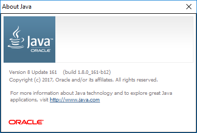{#fig:about_java}

### Installing Java ###

If you need to install Java, please follow the instructions for [downloading and installing Java for a Windows computer](http://www.java.com/en/download/help/windows_offline_download.xml) [java.com]. Note that you will need administrator privileges to install Java on Windows. During the installation, make a note of the directory where Java is installed on your computer. You will need this information to configure the EMF client.

### Updating Java ###

If Java is installed on your computer but is not version 8 or greater, you will need to update your Java installation. Start by opening the Java Control Panel from the Windows Control Panel. [@Fig:java_control_panel] shows the Java Control Panel.

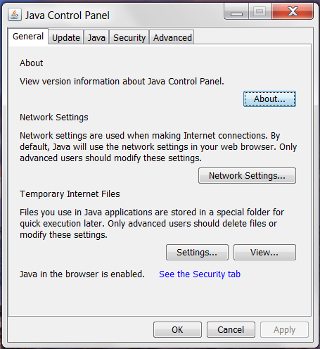{#fig:java_control_panel}

Clicking the **About** button will display the Java version dialog seen in [@Fig:java_version]. In [@Fig:java_version], the installed version of Java is Version 7 Update 45. This version of Java needs to be updated to run the EMF client.

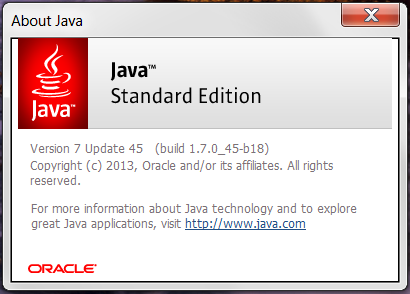{#fig:java_version}

To update Java, click the tab labeled Update in the Java Control Panel (see [@Fig:java_control_panel_update]). Click the button labeled **Update Now** in the bottom right corner of the Java Control Panel to update your installation of Java.

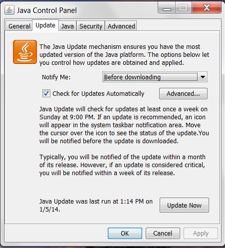{#fig:java_control_panel_update}

## Installing the EMF Client ##

How you install the EMF client depends on which EMF server you will be connecting to. To download and install an all-in-one package that includes all the EMF components, please visit [https://www.cmascenter.org/cost/](https://www.cmascenter.org/cost/). Other users should contact their EMF server administrators for instructions on downloading and installing the EMF client.

To launch the EMF client, double-click the file named EMFClient.bat. You may see a security warning similar to [@Fig:security_warning]. Uncheck the box labeled "Always ask before opening this file" to avoid the warning in the future.

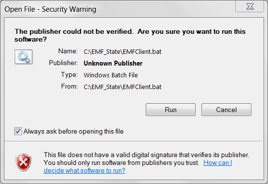{#fig:security_warning}

## Register as a New User and Log In ##

When you start the EMF client application, you will initially see a login window like [@Fig:login_window].

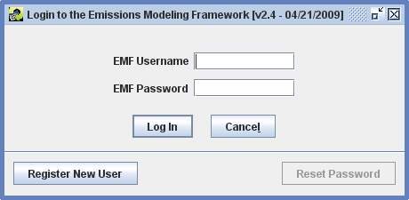{#fig:login_window}

If you are an existing EMF user, enter your EMF username and password in the login window and click the Log In button. If you forget your password, an EMF Administrator can reset it for you. **Note:** The Reset Password button is used to update your password when it expires; it can't be used if you've lost your password. See [@Sec:password_expired_section] for more information on password expiration.

If you have never used the EMF before, click the **Register New User** button to bring up the Register New User window as shown in [@Fig:new_user].

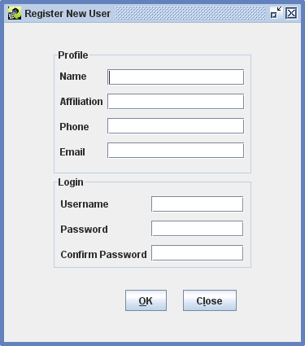{#fig:new_user}

In the Register New User window, enter the following information:

* **Name**: Your full name.
* **Affiliation**: Your affiliation. This must be at least 3 characters long.
* **Phone**: Your phone number.
* **Email**: Your email address. Your email address must have the format xx@yy.zz.
* **Username**: Select a username. Your username must be at least three characters long. The EMF will automatically check that the username you choose is unique.
* **Password**: Select a password. Your password must be at least 8 characters long and must contain at least one digit.
* **Confirm Password**: Re-enter your selected password.

Click OK to create your account. If there are any problems with the information you entered, an error message will be displayed at the top of the window as shown in [@Fig:new_user_error].

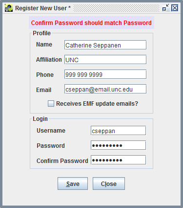{#fig:new_user_error}

Once you have corrected any errors, your account will be created and the EMF main window will be displayed ([@Fig:main_window]).

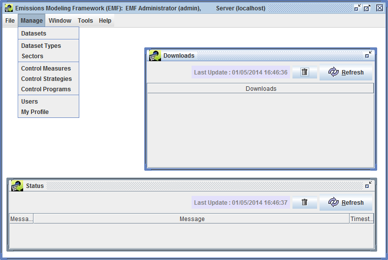{#fig:main_window}

## Update Your Profile ##

If you need to update any of your profile information or change your password, click the **Manage** menu and select **My Profile** to bring up the Edit User window shown in [@Fig:edit_user].

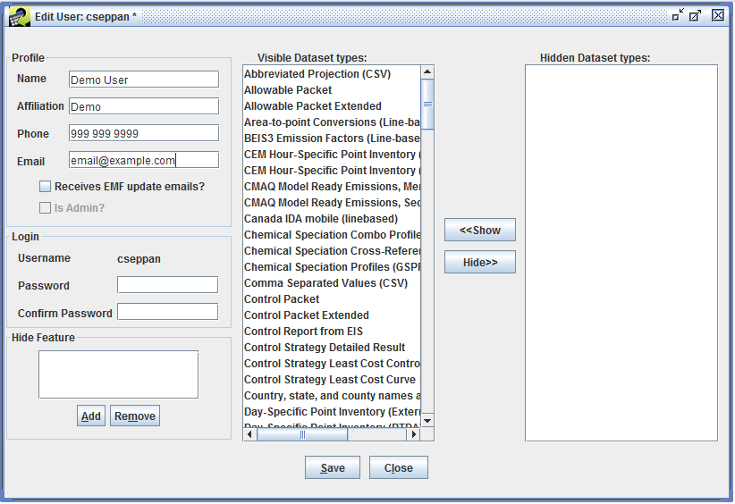{#fig:edit_user}

To change your password, enter your new password in the Password field and be sure to enter the same password in the Confirm Password field. Your password must be at least 8 characters long and must contain at least one digit.

Once you have entered any updated information, click the Save button to save your changes and close the Edit User window. You can close the window without saving changes by clicking the Close button. If you have unsaved changes, you will be asked to confirm that you want to discard your changes ([@Fig:discard_changes]).

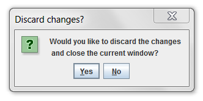{#fig:discard_changes}

## Password Expiration ## {#sec:password_expired_section}

Passwords in the EMF expire every 90 days. If you try to log in and your password has expired, you will see the message "Password has expired. Reset Password." as shown in [@Fig:password_expired].

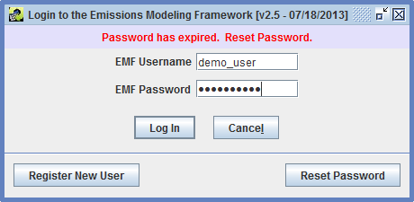{#fig:password_expired}

Click the **Reset Password** button to set a new password as shown in [@Fig:reset_password]. After entering your new password and confirming it, click the **Save** button to save your new password and you will be logged in to the EMF. Make sure to use your new password next time you log in.

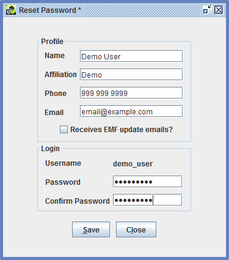{#fig:reset_password}

## Interface Concepts ##

As you become familiar with the EMF client application, you'll encounter various concepts that are reused through the interface. In this section, we'll briefly introduce these concepts. You'll see specific examples in the following chapters of this guide.

### Viewing vs. Editing ###

First, we'll discuss the difference between **viewing** an item and **editing** an item. Viewing something in the EMF means that you are just looking at it and can't change its information. Conversely, editing an item means that you have the ability to change something. Oftentimes, the interface for viewing vs. editing will look similar but when you're just viewing an item, various fields won't be editable. For example, [@Fig:view_dataset_ch2] shows the Dataset Properties View window while [@Fig:edit_dataset_ch2] shows the Dataset Properties Editor window for the same dataset.

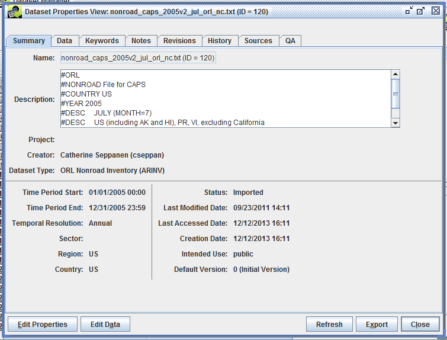{#fig:view_dataset_ch2}

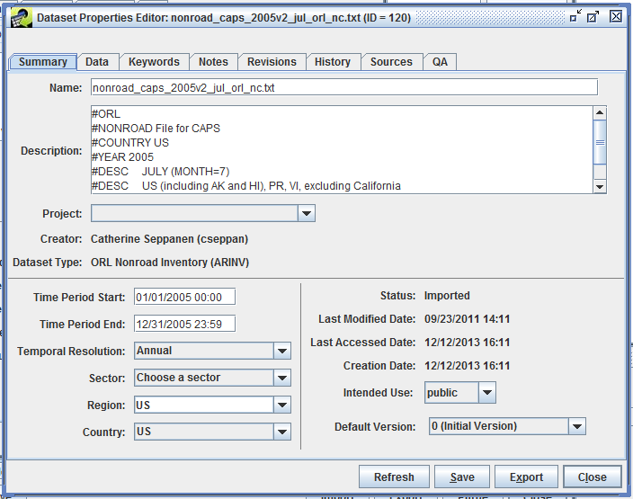{#fig:edit_dataset_ch2}

In the edit window, you can make various changes to the dataset like editing the dataset name, selecting the temporal resolution, or changing the geographic region. Clicking the Save button will save your changes. In the viewing window, those same fields are not editable and there is no Save button. Notice in the lower left hand corner of [@Fig:view_dataset_ch2] the button labeled Edit Properties. Clicking this button will bring up the editing window shown in [@Fig:edit_dataset_ch2].

Similarly, [@Fig:view_qa_steps_ch2] shows the QA tab of the Dataset Properties View as compared to [@Fig:edit_qa_steps_ch2] showing the same QA tab but in the Dataset Properties Editor.

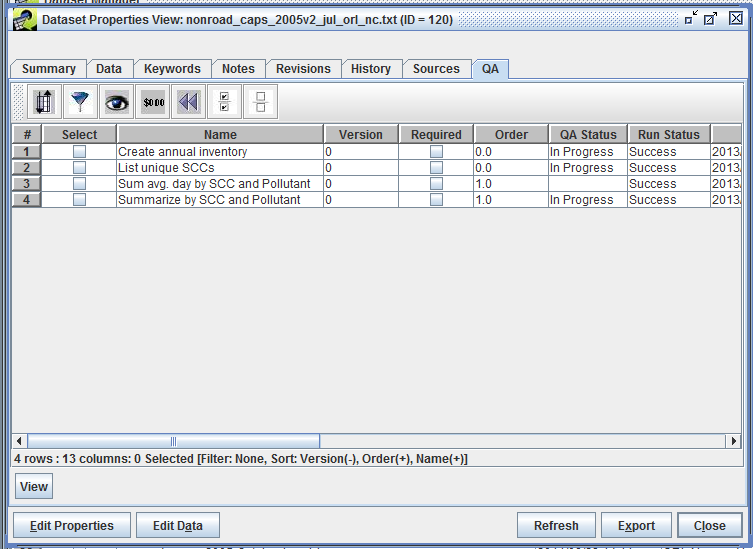{#fig:view_qa_steps_ch2}

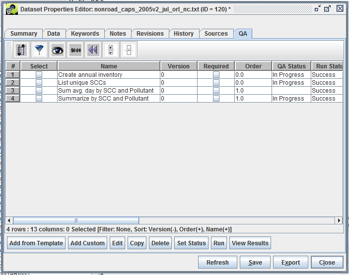{#fig:edit_qa_steps_ch2}

In the View window, the only option is to view each QA step whereas the Editor allows you to interact with the QA steps by adding, editing, copying, deleting, or running the steps. If you are having trouble finding an option you're looking for, check to see if you're viewing an item vs. editing it.

### Access Restrictions ###

Only one user can edit a given item at a time. Thus, if you are editing a dataset, you have a "lock" on it and no one else will be able to edit it at the same time. Other users will be able to view the dataset as you're editing it. If you try to edit a locked dataset, the EMF will display a message like [@Fig:dataset_locked]. For some items in the EMF, you may only be able to edit the item if you created it or if your account has administrative privileges.

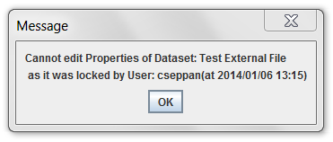{#fig:dataset_locked}

### Unsaved Changes ###

Generally you will need to click the Save button to save changes that you make. If you have unsaved changes and click the Close button, you will be asked if you want to discard your changes as shown in [@Fig:discard_changes]. This helps to prevent losing your work if you accidentally close a window.

### Refresh ###

The EMF client application loads data from the EMF server. As you and other users work, your information is saved to the server. In order to see the latest information from other users, the client application needs to refresh its information by contacting the server. The latest data will be loaded from the server when you open a new window. If you are working in an already open window, you may need to click on the Refresh button to load the newest data. [@Fig:highlight_refresh_button] highlights the Refresh button in the Dataset Manager window. Clicking Refresh will contact the server and load the latest list of datasets.

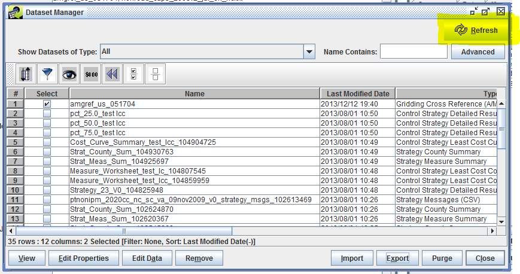{#fig:highlight_refresh_button}

Various windows in the EMF client application have Refresh buttons, usually in either the top right corner as in [@Fig:highlight_refresh_button] or in the row of buttons on the bottom right like in [@Fig:edit_qa_steps_ch2].

You will also need to use the Refresh button if you have made changes and return to a previously opened window. For example, suppose you select a dataset in the Dataset Manager and edit the dataset's name as described in [@Sec:dataset_properties_section]. When you save your changes, the previously opened Dataset Manager window won't automatically display the updated name. If you close and re-open the Dataset Manager, the dataset's name will be refreshed; otherwise, you can click the Refresh button to update the display.

### Status Window ### {#sec:status_window_section}

Many actions in the EMF are run on the server. For example, when you run a QA step, the client application on your computer sends a message to the server to start running the step. Depending on the type of QA step, this processing can take a while and so the client will allow you to do other work while it periodically checks with the server to find out the status of your request. These status checks are displayed in the Status Window shown in [@Fig:status_window].

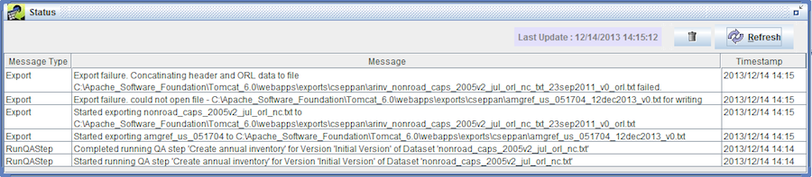{#fig:status_window}

The status window will show you messages about tasks when they are started and completed. Also, error messages will be displayed if a task could not be completed. You can click the Refresh button in the Status Window to refresh the status. The Trash icon clears the Status Window.

### The Sort-Filter-Select Table ### {#sec:sfs_table_section}

Most lists of data within the EMF are displayed using the Sort-Filter-Select Table, a generic table that allows sorting, filtering, and selection (as the name suggests). [@Fig:sfs_table] shows the sort-filter-select table used in the Dataset Manager. (To follow along with the figures, select the main **Manage** menu and then select **Datasets**. In the window that appears, find the **Show Datasets of Type** pull-down menu near the top of the window and select All.)

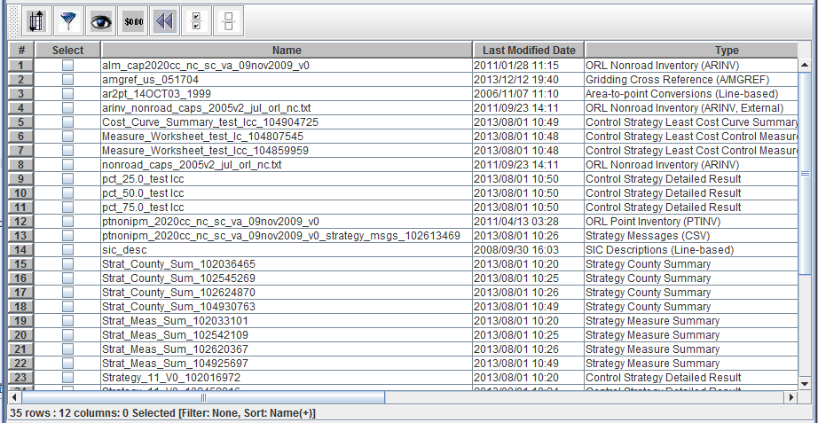{#fig:sfs_table}

Row numbers are shown in the first column, while the first row displays column headers. The column labeled Select allows you to select individual rows by checking the box in the column. Selections are used for different activities depending on where the table is displayed. For example, in the Dataset Manager window you can select various datasets and then click the View button to view the dataset properties of each selected dataset. In other contexts, you may have options to change the status of all the selected items or copy the selected items. There are toolbar buttons to allow you to quickly select all items in a table ([@Sec:sfs_selectall_section]) and to clear all selections ([@Sec:sfs_clear_section]).

The horizontal scroll bar at the bottom indicates that there are more columns in the table than fit in the window. Scroll to the right in order to see all the columns as in [@Fig:sfs_scroll_right].

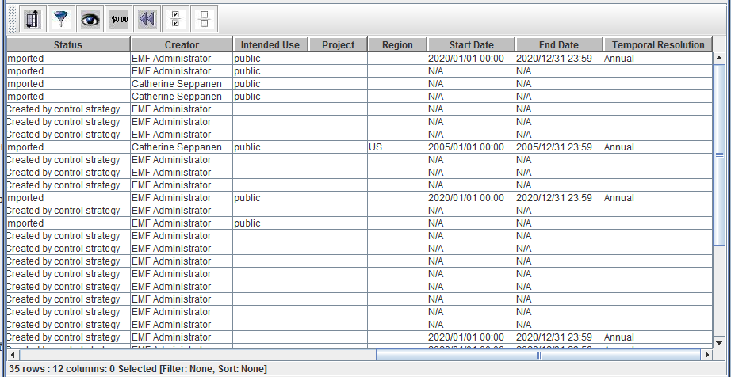{#fig:sfs_scroll_right}

Notice the info line displayed at the bottom of the table. In [@Fig:sfs_scroll_right] the line reads **35 rows : 12 columns: 0 Selected [Filter: None, Sort: None]**. This line gives information about the total number of rows and columns in the table, the number of selected items, and any filtering or sorting applied.

Columns can be resized by clicking on the border between two column headers and dragging it right or left. Your mouse cursor will change to a horizontal double-headed arrow when resizing columns.

You can rearrange the order of the columns in the table by clicking a column header and dragging the column to a new position. [@Fig:sfs_reorder_columns] shows the sort-filter-select table with columns rearranged and resized.

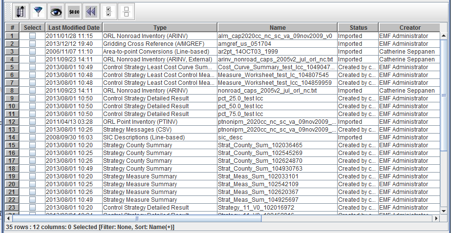{#fig:sfs_reorder_columns}

To sort the table using data from a given column, click on the column header such as Last Modified Date. [@Fig:sfs_simple_sort] shows the table sorted by Last Modified Date in descending order (latest dates first). The table info line now includes **Sort: Last Modified Date(-)**.

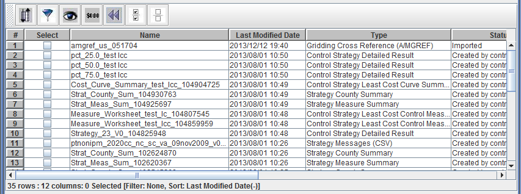{#fig:sfs_simple_sort}

If you click the Last Modified Date header again, the table will re-sort by Last Modified Date in ascending order (earliest dates first). The table info line also changes to **Sort: Last Modified Date(+)** as seen in [@Fig:sfs_simple_sort_reversed].

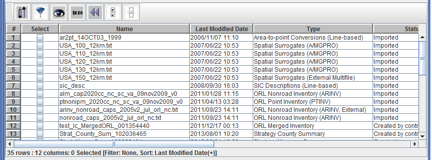{#fig:sfs_simple_sort_reversed}

The toolbar at the top of the table (as shown in [@Fig:sort_filter_select]) has buttons for the following actions (from left to right):

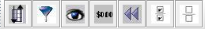{#fig:sort_filter_select}

1. Sort options
2. Filter rows
3. Show or hide columns
4. Format data in columns
5. Reset table's sorting, filtering, and column layout
6. Select all rows
7. Clear all selections

If you hover your mouse over any of the buttons, a tooltip will pop up to remind you of each button's function.

### Sort Options ###

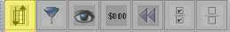

The Sort toolbar button brings up the Sort Columns dialog as shown in [@Fig:sort_columns]. This dialog allows you to sort the table by multiple columns and also allows case sensitive sorting. (Quick sorting by clicking a column header uses case insensitive sorting.)

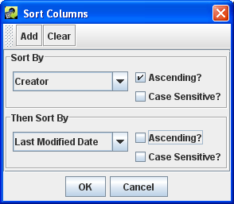{#fig:sort_columns}

In the Sort Columns Dialog, select the first column you would use to sort the data from the Sort By pull-down menu. You can also specify if the sort order should be ascending or descending and if the sort comparison should be case sensitive.

To add additional columns to sort by, click the Add button and then select the column in the new Then Sort By pull-down menu. When you have finished setting up your sort selections, click the OK button to close the dialog and re-sort the table. The info line beneath the table will show all the columns used for sorting like **Sort: Creator(+), Last Modified Date(-)**.

To remove your custom sorting, click the Clear button in the Sort Columns dialog and then click the OK button. You can also use the Reset toolbar button to reset all custom settings as described in [@Sec:sfs_reset_section].

### Filter Rows ### {#sec:sfs_filter_section}

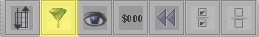

The Filter Rows toolbar button brings up the Filter Rows dialog as shown in [@Fig:filter_rows]. This dialog allows you to create filters to "whittle down" the rows of data shown in the table. You can filter the table's rows based on any column with several different value matching options.

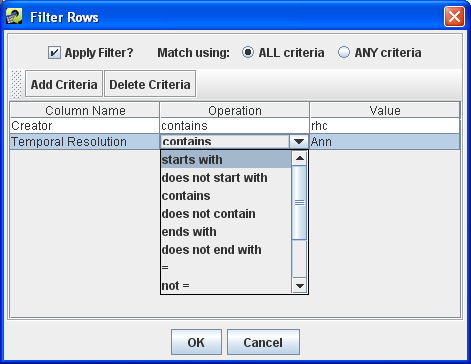{#fig:filter_rows}

To add a filter criterion, click the Add Criteria button and a new row will appear in the dialog window. Clicking the cell directly under the Column Name header displays a pull-down menu to pick which column you would like use to filter the rows. The Operation column allows you to select how the filter should be applied; for example, you can filter for data that starts with the given value or does not contain the value. Finally, click the cell under the Value header and type in the value to use. Note that the filter values are case-sensitive. A filter value of "nonroad" would *not* match the dataset type "ORL Nonroad Inventory".

If you want to specify additional criteria, click Add Criteria again and follow the same process. To remove a filter criterion, click on the row you want to remove and then click the Delete Criteria button.

If the radio button labeled Match using: is set to ALL criteria, then only rows that match all the specified criteria will be shown in the filtered table. If Match using: is set to ANY criteria, then rows will be shown if they meet any of the criteria listed.

Once you are done specifying your filter options, click the OK button to close the dialog and return to the filtered table. The info line beneath the table will include your filter criteria like **Filter: Creator contains rhc, Temporal Resolution starts with Ann**.

To remove your custom filtering, you can delete the filter criteria from the Filter Rows dialog or uncheck the Apply Filter? checkbox to turn off the filtering without deleting your filter rules. You can also use the Reset toolbar button to reset all custom settings as described in [@Sec:sfs_reset_section]. Note that clicking the Reset button will delete your filter rules.

### Show or Hide Columns ### {#sec:sfs_showhide_section}

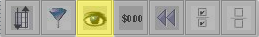

The Show/Hide Columns toolbar button brings up the Show/Hide Columns dialog as shown in [@Fig:show_hide_columns]. This dialog allows you to customize which columns are displayed in the table.

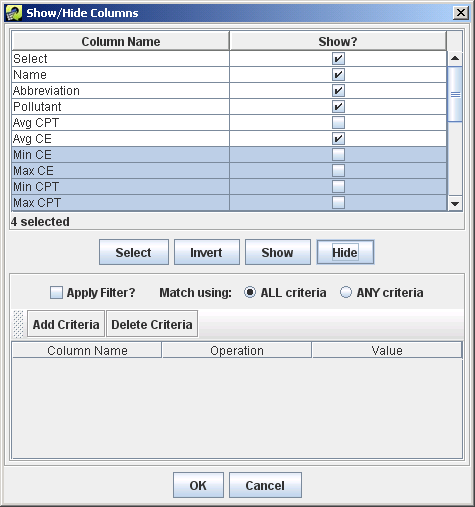{#fig:show_hide_columns}

To hide a column, uncheck the box next to the column name under the Show? column. Click the OK button to return to the table. The columns you unchecked will no longer be seen in the table. The info line beneath the table will also be updated with the current number of displayed columns.

To make a hidden column appear again, open the Show/Hide Columns dialog and check the Show? box next to the hidden column's name. Click OK to close the Show/Hide Columns dialog.

To select multiple columns to show or hide, click on the first column name of interest. Then hold down the Shift key and click a second column name to select it and the intervening columns. Once rows are selected, clicking the Show or Hide buttons in the middle of the dialog will check or uncheck all the Show? boxes for the selected rows. To select multiple rows that aren't next to each other, you can hold down the Control key while clicking each row. The Invert button will invert the selected rows. After checking/unchecking the Show? checkboxes, click OK to return to the table with the columns shown/hidden as desired.

The Show/Hide Columns dialog also supports filtering to find columns to show or hide. This is an infrequently used option most useful for locating columns to show or hide when there are many columns in the table. [@Fig:sfs_showhide_filter] shows an example where a filter has been set up to match column names that contain the value "Date". Clicking the Select button above the filtering options selects matching rows which can then be hidden by clicking the Hide button.

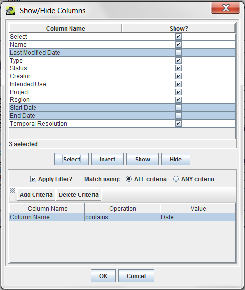{#fig:sfs_showhide_filter}

### Format Data in Columns ###

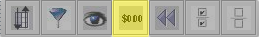

The Format Columns toolbar button displays the Format Columns dialog show in [@Fig:format_columns]. This dialog allows you to customize the formatting of columns. In practice, this dialog is not used very often but it can be helpful to format numeric data by changing the number of decimal places or the number of significant digits shown.

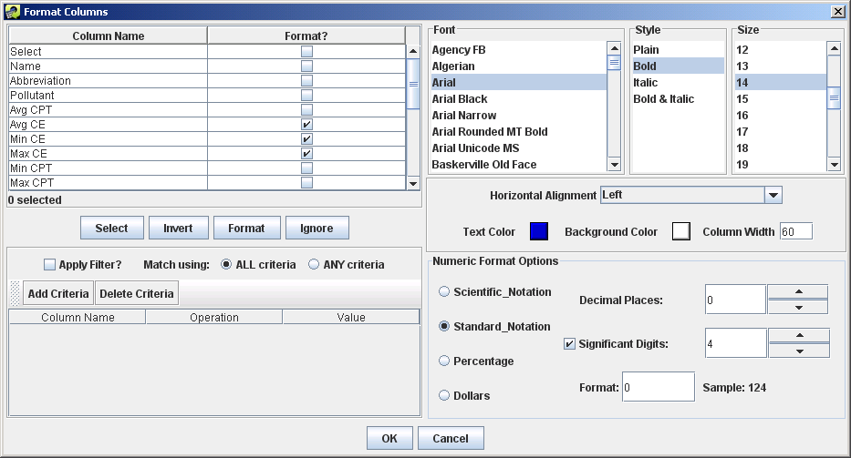{#fig:format_columns}

To change the format of a column, first check the checkbox next to the column name in the Format? column. If you only select columns that contain numeric data, the Numeric Format Options section of the dialog will appear; otherwise, it will not be visible. The Format Columns dialog supports filtering by column name similar to the Show/Hide Columns dialog ([@Sec:sfs_showhide_section]).

From the Format Columns dialog, you can change the font, the style of the font (e.g. bold, italic), the horizontal alignment for the column (e.g. left, center, right), the text color, and the column width. For numeric columns, you can specify the number of significant digits and decimal places.

### Reset Table ### {#sec:sfs_reset_section}

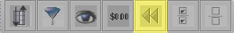

The Reset toolbar button will remove all customizations from the table: sorting, filtering, hidden columns, and formatting. It will also reset the column order and set column widths back to the default.

### Select All Rows ### {#sec:sfs_selectall_section}

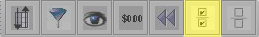

The Select All toolbar button selects all the rows in the table. After clicking the Select All button, you will see that the checkboxes in the Select column are now all checked. You can select or deselect an individual item by clicking its checkbox in the Select column.

### Clear All Selections ### {#sec:sfs_clear_section}

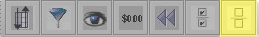

The Clear All Selections toolbar button unselects all the rows in the table.
