# Datasets # {#sec:datasets_chapter}

## Introduction ##

Emissions inventories, reference data, and other types of data files are imported into the EMF and stored as datasets. A dataset encompasses both the data itself as well as various dataset properties such as the time period covered by the dataset and geographic extent of the dataset. Changes to a dataset are tracked as dataset revisions. Multiple versions of the data for a dataset can be stored in the EMF.

## Dataset Types ## {#sec:dataset_types_section}

Each dataset has a dataset type. The dataset type describes the format of the dataset's data. For example, the dataset type for an ORL Point Inventory (PTINV) defines the various data fields of the inventory file such as FIPS code, SCC code, pollutant name, and annual emissions value. A different dataset type like Spatial Surrogates (A/MGPRO) defines the fields in the corresponding file: surrogate code, FIPS code, grid cell, and surrogate fraction.

The EMF also supports flexible dataset types without fixed format - Comma Separated Value and Line-based. These types allow for new kinds of data to be loaded into the EMF without requiring updates to the EMF software.

When importing data into the EMF, you can choose between internal dataset types where the data itself is stored in the EMF database and external dataset types where the data remains in a file on disk and the EMF only tracks the metadata. For internal datasets, the EMF provides data editing, revision and version tracking, and data analysis using SQL queries. External datasets can be used to track files that don't need these features or data that can't be loaded into the EMF like binary NetCDF files.

You can view the dataset types defined in the EMF by selecting **Dataset Types** from the main **Manage** menu. EMF administrators can add, edit, and remove dataset types; non-administrative users can view the dataset types. [@Fig:dataset_type_manager] shows the Dataset Type Manager.

{#fig:dataset_type_manager}

To view the details of a particular dataset type, check the box next to the type you want to view (for example, "Flat File 2010 Nonpoint") and then click the View button in the bottom left-hand corner.

[@Fig:view_dataset_type_ff10nonpt] shows the View Dataset Type window for the Flat File 2010 Nonpoint dataset type. Each dataset type has a name and a description along with metadata about who created the dataset type and when, and also the last modified date for the dataset type.

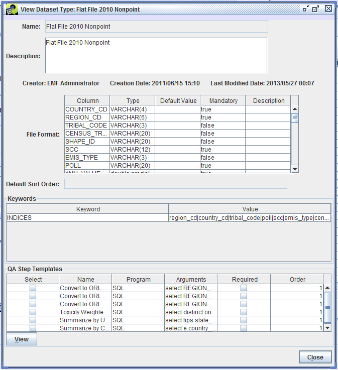{#fig:view_dataset_type_ff10nonpt}

The dataset type defines the format of the data file as seen in the File Format section of [@Fig:view_dataset_type_ff10nonpt]. For the Flat File 2010 Nonpoint dataset type, the columns from the raw data file are mapped into columns in the database when the data is imported. Each data column must match the type (string, integer, floating point) and can be mandatory or optional.

Keyword-value pairs can be used to give the EMF more information about a dataset type. [@Tbl:dataset_type_keywords_table] lists some of the keywords available. [@Sec:dataset_properties_keywords_section] provides more information about using and adding keywords.

Keyword|Description|Example
--|---|-
EXPORT\_COLUMN\_LABEL|Indicates if columns labels should be included when exporting the data to a file|FALSE
EXPORT\_HEADER\_COMMENTS|Indicates if header comments should be included when exporting the data to a file|FALSE
EXPORT\_INLINE\_COMMENTS|Indicates if inline comments should be included when exporting the data to a file|FALSE
EXPORT\_PREFIX|Filename prefix to include when exporting the data to a file|ptinv\_
EXPORT\_SUFFIX|Filename suffix to use when exporting the data to a file|.csv
INDICES|Tells the system to create indices in the database on the given columns|region\_cd\|country\_cd\|scc
REQUIRED\_HEADER|Indicates a line that must occur in the header of a data file|#FORMAT=FF10\_ACTIVITY
: Dataset Type Keywords {#tbl:dataset_type_keywords_table}

Each dataset type can have QA step templates assigned. These are QA steps that apply to any dataset of the given type. More information about using QA step templates in given in [@Sec:qa_chapter].

### Common Dataset Types ### {#sec:common_dataset_types_section}

Dataset types can be added, edited, or deleted by EMF administrators. In this section, we list dataset types that are commonly used. Your EMF installation may not include all of these types or may have additional types defined.

#### Common Inventory Dataset Types ####

Dataset Type Name|Description|Link to File Format
-|-|-
Flat File 2010 Activity|Onroad mobile activity data (VMT, VPOP, speed) in Flat File 2010 (FF10) format|[SMOKE documentation][FF10ACT]
Flat File 2010 Activity Nonpoint|Nonpoint activity data in FF10 format|Same format as Flat File 2010 Activity
Flat File 2010 Activity Point|Point activity data in FF10 format|Not available
Flat File 2010 Nonpoint|Nonpoint or nonroad emissions inventory in FF10 format|[SMOKE documentation][FF10NPANN]
Flat File 2010 Nonpoint Daily|Nonpoint or nonroad day-specific emissions inventory in FF10 format|[SMOKE documentation][FF10NPDAY]
Flat File 2010 Point|Point emissions inventory in FF10 format|[SMOKE documentation][FF10PTANN]
Flat File 2010 Point Daily|Point day-specific emissions inventory in FF10 format|[SMOKE documentation][FF10PTDAY]
ORL Day-Specific Fires Data Inventory (PTDAY)|Day-specific fires inventory|[SMOKE documentation][ORLFRDAY]
ORL Fire Inventory (PTINV)|Wildfire and prescribed fire inventory|[SMOKE documentation][ORLFRANN]
ORL Nonpoint Inventory (ARINV)|Nonpoint emissions inventory in ORL format|[SMOKE documentation][ORLNPANN]
ORL Nonroad Inventory (ARINV)|Nonroad emissions inventory in ORL format|[SMOKE documentation][ORLNRANN]
ORL Onroad Inventory (MBINV)|Onroad mobile emissions inventory in ORL format|[SMOKE documentation][ORLMBANN]
ORL Point Inventory (PTINV)|Point emissions inventory in ORL format|[SMOKE documentation][ORLPTANN]
: Inventory Dataset Types {#tbl:inventory_dataset_types_table}

[FF10ACT]: https://www.cmascenter.org/smoke/documentation/4.5/html/ch08s02s05.html#d0e39111 {target="_blank"}
[FF10NPANN]: https://www.cmascenter.org/smoke/documentation/4.5/html/ch08s02s04.html#d0e37919 {target="_blank"}
[FF10NPDAY]: https://www.cmascenter.org/smoke/documentation/4.5/html/ch08s02s02.html#d0e37477 {target="_blank"}
[FF10PTANN]: https://www.cmascenter.org/smoke/documentation/4.5/html/ch08s02s08.html#sect_input_ptinv_ff10 {target="_blank"}
[FF10PTDAY]: https://www.cmascenter.org/smoke/documentation/4.5/html/ch08s02s06.html#sect_input_ptday_ff10 {target="_blank"}
[ORLFRDAY]: https://www.cmascenter.org/smoke/documentation/4.5/html/ch08s02s06.html#sect_input_ptday_fireemis {target="_blank"}
[ORLFRANN]: https://www.cmascenter.org/smoke/documentation/4.5/html/ch08s02s08.html#sect_input_ptinv_fire {target="_blank"}
[ORLNPANN]: https://www.cmascenter.org/smoke/documentation/4.5/html/ch08s02s04.html#d0e38224 {target="_blank"}
[ORLNRANN]: https://www.cmascenter.org/smoke/documentation/4.5/html/ch08s02s04.html#d0e38599 {target="_blank"}
[ORLMBANN]: https://www.cmascenter.org/smoke/documentation/4.5/html/ch08s02s05.html#d0e38921 {target="_blank"}
[ORLPTANN]: https://www.cmascenter.org/smoke/documentation/4.5/html/ch08s02s08.html#d0e40766 {target="_blank"}

#### Common Reference Data Dataset Types ####

Dataset Type Name|Description|Link to File Format
-|-|-
Country, state, and county names and data (COSTCY)|List of region names and codes with default time zones and daylight-saving time flags|[SMOKE documentation][COSTCY]
Grid Descriptions (Line-based)|List of projections and grids|[I/O API documentation][GRIDDESC]
Holiday Identifications (Line-based)|Holidays date list|[SMOKE documentation][HOLIDAYS]
Inventory Table Data (INVTABLE)|Pollutant reference data|[SMOKE documentation][INVTABLE]
MACT description (MACTDESC)|List of MACT codes and descriptions|[SMOKE documentation][MACTDESC]
NAICS description file (NAICSDESC)|List of NAICS codes and descriptions|[SMOKE documentation][NAICSDESC]
ORIS Description (ORISDESC)|List of ORIS codes and descriptions|[SMOKE documentation][ORISDESC]
Point-Source Stack Replacements (PSTK)|Replacement stack parameters|[SMOKE documentation][PSTK]
SCC Descriptions (Line-based)|List of SCC codes and descriptions|[SMOKE documentation][SCCDESC]
SIC Descriptions (Line-based)|List of SIC codes and descriptions|[SMOKE documentation][SICDESC]
Surrogate Descriptions (SRGDESC)|List of surrogate codes and descriptions|[SMOKE documentation][SRGDESC]
: Reference Data Dataset Types {#tbl:reference_dataset_types_table}

[COSTCY]: https://www.cmascenter.org/smoke/documentation/4.5/html/ch08s10s02.html {target="_blank"}
[GRIDDESC]: https://www.cmascenter.org/ioapi/documentation/all_versions/html/GRIDDESC.html {target="_blank"}
[HOLIDAYS]: https://www.cmascenter.org/smoke/documentation/4.5/html/ch08s03s03.html {target="_blank"}
[INVTABLE]: https://www.cmascenter.org/smoke/documentation/4.5/html/ch08s10s04.html {target="_blank"}
[MACTDESC]: https://www.cmascenter.org/smoke/documentation/4.5/html/ch08s10s05.html {target="_blank"}
[NAICSDESC]: https://www.cmascenter.org/smoke/documentation/4.5/html/ch08s10s06.html {target="_blank"}
[ORISDESC]: https://www.cmascenter.org/smoke/documentation/4.5/html/ch08s10s08.html {target="_blank"}
[PSTK]: https://www.cmascenter.org/smoke/documentation/4.5/html/ch08s09s03.html#sect_input_pstk {target="_blank"}
[SCCDESC]: https://www.cmascenter.org/smoke/documentation/4.5/html/ch08s10s10.html {target="_blank"}
[SICDESC]: https://www.cmascenter.org/smoke/documentation/4.5/html/ch08s10s12.html {target="_blank"}
[SRGDESC]: https://www.cmascenter.org/smoke/documentation/4.5/html/ch08s04.html#sect_input_srgdesc {target="_blank"}

#### Common Emissions Modeling Cross-Reference and Factors Dataset Types ####

Dataset Type Name|Description|Link to File Format
-|-|-
Area-to-point Conversions (Line-based)|Point locations to assign to stationary area and nonroad mobile sources|[SMOKE documentation][ARTOPNT]
Chemical Speciation Combo Profiles (GSPRO\_COMBO)|Multiple speciation profile combination data|[SMOKE documentation][GSPRO_COMBO]
Chemical Speciation Cross-Reference (GSREF)|Cross-reference data to match inventory sources to speciation profiles|[SMOKE documentation][GSREF]
Chemical Speciation Profiles (GSPRO)|Factors to allocate inventory pollutant emissions to model species|[SMOKE documentation][GSPRO]
Gridding Cross Reference (A/MGREF)|Cross-reference data to match inventory sources to spatial surrogates|[SMOKE documentation][AMGREF]
Pollutant to Pollutant Conversion (GSCNV)|Conversion factors when inventory pollutant doesn't match speciation profile pollutant|[SMOKE documentation][GSCNV]
Spatial Surrogates (A/MGPRO)|Factors to allocate emissions to grid cells|[SMOKE documentation][AMGPRO]
Spatial Surrogates (External Multifile)|External dataset type to point to multiple surrogates files on disk|Individual files have same format as Spatial Surrogates (A/MGPRO)
Temporal Cross Reference (A/M/PTREF)|Cross-reference data to match inventory sources to temporal profiles|[SMOKE documentation][AMPTREF]
Temporal Profile (A/M/PTPRO)|Factors to allocate inventory emissions to hourly estimates|[SMOKE documentation][AMPTPRO]
: Emissions Modeling Dataset Types {#tbl:emissions_modeling_dataset_types_table}

[ARTOPNT]: https://www.cmascenter.org/smoke/documentation/4.5/html/ch08s10.html#sect_input_artopnt {target="_blank"}
[GSPRO_COMBO]: https://www.cmascenter.org/smoke/documentation/4.5/html/ch08s05s03.html {target="_blank"}
[GSREF]: https://www.cmascenter.org/smoke/documentation/4.5/html/ch08s05s04.html {target="_blank"}
[GSPRO]: https://www.cmascenter.org/smoke/documentation/4.5/html/ch08s05s02.html {target="_blank"}
[AMGREF]: https://www.cmascenter.org/smoke/documentation/4.5/html/ch08s04s03.html {target="_blank"}
[GSCNV]: https://www.cmascenter.org/smoke/documentation/4.5/html/ch08s05.html#sect_input_gscnv {target="_blank"}
[AMGPRO]: http://www.cmascenter.org/smoke/documentation/3.5.1/html/ch08s04s02.html {target="_blank"}
[AMPTREF]: https://www.cmascenter.org/smoke/documentation/4.5/html/ch08s03s02.html {target="_blank"}
[AMPTPRO]: https://www.cmascenter.org/smoke/documentation/4.5/html/ch08s03.html#sect_input_amptpro {target="_blank"}

#### Common Growth and Controls Dataset Types ####

Dataset Type Name|Description|Link to File Format
-|-|-
Allowable Packet|Allowable emissions cap or replacement values|[SMOKE documentation][ALLOW]
Allowable Packet Extended|Allowable emissions cap or replacement values; supports monthly values|[Download CSV][ALLOWEXT]
Control Packet|Control efficiency, rule effectiveness, and rule penetration rate values|[SMOKE documentation][CONTROL]
Control Packet Extended|Control percent reduction values; supports monthly values|[Download CSV][CONTROLEXT]
Control Strategy Detailed Result Extended|Output from CoST|[Download CSV][CSDREXT]
Control Strategy Least Cost Control Measure Worksheet|Output from CoST|Not available
Control Strategy Least Cost Curve Summary|Output from CoST|Not available
Facility Closure Extended|Facility closure dates|[Download CSV][FACEXT]
Projection Packet|Factors to grow emissions values into the past or future|[SMOKE documentation][PROJ]
Projection Packet Extended|Projection factors; supports monthly values|[Download CSV][PROJEXT]
Strategy County Summary|Output from CoST|Not available
Strategy Impact Summary|Output from CoST|Not available
Strategy Measure Summary|Output from CoST|Not available
Strategy Messages (CSV)|Output from CoST|Not available
: Growth and Controls Dataset Types {#tbl:growth_dataset_types_table}

[ALLOW]: https://www.cmascenter.org/smoke/documentation/4.5/html/ch08s06.html#sect_input_gcntl_allowable {target="_blank"}
[ALLOWEXT]: https://raw.githubusercontent.com/USEPA-OAQPS/emf/master/EMF/deploy/db/cost/formats/allowable_packet_extended_flex_file_format.csv {target="_blank"}
[CONTROL]: https://www.cmascenter.org/smoke/documentation/4.5/html/ch08s06.html#sect_input_gcntl_control {target="_blank"}
[CONTROLEXT]: https://raw.githubusercontent.com/USEPA-OAQPS/emf/master/EMF/deploy/db/cost/formats/control_packet_extended_flex_file_format.csv {target="_blank"}
[CSDREXT]: https://raw.githubusercontent.com/USEPA-OAQPS/emf/master/EMF/deploy/db/cost/formats/control_strategy_detailed_result_extended.csv {target="_blank"}
[FACEXT]: https://raw.githubusercontent.com/USEPA-OAQPS/emf/master/EMF/deploy/db/cost/formats/facility_closure_extended.csv {target="_blank"}
[PROJ]: https://www.cmascenter.org/smoke/documentation/4.5/html/ch08s06.html#sect_input_gcntl_projection {target="_blank"}
[PROJEXT]: https://raw.githubusercontent.com/USEPA-OAQPS/emf/master/EMF/deploy/db/cost/formats/projection_packet_extended_flex_file_format.csv {target="_blank"}

## The Dataset Manager ##

The main interface for finding and interacting with datasets is the Dataset Manager. To open the Dataset Manager, select the **Manage** menu at the top of the EMF main window, and then select the **Datasets** menu item. It may take a little while for the window to appear. As shown in [@Fig:empty_dataset_manager], the Dataset Manager initially does not show any datasets. This is to avoid loading a potentially large list of datasets from the server.

{#fig:empty_dataset_manager}

From the Dataset Manager you can: 

* Organize emissions modeling data such as emissions inventories, reference data, and analysis reports
* Find datasets that may be of interest
* Track changes to data using versions
* Manage metadata for datasets
* Quality assure datasets and track QA steps for each version

To quickly find datasets of interest, you can use the **Show Datasets of Type** pull-down menu at the top of the Dataset Manager window. Select "ORL Point Inventory (PTINV)" and the datasets matching that Dataset Type are loaded into the Dataset Manager as shown in [@Fig:dataset_manager].

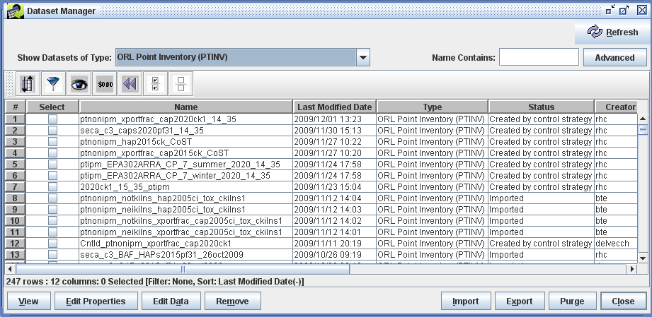{#fig:dataset_manager}

The matching datasets are shown in a table that lists some of their properties, including the dataset's name, last modified date, dataset type, status indicating how the dataset was created, and the username of the dataset's creator. [@Tbl:columns_table] describes each column in the Dataset Manager window. In the Dataset Manager window, use the horizontal scroll bar to scroll the table to the right to see all the columns.

Column|Description
-|----
Name|A unique name or label for the dataset. You choose this name when importing data and it can be edited by users with appropriate privileges.
Last Modified Date|The most recent date and time when the data (not the metadata) of the dataset was modified. When the dataset is initially imported, the Last Modified Date is set to the file's timestamp.
Type|The Dataset Type of this dataset. The Dataset Type incorporates information about the structure of the data and information regarding how the data can be sorted and summarized.
Status|Shows whether the dataset was imported from disk or created in some other way such as an output from a control strategy.
Creator|The username of the person who originally created the dataset.
Intended Use|Specifies whether the dataset is intended to be public (accessible to any user), private (accessible only to the creator), or to be used by a specific group of users.
Project|The name of a study or set of work for which this dataset was created. The project field can help you organize related files.
Region|The name of a geographic region to which the dataset applies.
Start Date|The start date and time for the data contained in the dataset.
End Date|The end date and time for the data contained in the dataset.
Temporal Resolution|The temporal resolution of the data contained in the dataset (e.g. annual, daily, or hourly).
: Dataset Manager Columns {#tbl:columns_table}

Using the Dataset Manager, you can select datasets of interest by checking the checkboxes in the Select column and then perform various actions related to those datasets. [@Tbl:dataset_actions_table] lists the buttons along the bottom of the Dataset Manager window and describes the actions for each button.

Command|Description
-|----
View|Displays a read-only Dataset Properties View for each of the selected datasets. You can view a dataset even when someone else is editing that dataset's properties or data.
Edit Properties|Opens a writeable Dataset Properties Editor for each of the selected datasets. Only one user can edit a dataset at any given time.
Edit Data|Opens a Dataset Versions Editor for each of the selected datasets.
Remove|Marks each of the selected datasets for deletion. Datasets are not actually deleted until you click purge.
||
Import|Opens the Import Datasets window where you can import data files into the EMF as new datasets.
Export|Opens the Export window to write the data for one version of the selected dataset to a file.
Purge|Permanently removes any datasets that are marked for deletion from the EMF.
Close|Closes the Dataset Manager window.
: Dataset Manager Actions {#tbl:dataset_actions_table}

## Finding Datasets ## {#sec:finding_datasets_section}

There are several ways to find datasets using the Dataset Manager. First, you can show all datasets with a particular dataset type by choosing the dataset type from the **Show Datasets of Type** menu. If there are more than a couple hundred datasets matching the type you select, the system will warn you and suggest you enter something in the **Name Contains** field to limit the list.

### Dataset Name Matching ###

The **Name Contains** field allows you to enter a search term to match dataset names. For example, if you type `2020` in the textbox and then hit Enter, the Dataset Manager will show all the datasets with "2020" in their names. You can also use wildcards in your keyword. Using the keyword `pt*2020` will show all datasets whose name contains "pt" followed at some point by "2020" as shown in [@Fig:name_contains]. The Name Contains search is not case sensitive.

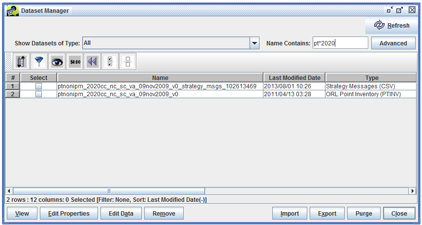{#fig:name_contains}

### Advanced Dataset Search ###

If you want to search for datasets using attributes other than the dataset's name or using multiple criteria, click the **Advanced** button. The Advanced Dataset Search dialog as shown in [@Fig:advanced_dataset_search] will be displayed.

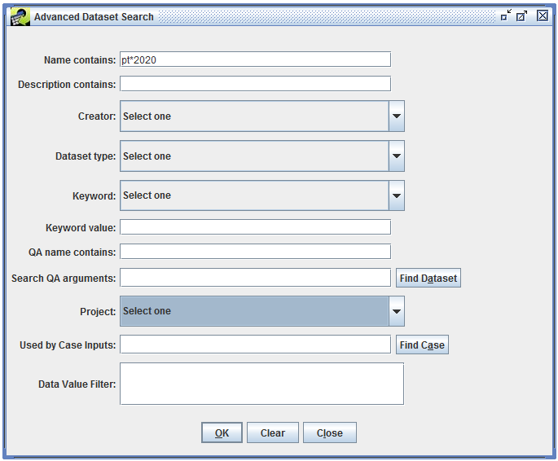{#fig:advanced_dataset_search}

You can use the Advanced Dataset Search to search for datasets based on the contents of the dataset's description, the dataset's creator, project, and more. [@Tbl:advanced_search_options_table] lists the options for the advanced search.

Search option|Description
-|----
Name contains|Performs a case-insensitive search of the dataset name; supports wildcards
Description contains|Performs a case-insensitive search of the dataset description; supports wildcards
Creator|Matches datasets created by the specified user
Dataset type|Matches datasets of the specified type
Keyword|Matches datasets that have the specified keyword
Keyword value|Matches datasets where the specified keyword has the specified value; must exactly match the dataset's keyword value (case-insensitive)
QA name contains|Performs a case-insensitive search of the names of the QA steps associated with datasets
Search QA arguments|Searches the arguments to QA steps associated with datasets
Project|Matches datasets assigned to the specified project
Used by Case Inputs|Finds datasets by case (not described in this User's Guide)
Data Value Filter|Matches datasets using SQL like "FIPS=\'37001\' and SCC like \'102005%\'"; must be used with the dataset type criterion
: Advanced Dataset Search Options {#tbl:advanced_search_options_table}

After setting your search criteria, click **OK** to perform the search and update the Dataset Manager window. The Advanced Dataset Search dialog will remain visible until you click **Close**. This allows you to refine your search or perform additional searches if needed. If you specify multiple search criteria, a dataset must satisfy all of the specified criteria to be shown in the Dataset Manager.

### Dataset Filtering ###

Another option for finding datasets is to use the filtering options of the Dataset Manager. (See [@Sec:sfs_filter_section] for a complete description of the Filter Rows dialog.) Filtering helps narrow down the list of datasets already shown in the Dataset Manager. Click the Filter Rows button in the toolbar to bring up the Filter Rows dialog. In the dialog, you can create a filter to show only datasets whose dataset type contains the word "Inventory" (see [@Fig:filter_dialog_inventory]).

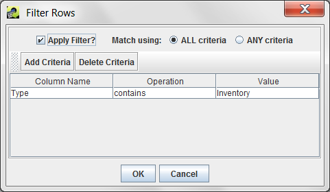{#fig:filter_dialog_inventory}

Once you've entered the filter criteria, click OK to return to the Dataset Manager. The list of datasets has now been reduced to only those matching the filter as shown in [@Fig:find_datasets_filter].

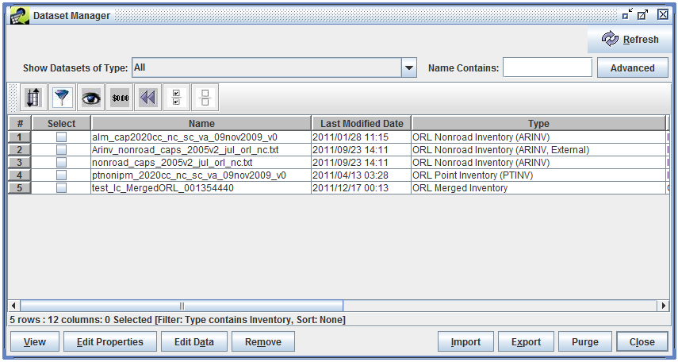{#fig:find_datasets_filter}

Using filtering allows you to search for datasets using any column shown in the Dataset Manager. Remember that filtering will only apply to the datasets already shown in the table - it doesn't search the database for additional datasets like the Advanced Dataset Search feature.

## Viewing and Editing Dataset Properties ## {#sec:dataset_properties_section}

To view or edit the properties of a dataset, select the dataset in the Dataset Manager and then click either the View or Edit Properties button at the bottom of the window. The Dataset Properties View or Editor window will be displayed with the Summary tab selected as shown in [@Fig:dataset_properties_summary_nonroad]. If multiple datasets are selected, separate Dataset Properties windows will be displayed for each selected dataset.

{#fig:dataset_properties_summary_nonroad}

The interface for viewing dataset properties is very similar to the editing interface except that the values are all read-only. In this section, we will show the editing versions of the interface so that all available options are shown. In general, if you don't need to edit a dataset, it's better to just view the properties since viewing the dataset doesn't lock it for editing by another user.

The Dataset Properties window divides its data into several tabs. [@Tbl:properties_tabs_table] gives a brief description of each tab.

Tab|Description
-|----
Summary|Shows high-level properties of the dataset
Data|Provides access to the actual data stored for the dataset
Keywords|Shows additional types of metadata not found on the Summary tab
Notes|Shows comments that users have made about the dataset and questions they may have
Revisions|Shows the revisions that have been made to the dataset
History|Shows how the dataset has been used in the past
Sources|Shows where the data came from and where it is stored in the database, if applicable
QA|Shows QA steps that have been run using the dataset
: Dataset Properties Tabs {#tbl:properties_tabs_table}

There are several buttons at the bottom of the editor window that appear on all tabs:

* **Refresh**: Load updated information from the server for this dataset.
* **Save**: Save any changes that have been made to the dataset and close the editor window.
* **Export**: Open the Export window to export the dataset to a file.
* **Close**: Close the editor window without saving changes.

### Summary ###

The Summary tab of the Dataset Properties Editor ([@Fig:dataset_properties_summary_nonroad]) displays high level summary information about the Dataset. Many of these properties are shown in the list of datasets displayed by the Dataset Manager and as a result are described in [@Tbl:columns_table]. The additional properties available in the Summary tab are described in [@Tbl:dataset_properties_table].

Column|Description
-|----
Description|Descriptive information about the dataset. The contents of this field are initially populated from the full-line comments found in the header and other sections of the file used to create the dataset when it is imported. Users are free to add on to the contents of this field which is written to the top of the resulting file when the data is exported from the EMF.
Sector|The emissions sector to which this data applies.
Country|The country to which the data applies.
Last Accessed Date|The date/time the data was last exported.
Creation Date|The date/time the dataset was created.
Default Version|Indicates which version of the dataset is considered to be the default. The default version of a dataset is important in that it indicates to other users and to some quality assurance queries the appropriate version of the dataset to be used.
: Summary Tab Dataset Properties (not included in Dataset Manager) {#tbl:dataset_properties_table}

Values of text fields (boxes with white background) are changed by typing into the fields. Other properties are set by selecting items from pull-down menus.

Some notes about updating the various editable fields follow:

* **Name**: If you change the dataset name, the EMF will verify that your newly selected name is unique within the EMF.

* **Description**: Be careful updating the description if the file will be exported for use in SMOKE. For example, ORL files *must* start with #ORL or SMOKE will not accept them. Thus, it is safer to add information to the end of the description.

* **Project**: You may select a different project for the dataset by choosing another item from the pull-down menu. If you are an EMF Administrator, you can create a new project by typing a non-existent value into the editable menu.

* **Region**: You can select an existing region by choosing an item from the pull-down menu or you can type a value into the editable menu to add a new region.

* **Default Version**: Only versions of datasets that have been marked as final can be selected as the default version.

### Data ### {#sec:dataset_properties_data_section}

The Data tab of the Dataset Properties Editor ([@Fig:dataset_properties_data_nonroad]) provides access to the actual data stored for the dataset. If the dataset has multiple versions, they will be listed in the Versions table.

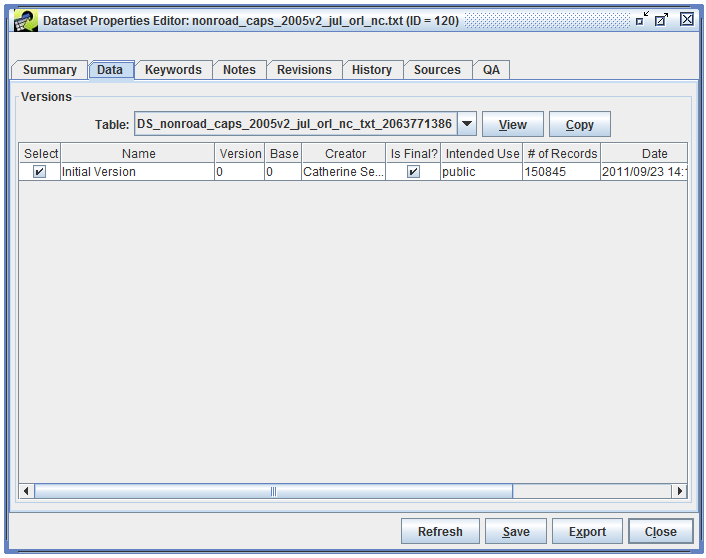{#fig:dataset_properties_data_nonroad}

To view the data associated with a particular version, select the version and click the View button. For more information about viewing the raw data, see [@Sec:viewing_data_section]. The Copy button allows you to copy any version of the data marked as final to a new dataset.

### Keywords ### {#sec:dataset_properties_keywords_section}

The Keywords tab of the Dataset Properties Editor ([@Fig:dataset_properties_keywords_nonroad]) shows additional types of metadata about the dataset stored as keyword-value pairs.

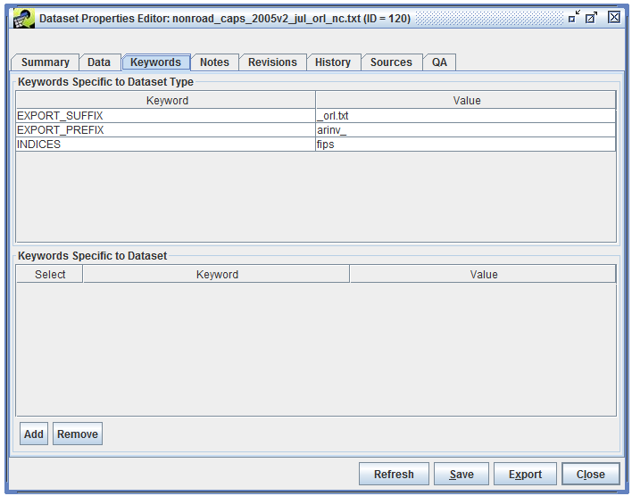{#fig:dataset_properties_keywords_nonroad}

The Keywords Specific to Dataset Type section show keywords associated with the dataset's type. These keywords are described in [@Sec:dataset_types_section].

Additional dataset-specific keywords can be added by clicking the Add button. A new entry will be added to the Keyword Specific to Dataset section of the window. Type the keyword and its value in the Keyword and Value cells.

### Notes ###

The Notes tab of the Dataset Properties Editor ([@Fig:dataset_properties_notes_nonroad]) shows comments that users have made about the dataset and questions they may have. Each note is associated with a particular version of a dataset.

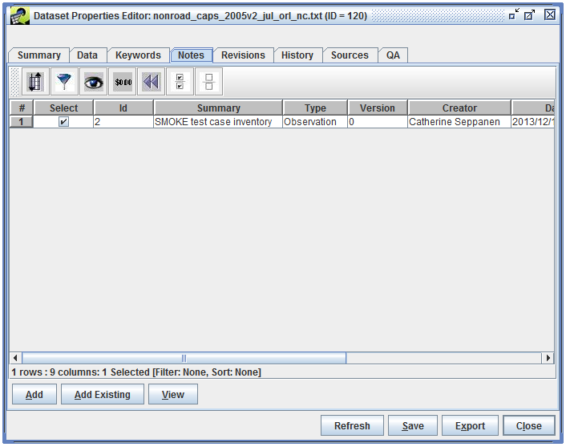{#fig:dataset_properties_notes_nonroad}

To create a new note about a dataset, click the Add button and the Create New Note dialog will open ([@Fig:create_new_note]). Notes can reference other notes so that questions can be answered. Click the Set button to display other notes for this dataset and select any referenced notes.

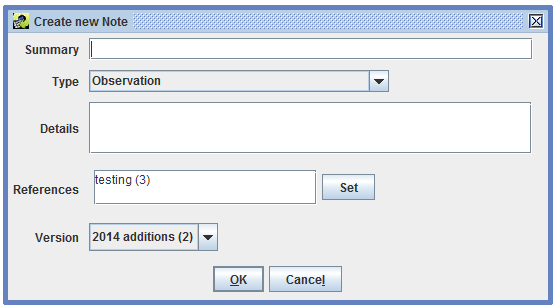{#fig:create_new_note}

The Add Existing button in the Notes tab opens a dialog to add existing notes to the dataset. This feature is useful if you need to add the same note to a set of files. Add a new note for the first dataset and then for subsequent datasets, use the "Note name contains:" field to search for the newly added note. In the list of matched notes, select the note to add and click the OK button.

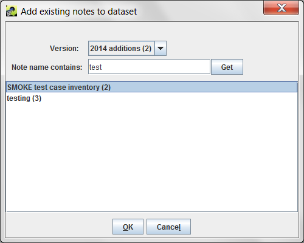{#fig:add_existing_note}

### Revisions ### {#sec:dataset_properties_revisions_section}

The Revisions tab of the Dataset Properties Editor ([@Fig:dataset_properties_revisions]) shows revisions that have been made to the data contained in the dataset. See [@Sec:editing_data_section] for more information about editing the raw data.

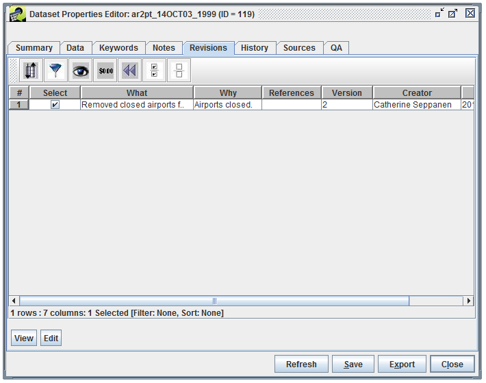{#fig:dataset_properties_revisions}

### History ###

The History tab of the Dataset Properties Editor ([@Fig:dataset_properties_history_nonroad]) shows the export history of the dataset. When the dataset is exported, a history record is automatically created containing the name of the user who exported the data, the version that was exported, the location on the server where the file was exported, and statistics about how many lines were exported and the export time.

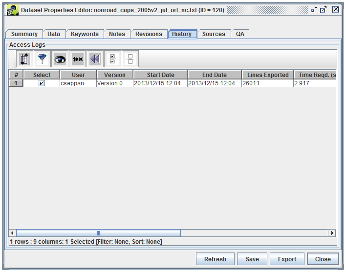{#fig:dataset_properties_history_nonroad}

### Sources ###

The Sources tab of the Dataset Properties Editor ([@Fig:dataset_properties_sources_nonroad]) shows where the data associated with the dataset came from and where it is stored in the database, if applicable. For datasets where the data is stored in the EMF database, the Table column shows the name of the table in the EMF database and Source lists the original file the data was imported from.

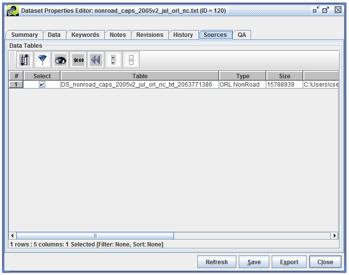{#fig:dataset_properties_sources_nonroad}

[@Fig:dataset_properties_sources_external] shows the Sources tab for a dataset that references external files. In this case, there is no Table column since the data is not stored in the EMF database. The Source column lists the current location of the external file. If the location of the external file changes, you can click the Update button to browse for the file in its new location.

{#fig:dataset_properties_sources_external}

### QA ### {#sec:dataset_properties_qa_section}

The QA tab of the Dataset Properties Editor ([@Fig:dataset_properties_qa_nonroad]) shows the QA steps that have been run using the dataset. See [@Sec:qa_chapter] for more information about setting up and running QA steps.

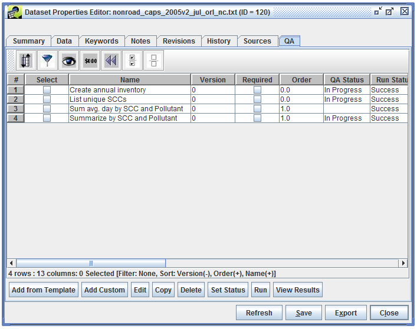{#fig:dataset_properties_qa_nonroad}

## Viewing Raw Data ## {#sec:viewing_data_section}

The EMF allows you to view and edit the raw data stored for each dataset. To work with the data, select a dataset from the Dataset Manager and click the Edit Data button to open the Dataset Versions Editor ([@Fig:dataset_versions_editor]). This window shows the same list of versions as the Dataset Properties Data tab ([@Sec:dataset_properties_data_section]).

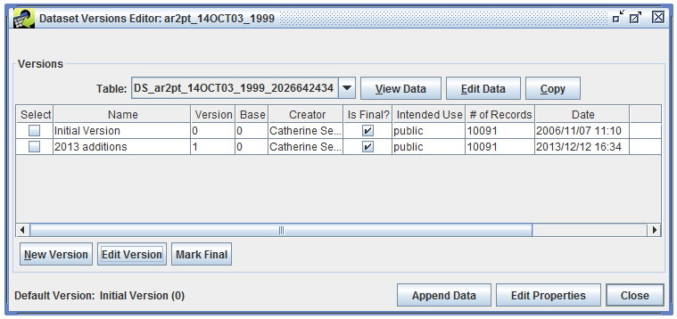{#fig:dataset_versions_editor}

To view the data, select a version and click the View Data button. The raw data is displayed in the Data Viewer as shown in [@Fig:data_viewer].

{#fig:data_viewer}

Since the data stored in the EMF may have millions of rows, the client application only transfers a small amount of data (300 rows) from the server to your local machine at a time. The area in the top right corner of the Data Viewer displays information about the currently loaded rows along with controls for paging through the data. The single left and right arrows move through the data one chunk at a time while the double arrows jump to the beginning and end of the data. If you hover your mouse over an arrow, a tooltip will pop up to remind you of its function. The slider allows you to quickly jump to different parts of the data.

You can control how the data are sorted by entering a comma-separated list of columns in the Sort Order field and then clicking the Apply button. A descending sort can be specified by following the column name with `desc`.

The Row Filter field allows you to enter criteria and filter the rows that are displayed. The syntax is similar to a SQL WHERE clause. [@Tbl:row_filter_syntax_table] shows some example filters and the syntax for each.

Filter Purpose|Row Filter Syntax
-|-
Filter on a particular set of SCCs|`scc like '101%' or scc like '102%'`
Filter on a particular set of pollutants|`poll in ('PM10', 'PM2_5')`
Filter sources only in NC (State FIPS = 37), SC (45), and VA (51);  note that FIPS column format is State + County FIPS code (e.g., 37001)|`substring(FIPS,1,2) in ('37', '45', '51')`
Filter sources only in CA (06) and include only NOx and VOC pollutants|`fips like '06%' and (poll = 'NOX' or poll = 'VOC')`
: Examples of Row Filter Syntax {#tbl:row_filter_syntax_table}

[@Fig:data_viewer_row_filter] shows the data sorted by the column "ratio" in descending order and filtered to only show rows where the FIPS code is "13013".

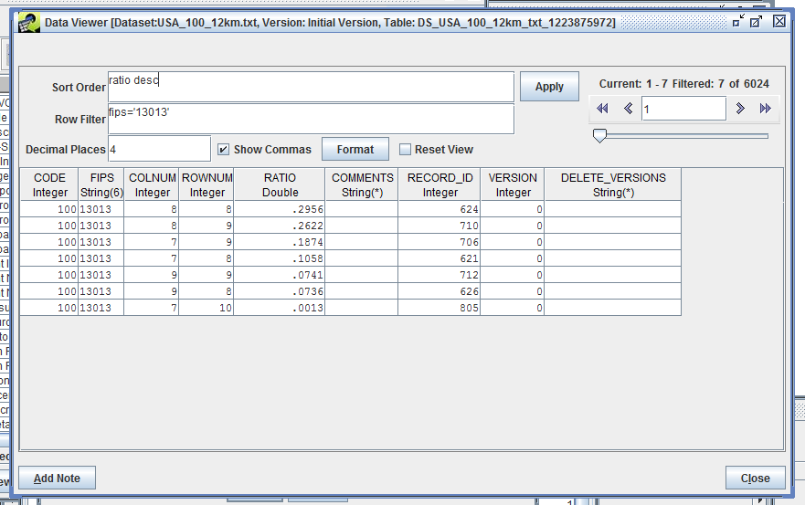{#fig:data_viewer_row_filter}

The Row Filter syntax used in the Data Viewer can also be used when exporting datasets to create filtered export files ([@Sec:export_filtering_section]. If you would like to create a new dataset based on a filtered existing dataset, you can export your filtered dataset and then import the resulting file as a new dataset. [@Sec:exporting_datasets_section] describes exporting datasets and [@Sec:importing_datasets_section] explains how to import datasets.

## Editing Raw Data ## {#sec:editing_data_section}

The EMF does not allow data to be edited after a version has been marked as final. If a dataset doesn't have a non-final version, first you will need to create a new version. Open the Dataset Versions Editor as shown in [@Fig:dataset_versions_editor]. Click the New Version button to bring up the Create a New Version dialog window like [@Fig:create_new_version].

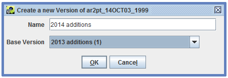{#fig:create_new_version}

Enter a name for the new version and select the base version. The base version is the starting point for the new version and can only be a version that is marked as final. Click OK to create the new version. The Dataset Versions Editor will show your newly created version ([@Fig:dataset_versions_editor_notfinal]).

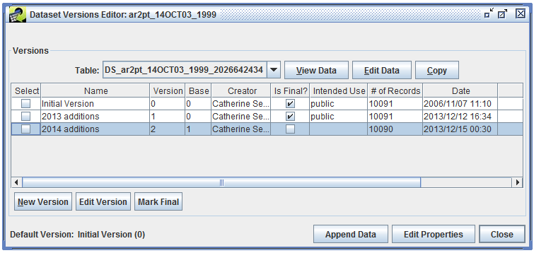{#fig:dataset_versions_editor_notfinal}

You can now select the non-final version and click the Edit Data button to display the Data Editor as shown in [@Fig:data_editor].

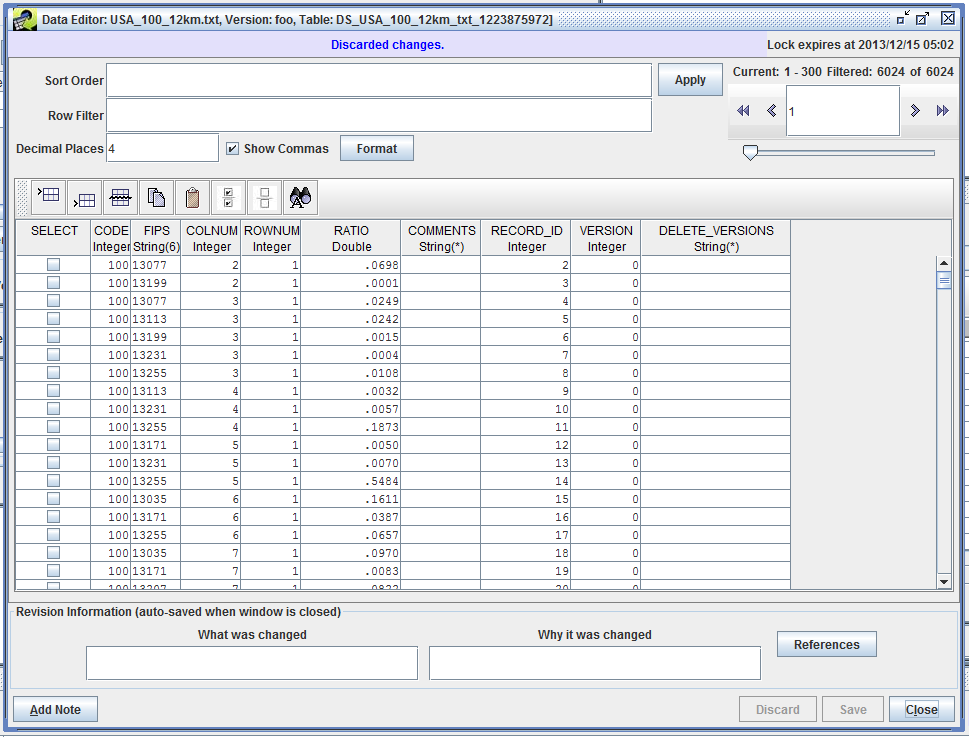{#fig:data_editor}

The Data Editor uses the same paging mechanisms, sort, and filter options as the Data Viewer described in [@Sec:viewing_data_section]. You can double-click a data cell to edit the value. The toolbar shown in [@Fig:data_editor_toolbar] provides options for adding and deleting rows.

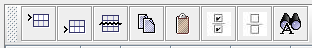{#fig:data_editor_toolbar}

The functions of each toolbar button are described below, listed left to right:

1. **Insert Above**: Inserts a new row above the currently selected row.
2. **Insert Below**: Inserts a new row below the currently selected row.
3. **Delete**: Deletes the selected rows. When you click this button, you will be prompted to confirm the deletion.
4. **Copy Selected Rows**: Copies the selected rows.
5. **Insert Copied Rows Below**: Pastes the copied rows below the currently selected row.
6. **Select All**: Selects all rows.
7. **Clear All**: Clears all selections.
8. **Find and Replace Column Values**: Opens the Find and Replace Column Values dialog shown in [@Fig:find_replace_values].

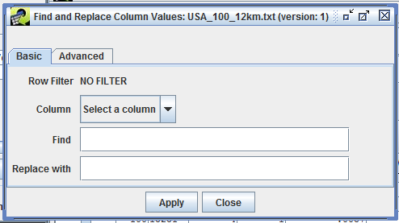{#fig:find_replace_values}

In the Data Editor window, you can undo your changes by clicking the Discard button. Otherwise, click the Save button to save your changes. If you have made changes, you will need to enter Revision Information before the EMF will allow you to close the window. Revisions for a dataset are shown in the Dataset Properties Revisions tab (see [@Sec:dataset_properties_revisions_section]).

## Exporting Datasets ## {#sec:exporting_datasets_section}

When you export a dataset, the EMF will generate a file containing the data in the format defined by the dataset's type. To export a dataset, you can either select the dataset in the Dataset Manager window and click the Export button or you can click the Export button in the Dataset Properties window. Either way will open the Export dialog as shown in [@Fig:export_dialog]. If you have multiple datasets selected in the Dataset Manager when you click the Export button, the Export dialog will list each dataset in the Datasets field.

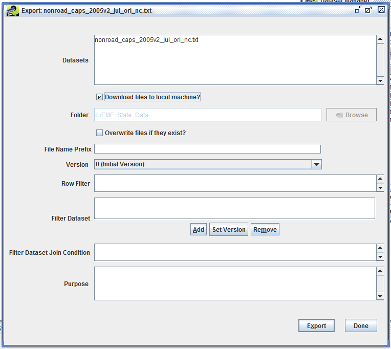{#fig:export_dialog}

Typically, you will check the **Download files to local machine?** checkbox. With this option, the EMF will export the dataset to a file on the EMF server and then automatically download it to your local machine. When downloading files to your local machine, the folder input field is not active. The downloaded files will be placed in a temporary directory on your local computer. The EMF property `local.temp.dir` controls the location of the temporary directory. EMF properties can be edited in the EMFPrefs.txt file. Note that the **Overwrite files if they exit?** checkbox isn't functional at this point.

You can enter a prefix to be added to the names of the exported files in the File Name Prefix field. Exported files will be named based on the dataset name and may have prefixes or suffixes attached based on keywords associated with the dataset or dataset type.

If you are exporting a single dataset and that dataset has multiple versions, the Version pull-down menu will allow you to select which version you would like to export. If you are exporting multiple datasets, the default version of each dataset will be exported.

The Row Filter, Filter Dataset, and Filter Dataset Join Condition fields allow for filtering the dataset during export to reduce the total number of rows exported. See [@Sec:export_filtering_section] for more information about these settings.

Before clicking the Export button, enter a Purpose for your export. This will be logged as part of the history for the dataset. If you do not enter any text in the Purpose field, the fact that you exported the dataset will still be logged as part of the dataset's history. At this time, history records are only created when the **Download files to local machine?** checkbox is *not* checked.

After clicking the Export button, check the Status window to see if any problems arise during the export. If the export succeeds, you will see a status message like

> Completed export of nonroad\_caps\_2005v2\_jul\_orl\_nc.txt to \<server directory\>/nonroad\_caps\_2005v2\_jul\_orl\_nc.txt in 2.137 seconds. The file will start downloading momentarily, see the Download Manager for the download status.

You can bring up the Downloads window as shown in [@Fig:downloads_window] by opening the **Window** menu at the top of the EMF main window and selecting **Downloads**.

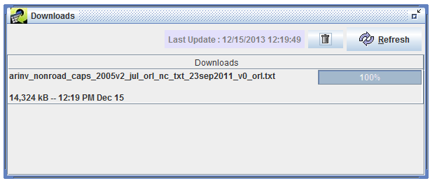{#fig:downloads_window}

As your file is downloading, the progress bar on the right side of the window will update to show you the progress of the download. Once it reaches 100%, your download is complete. Right click on the filename in the Downloads window and select **Open Containing Folder** to open the folder where the file was downloaded.

### Export Filtering Options ### {#sec:export_filtering_section}

The export filtering options allow you to select and export portions of a dataset based on your matching criteria.

The Row Filter field shown in the Export Dialog in [@Fig:export_dialog] uses the same syntax as the Data Viewer window ([@Sec:viewing_data_section]) and allows you to export only a subset of the data. Example filters are shown in [@Tbl:row_filter_syntax_table].

Filter Dataset and Filter Dataset Join Condition, also shown in [@Fig:export_dialog], allow for advanced filtering of the dataset using an additional dataset. For example, if you are exporting a nonroad inventory, you can choose to only export rows that match a different inventory by FIPS code or SCC. When you click the Add button, the Select Datasets dialog appears as in [@Fig:export_select_datasets].

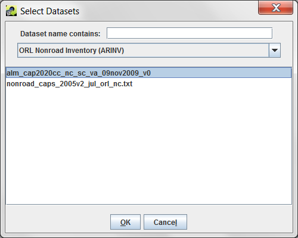{#fig:export_select_datasets}

Select the dataset type for the dataset you want to use as a filter from the pull-down menu. You can use the **Dataset name contains** field to further narrow down the list of matching datasets. Click on the dataset name to select it and then click OK to return to the Export dialog.

The selected dataset is now shown in the Filter Dataset box. If the filter dataset has multiple versions, click the Set Version button to select which version to use for filtering. You can remove the filter dataset by clicking the Remove button.

Next, you will enter the criteria to use for filtering in the Filter Dataset Join Condition textbox. The syntax is similar to a SQL JOIN condition where the left hand side corresponds to the dataset being exported and the right hand side corresponds to the filter dataset. You will need to know the column names you want to use for each dataset. 

Type of Filter|Filter Dataset Join Condition
--|-
Export records where the FIPS, SCC, and plant IDs are the same in both datasets;  both datasets have the same column names|`fips=fips`  `scc=scc`  `plantid=plantid`
Export records where the SCC, state codes, and pollutants are the same in both datasets;  the column names differ between the datasets|`scc=scc_code`  `substring(fips,1,2)=state_cd`  `poll=poll_code`
: Examples of Filter Dataset Join Conditions {#tbl:filter_join_conditions_table}

Once your filter conditions are set up, click the Export button to begin the export. Only records that match all of the filter conditions will be exported. Status messages in the Status window will contain additional information about your filter. If no records match your filter condition, the export will fail and you will see a status message like:

> Export failure. ERROR: nonroad\_caps\_2005v2\_jul\_orl\_nc.txt will not be exported because no records satisfied the filter

If the export succeeds, the status message will include a count of the number of records in the database and the number of records exported:

> No. of records in database: 150845; Exported: 26011

## Importing Datasets ## {#sec:importing_datasets_section}

Importing a dataset is the process where the EMF reads a data file or set of data files from disk, stores the data in the database (for internal dataset types), and creates metadata about the dataset. To import a dataset, start by clicking the Import button in the bottom right corner of the Dataset Manager window ([@Fig:dataset_manager]). The Import Datasets dialog will be displayed as shown in [@Fig:import_datasets]. You can also bring up the Import Datasets dialog from the main EMF File menu, then select Import.

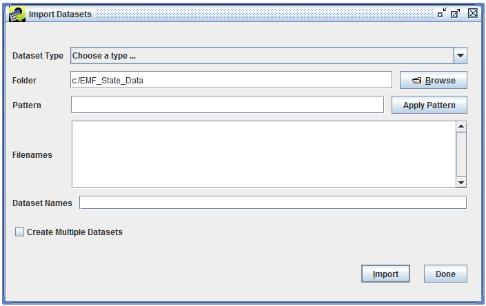{#fig:import_datasets}

An advantage to opening the Import Datasets dialog from the Dataset Manager as opposed to using the File menu is that if you have a dataset type selected in the Dataset Manager Show Datasets of Type pull-down menu, then that dataset type will automatically be selected for you in the Import Datasets dialog.

In the Import Datasets dialog, first use the **Dataset Type** pull-down menu to select the dataset type corresponding to the file you want to import. For example, if your data file is a annual point-source emissions inventory in Flat File 2010 (FF10) format, you would select the dataset type "Flat File 2010 Point". [@Sec:common_dataset_types_section] lists commonly used dataset types. Keep in mind that your EMF installation may have different dataset types available.

Most dataset types specify that datasets of that type will use data from a single file. For example, for the Flat File 2010 Point dataset type, you will need to select exactly one file to import per dataset. Other dataset types can require or optionally allow multiple files to import into a single dataset. Some dataset types can use a large number of files like the Day-Specific Point Inventory (External Multifile) dataset type which allows up to 366 files for a single dataset. Thus, the Import Datasets dialog will allow you to select multiple files during the import process and has tools for easily matching multiple files.

Next, select the folder where the data files to import are located on the EMF server. You can either type or paste (using Ctrl-V) the folder name into the field labeled **Folder**, or you can click the Browse button to open the remote file browser as shown in [@Fig:remote_file_browser]. ***Important!*** To import data files, the files must be accessible by the machine that the EMF server is running on. If the data files are on your local machine, you will need to transfer them to the EMF server before you can import them.

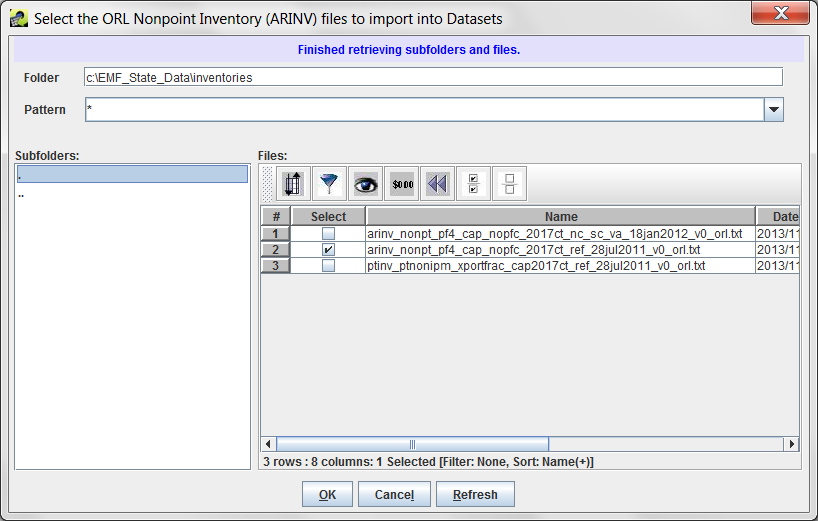{#fig:remote_file_browser}

To use the remote file browser, you can navigate from your starting folder to the file by either typing or pasting a directory name into the **Folder** field or by using the **Subfolders** list on the left side of the window. In the Subfolders list, double-click on a folder's name to go into that folder. If you need to go up a level, double-click the `..` entry.

Once you reach the folder that contains your data files, select the files to import by clicking the checkbox next to each file's name in the **Files** section of the browser. The Files section uses the Sort-Filter-Select Table described in [@Sec:sfs_table_section] to list the files. If you have a large number of files in the directory, you can use the sorting and filtering options of the Sort-Filter-Select Table to help find the files you need.

You can also use the **Pattern** field in the remote file browser to only show files matching the entered pattern. By default the pattern is just the wildcard character `*` to match all files. Entering a pattern like `arinv*2002*txt` will match filenames that start with "arinv", have "2002" somewhere in the filename, and then end with "txt".

Once you've selected the files to import, click **OK** to save your selections and return to the Import Datasets dialog. The files you selected will be listed in the Filenames textbox in the Import Datasets dialog as shown in [@Fig:import_dataset_single_file]. If you selected a single file, the **Dataset Names** field will contain the filename of the selected file as the default dataset name.

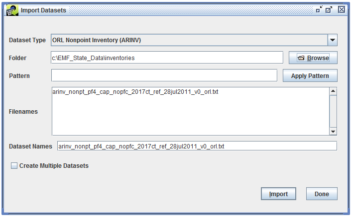{#fig:import_dataset_single_file}

Update the **Dataset Names** field with your desired name for the dataset. If the dataset type has EXPORT\_PREFIX or EXPORT\_SUFFIX keywords assigned, these values will be automatically stripped from the dataset name. For example, the ORL Nonpoint Inventory (ARINV) dataset type defines EXPORT\_PREFIX as "arinv\_" and EXPORT\_SUFFIX as "\_orl.txt". Suppose you select an ORL nonpoint inventory file named "arinv\_nonpt\_pf4\_cap\_nopfc\_2017ct\_ref\_orl.txt" to import. By default the Dataset Names field in the Import Datasets dialog will be populated with "arinv\_nonpt\_pf4\_cap\_nopfc\_2017ct\_ref\_orl.txt" (the filename). On import, the EMF will automatically convert the dataset name to "nonpt\_pf4\_cap\_nopfc\_2017ct\_ref" removing the EXPORT\_PREFIX and EXPORT\_SUFFIX.

Click the **Import** button to start the dataset import. If there are any problems with your import settings, you'll see a red error message displayed at the top of the Import Datasets window. [@Tbl:dataset_import_error_messages_table] shows some example error messages and suggested solutions.

Example Error Message|Solution
-|--
A Dataset Type should be selected|Select a dataset type from the **Dataset Type** pull-down menu.
A Filename should be specified|Select a file to import.
A Dataset Name should be specified|Enter a dataset name in the **Dataset Names** textbox.
The ORL Nonpoint Inventory (ARINV) importer can use at most 1 files|You selected too many files to import for the dataset type. Select the correct number of files for the dataset type. If you want to import multiple files of the same dataset type, see [@Sec:import_multiple_section].
The NIF3.0 Nonpoint Inventory importer requires at least 2 files|You didn't select enough files to import for the dataset type. Select the correct number of files for the dataset type.
Dataset name nonpt\_pf4\_cap\_nopfc\_2017ct\_ref has been used.|Each dataset in the EMF needs a unique dataset name. Update the dataset name to be unique. Remember that the EMF will automatically remove the EXPORT\_PREFIX and EXPORT\_SUFFIX if defined for the dataset type.
: Dataset Import Error Messages {#tbl:dataset_import_error_messages_table}

If your import settings are good, you will see the message "Started import. Please monitor the Status window to track your import request." displayed at the top of the Import Datasets window as shown in [@Fig:import_started].

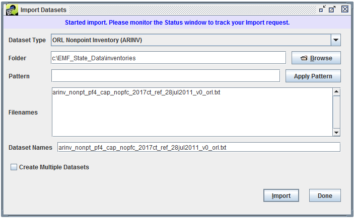{#fig:import_started}

In the Status window, you will see a status message like:

> Started import of nonpt\_pf4\_cap\_nopfc\_2017ct\_nc\_sc\_va\_18jan2012\_v0 [ORL Nonpoint Inventory (ARINV)] from arinv\_nonpt\_pf4\_cap\_nopfc\_2017ct\_nc\_sc\_va\_18jan2012\_v0.txt

Depending on the size of your file, the import can take a while to complete. Once the import is complete, you will see a status message like:

> Completed import of nonpt\_pf4\_cap\_nopfc\_2017ct\_nc\_sc\_va\_18jan2012\_v0 [ORL Nonpoint Inventory (ARINV)] in 57.6 seconds from arinv\_nonpt\_pf4\_cap\_nopfc\_2017ct\_nc\_sc\_va\_18jan2012\_v0.txt

To see your newly imported dataset, open the Dataset Manager window and find your dataset by dataset type or using the Advanced search. You may need to click the **Refresh** button in the upper right corner of the Dataset Manager window to get the latest dataset information from the EMF server.

### Importing Multiple Datasets ### {#sec:import_multiple_section}

You can use the Import Datasets window to import multiple datasets of the same type at once. In the remote file browser (shown in [@Fig:remote_file_browser]), select all the files you would like to import and click **OK**. In the Import Datasets window, check the checkbox **Create Multiple Datasets** as shown in [@Fig:import_multiple_datasets]. The **Dataset Names** textbox goes away.

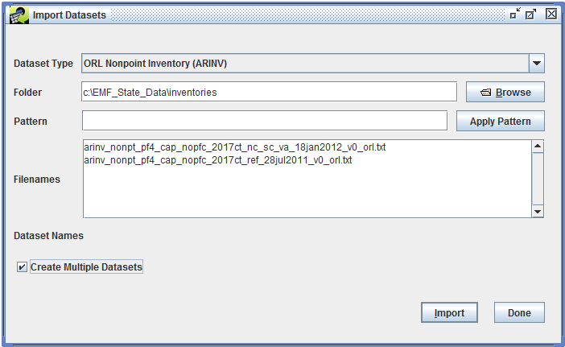{#fig:import_multiple_datasets}

For each dataset, the EMF will automatically name the dataset using the corresponding filename. If the keywords EXPORT\_PREFIX or EXPORT\_SUFFIX are defined for the dataset type, the keyword values will be stripped from the filenames when generating the dataset names. If these keywords are not defined for the dataset type, then the dataset name will be identical to the filename.

Click the **Import** button to start importing the datasets. The Status window will display Started and Completed status messages for each dataset as it is imported.

## Suggestions for Dataset Organization ##

* Use a consistent naming scheme that works for your group. If you have a naming system already in place, continue using it in the EMF. You can enter your own dataset names when importing files and also edit a dataset's name if you have the appropriate privileges. The EMF will automatically make sure that the dataset names are unique.

* Avoid dates in your dataset names. When a dataset is exported, the EMF will automatically include the dataset's last modified date in name of the exported file.

* For monthly inventory files, include the three character month abbreviation in the dataset name (i.e. "jan", "feb", "mar", etc.). These names are used in certain QA steps.

* Enter as much metadata about each dataset as possible, for example the temporal resolution of the data, time period covered, and region. These fields can be used when filtering datasets in the Dataset Manager window.

* Use the Project field to group sets of files together. EMF Administrators can create new project names to aid in organizing files.

* Try out the different options for finding datasets in the Dataset Manager ([@Sec:finding_datasets_section]) to see what works best for your workflow. You may find that the Advanced Dataset Search fits what you need to do or perhaps filtering the dataset list is more useful.

* Hide dataset types that you don't use. Each user can control the list of dataset types that the EMF client will use when displaying dataset type pull-down menus (like the Show Datasets of Type pull-down menu in the Manage Datasets window). From the **Manage** menu, select **My Profile** to show the Edit User window ([@Fig:edit_user_hide_dataset_types]). In this window, you can select dataset types from the Visible Dataset Types list, then click the Hide button to move the selected types to the Hidden Dataset Types list. Selecting items in the hidden list and clicking the Show button will move the selected types back to the visible list. Click the Save button to save your changes. Note that if the Dataset Manager window is open, you'll need to close it and open it again for the list of dataset types to refresh.

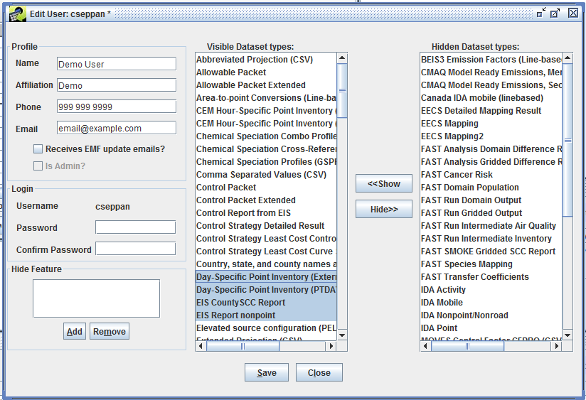{#fig:edit_user_hide_dataset_types}
