# Case Management # {#sec:case_management_chapter}

In the EMF, **cases** are used to organize data and settings needed for model runs. For example, a case might run MOVES2014 to generate emission factors for a set of reference counties, or a case may run SMOKE to create inputs for CMAQ. Cases are a flexible concept to accommodate many different types of processing. Cases are organized into:

* **jobs** that run specific scripts or programs
* **inputs** that refer to datasets stored in the EMF and provide data needed by the jobs
* **parameters** that provide settings and other pieces of information needed by the jobs

When a job is run, it can produce messages that are stored as the **history** for the job. A job may also produce data files that are automatically imported into the EMF; these datasets are referred to as **outputs** for the job.

To work with cases in the EMF, select the Manage menu and then Cases. This opens the Case Manager window, which will initially be empty as shown in [@Fig:case_manager_empty].

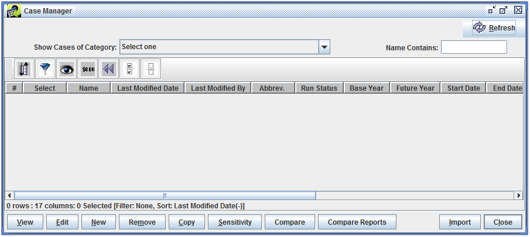{#fig:case_manager_empty}

To show all cases currently in the EMF, use the **Show Cases of Category** pull-down to select All. The Case Manager window will then list all the cases as shown in [@Fig:case_manager_all].

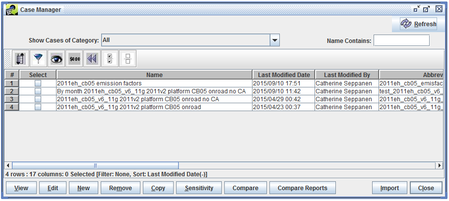{#fig:case_manager_all}

The Case Manager window shows a summary of each case. [@Tbl:case_manager_columns_table] lists each column in the window. Many of the values are optional and may or may not be used depending on the specific model and type of case.

Column|Description
-|----
Name|The unique name for the case.
Last Modified Date|The most recent date and time when the case was modified.
Last Modified By|The user who last modified the case.
Abbrev.|The unique abbreviation assigned to the case.
Run Status|The overall run status of the case. Values are Not Started, Running, Failed, and Complete.
Base Year|The base year of the case.
Future Year|The future year of the case.
Start Date|The starting date and time of the case.
End Date|The ending date and time of the case.
Regions|A list of modeling regions assigned to the case.
Model to Run|The model that the case will run.
Downstream|The model that the case is creating output for.
Speciation|The speciation mechanism used by the case.
Category|The category assigned to the case.
Project|The project assigned to the case.
Is Final|Indicates if the case has been marked as final.
: Case Manager Columns {#tbl:case_manager_columns_table}

In the Case Manager window, the **Name Contains** textbox can be used to quickly find cases by name. The search term is not case sensitive and the wildcard character * (asterisk) can be used in the search.

To work with a case, select the case by checking the checkbox in the **Select** column, then click the desired action button in the bottom of the window. [@Tbl:case_manager_actions_table] describes each button.

Command|Description
-|----
View|Opens the Case Viewer window to view the details of the case in read-only mode.
Edit|Opens the Case Editor window to edit the details of the case.
New|Opens the Create a Case window to start creating a new case.
Remove|Removes the selected case; a prompt is displayed confirming the deletion.
Copy|Copies the selected case to a new case named "Copy of _case name_".
Sensitivity|Opens the sensitivity tool, used to make emissions adjustments to existing SMOKE cases.
Compare|Generates a report listing the details of two or more cases and whether the settings match.
Compare Reports|Opens the Compare Case window which can be used to compare the outputs from different cases.
Import|Opens the Import Cases window where case information that was previously exported from the EMF can be imported from text files.
Close|Closes the Case Manager window.
Refresh|Refreshes the list of cases and information about each case. (This button is in the top right corner of the Case Manager window.)
: Case Manager Actions {#tbl:case_manager_actions_table}

## Viewing and Editing Case Details ##

To view or edit the details of a case, select the case in the Case Manager window, then click the View or Edit button. [@Fig:case_viewer_summary] shows the Case Viewer window, while [@Fig:case_editor_summary] shows the Case Editor window for the same case. Data in the Case Viewer window is not editable, and the Case Viewer window does not have a Save button.

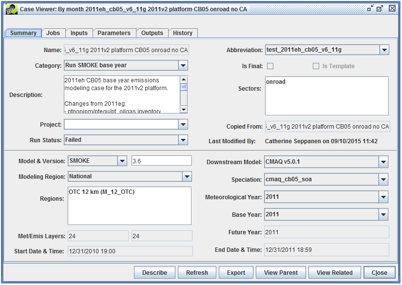{#fig:case_viewer_summary}

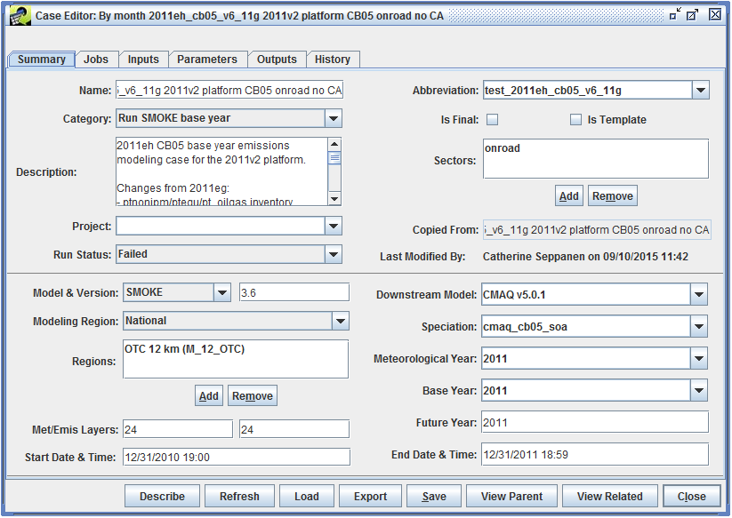{#fig:case_editor_summary}

The Case Viewer and Case Editor windows split the case details into six tabs. [@Tbl:case_detail_tabs_table] gives a brief description of each tab.

Tab|Description
-|----
Summary|Shows an overview of the case and high-level settings
Jobs|Work with the individual jobs that make up the case
Inputs|Select datasets that will be used as inputs to the case's jobs
Parameters|Configure settings and other information needed to run the jobs
Outputs|View and export the output datasets created by the case's jobs
History|View log and status messages generated by individual jobs
: Case Viewer and Editor Tabs {#tbl:case_detail_tabs_table}

There are several buttons that appear at the bottom of the Case Viewer and Case Editor windows. The actions for each button are described in [@Tbl:case_detail_actions_table].

Command|Description
-|----
Describe|Shows the case description in a larger window. If opened from the Case Editor window, the description can be edited (see [@Fig:case_editor_describe]).
Refresh|Reload the case details from the server.
Load (Case Editor only)|Manually load data created by CMAQ jobs into the EMF.
Export|Exports the case settings to text files. See [@Sec:export_case].
Save (Case Editor only)|Save the current case.
View Parent|If the case was copied from another case, opens the Case Viewer showing the original case.
View Related|View other cases that either produce inputs used by the current case, or use outputs created by the current case.
Close|Closes the Case Viewer or Case Editor window
: Case Viewer and Editor Actions {#tbl:case_detail_actions_table}

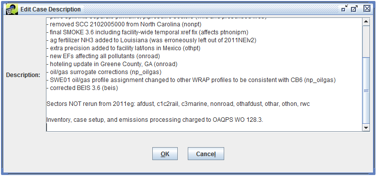{#fig:case_editor_describe}

### Exporting a Case ### {#sec:export_case}

The **Export** button at the bottom of the Case Viewer or Case Editor window can be used to export the current case. Clicking the **Export** button will open the Export Case dialog shown in [@Fig:case_editor_export].

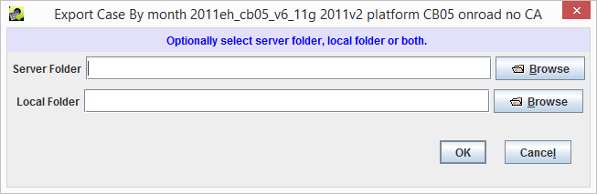{#fig:case_editor_export}

The case can be exported to text files either on the EMF server or directly to a local folder. After selecting the export location, click OK to export the case. The export process will create three text files, each named with the case's name and abbreviation. [@Tbl:case_export_files_table] describes the contents of the three files.

File Name|Description
-|----
_case_name_abbrev_\_Summary\_Parameters.csv|Settings from the Summary tab, and a list of parameters for the case
_case_name_abbrev_\_Jobs.csv|List of jobs for the case with settings for each job
_case_name_abbrev_\_Inputs.csv|List of inputs for the case including the dataset name associated with each input
: Case Export Files {#tbl:case_export_files_table}

The exported case data can be loaded back into the EMF using the **Import** button in the Case Manager window.

### Summary Tab ### {#sec:summary_tab}

[@Fig:case_editor_summary_2] shows the Summary tab in the Case Editor window.

{#fig:case_editor_summary_2}

The Summary tab shows a high-level overview of the case including the case's name, abbreviation, and assigned category. Many of the fields on the Summary tab are listed in the Case Manager window as described in [@Tbl:case_manager_columns_table].

The **Is Final** checkbox indicates that the case should be considered final and should not have any changes made to it. The **Is Template** checkbox indicates that the case is meant as a template for additional cases and should not be run directly. The EMF does not enforce any restrictions on cases marked as final or templates.

The **Description** textbox allows a detailed description of the case to be entered. The **Describe** button at the bottom of the Case Editor window will open the case description in a larger window for easier editing.

The **Sectors** box lists the sectors that have been associated with the case. Click the **Add** or **Remove** buttons to add or remove sectors from the list.

A case can optionally be assigned to a project using the **Project** pull-down menu.

If the case was copied from a different case, the parent case name will be listed by the **Copied From** label. This value is not editable. Clicking the **View Parent** button will open the copied from case.

The overall status of the case can be set using the **Run Status** pull-down menu. Available statuses are Not Started, Running, Failed, and Complete.

The **Last Modified By** field shows who last modified the case and when. This field is not editable.

The lower section of the Summary tab has various fields to set technical details about the case such as which model will be run, the downstream model (i.e. which model will be using the output from the case), and the speciation mechanism in use. These values will be available to the scripts that are run for each case job; see [@Sec:script_integration] for more information. 

For the case shown in [@Fig:case_editor_summary_2], the **Start Date & Time** is January 1, 2011 00:00 GMT and the **End Date & Time** is December 31, 2011 23:59 GMT. The EMF client has automatically converted these values from GMT to the local time zone of the client which is Eastern Daylight Time (GMT-5). Thus the values shown in the screenshot are correct, but confusing.

### Jobs Tab ###

[@Fig:case_editor_jobs] shows the Jobs tab in the Case Editor window.

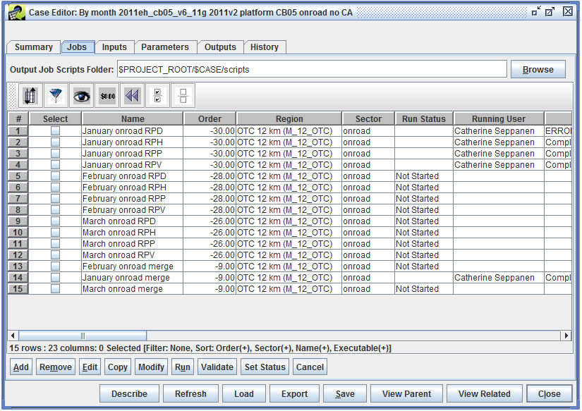{#fig:case_editor_jobs}

At the top of the Jobs tab is the **Output Job Scripts Folder**. When a job is run, the EMF creates a shell script in this folder. See [@Sec:script_integration] for more information about the script that the EMF writes and executes. Click the **Browse** button to set the scripts folder location on the EMF server. Otherwise, the folder location can be typed in the text field.

As shown in [@Fig:case_editor_jobs], the Output Job Scripts Folder can use variables to refer to case settings or parameters. In this case, the folder location is set to `$PROJECT_ROOT/$CASE/scripts`. PROJECT_ROOT is a case parameter defined in the Parameters tab with the value `/data/em_v6.2/2011platform`. The CASE variable refers to the case's abbreviation: `test_2011eh_cb05_v6_11g`. Thus, the scripts for the jobs in the case will be written to the folder `/data/em_v6.2/2011platform/test_2011eh_cb05_v6_11g/scripts`.

To view the details of a particular job, select the job, then click the **Edit** button to bring up the Edit Case Job window ([@Fig:case_job_edit]).

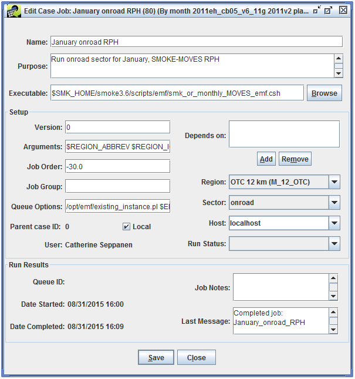{#fig:case_job_edit}

[@Tbl:case_job_fields_table] describes each field in the Edit Case Job window.

Name|Description
-|----
Name|The name of the job. When setting up a job, the combination of the job's name, region, and sector must be unique.
Purpose|A short description of the job's purpose or functionality.
Executable|The script or program the job will run.
**Setup**||
Version|Can be used to mark the version of a particular job.
Arguments|A string of arguments to pass to the executable when the job is run.
Job Order|The position of this job in the list of jobs.
Job Group|Can be used to label related jobs.
Queue Options|Any commands that are needed when submitting the job to run (i.e. queueing system options, or a wrapper script to call).
Parent case ID|If this job was copied from a different case, shows the parent case's ID.
Local|Can be used to indicate to other users if the job runs locally vs. remotely.
Depends on|TBA
Region|Indicates the region associated with the job.
Sector|Indicates the sector associated with the job.
Host|If set to anything other than localhost, the job is executed via SSH on the remote host.
Run Status|Shows the run status of the job.
**Run Results**||
Queue ID|Shows the queueing system ID, if the job is run on a system that provides this information.
Date Started|The date and time the job was last started.
Date Completed|The date and time the job completed.
Job Notes|User editable notes about the job run.
Last Message|The most recent message received while running the job.
: Case Job Fields {#tbl:case_job_fields_table}

After making any edits to the job, click the Save button to save the changes. The Close button closes the Edit Case Job window.

To create a new job, click the **Add** button to open the Add a Job window as shown in [@Fig:case_job_add].

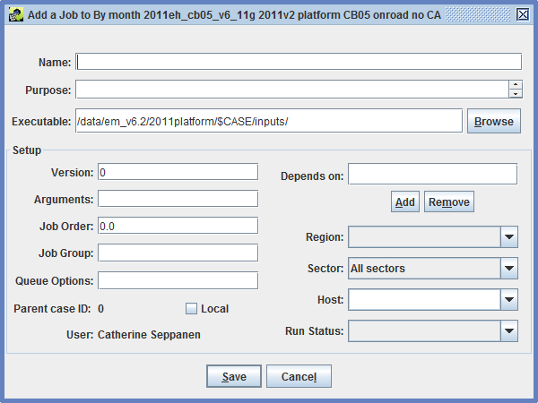{#fig:case_job_add}

The Add a Job window has the same fields as the Edit Case Job window except that the Run Results section is not shown. See [@Tbl:case_job_fields_table] for more information about each input field. Once the job information is complete, click the Save button to save the new job. Click Cancel to close the Add a Job window without saving the new job.

An existing job can be copied to a different case or the same case using the **Copy** button. [@Fig:case_job_copy] shows the window that opens when copying a job.

{#fig:case_job_copy}

If multiple jobs need to be edited with the same changes, the **Modify** button can be used. This action opens the window shown in [@Fig:case_jobs_modify].

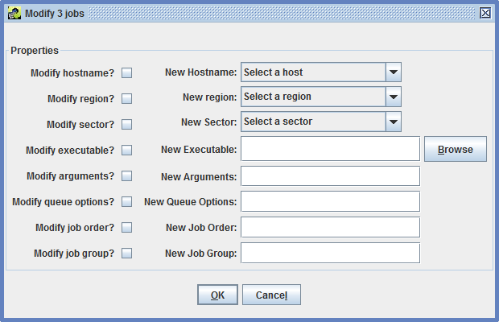{#fig:case_jobs_modify}

In the Modify Jobs window, check the checkbox next to each property to be modified. Enter the new value for the property. After clicking OK, the new value will be set for all selected jobs.

In the Jobs tab of the Case Editor window, the **Validate** button can be used to check the inputs for a selected job. The validation process will check each input for the job and report if any inputs use a non-final version of their dataset, or if any datasets have later versions available. If no later versions are found, the validation message "No new versions exist for selected inputs." is displayed.

### Inputs Tab ###

When the Inputs tab is initially viewed, the list of inputs will be empty as seen in [@Fig:case_editor_inputs_initial].

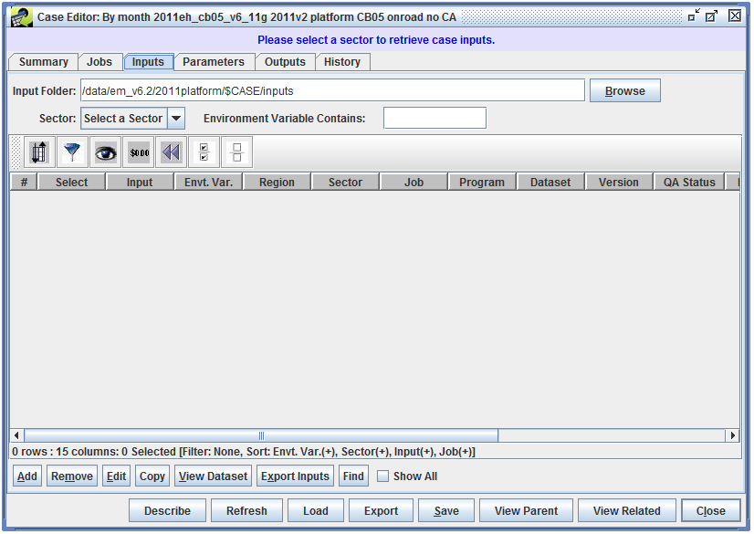{#fig:case_editor_inputs_initial}

To view the inputs, use the **Sector** pull-down menu to select a sector associated with the case. In [@Fig:case_editor_inputs], the selected sector is All, so that all inputs for the case are displayed.

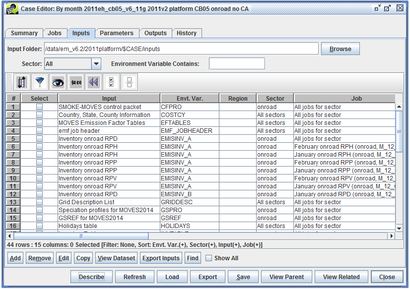{#fig:case_editor_inputs}

To view the details of an existing input, select the input, then click the **Edit** button to open the Edit Case Input window as shown in [@Fig:case_input_edit].

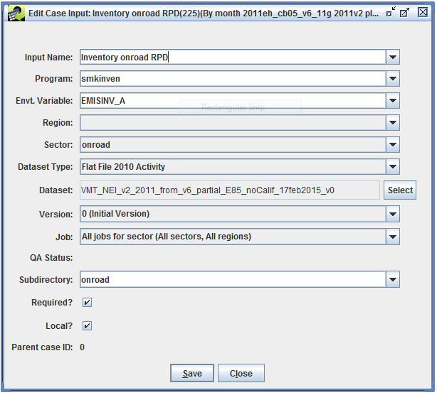{#fig:case_input_edit}

To create a new input, click the **Add** button to bring up the Add Input to Case window ([@Fig:case_input_add]).

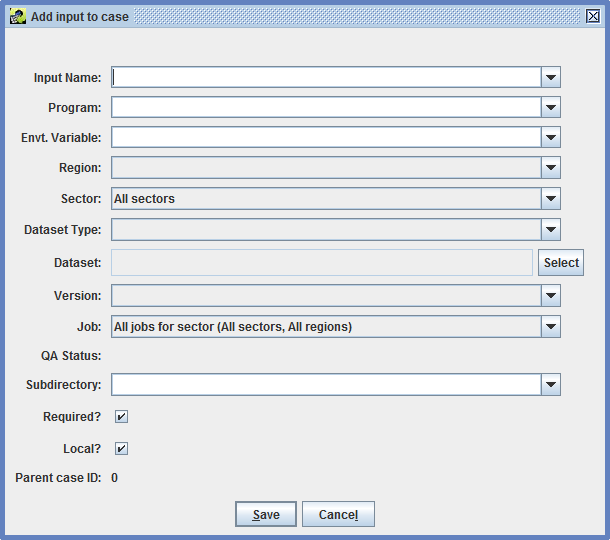{#fig:case_input_add}

The **Copy** button can be used to copy an existing input to a different case. [@Fig:case_input_copy] shows the Copy Case Input window that opens when the **Copy** button is clicked.

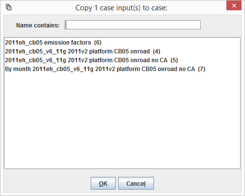{#fig:case_input_copy}

To view the dataset associated with a particular input, click the **View Dataset** button to open the Dataset Properties View window for the selected input.

### Parameters Tab ###

Like the Inputs tab, the Parameters tab will be empty when initially viewed, as shown in [@Fig:case_editor_params_initial].

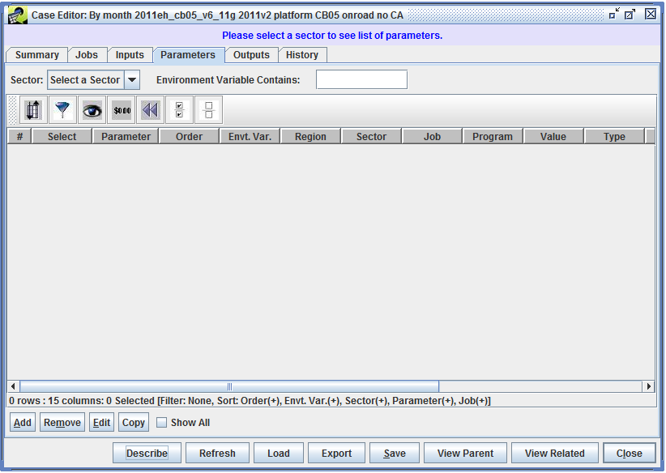{#fig:case_editor_params_initial}

To view the parameters, use the **Sector** pull-down menu to select a sector. [@Fig:case_editor_params] shows the Parameters tab with the sector set to All, so that all parameters for the case are shown.

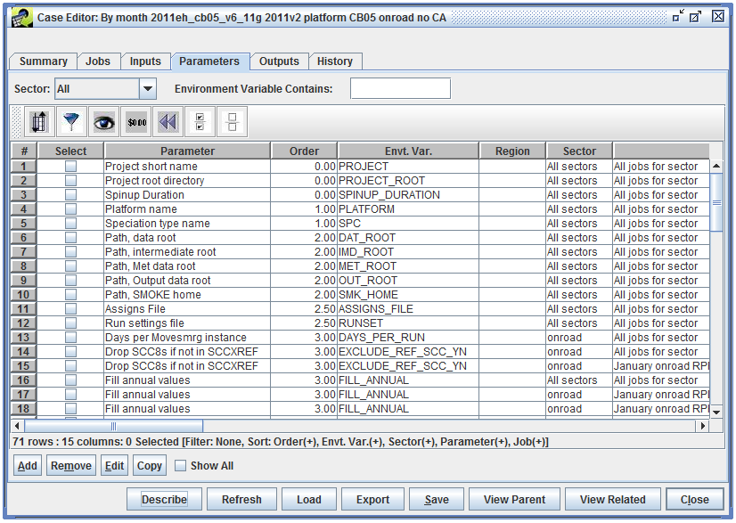{#fig:case_editor_params}

To view or edit the details of an existing parameter, select the parameter, then click the **Edit** button. This opens the parameter editing window as shown in [@Fig:case_param_edit].

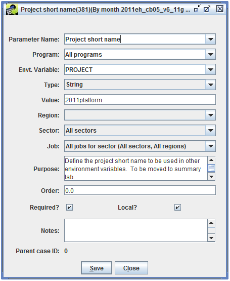{#fig:case_param_edit}

To create a new parameter, click the **Add** button and the Add Parameter to Case window will be displayed ([@Fig:case_param_add]).

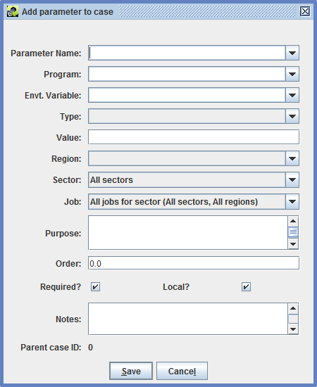{#fig:case_param_add}

### Outputs Tab ###

When initially viewed, the Outputs tab will be empty, as seen in [@Fig:case_editor_outputs_initial].

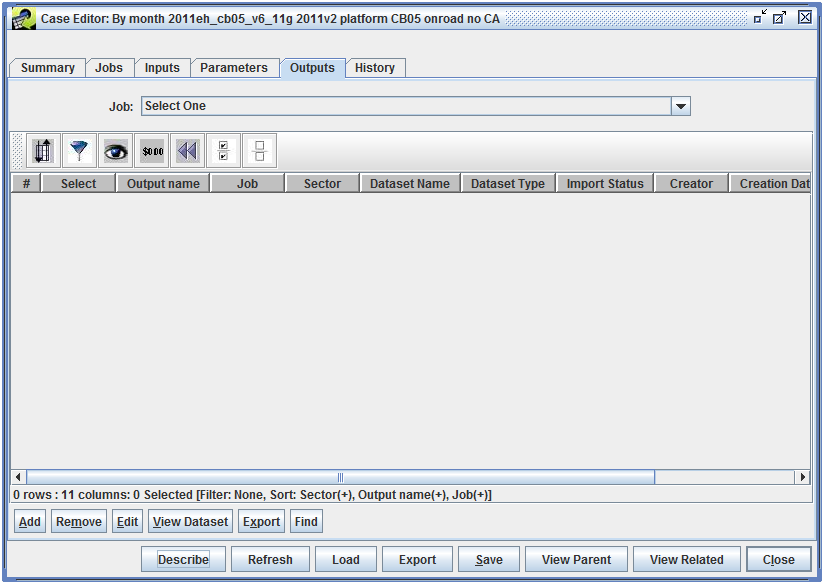{#fig:case_editor_outputs_initial}

Use the **Job** pull-down menu to select a particular job and see the outputs for that job, or select "All (All sectors, All regions)" to view all the available outputs. [@Fig:case_editor_outputs] shows the Outputs tab with All selected.

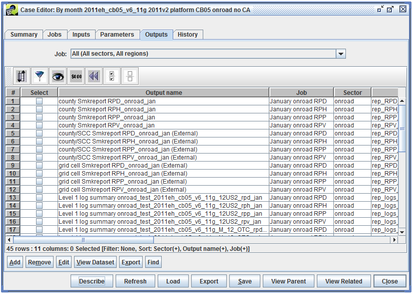{#fig:case_editor_outputs}

[@Tbl:case_outputs_columns_table] lists the columns in the table of case outputs. Most outputs are automatically registered when a case job is run, and the job script is responsible for setting the output name, dataset information, message, etc.

Column|Description
-|----
Output Name|The name of the case output.
Job|The case job that created the output.
Sector|The sector associated with the job that created the output.
Dataset Name|The name of the dataset for the output.
Dataset Type|The dataset type associated with the output dataset.
Import Status|The status of the output dataset import.
Creator|The user who created the output.
Creation Date|The date and time when the output was created.
Exec Name|If set, indicates the executable that created the output.
Message|If set, a message about the output.
: Case Outputs Colums {#tbl:case_outputs_columns_table}

### History Tab ###

Like the Outputs tab, the History tab is empty when initially viewed ([@Fig:case_editor_history_initial]).

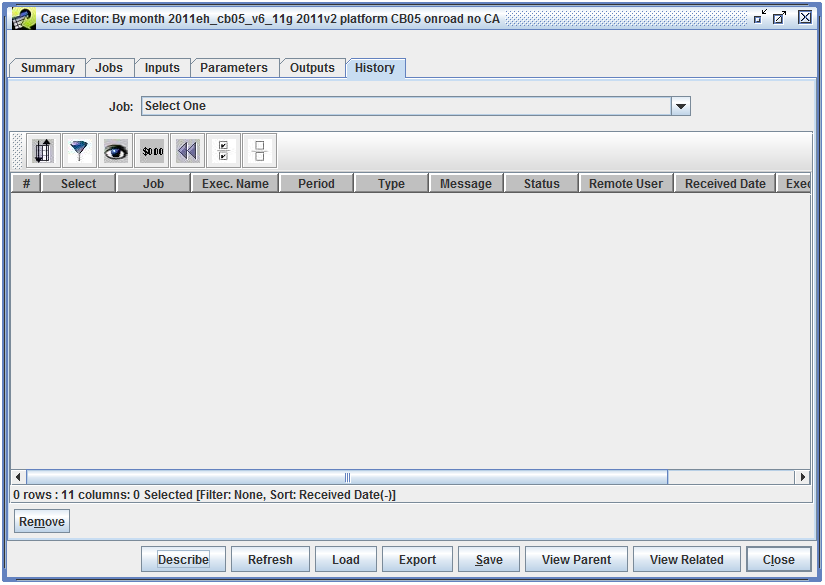{#fig:case_editor_history_initial}

The history of a single job can be viewed by selecting that job from the **Job** pull-down menu, or the history of all jobs can be viewed by selecting "All (All sectors, All regions)", as seen in [@Fig:case_editor_history].

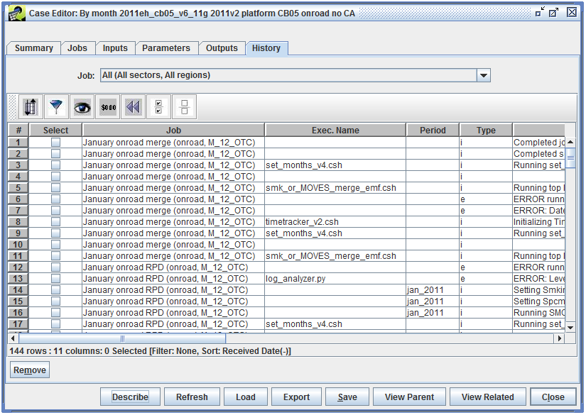{#fig:case_editor_history}

Messages in the History tab are automatically generated by the scripts that run for each case job. Each message will be associated with a particular job and the History tab will show when the message was received. Additionally, each message will have a type: i (info), e (error), or w (warning). The case job may report a specific executable and executable path associated with the message.

## Script Integration ## {#sec:script_integration}

When a job is run, the EMF creates a shell script that will call the job's executable. This script is created in the Output Job Scripts Folder specified in the Jobs tab of the Case Editor.

If the case includes an EMF_JOBHEADER input, the contents of this dataset are put at the beginning of the shell script. Next, all the environment variables associated with the job are exported in the script. Finally, the script calls the job's executable with any arguments and queue options specified in the job. 

In addition to the environment variables associated with a job's inputs and parameters, [@Tbl:env_case_settings_table] and [@Tbl:env_job_settings_table] list the case and job settings that are automatically added to the script written by the EMF.

Case Setting|Env. Var.|Example
-|-|-
abbreviation|\$CASE|test_2011eh_cb05_v6_11g
base year|\$BASE_YEAR|2011
future year|\$FUTURE_YEAR|2011
model name and version|\$MODEL_LABEL|SMOKE3.6
downstream model|\$EMF_AQM|CMAQ v5.0.1
speciation|\$EMF_SPC|cmaq_cb05_soa
start date \& time|\$EPI_STDATE_TIME|2011-01-01 00:00:00.0
end date \& time|\$EPI_ENDATE_TIME|2011-12-31 23:59:00.0
parent case|\$PARENT_CASE|2011eh_cb05_v6_11g_onroad_no_ca
: Environment Variables for Case Settings {#tbl:env_case_settings_table}

Job Setting|Env. Var.|Example
-|-|-
sector|\$SECTOR|onroad
job group|\$JOB_GROUP|
region|\$REGION|OTC 12 km
region abbreviation|\$REGION_ABBREV|M_12_OTC
region gridname|\$REGION_IOAPI_GRIDNAME|M_12_OTC
: Environment Variables for Job Settings {#tbl:env_job_settings_table}
