<!-- BEGIN COMMENT -->

[<< Previous Chapter](ch1_introduction.md) - [Home](README.md) - [Next Chapter >>](ch3_control_measure_manager.md)

<!-- END COMMENT -->

# Installing the CoST Software and Data

<!-- BEGIN COMMENT -->
## Contents
[Background on the CoST Client-Server System](#Background2)<br>
[1. Download the Software Installation Package](#Download2)<br>
[2. Install Java](#Java2)<br>
[3. Install the PostgreSQL Database](#Postgres2)<br>
[4. Install the Tomcat Web/Application Server](#Tomcat2)<br>
[5. Installing CoST](#Cost2)<br>
[6. Running CoST and Logging into the EMF Server](#RunningCost2)<br>
[(Optional) Upgrade the Control Measures Database (CMDB)](#Upgrade2)<br>
[(Optional) Removing CoST Installation Package](#Remove2)<br>

<!-- END COMMENT -->

<a id=Background2></a>

## Background on the CoST Client-Server System

Because CoST is fully integrated within the EMF, installing CoST is the same as installing the EMF. There are two parts of the CoST/EMF system: a client and a server. In this guide, it is assumed that you need to install both the client and the server.

In the CoST client-server system, client software that runs on a desktop computer is used to connect to a server running the CoST algorithms and database. The CoST/EMF client is a Java program that accesses Java and [PostgreSQL](http://www.postgresql.org) software running on the CoST/EMF server. CoST/EMF requires that a recent version of Java be installed on each user's computer. The EMF database server stores information related to emissions modeling, including emissions inventory datasets and a database of emissions control measures. When a control strategy is developed, new datasets and summaries of them are created within CoST, and controlled emissions inventories can optionally be generated. These emissions inventories can be exported from CoST and then used as inputs to the SMOKE modeling system, which prepares emissions data for use in the CMAQ model. A schematic of the CoST/EMF client-server system see Figure {@fig:cost_emf_client_server}.

<a id=cost_emf_client_server></a>

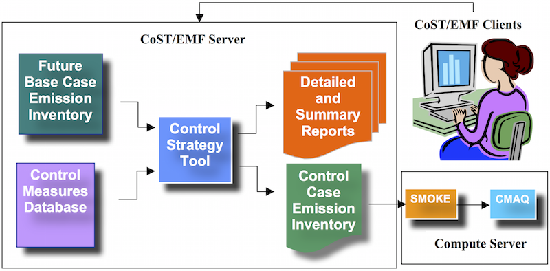{#fig:cost_emf_client_server}

## Download the Software Installation Package

The software installation package is a ZIP file (~300MB) that contains all the relevant supporting applications and software required to run the CoST system on a Windows-based machine. The installation package also contains the most recent version of the CMDB available at the time of the software release. Instructions for optionally updating the CMDB are provided at the end of this section.

The CoST server requires [Java Runtime Environment 7 or 8](http://www.oracle.com/technetwork/java/javase/overview/index.html) (also known as JRE 1.7 or 1.8), [Tomcat](https://tomcat.apache.org/index.html) and [PostgreSQL](https://www.postgresql.org).  All of these components are in the CoST/EMF installation package.

The total space required for the software is 5GB. Around 1.2GB of space can be freed at the end of the installation process. Make sure you have enough storage space (~40-50 GB) available to allow for future usage with your own custom inventories and control measures in the CoST system.

The CoST/EMF software package can be downloaded via the [Community Modeling and Analysis System (CMAS)](http://www.cmascenter.org).

A\. Download the CoST Windows Installation zip file from the CMAS software download site: [http://www.cmascenter.org/download/software.cfm](http://www.cmascenter.org/download/software.cfm)

B\. Unzip the downloaded file into a known folder location on a Windows machine.

Figure {@fig:installation_package} lists the batch file and the folders that are located in the install zip file; these are described below the figure.

<a id=installation_package></a>

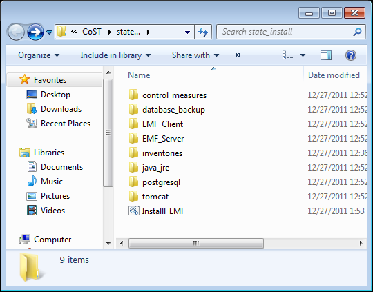{#fig:installation_package}


* Install\_EMF.bat - bat file to install the EMF Client and Server
* control\_measures - contains measures in the database (note: These are already installed)
* database\_backup - contains a backup of the database
* EMF\_Client - includes client installation package (all the Java libraries etc.)
* EMF\_Server - includes the emf.war file that will be pushed to the tomcat server
* inventories - contains inventories
* java\_jre - includes the Java JRE installation package
* postgresql - includes the PostgreSQL installation package and postgresql jdbc driver
* tomcat - includes the Tomcat installation package

<a id=Java2></a>

## Install Java

Go to the `java_jre` directory and double click the executable file, `jre-8u51-windows-i586.exe`.

Follow the installation steps as illustrated in the figures: {@fig:java_welcome}, {@fig:java_setup}, {@fig:java_complete}.

<a id=java_welcome></a>

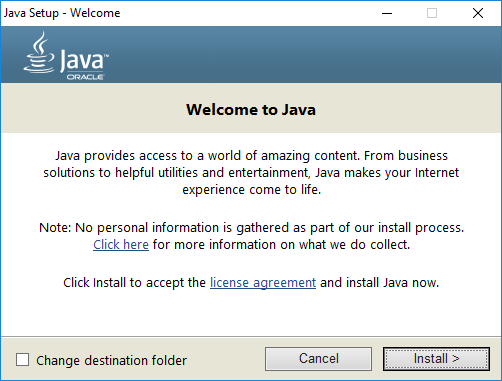{#fig:java_welcome}

Click `Install` to accept the license agreement and start the installation process.

<a id=java_setup></a>

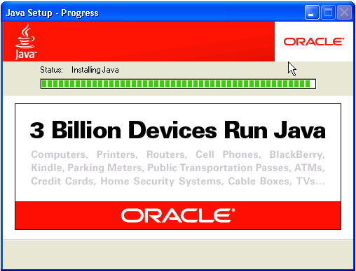{#fig:java_setup}

<a id=java_complete></a>

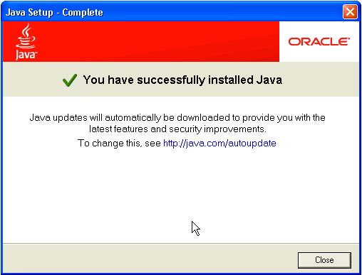{#fig:java_complete}

Click `Close` to finalize the installation process.

<a id=Postgres2></a>

## Install the PostgreSQL Database

Go to the `postgresql` directory and double click the executable file, `postgresql-9.3.9-3-windows.exe`.

During the installation process, you'll be prompted to enter a database superuser password. Set a password, e.g., `postgres`, and take note of it for a later step of the installation process.

Follow the installation steps as illustrated in the figures: {@fig:postgres_welcome}, {@fig:postgres_installation}, {@fig:postgres_data}, {@fig:postgres_password}, {@fig:postgres_port}, {@fig:postgres_locale}, {@fig:postgres_ready}, {@fig:postgres_installing}, {@fig:postgres_complete}.

<a id=postgres_welcome></a>

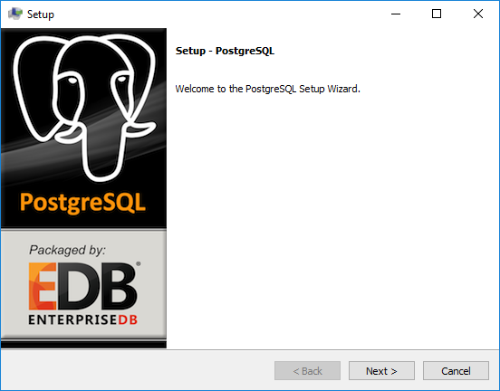{#fig:postgres_welcome}

Click `Next` to begin the installation process.

<a id=postgres_installation></a>

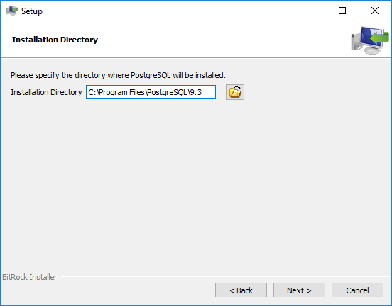{#fig:postgres_installation}

The default directory location is sufficient, click `Next` to continue to the next step. Remember this directory for later use in the installation process.

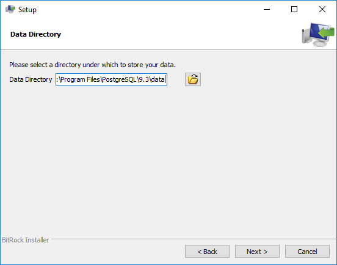{#fig:postgres_data}

The default location is sufficient, click `Next` to continue to the next step.

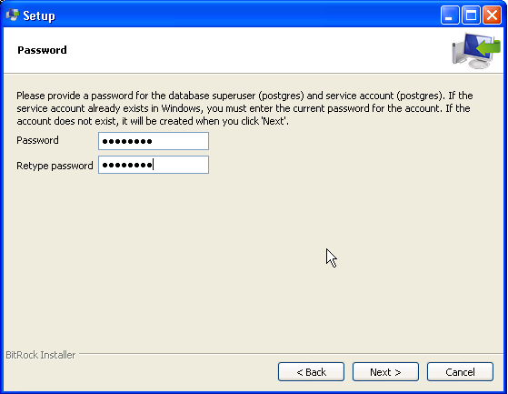{#fig:postgres_password}

For this step, make sure you use the password that you set earlier in the installation, e.g., `postgres`. This password is also expected during a later step when installing the CoST database.

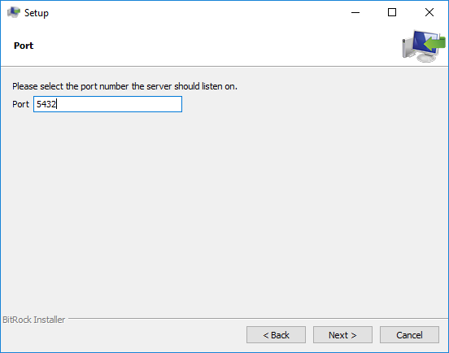{#fig:postgres_port}

The default `Port` is sufficient, click `Next` to continue to the next step.

{#fig:postgres_locale}

The default `Locale` is sufficient, click `Next` to continue to the next step.

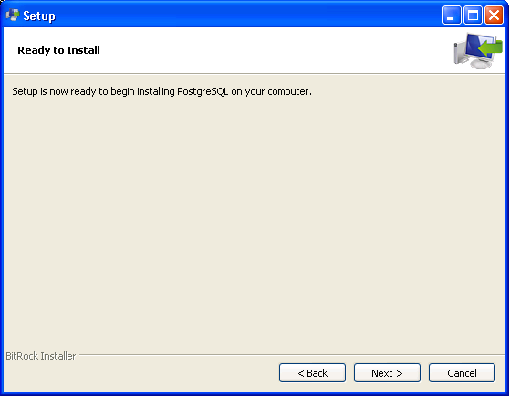{#fig:postgres_ready}

Click `Next` to install the PostgreSQL database server.

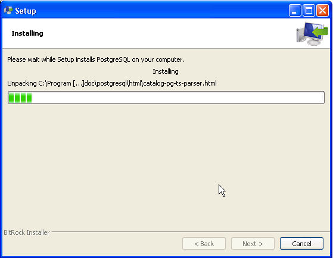{#fig:postgres_installing}

Click `Next` to finalize the PostgreSQL installation.

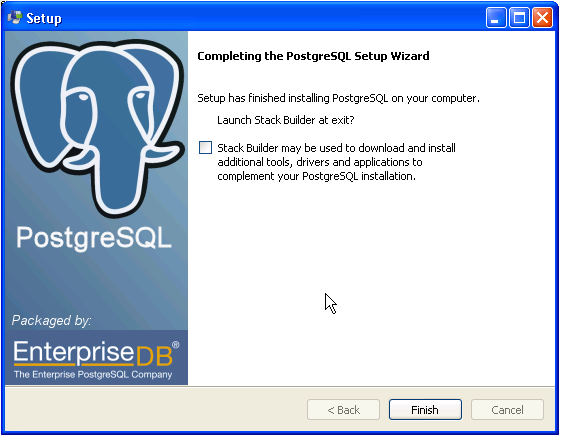{#fig:postgres_complete}

When you reach the end, uncheck the `Launch Stack Builder` option and click `Finish`.

The PostgreSQL database is now installed and ready for the CoST system database. This database will be installed in a later step.

<a id=Tomcat2></a>

## Install the Tomcat Web/Application Server

Go to the `tomcat` directory and find the executable file, `apache-tomcat-7.0.63.exe`. Double click the file to install Tomcat. Follow the installation steps as illustrated in the figures: {@fig:tomcat_welcome}, {@fig:tomcat_license}.

<a id=tomcat></a>

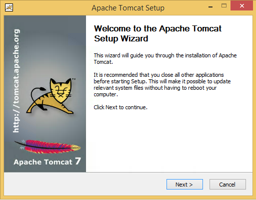{#fig:tomcat_welcome}

Click `Next` to begin the installation process.

<a id=tomcat_license></a>

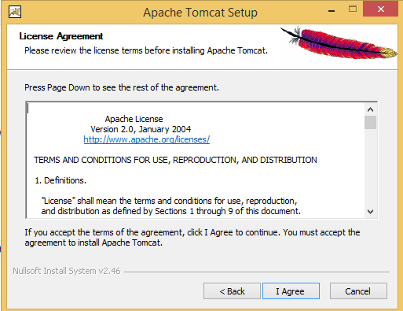{#fig:tomcat_license}

Click `I Agree` to continue to the next step.

<a id=tomcat_components></a>

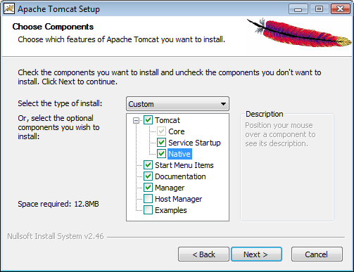{#fig:tomcat_components}

Expand the `Tomcat` option and check the `Service Startup` and `Native` components and then click `Next`. Note that the required `Service Startup` option ensures that the application server is available on startup when the machine is rebooted.

<a id=tomcat_options></a>

{#fig:tomcat_options}

The default settings are sufficient, click `Next` to continue to the next step.

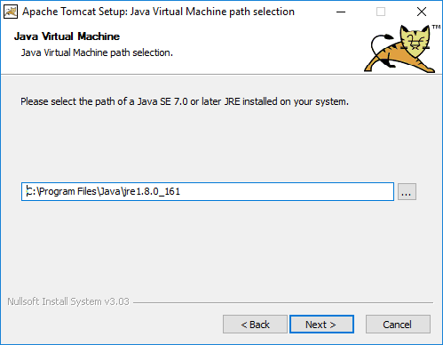{#fig:tomcat_jvm}

The default location is sufficient, click `Next` to continue to the next step.

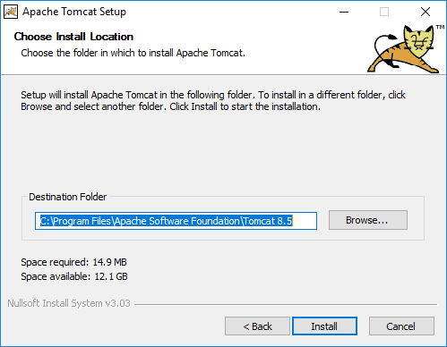{#fig:tomcat_install_location}

The default location is sufficient, click `Install` to install the Tomcat web server. Remember this folder for use in a later step of the installation process.

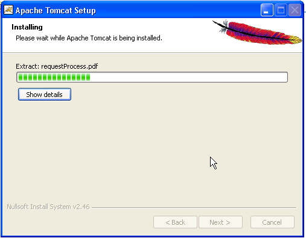{#fig:tomcat_installing}

Once the program files have been installed click `Next` to finalize installation process.

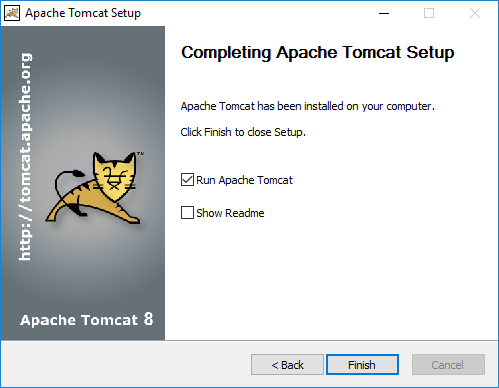{#fig:tomcat_complete}

When you reach the end, click `Finish`. The Tomcat application server is now installed and ready for the CoST system application. This CoST application will be installed in the next step.

<a id=Cost2></a>

## Installing CoST

Go to the root installation directory where the CoST/EMF zip file was installed and find the Install_EMF.bat executable file. Edit the bat file and change the following variables to match your computer's settings:

```
SET EMF_CLIENT_DIRECTORY=C:\Users\Public\EMF
SET EMF_DATA_DIRECTORY=C:\Users\Public\EMF_Data
SET POSTGRESDIR=C:\Program Files\PostgreSQL\9.3
SET TOMCAT_DIR=C:\Program Files\Apache Software Foundation\Tomcat 7.0
```

* `EMF_CLIENT_DIRECTORY` sets the location where the EMF client application will be installed. This is the location where you will find the CoST executable.
* `EMF_DATA_DIRECTORY` sets the location where the EMF data files (e.g., inventories and control measure import files) will be installed.
* `POSTGRESDIR` sets the location where the PostgreSQL application is installed.
* `TOMCAT_DIR` sets the location where the Tomcat application is installed.

Save, exit and double-click the file `Install_EMF.bat` to start the CoST/EMF server installation.

*Note: This installation process can take around 30-40 minutes to finish.* During the installation process, you will be prompted once (see Figure below) to enter the PostgreSQL superuser password, e.g., `postgres`.

<a id=cost_installation></a>

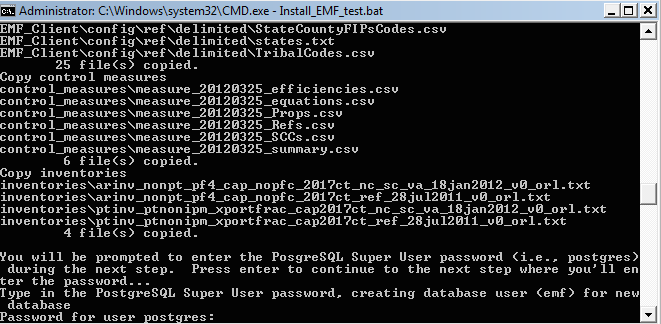{#fig:cost_installation}

After the server installer completes, go to the directory containing the EMF client application; this was specified in the Install_EMF.bat file via the `EMF_CLIENT_DIRECTORY` variable. Edit the EMFClient.bat batch file to match your computer's settings:

```
set EMF_HOME=C:\Users\Public\EMF
set JAVA_EXE=C:\Program Files\Java\jre1.8.0\_51\bin\java
```

* `EMF_HOME` sets the location of EMF client application (set to be the same as `EMF_CLIENT_DIRECTORY` from the server installer above)
* `JAVA_EXE` sets the location of Java runtime application (note that the directory is C:\Program Files\Java\jre1.8.0\_51\bin and java is the Java runtime application)

Save and exit from the file `EMFClient.bat`.

<a id=RunningCost2></a>
>>>>>>> parent of 376088f... The method I used to put the images inline used html div tag, that doesn't allow the images to be visible in the browser in markdown.

## Running CoST and Logging into the EMF Server

The CoST application can now be run by going to the EMF client directory and locating the `EMFClient.bat` file. Double click this file, and you will then be prompted to log in to the system. If the configuration was specified properly and the server is running, you should the following window.

<a id=login_emf></a>

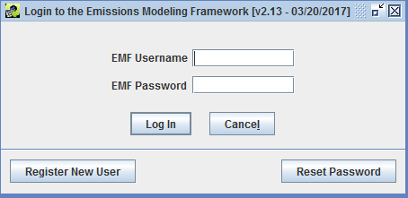{#fig:login_emf}

If you have never used the EMF before, click the `**`Register New User`**` button. You will then see the following window

<a id=register_new_user></a>

{#fig:register_new_user}

In the `Register New User` window, fill in your full name, affiliation, phone number, and email address. You may then select a username with at least three characters and enter a password with at least 8 characters and at least one digit and then click `OK`. Once your account has been created, the EMF main window should appear (see below).

If have logged into the EMF previously, enter your EMF username and password in the `Login to the Emissions Modeling Framework` window and click `Log In`. The following EMF main window will appear on your screen

*Note: The administrator EMF login name is `admin`, with a password `admin12345`*.

After successfully logging into CoST the main EMF window shown below will display.

<a id=emf_main_window></a>

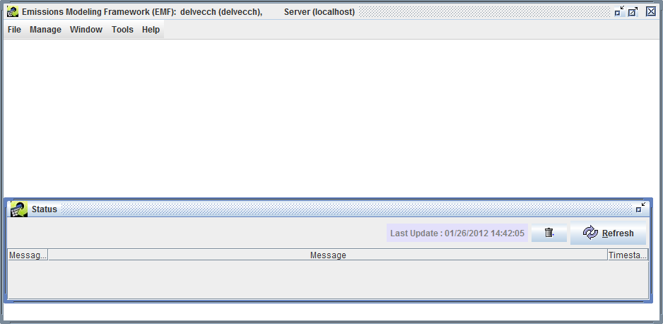{#fig:emf_main_window}

<a id=Upgrade2></a>

## (Optional) Upgrade the Control Measures Database (CMDB)

The Control Measures Database includes all of the emissions control technology information, emissions reductions, and associated costs used by U.S. EPA for developing emissions control strategies for stationary sources. The latests CMDB is available from [EPA CoST Website](https://www.epa.gov/economic-and-cost-analysis-air-pollution-regulations/cost-analysis-modelstools-air-pollution).

The CoST/EMF installation package includes the latest version of the CMDB. The instructions here are provided to guide the upgrade of an existing EMF installation with a new version of the CMDB.

To install the CMDB in the EMF, first download the latest CMDB CSV file from the EPA website.  You must login to the EMF Client as Administrator to add to the CMDB to the CoST PostgreSQL database. After logging in as administrator select `Control Measures` from the `Manage` drop down menu at the top of the EMF Client window:

<a id=manage_control_measures></a>

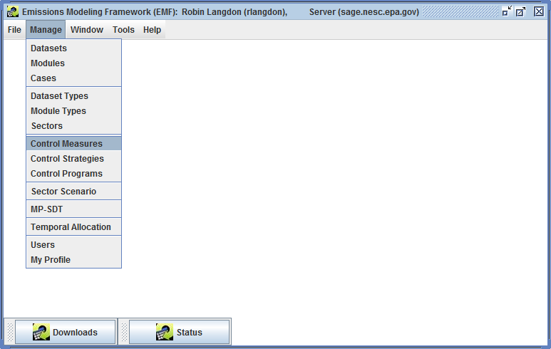{#fig:manage_control_measures}

Click the `Import` button to see the Import Control Measures screen:

<a id=import_control_measures></a>

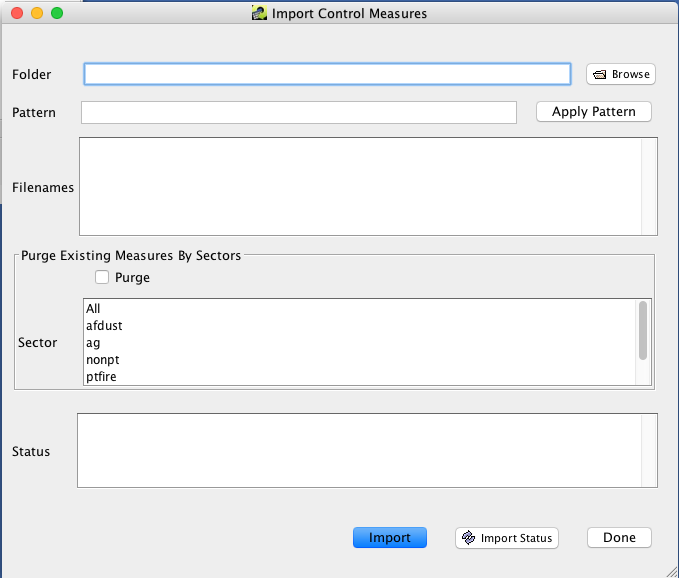{#fig:import_control_measures}

Use the `Browse` button to find the CMDB CSV file downloaded from the EPA website. Select the file and click `OK`.

Click `Import` to add the EPA CMDB to the CoST/EMF database.

<a id=Remove2></a>

## (Optional) Removing CoST Installation Package

To remove the CoST installation package, go to the root directory where the EMF/CoST Installer zip file was installed and manually remove all files and sub folders from this directory. The original zip package contains a compressed version of the installation package and can be kept for reference purposes. Removing these files and directories will free up around 1.2GB of space.

<!-- BEGIN COMMENT -->

[<< Previous Chapter](ch1_introduction.md) - [Home](README.md) - [Next Chapter >>](ch3_control_measure_manager.md)<br>

<!-- END COMMENT -->
