<!-- BEGIN COMMENT -->

[<< Previous Chapter](ch2_installing_cost.md) - [Home](README.md) - [Next Chapter >>](ch4_control_strategy_manager.md)

<!-- END COMMENT -->

# Control Measure Manager {#Chapter3}

<!-- BEGIN COMMENT -->
## Contents
[Chapter 3 Introduction](#Ch3Intro3)<br>
[1. Introduction to the Control Measure Manager](#Intro3)<br>
[2. Viewing Data for an Existing Control Measure](#Viewing3)<br>
[3. Copying a Control Measure](#Copying3)<br>
[4. Editing Control Measure Data](#Editing3)<br>
[5. Creating a New Control Measure](#Creating3)<br>
[6. Finding Available Control Measures for Specific SCCs](#Finding3)<br>
[7. The Pollutant Menu](#PollutantMenu3)<br>
[8. The Cost Year Menu](#CostYearMenu3)<br>
[9. Importing and Exporting Control Measure Data](#ImportExport3)<br>

<!-- END COMMENT -->

<a id=Ch3Intro3></a>

## Introduction

This chapter demonstrates the features of the CoST Control Measure Manager. The initial CoST installation includes area- and stationary-source control measures. The pre-loaded measures can be used directly for CoST control strategy runs, the measures are editable through the CoST/EMF client, and new measures may be imported through the client. **Control measures store information about control technologies and practices that are available to reduce emissions, the source categories to which they apply, the expected control efficiencies, and their estimated costs.**

The Control Measure Manager allows control measure data to be entered, viewed, and edited. The data that are accessible through the Control Measure Manager are stored in the [CoST Control Measures Database (CMDB)](https://www3.epa.gov/ttn/ecas/models/CoST_CMDB_Document_2010-06-09.pdf). The CMDB is stored as a set of tables within the EMF database. Control measures can also be imported from files that are provided in a specific CSV format and exported to that same format. In CoST, the control measures are stored separately from the emissions inventory data and are matched with the emissions sources using a list of Source Classification Codes (SCCs) that are specified for each control measure.

The Control Measure Manager has the following major features:

* Facilitates storing and maintaining control measure data
* Shows minimum, maximum, and average control efficiency, cost per ton (based on year 2013 values), and average rule effectiveness and rule penetration
* Displays other control measure attributes (e.g., abbreviation, major pollutant, source group, equipment life, emissions inventory sectors, class)
* Allows import of control measure information into the system from CSV files
* Enables export of control measure to CSV files

In this chapter, you will learn how to:

* View, sort, and filter a list of control measures from the Control Measure Manager window
* Find control measure that apply to selected SCCs
* View the detailed data available for a control measure, including control efficiencies, SCCs, cost equations, and properties
* Copy control measures
* Edit data for control measures
* Create new control measures
* Filter and display cost and control efficiency information for major and co-benefit pollutants of the measures
* See cost per ton information for different cost years
* Export control measures data

***This chapter is presented as a series of steps in a tutorial format.***

<a id=Intro3></a>

### Introduction to the Control Measure Manager

Begin by opening the Control Measure Manager and exploring the buttons and menus in the upper portion of the window.

**Step 1-1: Open Control Measure Manager.** To open the Control Measure Manager, choose `Control Measures` from the `Manage` drop down menu on the EMF main window see Figure {@fig:emf_main_window}. The Control Measure Manager window will appear {@fig:manage_menu_of_emf_main_window}. When the window first appears, it will be empty. Notice that the window appears within the EMF main window.

<a id=manage_menu_of_emf_main_window></a>

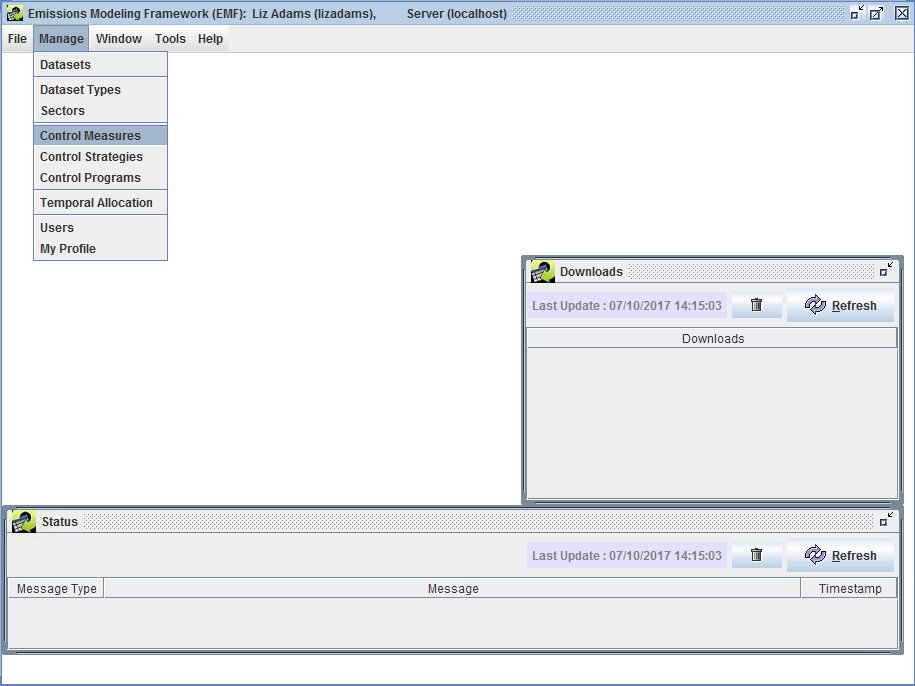{#fig:manage_menu_of_emf_main_window }

Notice the different parts of the Control Measure Manager window. There is a `Pollutant Filter` drop down menu at the top, a `Show Details` checkbox, a `Refresh` button, and a `Name or Abbr contains` dialog box. Below those buttons is a toolbar with buttons that operate on the data shown in the table below the toolbar, which by default is empty. There is another set of buttons and pull-down menus below the table. The functions of all of these buttons are discussed below.

<a id=control_measure_manager_before_control_measures_are_loaded></a>

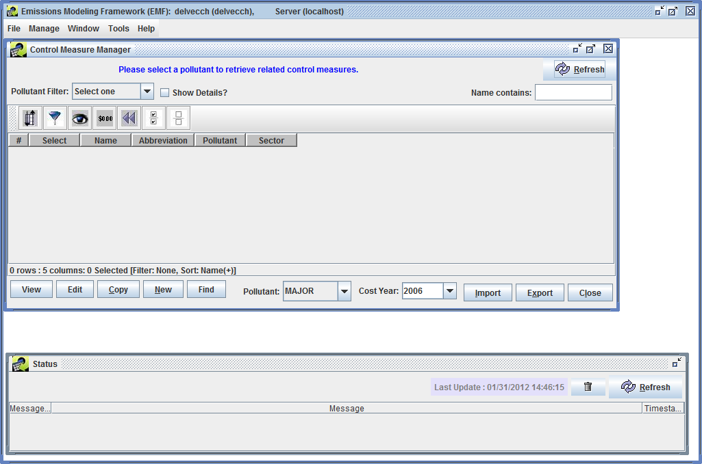{#fig:control_measure_manager_before_control_measures_are_loaded}


**Step 1-2: Display Control Measures.** To display control measures from the CMDB in the Control Measure Manager window, select a pollutant from the `Pollutant Filter` pull-down menu at the upper left corner of the Control Measure Manager. For this example, use the scroll bar to find and select PM10-PRI. Information about any control measures that control the selected pollutant will appear in the Control Measure Manager window (Figure {@fig:control_measure_manager_with_control_measures}). The control measure **Name**, **Abbreviation**, **Pollutant**, **Sector**, and **Class** are shown in the window. Note that name of each control measure must be unique within the database, and that the control measures appear in a table in which the data can be sorted by clicking on the row headers.

The control measure abbreviation is a set of characters that is a *short-hand* for the control measure. Typically, the abbreviation should express the name of the control measure in an abbreviated form such that if someone is familiar with the abbreviation conventions, the person might be able to infer the name of the measure. Typically the first character of the measure denotes the major pollutant (e.g., 'P' for PM controls, 'N' for NO<sub>x</sub> controls, 'S' for SO<sub>2</sub> controls). The next few characters usually denote the control technology (e.g., 'ESP' for Electrostatic Precipitator, 'FFM' for fabric filter mechanical shaker). Abbreviations must be unique within the database (i.e., no two control measures can use the same abbreviation).

<a id=control_measure_manager_with_control_measures></a>

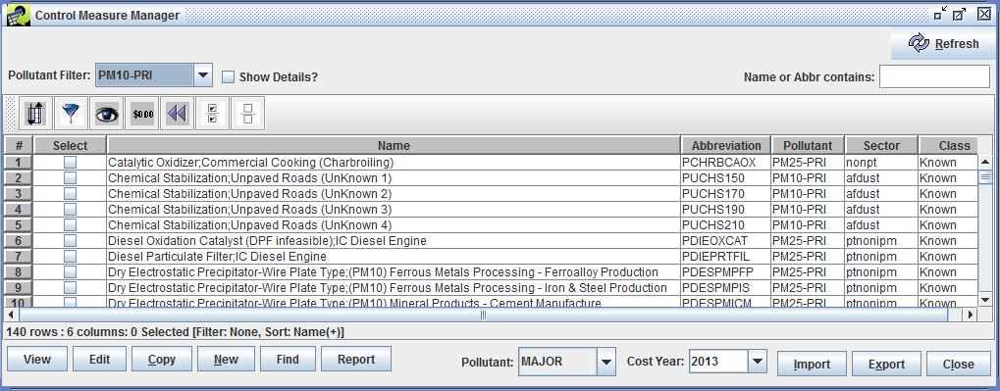{#fig:control_measure_manager_with_control_measures}

**Step 1-3: Show Details of Control Measures.** To see more information about the measures, check the `Show Details` checkbox - additional columns will appear on the right of the table. An example is shown in Figure {@fig:control_measure_manager_showing_control_measure_details}.

<a id=control_measure_manager_showing_control_measure_details></a>

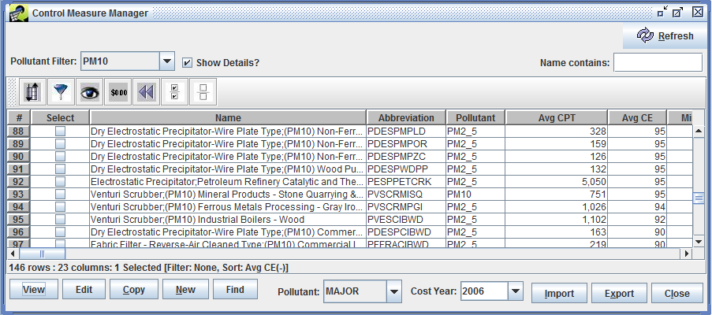{#fig:control_measure_manager_showing_control_measure_details}

**Step 1-4: Configure the Control Measure Window.** To better see the additional columns, you can make the Name column narrower by positioning your mouse on the line between **Name** and **Abbreviation** on the table header; this will cause a special mouse pointer with arrows to appear and you can then use the mouse to drag the column edge to resize the column width.

**Step 1-5: Examine Control Measure Details.** Scroll to the right to examine the detail columns that are available in the Control Measure Manager. *Note that you may move the columns around by grabbing the column's header with your mouse and dragging them. You may also change their widths as desired.* You can also resize the Control Measure Manager window within the EMF Main Window as desired, such as to make the entire window wider so that you can see more columns.

**Step 1-6: View Measure Name.**  After you scroll to the right in the window, if you hover your mouse over one of the columns other than `Name`, you will see that the name of the measure corresponding to the row you are on will appear briefly as a "tooltip". This is so that you can tell what the name of the measure is even if it has scrolled off the window.

The columns shown on the Control Measure Manager with brief descriptions are shown in Table {@tbl:control_measure_manager_columns_table}. The control measures table supports sorting and filtering the data. Tables of this same type are used many places throughout CoST and the EMF.

<a id="control_measure_manager_columns_table"></a>

Column Name|Description
---------------------|--------------------------------------------------------------------------------------------------------------------------------
Select|This column will allow the user to view, edit, or copy the measure by clicking the corresponding button at the bottom of the manager window. These features will be discussed later in the training.
Name|A unique name for the measure.
Abbreviation|A unique abbreviation for the measure.
Pollutant|A pollutant (e.g., NO<sub>x</sub>, PM10-PRI) that the measure might control. Note that any pollutant-specific information in the row is for this pollutant.
Avg, Min, and Max CE|Average, minimum, and maximum control efficiencies for the specified pollutant, aggregated across all locales, effective dates, and source sizes.
Avg, Min, and Max CPT|Average, minimum, and maximum cost per ton for the specified pollutant aggregated across all locales, effective dates, and source sizes.
Avg Rule Eff.|Average rule effectiveness aggregated across all efficiency records for the specified pollutant.
Avg Rule Pen.|Average rule penetration aggregated across all efficiency records for the specified pollutant.
Control Technology|The control technology that is used for the measure (e.g., Low NOx burner, Onroad Retrofit).
Source Group|The group of sources to which the measure applies (e.g., Fabricated Metal Products - Welding).
Equipment Life|Expected lifetime (in years) of the equipment used for the measure.
Sectors|An emissions inventory sector or set of the EPA's emissions inventory sectors to which the measure applies (e.g., ptipm, afdust, nonpoint). A sector represents a broad group of similar emissions sources.
Class|The class of the measure. Options are Known (i.e., already in use), Emerging (i.e., realistic, but in an experimental phase), and Hypothetical (i.e., the specified data are hypothetical).
Eq Type|The type of COST equation to use
Last Modified Time|The date and time for which the information about the measure was last modified in the editor or imported from a file.
Last Modified By|The last user to modify the measure.
Date Reviewed|The date on which the data for the measure were last reviewed.
Creator|The user that created the measure (either from the import process or by adding it via the "New" button).
Data Source|A description of the sources or references from which the values were derived. Temporarily, this is a list of numbers that correspond to references listed in the References Sheet from when the control measures were imported.
Description|A textual description of the applicability of the measure and any other relevant information.

Table: Control Measure Manager Columns. {#tbl:control_measure_manager_columns_table}

**Step 1-7: Sort Control Measures.** To sort based on data in one of the columns, click on the column header. For example, to sort based on the average control efficiency of the measure click on the column header for the "Avg CE" column. The table will now be sorted by the values of "Avg CE" in descending order. *Notice that information about the currently specified sort is reflected in the line just below the table.*

**Step 1-8: Reverse Sort.** Click on the header of the "Avg CE" column a second time, the sort order will be reversed.

**Step 1-9: Multi-Column Sort.** To perform a multicolumn sort, click the sort button  and then click `Add` to add an additional column to sort by (e.g., `Name`). Notice that you can control whether the sort is **Ascending** and whether it is **Case Sensitive**. Click `OK` once you have made your selection. The data should now be sorted according to the column(s) you specified.

**Step 1-10: Apply Filters to Control Measure Table.** To use a filter to limit the measures shown, click the button on the toolbar that looks like a filter . When you do this the "Filter Rows" dialog appears (Figure {@fig:filter_rows_dialog}).

- Enter a criterion for the filter by clicking `Add Criteria`.
- Click in the cell under "Column Name" to make a pull-down menu appear, from which you may choose a column to filter on (e.g., **Name**).
- Click in the cell under `Operation` to see the available operations and, if desired, select an operation (**contains** is the default).
- Enter a value in the `Value` cell (e.g., **Scrubber**). Note that the filter values are case-sensitive (e.g., Measure names containing "scrubber" will not match a filter value of "Scrubber").

<a id=filter_rows_dialog></a>

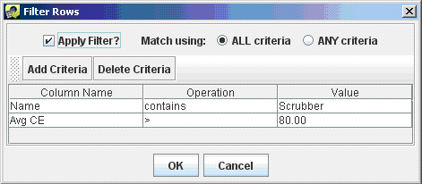{#fig:filter_rows_dialog}

To add a second criterion click `Add Criteria` again on the **Filter Rows** dialog (e.g., enter **'Avg CE > 80'**). Note that if `Match using` is set to **ALL criteria** then only rows that match all the specified criteria will be shown in the table after you click OK. If `Match using` is set to **ANY criteria**, then rows will be shown in the table if they meet any of the criteria that are listed.

Click `OK` to close the **Filter Rows** dialog and to apply the selected filter. Figure {@fig:control_measure_manager_with_filter_applied} shows the table that results from the selections shown in Figure {@fig:filter_rows_dialog}. *Notice that the currently applied filter is reflected in the line under the horizontal scrollbar of the table.*

<a id=control_measure_manager_with_filter_applied></a>

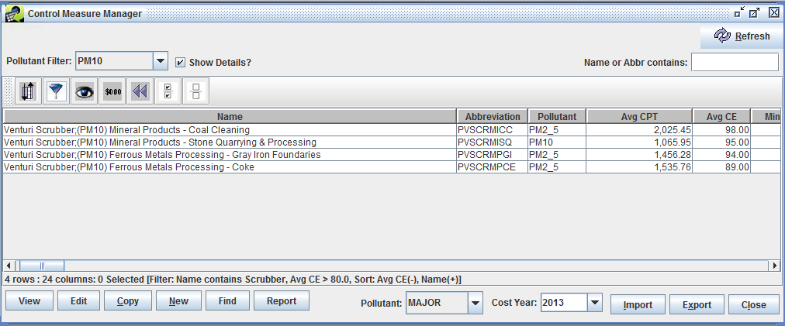{#fig:control_measure_manager_with_filter_applied}

Open the filter dialog again by clicking the `Filter rows` button. Set `Match using` to **ANY criteria** and then click `OK` to see what effect it has on the measures shown. Hint: you should see more measures displayed than when `Match using` is set to **ALL criteria**.

**Step 1-11: Remove Filters from the Control Measures Table.** Open the filter dialog again by clicking the `Filter rows` button. Remove one of criteria by clicking somewhere in one of the rows shown on the Filter Dialog and then clicking `Delete Criteria`. Now click `OK` to have the less stringent filter take effect.

**Step 1-12: Select and Unselect Control Measures.** To select all of the control measures that meet your filter criteria, click the `Select All` button on the toolbar . You will see that the checkboxes in the `Select` column are now all filled with checks. You may select or deselect individual measures by clicking their checkboxes in the `Select` column. In the next subsection, we will discuss operations that can be performed on selected measures, such as viewing them and exporting their data.

To unselect all of the measures, click the `Clear all the selections` button  and you will see that all of the checks in the `Select` column are now removed.

**Step 1-13: Show/Hide Columns.** To hide some of the columns that are shown in the table, click the `Show/Hide columns` button . On the Show/Hide Columns dialog that appears (similar to the one shown in Figure {@fig:show_hide_columns_dialog}, uncheck some of the checkboxes in the `Show?` column and then click `OK`. The columns you unchecked will no longer display in the control measures table.

<a id=show_hide_columns_dialog></a>

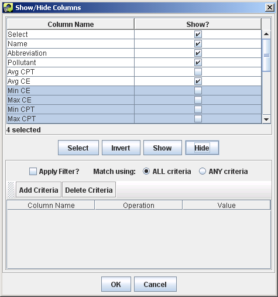{#fig:show_hide_columns_dialog}

Click the `Show/Hide columns` button again and scroll down through the list of columns at the top of the dialog to see others that are farther down the list. To select multiple columns to show or hide, click on the first column name of interest, hold down the shift key, then click a second column name to select the intervening columns, and then click the `Show` button or the `Hide` button to either show or hide those columns.

To select columns that are not next to each other, hold down the control key and click on the columns that you want to select; when you are finished selecting click `Show` or `Hide`. The remaining buttons on the dialog are not used frequently: (a) `Invert` will invert the selection of highlighted columns. (b) The `Add Criteria`/`Delete Criteria` Filter section at the bottom can be used to locate columns when there are hundreds of column names, but there are no tables that large used in CoST.

**Step 1-14: Format Columns.** Click the `Format Columns` button, , to open the Format Columns dialog and examine the options for controlling how data in the table are shown. For example, check the checkboxes in the `Format?` column for one or more of the column names **"Avg CE"**, **"Min CE"**, and **"Max CE"** (note that you may first need to unhide the columns if you hid them in the previous step). Because these columns are all numeric, some controls used to format numbers will appear in the lower right corner.

Change the `Font` to **Arial**, the `Style` to **Bold**, the `Size` to **14**, the `Horizontal Alignment` to **Left**, the `Text Color` to **blue**, the `Column Width` to **6**, the number of `Decimal Places` to **0**, and select `Significant Digits`. Once these selections have been made, the dialog should look similar to the one in Figure {@fig:format_columns_dialog}. Click `OK` after making these selections to apply the formatting to the Control Measures table. The columns selected for formatting will have the attributes specified on the Format Columns dialog. In practice, this dialog is not used very often, but it can be particularly helpful to format numeric data by changing the number of decimal places or the number of significant digits shown.

<a id=format_columns_dialog></a>

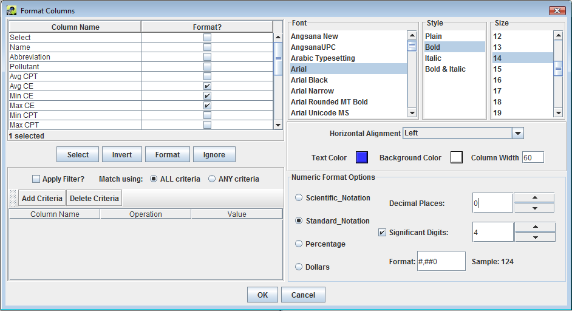{#fig:format_columns_dialog}

**Step 1-15: Reset Control Measures Table.** To remove sort criteria, row and column filters, and formatting, click the `Reset` button  in the Control Measure Manager window.

**Step 1-16: Mouse Hover Tooltip.** If you are unsure of what a button does when using CoST, place your cursor over the button and wait; in many cases, a small piece of text called a **"tooltip"** will appear. For example, place your cursor over one of the buttons on the Control Measure Manager window and hold it still. You will see a tooltip describing what the button does. Many of the buttons and fields used in CoST have tooltips to clarify what they do or what type of data should be entered.

**Step 1-17: Update Control Measures List.** If you wish to retrieve an updated set of control measures data from the CoST server, click the `Refresh` button  at the upper right portion of the Control Measure Manager. Note that this will also reset any special formatting that you have specified, but any sort and filter settings will be preserved.

<a id=Viewing3></a>

## Viewing Data for an Existing Control Measure {#Viewing3}

In this section you will learn about viewing the detailed data for a control measure.

**Step 2-1: Select a Control Measure.** Select the control measure for which to view the underlying data. For example, in the Control Measure Manager, set the `Pollutant Filter` to **PM10-PRI**, and then in the table locate the Control Measure with the Name **"Dry Electrostatic Precipitator-Wire Plate Type;(PM10-PRI) Municipal Waste Incineration"** (Abbreviation = **PDESPMUWI**).

*Hint: Typing the abbreviation into the `Name or Abbr contains` box will display the measure directly.*

**Step 2-2: View Control Measure Data.** Click the checkbox in the **Select** column next to the measure and click `View`. The View Control Measure window will appear as shown in Figure {@fig:summary_tab_of_view_control_measure_window}. There are several tabs available on the window; the Summary tab will be shown by default.

<a id=summary_tab_of_view_control_measure_window></a>

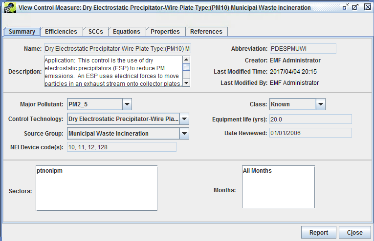{#fig:summary_tab_of_view_control_measure_window}

### Control Measure Summary

**Step 2-3: Examine Control Measure Summary.** The `Summary` tab of the View Control Measure window contains high-level summary information about the measure. Table {@tbl:control_measure_summary_tab_table} shows brief descriptions of the fields on this tab.

<a id=control_measure_summary_tab_table></a>

Component|Description
---------------------|--------------------------------------------------------------------------------------------------------------------------------
Name|A unique name that typically includes both the control technology used and the group of sources to which the measure applies.
Description|A description of the applicability of the measure and any other relevant information.
Abbreviation|A multi-character unique abbreviation that is used to assign the control measure to sources in the inventory. Ideally, the abbreviation should be somewhat readable so that the user has some idea of what type of measure it is from reading the abbreviation (e.g., the DESP in PDESPIBCL is short for 'Dry Electrostatic Precipitator, the IB is short for 'Industrial Boiler', and the CL is short for 'Coal').
Creator|The name of the user who imported or created the measure.
Last Modified Time|The date and time on which the information about the measure was last modified in the editor or imported from a file.
Last Modified By|The last user to modify the measure.
Major Pollutant|The pollutant most controlled by the measure. This is used to group the measures only, and has no impact on how the measure is assigned to sources.
Control Technology|The control technology that is used for the measure (e.g., Low NOx burner). You can type a new entry into this field and then choose it from the pull-down menu in the future.
Source Group|The group of sources to which the measure applies (e.g., Fabricated Metal Products - Welding). You can type a new entry into this field and then choose it from the pull-down menu in the future.
NEI Device Code|The numeric code used in the NEI to indicate that the measure has been applied to a source. A cross-reference table to match the control measure abbreviations and NEI Device Codes to one another may be created.
Class|The class of the measure. Options are Known (i.e., already in use), Emerging (i.e., realistic, but in an experimental phase), Hypothetical (i.e., the specified data are hypothetical), and Temporary (i.e., the specified data are temporary and should be used only for testing purposes).
Equipment Life|The expected life of the control measure equipment, in years.
Date Reviewed|The date on which the data for the measure were last reviewed.
Sectors|An emissions inventory sector or set of emissions inventory sectors to which the measure applies. A sector represents a broad group of similar emissions sources.
Months|The month(s) of the year to which the control measure is applicable. This is either "All Months" or a list of individual months (e.g., March, April, and May for measures applicable only in spring months).

Table: Control Measure Summary Tab Contents. {#tbl:control_measure_summary_tab_table}


When viewing a control measure (as opposed to editing a control measure), you cannot make changes to any of the selections. However, you can review the available selections for some fields. Use the pull-down menus next to the fields `Major Pollutant`, `Control Technology`, `Source Group`, and `Class` to see the available options for each of these fields. Note that if you make a selection that differs from the original value on one of these menus, the new value will not be saved when you close the window because you are only viewing the measure data.

### Control Measure Efficiencies

**Step 2-4: Examine Control Measure Efficiencies.** Click on the `Efficiencies` tab in the View Control Measure Window to see the data that are available from this tab. You will see a table with many columns. Each row in the table corresponds to a different "efficiency record" in the database. An efficiency record contains cost and control efficiency information about the control measure. In the example shown in Figure {@fig:efficiencies_tab_of_view_control_measure_window}, notice that the **Control Efficiency** and **cost per ton data (CPT)** vary by pollutant. Scroll to the right in the table to see some of the other columns that are not immediately visible.

If the cost or control efficiency varies over region or time, it is possible to specify different records in the table for each Locale (i.e., state or county) or for each Effective Date if the measure will be "phased in" over time. Different efficiency records can also be entered to account for different source sizes using the Min Emis and Max Emis columns.

<a id=efficiencies_tab_of_view_control_measure_window></a>

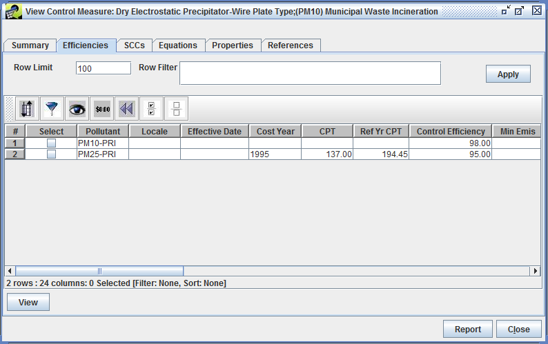{#fig:efficiencies_tab_of_view_control_measure_window}

The `Row Limit` and `Row Filter` fields are helpful when there are hundreds of efficiency records (e.g., some data may be county specific and available for multiple pollutants). The `Row Limit` is the maximum number of records that will be displayed on the page. For example, if there were several hundred records, it could take a long time to transfer all of those data from the server, so by default only 100 records will be transferred if the Row Limit is set to 100.

**Step 2-5: Apply a Row Filter to Control Measure Efficiencies.** To apply a `Row Filter` to the control efficiencies, enter `Pollutant='PM10-PRI'` into the text field and then click `Apply` to display only the record for PM10-PRI. The `Row Filter` follows the syntax of a Structured Query Language (SQL) 'WHERE' clause. Note that the filter may not seem necessary in this particular example that only has a few records, but if this measure had entries for every county and pollutant, as do some mobile measures, then the filter is useful for limiting the number records displayed. If desired, you may try some other filters with this measure, such as:

```
Pollutant LIKE 'PM%'
Pollutant = 'PM10-PRI'
Control Efficiency > 95
```

Here are some examples of other types of filters that illustrate other aspects of the syntax, although they may not all be applicable to this particular measure:

```
Pollutant != 'PM10-PRI'
Locale LIKE '37%'
Pollutant IN ('CO', 'VOC', 'PM10-PRI')
```

**Step 2-6: View an Efficiency Record in a Separate Window.** To see the data for an efficiency record in a separate window, check the checkbox in the **Select** row for the PM25-PRI efficiency record, and click `View`. A View Efficiency Record window will appear as shown in Figure {@fig:view_efficiency_record_window}. The fields of the efficiency record are shown in Table {@tbl:control_measure_efficiency_record_table}.

Notice that most of the fields in Figure {@fig:view_efficiency_record_window} are set using text fields. The `Ref Yr Cost Per Ton Reduced` is shown with a label because this value is automatically computed for the reference year (currently 2013) according to the cost year and the specified C`ost Per Ton Reduced`. Note that the cost per ton reduced should take into account the specified rule effectiveness and rule penetration, which can 'dilute' the effectiveness of the control measure, but are not taken into account when the `Ref Yr Cost Per Ton Reduced` is computed. Other fields that are labels are `Last Modified By` and `Last Modified Time`. These fields are automatically updated and tracked by CoST when someone edits the efficiency record, although editing is done from the Edit Efficiency Record window instead of the View Efficiency Record window.

*Note: The efficiency records must be unique according to the contents of the following fields:* Pollutant, Locale, Effective Date, Minimum Emissions, Maximum Emissions, and Existing Measure Abbreviation. This means that two records cannot have the same values for all of these fields.

<a id=view_efficiency_record_window></a>

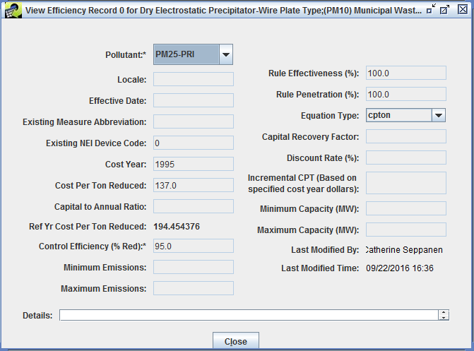{#fig:view_efficiency_record_window}

<a id=control_measure_efficiency_record_table></a>

Component|Description
------------------------------|------------------------------------------------------------------------------------------------------------------------
Pollutant|The pollutant for which this record applies (emissions are either decreased or increased). An asterisk appears beside this field because a value for it must be specified.
Locale|A two-digit Federal Information Processing Standards (FIPS) state code, or a five-digit FIPS county code, to denote that the information on the row is relevant only for a particular state or county. If left blank, it is assumed to apply to all states and counties.
Effective Date|The month, day, and year on which the record becomes effective. The system will find the record with the closest effective date that is less than or equal to the date of the analysis. If this is left blank, the record is assumed to apply to any date.
Existing Measure Abbreviation|This field should be populated when the data on the row are provided, assuming that a control measure has already been applied to the source. The contents of the field should be the control measure abbreviation that corresponds to the existing measure. The reason for this field is that the efficiency of and cost of applying the measure may vary when there is already a control measure installed on a source.
Existing NEI Device Code|This is used in conjunction with Existing Measure and should specify the device code used in the NEI that corresponds to the currently installed device.
Cost Year|The year for which the cost data are provided.
Cost per Ton Reduced|The cost to reduce each ton of the specified pollutant.
Capital to Annual Ratio|The ratio of capital costs to annual costs. *Applicable only for equation-based annualized costs.*
Ref Yr Cost per Ton Reduced|The cost per ton to reduce the pollutant in 2013 dollars.
Control Efficiency|The [median] control efficiency (in units of percent reduction) that is achieved when the measure is applied to the source, exclusive of rule effectiveness and rule penetration. An asterisk is shown next to the field because a value for the field is required, whereas other fields are optional. Eventually, statistical distributions for percent reduction may be provided to facilitate uncertainty analysis. *Note that there are sometimes disbenefits for certain pollutants as a result of the control device, so control efficiency can be negative to indicate that the amount of a pollutant actually increased.*
Minimum Emissions|The lower limit of emissions from the inventory required for the control measure to be applied.
Maximum Emissions|The upper limit of emissions from the inventory for the control measure to be applied.
Rule Effectiveness|The ability of a regulatory program to achieve all the emissions reductions that could have been achieved by full compliance with the applicable regulations at all sources at all times. A rule effectiveness of 100% means that all sources are fully complying at all times. Rule effectiveness can sometimes vary by locale.
Rule Penetration|The percent of sources that are required to implement the control measure. Rule penetration might vary over time as a new rule is "phased in" gradually, and can sometimes vary by locale.
Equation Type|The type of cost equation to use.
Minimum Capacity (MW)| The minimum capacity for the control measure (megawatts).
Maximum Capacity (MW)| The maximum capacity for the control measure (megawatts).
Last Modified By|The last user to modify the efficiency record.
Last Modified Time|The last date and time a user modified the efficiency record.
Details|Text that specifies information about the source of data for this row or reason they were changed.

Table: Efficiencies Record Window Contents. {#tbl:control_measure_efficiency_record_table}

When you are done examining the information on the View Efficiency Record Window, click `Close`.

### Control Measure SCCs

**Step 2-7: View the Control Measure SCCs.** The inventory sources to which a control measure could be applied are listed in the `SCCs` tab for the control measure.

*Note that while multiple SCCs can be specified for a measure, if the control efficiency or cost data differs for any of the SCCs, then a separate measure must be created to contain that data.*

Click on the `SCCs` tab in the View Control Measure window to see the SCCs associated with the measure. An example of this tab is shown in Figure {@fig:sccs_tab_of_view_control_measure_window}. The selected control measure is applicable only to SCCs listed on this tab.

*Note that CoST currently does not support wildcards in the SCC list for a control measure. There is no expanding of SCC codes ending in zeros; therefore each applicable SCC must be explicitly listed on this tab.* You may sort and filter the SCCs in the table to get a better idea of what SCCs are associated with the measure.

<a id=sccs_tab_of_view_control_measure_window></a>

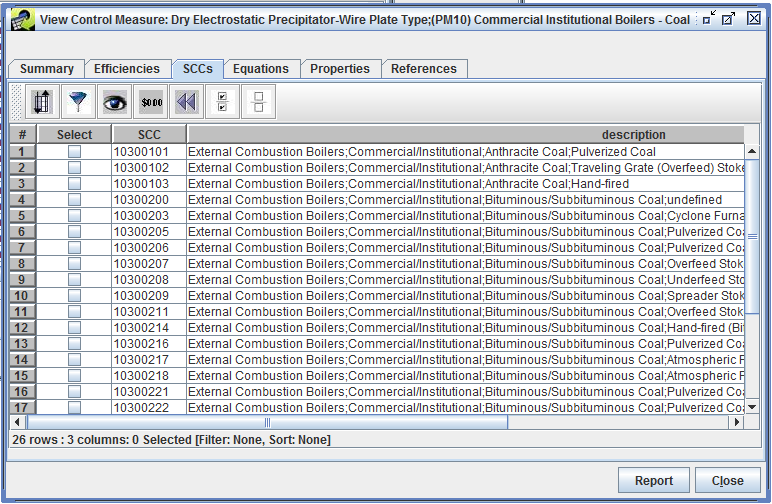{#fig:sccs_tab_of_view_control_measure_window}

Do not click `Close` after examining the SCC list as this will close the View Control Measure window, which we will use for the next step.

### Control Measure Equations

As an alternative to using a simple 'cost per ton of pollutant reduced' value to compute the cost of a control measure, an engineering cost equation can be specified. The cost equation will then be used to associate emissions control costs with a particular pollutant. The equation must be selected from a list of pre-specified equation types. The cost will be computed using the form of the equation specified on the equations tab, source-independent variables listed in the equations tab, and source-dependent variables from the emissions inventory (e.g., stack flow rate). Currently, only a single equation can be specified for any given measure.

**Step 2-8: View the Control Measure Equations.** Click on the `Equations` tab on the View Control Measure window to see information associated with the cost equations for the selected measure. An example of this tab is shown in Figure {@fig:equations_tab_of_view_control_measure_window}. If the measure does not use a cost equation, this tab will be blank. The table at the bottom of the `Equations` tab shows the **Equation Type** (the same type is repeated in every row), in addition to the **Variable Name** and **Value** for that variable. The fields of the `Equations` tab are shown in Table {@tbl:control_measure_equations_tab_table}.

Each type of equation uses a different set of variables. CoST supports fourteen different types of cost equations. Additional types of equations may be added in the future. For more information on the equations and their input variables, see the [Documentation of Cost Equations in the EPA's Control Strategy Tool (CoST)](https://www.epa.gov/economic-and-cost-analysis-air-pollution-regulations/cost-analysis-modelstools-air-pollution). The appropriate form of the equation will be used in conjunction with the specified values to compute the total cost of applying the measure to the source for the specified pollutant and cost year.

Do not click `Close` after examining the Equations tab as this will close the View Control Measure window, which we will use for the next step.

<a id=equations_tab_of_view_control_measure_window></a>

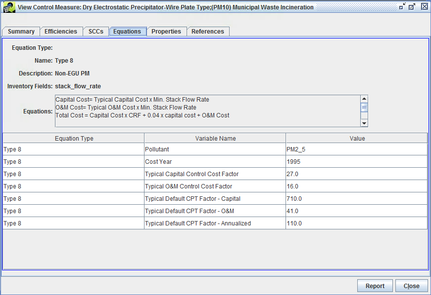{#fig:equations_tab_of_view_control_measure_window}

Component|Description
-------------------------------------|---------------------------------------------------------------------------------------------------------------
Name|The name of the engineering cost equation type (e.g., Type 8).
Description|The description of the engineering cost equation type (e.g., Non-EGU PM Cost Equation).
Inventory Fields|The input parameters to the cost equations found in the inventory (e.g., stack velocity and temperature or design capacity).
Equations|The cost equation definitions.

Table: Control Measure Equations Tab Contents. {#tbl:control_measure_equations_tab_table}

### Control Measure Properties

**Step 2-9: View the Control Measure Properties.** Click on the `Properties` tab on the View Control Measure window to see the data that are available from this tab. Each row in the Properties tab corresponds to a different "property record" in the database. A property record allows for generic information to be stored about the control measures (e.g., metadata). The control measures example in Figure {@fig:properties_tab_of_view_control_measure_window} shows property information that happened to be archived from the AirControlNET software when the measures were transferred into the CMDB.

<a id=properties_tab_of_view_control_measure_window></a>

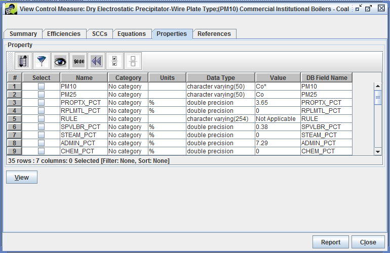{#fig:properties_tab_of_view_control_measure_window}

**Step 2-10: View a Properties Record in a Separate Window.** To see the data for a property record in a separate window, check a checkbox in the **Select** column and click `View`. For example, select the `STEAM_PCT` property record and click `View`. Figure {@fig:view_property_record_window} shows the View Property Record window that will appear. The fields of the property record are shown in Table {@tbl:control_measure_property_record_table}.

Notice that most of the fields in Figure {@fig:view_property_record_window} are set using text fields. The `Category` is a free-form drop down, where an existing category could be used or a new one could be used by typing in the new category.

Do not click Close after examining the Properties tab as this will close the View Control Measure window, which we will use for the next step.

<a id=view_property_record_window></a>

{#fig:view_property_record_window}

<a id=control_measure_property_record_table></a>

Component|Description
-------------------------|----------------------------------------------------------------------------------------------------------------------------
Name|The name of the property.
Category|The category for the property (e.g., AirControlNET Properties, Cost Properties, or Control Efficiency Properties).
Units|The units for the property (e.g., % for percentage).
Data Type|If applicable, this defines the data type of the property (e.g., double precision/float for numeric values, or a varchar/string for textual information).
DB Field Name|If specified, this is a placeholder to help identify the database field name from the particular data source reference that supplied the property information (e.g., an ancillary dataset has a steam percentage stored in the STEAM\_PCT table field/column).
Value|The value of the property.

Table: Property Record Window Contents. {#tbl:control_measure_property_record_table}

### Control Measure References

**Step 2-11: View the Control Measure References.** Click on the `References` tab of the View Control Measure window to see the report and literature citations associated with a control measure (Figure {@fig:references_tab_of_view_control_measure_window}). Each row in the table corresponds to a different "reference record" in the database. A reference record stores source and reference information for the primary information used to create a control measure.

<a id=references_tab_of_view_control_measure_window></a>

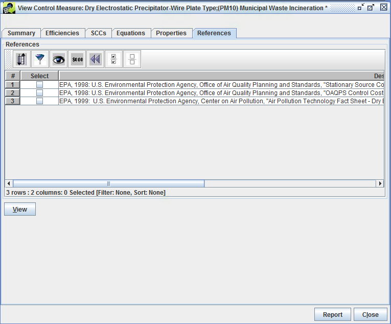{#fig:references_tab_of_view_control_measure_window}

**Step 2-12: View a References Record in a Separate Window.**  To see the data for a reference record in a separate window, check a checkbox in the **Select** column and click `View`. For example, check the checkbox for the first reference record and click `View`. A View Reference Record window will appear (Figure {@fig:view_reference_record_window}) with an editable source/reference description text field.

When you are done examining the information on the View Reference Record Window, click `Close`.

<a id=view_reference_record_window></a>

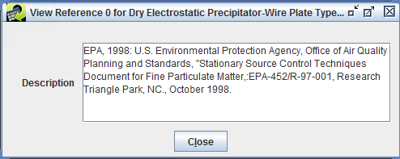{#fig:view_reference_record_window}

This concludes the exercises on examining existing control measures. Click `Close` to close the View Control Measure window.

<a id=Copying3></a>

## Copying a Control Measure {#Copying3}

One way to create a new control measure in CoST is to copy an existing control measure and then edit its data.

**Step 3-1: Copy a Control Measure.** To copy a control measure, first find a measure to copy. Start by
clicking the Reset button  on the toolbar of the Control Measure Manager to remove any previously specified filters.

Next, uncheck the `Show Details` button at the top of the Control Measure Manager (to speed the data transfer) and set the `Pollutant Filter` at the top of the Control Measure Manager to the pollutant of interest. For this example select **NOx** and find the measure named **"Selective Non-Catalytic Reduction; ICI Boilers - Natural Gas"** (Abbreviation = **NSNCRIBNG**). *Hint: You may want to apply a filter to the manager to make it easier to find this specific measure.*

Once you have found the measure to copy, check the corresponding checkbox in the **Select** column and then click the `Copy` button. CoST will create a new control measure called **"Copy of [the starting measure name] [your name] [unique #]"**. A unique abbreviation will also be automatically generated for the measure.

**Step 3-2: View the Copied Control Measure.** To see the new control measure in the Control Measure Manager, **Scroll** to the top of the window. If you do not see the measure, click the `Refresh` button at the top right of the Manager window to obtain updated data from the CoST server.

*Note: If the measure named 'Copy of Selective Non-Catalytic Reduction; ICI Boilers...' still does not appear, a filter may be active that is preventing the measure from showing up.* Remove any filters to see the newly copied measure.

View the contents of the copied measure by selecting the checkbox next to the measure and clicking the `View` button.  The new measure will be edited in the next section.

<a id=Editing3></a>

## Editing Control Measure Data {#Editing3}

Only control measures created by the current CoST user can be edited through the Control Measure Manager. CoST Administrators can edit all of the measures in the CMDB.

**Step 4-1: Find a Control Measure to Edit.** First, click the `Clear all the selections` button to
unselect any previously selected measures . For this exercise, find the measure created using the copy button (see [Copying a Control Measure](#Copying3)) in the Control Measure Manager and check the corresponding select box in the **Select** column. Click `Edit` to edit the data for the control measure. The Edit Control Measure window will appear Figure {@fig:summary_tab_of_edit_control_measure_window}.

<a id=summary_tab_of_edit_control_measure_window></a>

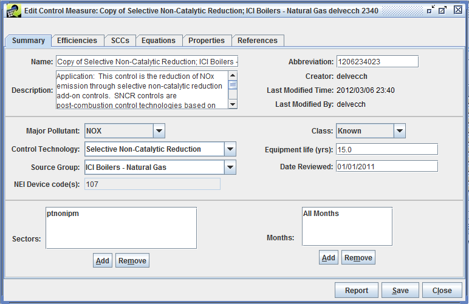{#fig:summary_tab_of_edit_control_measure_window}

### Editing a Control Measure Summary

Like the View Control Measure window, the Edit Control Measure window has six tabs, and the `Summary` tab is shown by default. The main difference between the View and Edit windows is that the control measure contents can be changed in the Edit window, rather than just viewing the information.

Notice that most of the fields have white backgrounds, which usually indicates that the field is editable; fields that are not contained within boxes are set by the software and cannot be changed by the user. In addition, there are `Add` and `Remove` buttons for the lists of Sectors and Months.

**Step 4-2: Change a Control Measure Name.** The name of a control measure can be changed on the `Summary` tab of Edit Control Measure window.  For example, you may change the part of the measure name that deals with the affected sources, such as **Selective Non-Catalytic Reduction; ICI Boilers - Natural Gas and Oil**. Recall that measure names must be unique.

When the measure was copied, the abbreviation was set to a number that was known to be unique so that it could be saved in the database. Replace the automatically generated `Abbreviation` for the new measure with something else (e.g., **NSNCRIBNGO**). Try to follow a similar naming convention as the other measures, but your new abbreviation must be unique in the database.

**Step 4-3: Edit Other Fields in the Control Measure Summary.** Edit the other **Summary** fields of the measure as desired. For this exercise, change the `Equipment Life` to **10**, change the `Date Reviewed` to **today's date**, set `Class` to **Emerging**, and make any other changes you wish, such as entering a more detailed `Description`.

Click the `Add` button under the `Sectors` list to add another sector for the measure. For example, from the Select Sectors dialog, choose **ptipm** (i.e., point sources handled by the Integrated Planning Model) and click `OK`. You will then see the new sector added to the list of applicable sectors. *Note that the sectors listed here are informational only; they do not affect the use of the measure in control strategies in any way.*

**Step 4-4: Remove a Control Measure Sector.** To remove a sector from a Control Measure, click on the sector in the list and click `Remove` and it will no longer appear on the list.

**Step 4-5: Setting Months for a Control Measure.** Adding and removing `Months` to which a control measure applies works similarly to adding and removing sectors. For this exercise, specify some particular months to which the measure should apply (e.g., **March**, **April**, and **May**).

*Note: the feature of setting specific months for which a measure applies is effective only when applying measures to monthly emissions inventories. Specifying months in this way is not effective when applying measures to annual emissions inventories.*

To set the months back to All Months, select all of the months in the `Months` list by clicking on the first month, scrolling to the last month in the list, and using **shift-click** with your mouse to select all  of the months in the list. Click `Remove` to remove specific months and to set the measure to be applicable to all months.

**Step 4-6: Discard Changes.**  Now that you have changed information for the measure, notice that an asterisk (\*) appears after the measure name in the title for the window. This means that CoST is aware that you have made changes. If you try to `Close` a window on which you have made changes to the data without saving it, CoST will ask you "Would you like to discard the changes and close the current window?" If you want to discard (i.e., undo) ALL of the changes made since you started editing the measure, click `Yes`. If you prefer to not to close the window so that your changes stay in-tact, click `No`. For this exercise, click `No` to preserve the changes that you made.

### Editing Control Measure Efficiencies

**Step 4-7: Edit Control Measure Efficiencies.**  Go to the `Efficiencies` tab of the Edit Control Measure Window Figure {@fig:efficiencies_tab_of_edit_control_measure_window}. The buttons on the `Efficiencies` tab of the Edit window are different from those on the View window. The available buttons are `Add`, `Edit`, and `Remove`. Notice the efficiency record for the measure shown in Figure {@fig:efficiencies_tab_of_edit_control_measure_window} is for only one pollutant, and that this record can be applied only to sources emitting at least 25 tons/yr as specified in the **Min Emis** field.

<a id=efficiencies_tab_of_edit_control_measure_window></a>

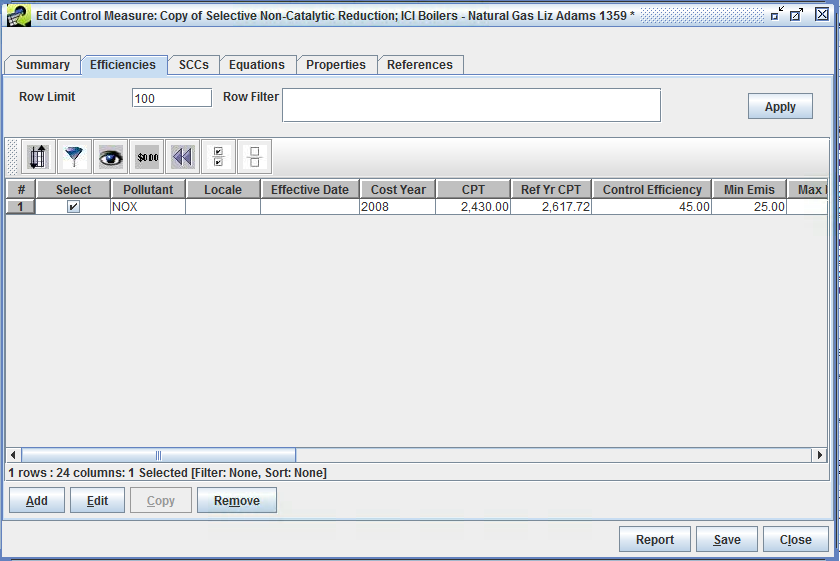{#fig:efficiencies_tab_of_edit_control_measure_window}

Scroll to the right to examine additional fields. Note that more of the fields are filled in for NOx than for the PM measure that you examined in [Viewing Data for an Existing Control Measure](#Viewing3). The additional data allows CoST to compute the capital and operating and maintenance (O\&M) costs in addition to overall annualized costs when this measure is used in a control strategy.

To edit an efficiency record, check the checkbox in the **Select** column for the pollutant to edit and then click `Edit`. The Edit Efficiency Record window will appear Figure {@fig:edit_efficiency_record_window}.

<a id=edit_efficiency_record_window></a>

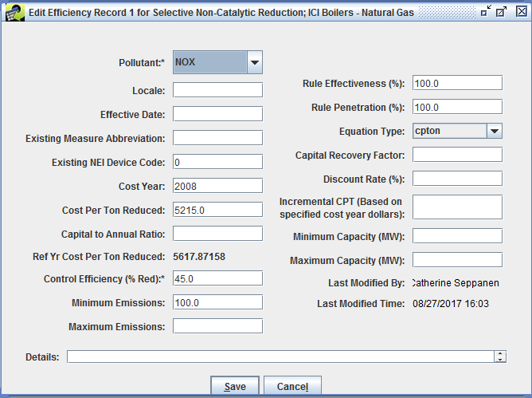{#fig:edit_efficiency_record_window}

Edit the values for the efficiency record to configure the new control measure. For this exercise, set `Maximum Emissions` to **5000** and click `Save`. The value for this field is now updated in the table in the Edit Control Measure window. The measure will apply only to sources that emit between 25 and 5000 tons of NOx annually.

**Step 4-8: Add a Control Measure Efficiency Record.** To add a new efficiency record, click `Add` in the Edit Control Measure `Efficiencies` tab. Fill in the fields in the Add Efficiency Record window to create the new Efficiencies record. For this exercise, select **CO<sub>2</sub>** as the `Pollutant`, set `Locale` to **06**, set `Effective Date` to **01/01/2025**, and set `Control Efficiency (% Red)` to **10**.  Click `Save` to save the new record. A new row will appear in the table on the `Efficiencies` tab in the Edit Control Measure window. The effect of this new record will be to include a 10% reduction to CO2 emissions for sources in California (FIPS=06) starting on 01/01/2025 when this control measure is applied.

**Step 4-9: Remove a Control Measure Efficiency Record.**  To remove one or more efficiency records, click the corresponding checkboxes next to the record and then click `Remove` to remove those records. For this exercise, click the checkbox in the **Select** column for the CO2 record that you just added and click `Remove` to remove that record. When asked to confirm removal of the selected record, click `Yes`. The record will disappear from the Efficiencies tab.

**Additive impact of multiple efficiency records.** If cost per ton (CPT) values are specified for multiple efficiency records, they are additive when they are used in a control strategy. For example, if a CPT is specified for both NO<sub>x</sub> and VOC for a measure, the total cost of applying the measure is the sum of (1) the CPT for NO<sub>x</sub> times the NO<sub>x</sub> emissions reduced and (2) the CPT for VOC times the VOC emissions reduced.

### Editing Control Measure SCCs

**Step 4-10: Edit Control Measure SCCs.** Click on the `SCCs` tab on the Edit Control Measure window to show the SCCs for inventory sources to which the edited measure can be applied. SCCs may be added or removed for a measure from this window. An example of this tab is shown in Figure {@fig:sccs_tab_of_edit_control_measure_window}.

<a id=sccs_tab_of_edit_control_measure_window></a>

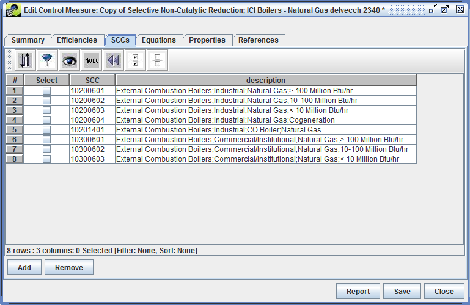{#fig:sccs_tab_of_edit_control_measure_window}

To add new SCCs, click the `Add` button to display the Select SCCs window (Figure {@fig:select_sccs_and_filter_rows_dialogs}). Note that there are over 11,900 possible SCCs to use for developing control measures. The number of available SCCs can be found in the lower left hand corner of the Select SCCs dialog.

To filter the SCCs for the new measure on the Select SCCs window, click the `Filter Rows` button on the toolbar. For this exercise, when the `Filter Rows` dialog that appears, click `Add Criteria` three times, enter the following criteria, then click `OK`:

* Description contains Natural Gas
* Description contains Boiler
* SCC starts with 1

<a id=select_sccs_and_filter_rows_dialogs></a>

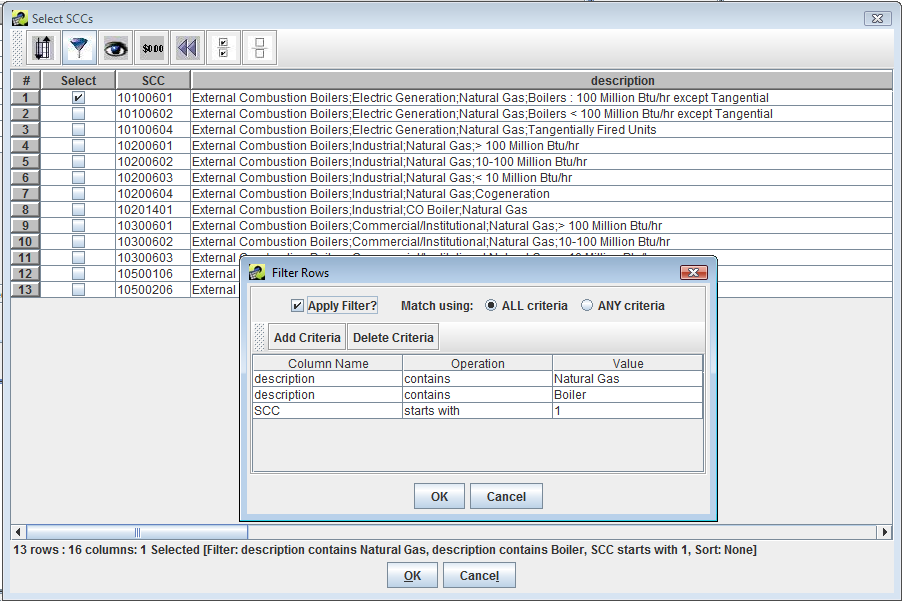{#fig:select_sccs_and_filter_rows_dialogs}

The Select SCCs window will show only the SCCs that met the above criteria, such as the 13 SCCs shown in Figure {@fig:select_sccs_and_filter_rows_dialogs}. While many of these SCCs are already associated with the measure (i.e., they are already shown on the SCCs tab of the Edit Control Measure window in Figure {@fig:sccs_tab_of_edit_control_measure_window}, a few additional SCCs (i.e., the ones starting with 101 and 105) are also relevant for this measure.

**Step 4-11: Add SCCs to a Control Measure.** Click the checkbox in the **Select** column for the SCCs to add to the measure. For this exercise, select **10100601** and then click `OK`. The SCC will now appear in the list of applicable SCCs for the measure in the Edit Control Measure window. *Note: If you select an SCC to add that was already on the SCCs tab, it will not cause any problems and it will not add the SCC for a second time.*

*Tip for adding multiple of SCCs:* If you need to add several SCCs and are able to specify a filter on the Select SCCs dialog box that results in only the SCCs that are appropriate for the control measure being shown, click the `Select All` button on the toolbar to select all of the SCCs at once. Then, when you click `OK`, all of the SCCs will be added to the SCCs tab for the measure. This avoids requiring you to click all of the individual Select checkboxes. Alternatively, if most but not all of the SCCs were appropriate, you could select all of them and then click on a few checkboxes to deselect the ones that were not needed and then click `OK` to add only the ones that remained selected.

### Editing Control Measure Equations

**Step 4-12: Edit Control Measure Equations.** Go to the `Equations` tab of the Edit Control Measure window (Figure {@fig:equations_tab_of_edit_control_measure_window}). Double click your mouse in the **Value** column in the cell next to the variable named **Cost Year**. For this exercise, change the Cost Year value to **1995** and then press the `Enter` key on your keyboard. You will see that the new cost year is set to 1995. Note that the values for other fields could be changed in a similar way.

<a id=equations_tab_of_edit_control_measure_window></a>

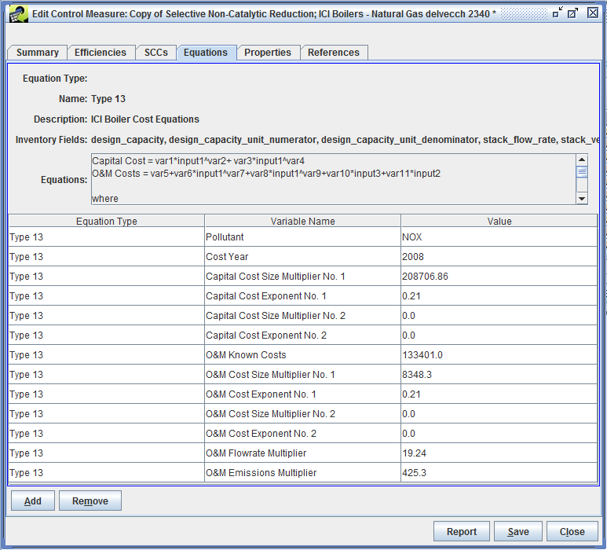{#fig:equations_tab_of_edit_control_measure_window}

**Step 4-13: Remove Control Measure Equation Data.** To remove all of the equation information, click the `Remove` button. You will see a dialog that says "Are you sure you want to remove the equation information?". To demonstrate how removing and resetting equation information works, click `Yes` to remove the equation information. All of the equation information will be removed from the `Equations` tab.

**Step 4-14: Add Control Measure Equation Data.**  To add equation information to a measure, click the `Add` button on the `Equations` tab. You will see a Select Equation Type dialog. Click the pull-down menu to see the available types of equations and select the desired equation type. For this exercise, select **Type 1 - EGU** and click `OK`. You will see that there are eight variables for this equation type. Note that the variables differ somewhat from the variables for the Type 13 equation shown in Figure {@fig:equations_tab_of_edit_control_measure_window}, and that the Type 1 equation is for NO<sub>x</sub> controls.

Details on the types of cost equations and their variables are given in the [Documentation of Cost Equations in the EPA's Control Strategy Tool (CoST)](https://www3.epa.gov/ttn/ecas/docs/CoST_Equations_Document_2016_03_15.pdf).

For this exercise, click the `Remove` button again and click `Yes` to confirm removal of the equation information. Click the `Add` button on the `Equations` tab and select **Type 13 - ICI Boiler Cost Equations**. Next, fill in the values for the variables as they are shown in Figure {@fig:equations_tab_of_edit_control_measure_window} by double clicking on the field corresponding to each value and then entering the appropriate information.

*Note: You can enter cost equations in terms of only one pollutant, even if the measure reduces emissions for multiple pollutants.*

Click `Save` at the bottom of the Edit Control Measure window to save the changes you made to the control measure and to close the window. To see the revised name and abbreviation for the new measure, click the `Refresh` button at the upper right of the Control Measure Manager to load the updated data from the server.

### Editing Control Measure Properties

**Step 4-15: Edit Control Measure Properties.** Go to the `Properties` tab of the Edit Control Measure Window (Figure {@fig:properties_tab_of_edit_control_measure_window}). The buttons on the `Properties` tab of the Edit window are different from those on the View window. The available buttons are `Add`, `Edit`, and `Remove`. The property record allows for freeform property metadata/information to be associated with the measure. The property can be assigned a category grouping (e.g., Steam Factors), units (e.g., MW/hr), and a data type (e.g., numeric).

<a id=properties_tab_of_edit_control_measure_window></a>

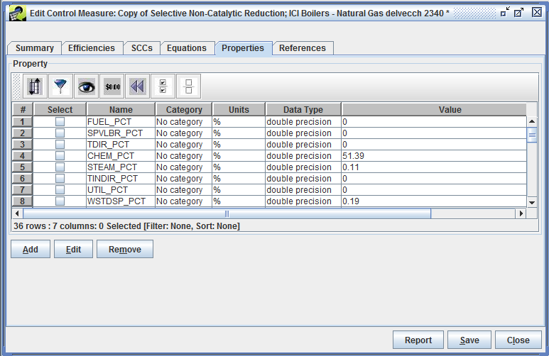{#fig:properties_tab_of_edit_control_measure_window}

To edit a property record, scroll down to the **COST_BASIS** property, and check the corresponding checkbox in the **Select** column for the **COST_BASIS** property and then click `Edit`. The Edit Property Record window will appear (Figure {@fig:edit_property_record_window}). The data type is text, which means the property will contain textual information about the measure. Note also how the value field contains detailed information about the methodologies used for costing this control measure.

<a id=edit_property_record_window></a>

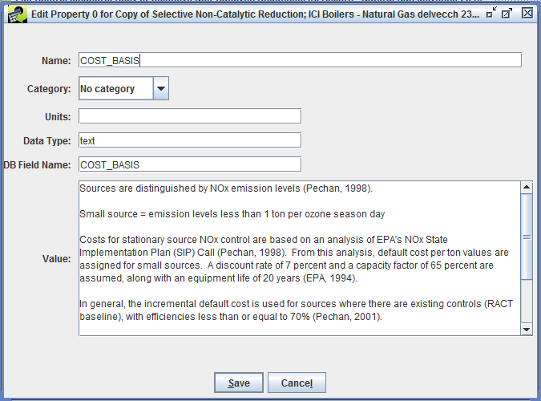{#fig:edit_property_record_window}

Edit the value for the property record as needed to reflect the new control measure. For this exercise, add some additional text to the `Value`, then click `Save`.

**Step 4-16: Add a New Control Measure Property.** To add a new property record, click `Add` in the `Properties `tab. Fill in the appropriate values in the Add Property Record window that appears. For this exercise, set the `Name` to "POWER_LOSS", select **No category** as the `Category`, **MW/hr** for the `Units`, **numeric** for the `Data Type`, **POWER_LOSS** for the `DB Field Name`, and **5** as the `Value`. Click `Save` once this information is entered and a new row will appear in the table in the Edit Control Measure window.

**Step 4-17: Remove a New Control Measure Property.**  To remove one or more property records, click the corresponding checkboxes and then click `Remove`. For this exercise, click the checkbox in the **Select** column for **POWER_LOSS** and then click `Remove` and confirm with `Yes` to remove that record. The **POWER_LOSS** record will disappear from the table.

### Editing Control Measure References

**Step 4-18: Edit Control Measure References.** Go to the `References` tab of the Edit Control Measure Window (Figure {@fig:references_tab_of_edit_control_measure_window}). The available edit buttons in this window are `Add`, `Edit`, and `Remove`.

<a id=references_tab_of_edit_control_measure_window></a>

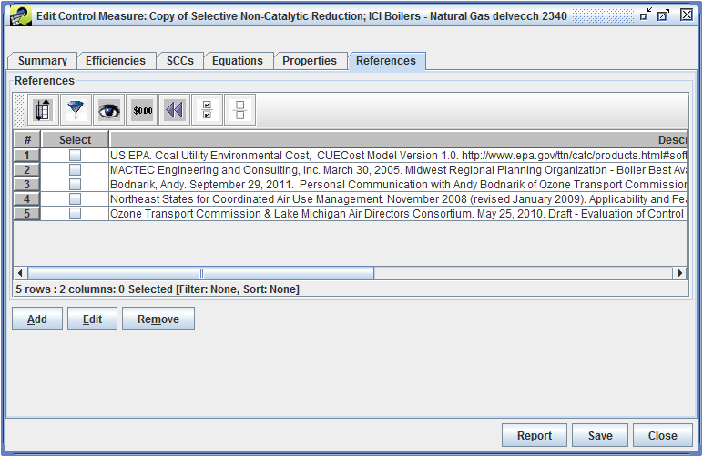{#fig:references_tab_of_edit_control_measure_window}

To edit an existing reference record, check the corresponding checkbox in the **Select** column and click `Edit`. For example, click the box next to the **"MACTEC Engineering and Consulting..."** reference entry and then click `Edit`. The Edit Reference Record window will appear (Figure {@fig:edit_reference_record_window}).

<a id=edit_reference_record_window></a>

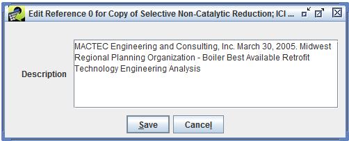{#fig:edit_reference_record_window}

Edit the value for the reference record as needed to reflect information for the new control measure. For this example, add some additional text to the `Description` box, then click `Save`.

**Step 4-19: Adding Control Measure References.** To add a new reference for a control measure, click `Add` in the `References` tab, and the **Add Reference Record** window will appear (Figure {@fig:add_reference_record_window}). Either choose a reference that already exists in the database, or add a new reference.

To choose an existing reference, click on the` Use existing reference` option and then search for the reference by filling in the `Text contains` field, then click `Search`. When you have located the correct reference, select the item in the `References` box and click `Save` to add the reference to the control measure.

To create a new reference, click on the `Create new reference` option and then type the reference in the `Description` field, then click `Save` to add the reference to the control measure. For this exercise, click on `Create new reference` and then add **"sample technical reference"** to the `Description` field. Click `Save` and a new row will appear in the References table in the `References` tab of the Edit Control Measure window.

<a id=add_reference_record_window></a>

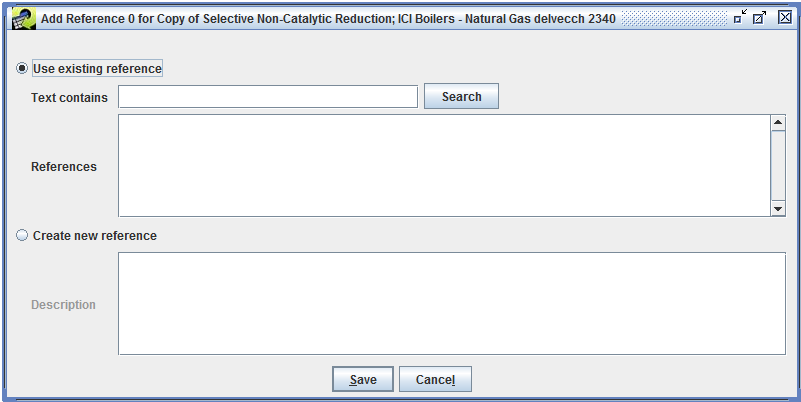{#fig:add_reference_record_window}

**Step 4-20: Remove Control Measure References.**  To remove one or more reference records in the `References` tab, click the checkbox(es) next to the reference(s) to remove and then click `Remove`. For this exercise, click the checkbox in the **Select** column for the record for "sample technical reference" that you just added and click `Remove` and `Yes` to confirm to remove that record. The record will disappear from the references table.

Click **Save** at the bottom of the Edit Control Measure window to save the changes you made to the control measure and to close the window.

<a id=Creating3></a>

## Creating a New Control Measure

This section describes how to create new CoST control measures through the Control Measure Manager.

**Step 5-1: Add a New Control Measure.** To create a new control measure, click `New` on the Control Measure Manager to display the New Control Measure window as shown in Figure {@fig:summary_tab_of_edit_control_measure_window}, except with none of the control measure information filled in.

**Step 5-2: Adding a New Control Measure: Summary.** Enter a unique name (e.g., New PM10-PRI Control Measure) in the `Name` field and a unique abbreviation (e.g., PNCM) in the `Abbreviation` field for the control measure. You must also set the `Major Pollutant` (e.g., PM10-PRI) and `Class` (e.g., Known) and the `Date Reviewed` for the measure before the measure can be saved into the CMDB. For more information on the fields in the Summary tab, see [Viewing Data for an Existing Control Measure](#Viewing3) and [Editing Control Measure Data](#Editing3) above.

**Step 5-3: Adding a New Control Measure: Efficiencies.**  Go to the `Efficiencies` tab of the New Control Measure window and add at least one efficiency record for the measure; otherwise it will have no effect on any emissions sources. The efficiencies tab for the new measure will look similar to Figure {@fig:efficiencies_tab_of_edit_control_measure_window}, except initially there will be no efficiency records. For more information on the data needed for efficiency records, see [Viewing Data for an Existing Control Measure](#Viewing3) and [Editing Control Measure Data](#Editing3). Add as many efficiency records as needed to describe the control efficiency and cost of the measure.

**Step 5-4: Adding a New Control Measure: SCCs.**  Go to the `SCCs` tab of the New Control Measure window and add at least one SCC record for the measure; otherwise it will have no effect on any emissions sources. The SCC tab for the new measure will look similar to Figure {@fig:sccs_tab_of_edit_control_measure_window}, except initially there will be no SCC records.  Note that the same control efficiency and cost information must apply to all sources with SCCs listed on this tab, otherwise the information must be stored in a separate measure for the other SCCs. For more information on the data needed for SCCs, see [Viewing Data for an Existing Control Measure](#Viewing3) and [Editing Control Measure Data](#Editing3).

**Step 5-5: Adding a New Control Measure: Equations.** To associate a cost equation with the new measure, go to the `Equations` tab and add an equation. The tab should look similar to the one shown in Figure {@fig:equations_tab_of_edit_control_measure_window}. Cost equations are optional. If you do not have a cost equation, cost per ton information from one or more of the efficiency records will be used to estimate the cost of applying the measure.

**Step 5-6: Adding a New Control Measure: Properties and References.** To associate a property with the measure, go to the `Properties` tab and add a property. The tab should look similar to the one shown in Figure {@fig:properties_tab_of_edit_control_measure_window}. Properties are optional.

To associate a reference with the measure, go to the `References` tab and add a reference. The tab should look similar to the one shown in Figure {@fig:references_tab_of_edit_control_measure_window}.

After all of the relevant information for the measure has been entered, click `Save` at the bottom of the New Control Measure window.

**Step 5-7: View the New Control Measure.** Set the `Pollutant Filter` in the Control Measure Manager to a pollutant specified for one of the new measure's efficiency records (e.g. PM10-PRI), and you will see the new measure listed in the Control Measure Manager window. If you do not see it, try clicking the `Refresh` button to reload the measures from the server.

<a id=Finding3></a>

## Finding Available Control Measures for Specific SCCs

If the SCCs are known for a source, the `Find` button on the Control Measure Manager (e.g., see Figure {@fig:control_measure_manager_showing_control_measure_details}) can be used to display which control measures are available for sources with those SCCs.

**Step 6-1: Find Control Measures for SCCs.**  Before using the Find feature, set the `Pollutant Filter` (in the top left corner of the Control Measure Manager) to **Select one**, and click the `Reset` button on the toolbar, so that no pollutant or other filters will be applied prior to performing the next step. Click the `Find` button. You will see the Select SCCs window, similar to the one shown in Figure {@fig:select_sccs_and_filter_rows_dialogs}, except that all 11,900+ SCCs will be shown.

Use the `Filter Rows` button on the toolbar of the Select SCCs window to enter a filter that will help identify SCCs for which you would like to see available control measures. For this example, click `Add Criteria` twice and add the filters **SCC starts with 103** and **SCC starts with 305006**, select `Match using` **ANY criteria**, and click `OK`. You should see 83 SCCs that meet this criterion.

Click the checkbox in the **Select** column for a few of the SCCs
(e.g., select at least **10300101** and **30500606**) and then click `OK`. If there are measures available for the selected SCC(s), they will be shown in the table. If you selected an SCC for which there are no measures available, none will be shown.

Click `Find` again and enter a filter on the Select SCCs window based on the SCC description instead of the SCC itself. For example, use the `Filter Rows` button on the Select SCCs window toolbar to enter the filter **description contains Cement**, then click on the checkbox in the **Select** column for a few of these SCCs (e.g., 30500606) and click `OK`. If there are measures in the database for the selected SCCs, they will be shown in the Control Measure Manager table. Note that there may be some SCCs for which there are no measures available in the database. In that case, no measures would be shown in the table after applying the SCC filter. For the measures that are returned, notice whether they all have the same value for Pollutant (e.g., measures for SCC 30500606 target NO<sub>x</sub>, PM<sub>10</sub>-PRI, and SO<sub>2</sub>).

<a id=PollutantMenu3></a>

## The Pollutant Menu

The `Pollutant` pull-down menu near the bottom of the Control Measure Manager selects the pollutant for which the **CPT**, **Control Efficiency (CE)**, **Rule Effectiveness**, and **Rule Penetration** data are shown in the Control Measure Manager. Note that to view these fields `Show Details` must be checked and you may need to scroll right or widen the window. Recall that each control measure can have efficiency records for multiple pollutants. By setting the `Pollutant Filter` at the top of the window, any measures that controls the selected pollutant will be shown in the table. The `Pollutant` pull-down menu displays the specific setting for the selected pollutant.  

**Step 7-1: Use the Pollutant Menu.** To see the effect of the Pollutant pull-down menu, click the `Reset` button  on the Control Measure Manager toolbar to remove any previously specified filters. Set the `Pollutant Filter` to **PM25-PRI** and make sure that `Show Details?` is checked.  Set the `Pollutant` menu at the bottom of the window to **MAJOR**.

Examine the values in the **Avg CPT**, **Min CPT**, **Max CPT**, **Avg CE**, **Min CE**, and **Max CE** columns for some of the measures. Notice that for some of the measures, PM25-PRI is not the pollutant listed in the **Pollutant** column (e.g., sort on the Pollutant column by clicking on it once or twice to find other pollutants). These measures are shown in the manager because they all apply to PM25-PRI, even if PM25-PRI is not the major pollutant for the measure. In this case, the CPT and CE values are shown for the major pollutant specified for the measure, not necessarily for PM25-PRI.

Change the value of the `Pollutant` menu to something other than **MAJOR** (e.g., **PM10-PRI**). All entries in the **Pollutant** column are now set to the pollutant specified in the `Pollutant` menu, and the cost per ton (CPT) and control efficiency (CE) values are specific to the selected pollutant instead of being for the major pollutant specified for the measure. Note that CPT values may not be filled in for some measures. For PM measures, the cost information is typically associated with PM10-PRI, as opposed to PM25-PRI. Therefore, if the **Pollutant** menu is set to PM25-PRI, fewer CPT values will be shown than when `Pollutant` is set to PM10-PRI.

<a id=CostYearMenu3></a>

## The Cost Year Menu

The `Cost Year` pull-down menu near the bottom of the Control Measure Manager controls the year for which the cost data are shown in the Manager. The default cost year is 2013. The cost data are converted between cost years using the Gross Domestic Product (GDP): Implicit Price Deflator (IPD), issued by the U.S. Department of Commerce, Bureau of Economic Analysis. Details of the computation used are given in the "Control Strategy Tool (CoST) Development Document."

**Step 8-1: Change the Cost Year.** Change the cost year in the `Cost Year` menu from 2013 to an earlier year (e.g., 2010). Note how the CPT values decrease. If the cost year is changed to a later year, the CPT values increase.

*Note that due to the method used to convert the costs between years, it is not possible to show costs for a future year (e.g., 2025); costs can be shown only for years prior to the current calendar year.*  The Cost Year cannot be set to the current calendar year because the economic data needed to make adjustments is not made available until after the end of each calendar year.

If an equation is specified for a measure, and there are no default CPT data available for that measure, the CPT will not be shown in the Control Measure Manager because it must be applied to an emissions source for the cost to be computed.

<a id=ImportExport3></a>

## Importing and Exporting Control Measure Data

Control measure data can be exported from the Control Measure Manager to a set of CSV files. First identify a set of control measures for which to export data. Measures may be exported based on specifically selected control measures via the Control Measure Manager, or an entire set of measures associated with a certain sector may be exported.

### Exporting Control Measures

**Step 9-1: Export PM10-PRI Control Measures.**  To export measures that control PM10-PRI, set the `Pollutant Filter` on the Control Measure Manager to **PM10-PRI**. Next, use the `Filter Rows` button the toolbar to enter the following criterion: **Name contains Fabric Filter**. The Manager will display 44 measures.

Click the `Select all` button on the Control Measure Manager toolbar, and then click the `Export` button. The Exporting Control Measures window (Figure {@fig:exporting_control_measures_dialog}) will appear.

To export by selected measures, select the `Export By Measure` option. The list of measures displayed for export are the same measures that were chosen from the Control Measure Manager. Note it's not necessary to click the "Select" checkboxes for these measures, all measures shown in the list will be exported regardless if they are checked or not. To export by inventory sector, select the `Export By Sector` option, then choose the various sectors for which to export control measures.

For this exercise, select `Export By Measure` to export the preselected measures from the Control Measure Manager. To specify the output folder (i.e., directory) into which the CSV files will be written, type the folder name into the `Server Export Folder` text field or use the `Browse` button to bring up a file and directory browser to select the output folder. To specify an export file name prefix for naming the new exported files, type the prefix string into the `File Name Prefix` text field.

<a id=exporting_control_measures_dialog></a>

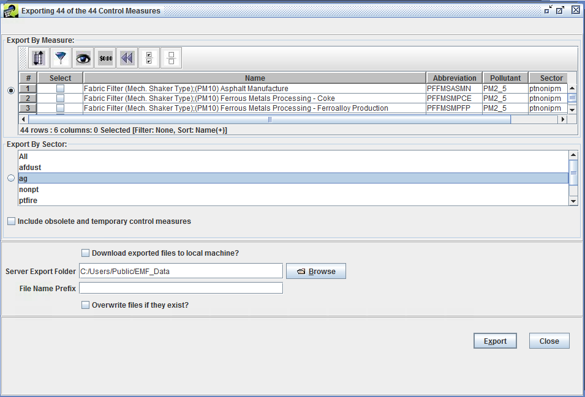{#fig:exporting_control_measures_dialog}

Type an export file prefix string (e.g., fabric_filter) into the `File Name Prefix` field of the Exporting Control Measures window. This string will be included at the beginning of the names of the exported CSV files to help identify the types of measures that are included in the files.

After setting the desired output folder and the file name prefix on the Exporting Control Measures window, click the `Export` button. The message at the top of the Export window will state that the export has started and to monitor the **Status** window to track the export request.

The **Status**, or **Downloads**, window is near the bottom of the EMF main window. It will show a message when the export starts and another when it is finished. Monitor the status on demand by clicking the `Refresh` button at the top of the **Status/Downloads** window.

**Step 9-2: View the Exported Control Measures.** After the export is finished, close the Exporting Control Measures window by clicking `Close`. Use your computer's file browser to view the contents of the folder that you selected for the export. In the example shown above, the files created in the selected folder are: **fabric_filter_summary.csv**, **fabric_filter_efficiencies.csv**, **fabric_filter_SCCs.csv**, **fabric_filter_equations.csv**, **fabric_filter_Props.csv**, and **fabric_filter_Refs.csv**. These files may be opened with standard spreadsheet software. For a complete description of the fields in the files, see "Control Strategy Tool (CoST) Control Measures Database (CMDB) Documentation."

### Importing Control Measures

Files in the exported format can also be imported into the CMDB. Control measures can only be imported to CoST/EMF by an Administrator.

**Step 9-3: Import Control Measures.**  If logged in as Administrator, click the **Import** button on the Control Measure Manager to start importing measures. In the **Import Control Measures** window that appears (Figure {@fig:import_control_measures_dialog}), type or paste the name of the import `Folder`. You may also use the `Browse` button to browse to a folder containing the files to be imported and select the files directly from the browser. Alternatively, enter the folder name and then type in a **pattern** to specify the files, then click `Apply Pattern`. When using a pattern, an asterisk (\*) will be expanded to the available file names.

After selecting the files to import, click the `Import` button. Information about the status of the import will be shown in the **Status** section of the window. To see updates to the status of the import, click the `Refresh Import Status` button. Once the imports are complete, click the `Done` button. If the measures already existed in the database, the new data will replace the existing data.

*Note that as there will be no warning before the CMDB data are replaced, use the import feature with caution.*

It is possible to purge existing measures from the CMDB by sector. This feature will remove all measures associated with the sectors chosen in the `Purge Existing Measures By Sectors` list. The user must also click the `Purge` checkbox to allow the measures to be purged. The measures will be purged when the `Import` button is clicked.

<a id=import_control_measures_dialog></a>

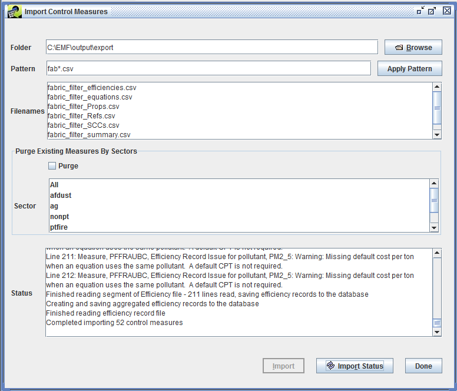{#fig:import_control_measures_dialog}

<!-- BEGIN COMMENT -->

[<< Previous Chapter](ch2_installing_cost.md) - [Home](README.md) - [Next Chapter >>](ch4_control_strategy_manager.md)<br>

<!-- END COMMENT -->
