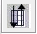
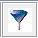
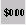

<!-- BEGIN COMMENT -->

[<< Previous Chapter](ch2_installing_cost.md) - [Home](README.md) - [Next Chapter >>](ch4_control_strategy_manager.md)

<!-- END COMMENT -->

Title: Control Measure Manager
Author: C. Seppanen, UNC
CSS: base.css

# Control Measure Manager [control_measure_manager_chapter] #

This chapter demonstrates the features of the Control Measure Manager. The CoST installation already includes updated area- and stationary-source control measures. These measures can be used as is during control strategy runs. The client user can also edit these measures, or import their own measures to be used by CoST.

The Control Measure Manager allows control measure data to be entered, viewed, and edited. The data that the Control Measure Manager is showing are stored in the Control Measures Database (CMDB). The CMDB is stored as a set of tables within the EMF database. Control measures can also be imported from files that are provided in a specific CSV format and exported to that same format. **Control measures store information about control technologies and practices that are available to reduce emissions, the source categories to which they apply, the expected control efficiencies, and their estimated costs.** In CoST, the control measures are stored separately from the emission inventory data and are matched with the emission sources using a list of Source Classification Codes (SCCs) that are specified for each control measure. The Control Measure Manager has the following major features:

* Facilitates storing and maintaining control measure data

* Shows minimum, maximum, and average control efficiency, cost per ton (based on year 2013 values), and average rule effectiveness and rule penetration

* Displays other control measure attributes (e.g., abbreviation, major pollutant, source group, equipment life, sectors, class)

* Allows import of control measure information into the system from CSV files

* Enables export of control measure to CSV files

In this chapter, you will learn how to:

* View, sort, and filter a list of control measures from the Control Measure Manager window

* Find control measure that apply to selected SCCs

* View the detailed data available for a control measure, including control efficiencies, SCCs, cost equations, and properties

* Copy control measures

* Edit data for control measures

* Create new control measures

* Filter and display cost and control efficiency information for major and co-benefit pollutants of the measures

* See cost per ton information for different cost years

* Export control measures data

**This chapter is presented as a series of steps so that it can be used as part of a training class or tutorial on how to use CoST.**

## Control Measure Manager [control_measure_manager_section] ##

We begin by opening the Control Measure Manager and exploring the buttons and menus in the upper portion of the window.

1\. To open the Control Measure Manager, choose **Control Measures** from the **Manage** menu on the EMF main window ([Figure](#emf_main_window)), as shown in [Figure](#manage_menu_of_emf_main_window). The Control Measure Manager window will appear ([Figure](#control_measure_manager_before_control_measures_are_loaded)). When the window first appears, it will be empty. Notice that the window appears within the EMF main window.

![Manage Menu of EMF Main Window][manage_menu_of_emf_main_window]

[manage_menu_of_emf_main_window]: images/Manage_Menu_of_EMF_Main_Window.png

Notice the different parts of the Control Measure Manager window. There is a **Pollutant Filter** at the top, along with a **Show Details** checkbox and a **Refresh** button. Below those buttons is a toolbar full of buttons that operate on the data shown in the table below the toolbar, which is currently empty. There is also a distinct set of buttons and pull-down menus below the table. The functions of all of these buttons will be discussed in the coming sections.

![Control Measure Manager before Control Measures are Loaded][control_measure_manager_before_control_measures_are_loaded]

[control_measure_manager_before_control_measures_are_loaded]: images/Control_Measure_Manager_before_Control_Measures_are_Loaded.png

2\. To show some of the control measures from the database in the table, select a pollutant from the **Pollutant Filter** pull-down menu at the upper left corner of the Control Measure Manager (**for the training, click on the down arrow and use the scroll bar to find and select PM10**). Information about any control measures that control the selected pollutant will appear in the window ([Figure](#control_measure_manager_with_control_measures)). At this point, only the control measure **name**, **abbreviation**, **pollutant**, **sector**, and **class** are shown in the manager window. Note that name of each control measure must be unique within the database, and that the control measures appear in a table in which the data can be sorted and filtered.

The abbreviation is a set of characters that is a 'short-hand' for the control measure. Typically, the abbreviation should express the name of the control measure in an abbreviated form such that if someone is familiar with the abbreviation conventions, the person might be able to infer the name of the measure. Typically the first character of the measure denotes the 'major pollutant' (e.g., 'P' for PM controls, 'N' for NO<sub>x</sub> controls, 'S' for SO~2 controls). The next few characters usually denote the control technology (e.g., 'ESP' for Electrostatic Precipitator, 'FFM' for fabric filter mechanical shaker). Abbreviations must be unique within the database (i.e., no two control measures can use the same abbreviation).

![Control Measure Manager with Control Measures][control_measure_manager_with_control_measures]

[control_measure_manager_with_control_measures]: images/Control_Measure_Manager_with_Control_Measures.png

3\. To see more information about the measures, check the **Show Details** checkbox - additional columns will appear on the right of the table. An example is shown in [Figure](#control_measure_manager_showing_control_measure_details).

4\. To better see the additional columns, you can make the Name column narrower by **positioning your mouse on the line between 'Name' and 'Abbreviation'** on the table header - this will cause a special mouse pointer with arrows to appear and you can then **drag your mouse** to make the Name column narrower.

![Control Measure Manager showing Control Measure Details][control_measure_manager_showing_control_measure_details]

[control_measure_manager_showing_control_measure_details]: images/Control_Measure_Manager_showing_Control_Measure_Details.png

5\. **Scroll to the right** and examine the columns that are available in the Control Measure Manager for future reference. *Note that you may move the columns around by grabbing the column's header with your mouse and dragging them. You may also change their widths as desired.* You can resize the Control Measure Manager window within the EMF Main Window as desired, such as to make the entire window wider so that you can see more columns.

6\. After you scroll to the right a bit, **hover your mouse over one of the columns other than 'Name'**, you will see that the name of the measure corresponding to the row you are on will appear briefly as a "tooltip". This is so that you can tell what the name of the measure is even if has scrolled off the window.

The columns shown on the Control Measure Manager with brief descriptions are shown in [Table](#control_measure_manager_columns_table). **The table that shows the control measures allows the user to sort and filter the data. Tables of this same type are used many places throughout CoST and the EMF.**

Column Name|Description
-|-
Select|This column will allow the user to view, edit, or copy the measure by clicking the corresponding button at the bottom of the manager window. These features will be discussed later in the training.
Name|A unique name for the measure.
Abbreviation|A unique abbreviation for the measure.
Pollutant|A pollutant (e.g., NO<sub>x</sub>, PM~10) that the measure might control. Note that any pollutant-specific information in the row is for this pollutant.
Max, Min, and Avg CE|Maximum, minimum, and average control efficiencies for the specified pollutant, aggregated across all locales, effective dates, and source sizes.
Max, Min, and Avg CPT|Maximum, minimum, and average cost per ton for the specified pollutant aggregated across all locales, effective dates, and source sizes.
Avg Rule Eff.|Average rule effectiveness aggregated across all efficiency records for the specified pollutant.
Avg Rule Pen.|Average rule penetration aggregated across all efficiency records for the specified pollutant.
Control Technology|The control technology that is used for the measure (e.g., Low NO~x burner, Onroad Retrofit).
Source Group|The group of sources to which the measure applies (e.g., Fabricated Metal Products - Welding).
Equipment Life|Expected lifetime (in years) of the equipment used for the measure.
Sectors|An emission sector or set of EPA's emission sectors to which the measure applies (e.g., ptipm, afdust, nonpoint). A sector represents a broad group of similar emissions sources.
Class|The class of the measure. Options are Known (i.e., already in use), Emerging (i.e., realistic, but in an experimental phase), Hypothetical (i.e., the specified data are hypothetical), and Obsolete (i.e., no longer in use).
Eq Type|The type of COST equation to use
Last Modified Time|The date and time on which the information about the measure was last modified in the editor or imported from a file.
Last Modified By|The last user to modify the measure.
Date Reviewed|The date on which the data for the measure were last reviewed.
Creator|The user that created the measure (either from the import process or by adding it via the "New" button).
Data Source|A description of the sources or references from which the values were derived. Temporarily, this is a list of numbers that correspond to references listed in the References Sheet from when the control measures were imported.
Description|A textual description of the applicability of the measure and any other relevant information.
[Columns on the Control Measure Manager][control_measure_manager_columns_table]

7\. To sort based on data in one of the columns, click on the column header. For example, to sort based on the average control efficiency of the measure, first you may want to **make the Name column narrower** so that the column labeled "Avg CE" comes into view on the window, and then **click on the column header for the "Avg CE" column**. The table will now be sorted by the values of "Avg CE" in descending order. *Notice that information about the currently specified sort is reflected in the line just under the horizontal scrollbar for the table.*

8\. If you **click on the header of a column (e.g., Avg CE)** a second time, the sort order will be reversed.

9\. To perform a multicolumn sort, **click the sort button**  and then click **Add** to add an additional column to sort by (e.g., **Name**). Notice that you can control whether the sort is **Ascending** and whether it is **Case Sensitive**. Click **OK** once you have made your selection. The data should now be sort according to the column(s) you specified.

10\. To use a filter to limit the measures shown, **click the button on the toolbar that looks like a filter:** . When you do this the "Filter Rows" dialog appears ([Figure](#filter_rows_dialog)).

- Enter a criterion for the filter by clicking **Add Criteria**.
- **Click in the cell under "Column Name"** to make a pull-down menu appear, from which you may choose a column to filter on (e.g., **'Name'**).
- **Click in the cell under "Operation"** to see the available operations and, if desired, select an operation ('contains' is the default).
- **Enter a value in the Value cell** (e.g., **'Scrubber'**). **Note that the filter values are case-sensitive** (e.g., Measure names containing "scrubber" will not match a filter value of "Scrubber").

![Filter Rows Dialog][filter_rows_dialog]

[filter_rows_dialog]: images/Filter_Rows_Dialog.png

11\. To add a second criterion click **Add Criteria** again on the Filter Rows dialog (e.g., enter **'Avg CE > 80'**). Note that if **Match using** is set to **ALL criteria** then only rows that match all the specified criteria will be shown in the table after you click OK. If **Match using** is set to **ANY criteria**, then rows will be shown in the table if they meet any of the criteria that are listed.

12\. Click **OK** to close the Filter Rows dialog and to apply the selected filter. [Figure](#control_measure_manager_with_filter_applied) shows the table that results from the selections shown in [Figure](#filter_rows_dialog). *Notice that the currently applied filter is reflected in the line under the horizontal scrollbar of the table.*

![Control Measure Manager with Filter Applied][control_measure_manager_with_filter_applied]

[control_measure_manager_with_filter_applied]: images/Control_Measure_Manager_with_Filter_Applied.png

13\. Open the filter dialog again by clicking the Filter rows button. Set **Match using** to **ANY criteria** and then click **OK** to see what effect it has on the measures shown. Hint: you should see more measures than when **Match using** is set to **ALL criteria**.

14\. Open the filter dialog again by clicking the Filter rows button. Remove one of criteria by clicking somewhere in one of the rows shown on the Filter Dialog and then clicking **Delete Criteria**. Now click **OK** to have the less stringent filter take effect.

15\. To select all of the control measures that meet your filter criteria, click the **Select All**
button on the toolbar: . You will see that the checkboxes in the Select column are now all filled with checks. You may select or deselect individual measures by clicking their checkboxes in the Select column. In the next subsection, we will discuss operations that can be performed on selected measures, such as viewing them and exporting their data.

16\. To unselect all of the measures, click the **Clear all the selections** button:  and you will see that all of the checks in the Select column are now removed.

17\. To hide some of the columns that are shown in the table, click the **Show/Hide columns**
button: . On the Show/Hide Columns dialog that appears (similar to the one shown in [Figure](#show_hide_columns_dialog)), uncheck some of the checkboxes in the "Show?" column and then click **OK**. The columns you unchecked will no longer be seen in the table.

![Show/Hide Columns Dialog][show_hide_columns_dialog]

[show_hide_columns_dialog]: images/Show_Hide_Columns_Dialog.png

18\. Click the **Show/Hide columns** button again and scroll down through the list of columns at the top of the dialog to see others that are farther down the list. Select multiple columns to show or hide by **clicking on the first column name of interest, then holding down the shift key, then clicking a second column name to select the intervening columns, and then clicking the Show button or the Hide button to either show or hide those columns.**

If you want to select columns that are not next to each other, you can hold down the control key when you click your mouse, then when you are finished selecting click Show or Hide. The remaining buttons on the dialog are not used frequently: (a) Invert will invert the selection of highlighted columns. (b) The Filter section at the bottom can be used to locate columns when there are hundreds of column names, but there are no tables that large used in CoST.

19\. Click the **Format columns** button, , to open the Format columns dialog and examine the options for controlling how data in the table are shown. For example, check the checkboxes in the **"Format?"** column for one or more of the column names **"Avg CE"**, **"Min CE"**, and **"Max CE"** (note that you may first need to unhide the columns if you hid them in the previous step). Because these columns are all numeric, some controls used to format numbers will appear in the lower right corner.

Next, change the **Font to Arial, the Style to Bold, the Size to 14, the Horizontal Alignment to Left, the Text Color to blue, the Column Width to 60, and the number of Decimal Places to 0, and select significant digits**. Once you have made all of your selections, your dialog should look similar to the one in [Figure](#format_columns_dialog); if so, click **OK**. The columns that you had selected for formatting will have the attributes you specified on the Format Columns dialog. In practice, this dialog is not used very often, but it can be particularly helpful to format numeric data by changing the number of decimal places or the number of significant digits shown.

![Format Columns Dialog][format_columns_dialog]

[format_columns_dialog]: images/Format_Columns_Dialog.png

20\. To remove the specified sort, the row and column filters, and the formatting, click the **Reset** button: .

21\. If you are unsure of what a button does when using CoST, place your cursor over the button and wait; in many cases, a small piece of text called a **"tooltip"** will appear. For example, **place your cursor over one of the buttons on the toolbar and hold it still**. You will see a tooltip describing what the button does. Many of the buttons and fields used in CoST have tooltips to clarify what they do or what type of data should be entered.

22\. If you wish to retrieve an updated set of control measures data from the server, click the **Refresh** button:  at the upper right portion of the Control Measure Manager. Note that this will also reset any special formatting that you have specified, but any sort and filter settings will be preserved.

## Viewing Data for an Existing Control Measure [viewing_data_for_an_existing_control_measure_section] ##

In this section you will learn about viewing the detailed data for a control measure.

23\. Before you can open a measure to view its data, you must select a measure of interest. For example, on the Control Measure Manager, make sure the Pollutant Filter is set to PM10, and then in the table locate the control measure and Source Group named **"Dry Electrostatic Precipitator-Wire Plate Type;(PM10) Municipal Waste Incineration"**.

Hint: Using a filter on the name field to show measures with names that include "Wire" may make it easier to find.

24\. Click the checkbox in the **Select** column next to the measure you want to examine and click the **View** button. The View Control Measure window will appear ([Figure](#summary_tab_of_view_control_measure_window)). There are several tabs available on the window; the Summary tab will be shown by default.

![Summary Tab of View Control Measure Window][summary_tab_of_view_control_measure_window]

[summary_tab_of_view_control_measure_window]: images/Summary_Tab_of_View_Control_Measure_Window.png

### Viewing the Summary Tab for a Control Measure ###

The Summary tab of the View Control Measure window contains high-level summary information about the measure. [Table](#control_measure_summary_tab_table) shows brief descriptions of the fields on this tab.

Component|Description
-|-
Name|A unique name that typically includes both the control technology used and the group of sources to which the measure applies.
Description|A description of the applicability of the measure and any other relevant information.
Abbreviation|A 10-character unique abbreviation that is used to assign the control measure to sources in the inventory. Ideally, the abbreviation should be somewhat readable so that the user has some idea of what type of measure it is from reading the abbreviation (e.g., the DESP in PDESPIBCL is short for 'Dry Electrostatic Precipitator, the IB is short for 'Industrial Boiler', and the CL is short for 'Coal').
Creator|The name of the user who imported or created the measure.
Last Modified Time|The date and time on which the information about the measure was last modified in the editor or imported from a file.
Last Modified By|The last user to modify the measure.
Major Pollutant|The pollutant most controlled by the measure. This is used to group the measures only, and has no impact on how the measure is assigned to sources.
Control Technology|The control technology that is used for the measure (e.g., Low NO~x burner). You can type a new entry into this field and then choose it from the pull-down menu in the future.
Source Group|The group of sources to which the measure applies (e.g., Fabricated Metal Products - Welding). You can type a new entry into this field and then choose it from the pull-down menu in the future.
NEI Device Code|The numeric code used in the NEI to indicate that the measure has been applied to a source. A cross-reference table to match the control measure abbreviations and NEI Device Codes to one another may be created.
Class|The class of the measure. Options are Known (i.e., already in use), Emerging (i.e., realistic, but in an experimental phase), Hypothetical (i.e., the specified data are hypothetical), Obsolete (i.e., no longer in use), and Temporary (i.e., the specified data are temporary and should be used only for testing purposes).
Equipment Life|The expected life of the control measure equipment, in years.
Date Reviewed|The date on which the data for the measure were last reviewed.
Sectors|An emissions modeling sector or set of emissions modeling sectors to which the measure applies. A sector represents a broad group of similar emissions sources.
Months|The month(s) of the year to which the control measure is applicable. This is either "All Months" or a list of individual months (e.g., March, April, and May for measures applicable only in spring months).
[Components on the Summary Tab of the View Control Measure Window][control_measure_summary_tab_table]

25\. When viewing a control measure (as opposed to editing a control measure), you cannot make changes to any of the selections. However, you can review the available selections for some fields. Click the arrows next to the fields **Major Pollutant**, **Control Technology**, **Source Group**, and **Class** to see the available options for each of these fields. Note that if you make a selection that differs from the original value on one of these menus, the new value will not be saved when you close the window because you are only viewing the measure data.

### Viewing the Efficiencies Tab for a Control Measure [viewing_the_efficiencies_tab_for_a_control_measure_section] ###

26\. **Click on the Efficiencies tab** in the View Control Measure Window to see the data that are available from this tab. You will see a table with many columns. Each row in the table corresponds to a different "efficiency record" in the database. An efficiency record contains cost and control efficiency information about the control measure. In the example shown in [Figure](#efficiencies_tab_of_view_control_measure_window), notice that the control efficiency and cost data (CPT) vary by pollutant. **Scroll to the right** to see some of the other columns in the table that are not immediately visible.

If the cost or control efficiency varies over region or time, it is possible to specify different records in the table for each Locale (i.e., state or county) or for each Effective Date if the measure will be "phased in" over time. Different efficiency records can also be entered to account for different source sizes using the Min Emis and Max Emis columns.

![Efficiencies Tab of View Control Measure Window][efficiencies_tab_of_view_control_measure_window]

[efficiencies_tab_of_view_control_measure_window]: images/Efficiencies_Tab_of_View_Control_Measure_Window.png

The **Row Limit** and **Row Filter** fields are helpful when there are hundreds or thousands of efficiency records (e.g., some data may be county specific and available for multiple pollutants). The Row Limit is the maximum number of records that will be displayed on the page. For example, if there were thousands of records, it could take a long time to transfer all of those data from the server, so by default only 100 records will be transferred if the Row Limit is set to 100.

27\. To see how the **Row Filter** works, enter **Pollutant='PM10'** into the text field and then click **Apply**. You will see only the record for PM10. These filters follow the syntax that can be used in a Structured Query Language (SQL) 'WHERE' clause. Note that the filter may not seem necessary in this particular example that only has a few records, but if this measure had entries for every county and pollutant as some mobile measure may have, then the filter can be very helpful to wade through all the records. If desired, you may **try some other filters with this measure**, such as:

```
Pollutant like 'PM%'
Pollutant='PM10'
Control Efficiency > 95
```

Here are some examples of other types of filters that you may find useful that illustrate other aspects of the syntax, although they may not all be applicable to this particular measure:

```
Pollutant <> 'PM10'
Locale LIKE '37%'
Pollutant IN ('EXH__CO', 'EXH__VOC', 'EXH__PM10')
```

28\. To see the data for an efficiency record in their own window: In the Select column, **check the checkbox for the PM2_5 efficiency record** and click **View**. A View Efficiency Record window will appear ([Figure](#view_efficiency_record_window)). The fields of the efficiency record are shown in [Table](#control_measure_efficiency_record_table).

Notice that most of the fields in [Figure](#view_efficiency_record_window) are set using text fields. The '**Ref Yr Cost Per Ton Reduced**' is shown with a label because this value is automatically computed for the reference year (currently 2013) according to the cost year and the specified '**Cost Per Ton Reduced**'. Note that the cost per ton reduced should take into account the specified rule effectiveness and rule penetration, which 'dilute' the effectiveness of the control measure, but are not taken into account when the Ref Yr Cost Per Ton Reduced is computed. Other fields that are labels are **Last Modified By** and **Last Modified Time**. These fields are automatically updated and tracked by CoST when someone edits the efficiency record, although editing is done from the 'Edit Efficiency Record' window instead of the View Efficiency Record window.

**Note: The efficiency records must be unique according to the contents of the following fields:** Pollutant, Locale, Effective Date, Minimum Emissions, Maximum Emissions, and Existing Measure Abbreviation. This means that two records cannot have the same values for all of these fields.

![View Efficiency Record Window][view_efficiency_record_window]

[view_efficiency_record_window]: images/View_Efficiency_Record_Window.png

Component|Description
-|-
Pollutant|The pollutant for which this record applies (emissions are either decreased or increased). An asterisk appears beside this field because a value for it must be specified.
Locale|A two-digit FIPS state code, or a five-digit FIPS county code, to denote that the information on the row is relevant only for a particular state or county. If left blank, it is assumed to apply to all states and counties.
Effective Date|The month, day, and year on which the record becomes effective. The system will find the record with the closest effective date that is less than or equal to the date of the analysis. If this is left blank, the record is assumed to apply to any date.
Existing Measure Abbreviation|This field should be populated when the data on the row are provided, assuming that a control measure has already been applied to the source. The contents of the field should be the control measure abbreviation that corresponds to the existing measure. The reason for this field is that the efficiency of and cost of applying the measure may vary when there is already a control measure installed on a source.
Existing NEI Device Code|This is used in conjunction with Existing Measure and should specify the device code used in the NEI that corresponds to the currently installed device.
Cost Year|The year for which the cost data are provided.
Cost per Ton Reduced|The cost to reduce each ton of the specified pollutant.
Capital to Annual Ratio|The ratio of capital costs to annual costs. *Applicable only for equation-based annualized costs.*
Ref Yr Cost per Ton Reduced|The cost per ton to reduce the pollutant in 2013 dollars.
Control Efficiency|The [median] control efficiency (in units of percent reduction) that is achieved when the measure is applied to the source, exclusive of rule effectiveness and rule penetration. An asterisk is shown next to the field because a value for the field is required, whereas other fields are optional. Eventually, statistical distributions for percent reduction may be provided to facilitate uncertainty analysis. *Note that there are sometimes disbenefits for certain pollutants as a result of the control device, so control efficiency can be negative to indicate that the amount of a pollutant actually increased.*
Minimum Emissions|The lower limit of emissions from the inventory required for the control measure to be applied.
Maximum Emissions|The upper limit of emissions from the inventory for the control measure to be applied.
Rule Effectiveness|The ability of a regulatory program to achieve all the emissions reductions that could have been achieved by full compliance with the applicable regulations at all sources at all times. A rule effectiveness of 100% means that all sources are fully complying at all times. Rule effectiveness can sometimes vary by locale.
Rule Penetration|The percent of sources that are required to implement the control measure. Rule penetration might vary over time as a new rule is "phased in" gradually, and can sometimes vary by locale.
Equation Type|The type of cost equation to use.
Capital Recovery Factor|The capital recovery factor to use. *Applicable only for equation-based annualized costs.*
Discount Rate|The discount rate used to compute the capital recovery factor. *Applicable only for equation-based annualized costs.*
Incremental CPT(Based on specified cost year dollars)|The cost to reduce a ton of the specified pollutant, when applied on top of an existing measure at an emissions source.
Last Modified By|The last user to modify the efficiency record.
Last Modified Time|The last date and time a user modified the efficiency record.
Details|Text that specifies information about the source of data for this row or reason they were changed.
[Components on the Control Measure View Efficiency Record Window][control_measure_efficiency_record_table]

29\. When you are done examining the information on the View Efficiency Record Window, click **Close**.

### Viewing the SCCs Tab for a Control Measure ###

The inventory sources to which the control measure could be applied are those for which their SCC appears on the SCCs tab for the control measure. Note that while multiple SCCs can be specified for a measure, if the control efficiency or cost data differs for any of the SCCs, then a separate measure must be created to contain that data.

30\. Click on the **SCCs** tab in the View Control Measure Window to see the SCCs associated with the measure. An example of this tab is shown in [Figure](#sccs_tab_of_view_control_measure_window). The control measure will be considered for application only to sources with SCCs listed on this tab.

Note that no expanding of SCC codes ending in zeros is performed by CoST; therefore each applicable SCC must be explicitly listed on this tab. You may sort and filter the SCCs in the table to get a better idea of what SCCs are associated with the measure.

![SCCs Tab of View Control Measure Window][sccs_tab_of_view_control_measure_window]

[sccs_tab_of_view_control_measure_window]: images/SCCs_Tab_of_View_Control_Measure_Window.png

31\. When you are finished examining the SCCs the measure can apply to, do not click **Close**, as this would close the View Control Measures Window, which we will use for the next step.

### Viewing the Equations Tab for a Control Measure ###

As an alternative to using a simple 'cost per ton of pollutant reduced' value to compute the cost of a control measure, an engineering cost equation can be specified. The cost equation will then be used to associate costs with a particular pollutant. The equation must be selected from a list of pre-specified equation types. The value of the equation will be computed as specified by the form of the equation using the values of variables specified on the equations tab and values specified to the source that are given in the inventory (e.g., stack flow rate). Currently, only a single equation can be specified for any given measure.

32\. Click on the **Equations** tab on the View Control Measures Window to see any information associated with cost equations for the measure. An example of this tab is shown in [Figure](#equations_tab_of_view_control_measure_window). If the measure does not use a cost equation, this tab will be blank. The table on the Equations tab shows the Equation Type (the same type is repeated in every row), in addition to the variable name and value for that variable. The fields of the **Equations** tab are shown in [Table](#control_measure_equations_tab_table).

Each type of equation uses a different set of variables. CoST supports at least eleven different types of cost equations. Additional types of equations may be added in the future. For more information on the Equations and their input variables, see the document "Documentation of Cost Equations in EPA's Control Strategy Tool (CoST)" (available at [https://www.epa.gov/economic-and-cost-analysis-air-pollution-regulations/cost-analysis-modelstools-air-pollution](https://www.epa.gov/economic-and-cost-analysis-air-pollution-regulations/cost-analysis-modelstools-air-pollution)). The appropriate form of the equation will be used in conjunction with the specified values to compute the total cost of applying the measure to the source for the specified pollutant and cost year.

33\. Once you are finished viewing the information about the control measure, do not click the **Close** button to close the View Control Measure window, as we need the View Control Measure window open for the next step.

![Equations Tab of View Control Measure Window][equations_tab_of_view_control_measure_window]

[equations_tab_of_view_control_measure_window]: images/Equations_Tab_of_View_Control_Measure_Window.png

Component|Description
-|-
Name|The name of the engineering cost equation type (e.g., Type 8).
Description|The description of the engineering cost equation type (e.g., Non-EGU PM Cost Equation).
Inventory Fields|The input parameters to the cost equations found in the inventory (e.g., stack velocity and temperature or design capacity).
Equations|The cost equation definitions.
[Components on the Control Measure Equations Tab][control_measure_equations_tab_table]

### Viewing the Properties Tab for a Control Measure ###

34\. Click on the Properties tab on the View Control Measures Window to see the data that are available from this tab. You will see a table with many columns. Each row in the table corresponds to a different "property record" in the database. A property record allows for generic information to be stored about the control measures (e.g., metadata). In the control measures example shown in [Figure](#properties_tab_of_view_control_measure_window), this shows property information that happened to be archived from the AirControlNET software when the measures were transferred into the CMDB.

![Properties Tab of View Control Measure Window][properties_tab_of_view_control_measure_window]

[properties_tab_of_view_control_measure_window]: images/Properties_Tab_of_View_Control_Measure_Window.png

35\. To see the data for a property record in their own window: In the Select column,
**check the checkbox for the STEAM_PCT property record** and click **View**. A View Property Record window will appear ([Figure](#view_property_record_window)). The fields of the property record are shown in [Table](#control_measure_property_record_table).

Notice that most of the fields in [Figure](#view_property_record_window) are set using text fields. The '**Category**' is a free-form drop down, where an existing category could be used or a new one could be used by typing in the new category.

When you are done examining the information on the View Property Record Window, click **Close**.

![View Property Record Window][view_property_record_window]

[view_property_record_window]: images/View_Property_Record_Window.png

Component|Description
-|-
Name|The name of the property.
Category|The category for the property (e.g., AirControlNET Properties, Cost Properties, or Control Efficiency Properties).
Units|The units for the property (e.g., % for percentage).
Data Type|If applicable, this defines the data type of the property (e.g., double precision/float for numeric values, or a varchar/string for textual information).
DB Field Name|If specified, this is a placeholder to help identify the database field name from the particular data source reference that supplied the property information (e.g., an ancillary dataset has a steam percentage stored in the STEAM\_PCT table field/column).
Value|The value of the property.
[Components on the Control Measure View Efficiency Record Window][control_measure_property_record_table]

### Viewing the References Tab for a Control Measure ###

36\. Click on the References tab of the View Control Measure window to see the data that are available from this tab ([Figure](#references_tab_of_view_control_measure_window)). You will see a table with two columns. Each row in the table corresponds to a different "reference record" in the database. A reference record stores source and reference information that help create the control measure.

![References Tab of View Control Measure Window][references_tab_of_view_control_measure_window]

[references_tab_of_view_control_measure_window]: images/References_Tab_of_View_Control_Measure_Window.png

37\. To see the data for a reference record in their own window: In the Select column, **check the checkbox for the first reference record** and click **View**. A View Reference Record window will appear ([Figure](#view_reference_record_window)). Notice that only field in [Figure](#view_reference_record_window) is the actual source/reference description that can be entered into a text field.

When you are done examining the information on the View Reference Record Window, click **Close**. Now that you are done examining all of the tabs on the View Control Measure Window, you can click **Close**, to close it.

![View Reference Record Window][view_reference_record_window]

[view_reference_record_window]: images/View_Reference_Record_Window.png

## Copying a Control Measure [copying_a_control_measure_section] ##

In addition to viewing existing control measure data, it is possible to create new control measures in CoST. One way to create a new measure is to copy an existing control measure and then edit its data.

38\. To copy a measure, we first need to find a measure that we want to copy. Start by
clicking the Reset button  on the toolbar of the Control Measure Manager to remove any previously specified filters.

39\. Next, uncheck the **Show Details** button at the top of the Control Measure Manager (to speed the data transfer) and set the **Pollutant Filter** at the top of the Control Measure Manager to the pollutant of interest (e.g., for the training pick **NOX**). For training purposes, find the measure named **"Selective Non-Catalytic Reduction; ICI Boilers - Natural Gas"**. Hint: You may want to apply a filter to the manager to make it easier to find this specific measure.

40\. Once you have found the measure you wish to copy, check the corresponding checkbox in the Select column and then click the **Copy** button. CoST will create a new control measure called 'Copy of *the starting measure name your name unique #*'. A unique abbreviation was also automatically generated for the measure.

41\. To see your new control measure in the Control Measure Manager, **Scroll** to the top of the window. If you do not see the measure, click the **Refresh** button at the top right of the manager - this causes the manager to obtain updated data from the server. Note: if you still do not see the measure named 'Copy of Selective Non-Catalytic Reduction; ICI Boilers...' you may have a filter applied that is preventing this from showing up. If that is the case, you would need to remove the filter to see your newly copied measure.

42\. If you wish, you may view the contents of your new measure at this time by **selecting it** and clicking the **View** button, but we will edit the data for the new measure in the next section, so you may not need to view it now.

## Editing Control Measure Data [editing_control_measure_data_section] ##

CoST allows you to edit the data on each of the tabs for a control measure that you created, but not for measures that you did not create, unless you are an Administrator.

43\. Find a measure that you want to edit. First, click the **Clear all the selections** button to
unselect any measures you may have worked with previously: . For training purposes, find the new measure you just created using the copy button ([Section](#copying_a_control_measure_section)) in the Control Measure Manager and **check the corresponding button in the Select column**. Now, click Edit to edit the data for the control measure. The Edit Control Measure window will appear ([Figure](#summary_tab_of_edit_control_measure_window)).

### Editing the Summary Tab for a Control Measure [editing_the_summary_tab_for_a_control_measure_section] ###

Like the View Control Measure window, the Edit Control Measure window has six tabs, and the Summary tab is shown by default. The main difference between the View and Edit windows is that you can actually change things from the Edit window, rather than just viewing the information.

Notice that most of the fields have white backgrounds, which usually indicates that the field is editable; fields that are not contained within boxes are set by the software and cannot be changed by the user. In addition, there are Add and Remove buttons for the lists of Sectors and Months.

![Summary Tab of Edit Control Measure Window][summary_tab_of_edit_control_measure_window]

[summary_tab_of_edit_control_measure_window]: images/Summary_Tab_of_Edit_Control_Measure_Window.png

44\. **Change the Name** of the newly created measure to reflect the name of the new measure you intended to create (e.g., you might change the part of the name that deals with the affected sources, such as **Selective Non-Catalytic Reduction; ICI Boilers - Natural Gas and Oil**). Recall that measure names must be unique.

45\. When the measure was copied, the abbreviation was set to a number that was known to be unique so that it could be saved in the database. At this point, you should **replace the automatically generated Abbreviation** for the new measure with one that has some meaning to you (e.g., **NSNCRIBNGO**). Try to follow a similar naming convention as the other measures, but your new abbreviation must be unique in the database.

46\. Edit the fields of the measure as desired. For training purposes, change the **Equipment Life** to **10**, and the **Date Reviewed** to **today's date**, set the **Class** to **Emerging**, and make any other changes you wish, such as entering a more detailed **Description**.

47\. Next click the **Add** button under the Sectors list to add another sector for the measure. For example, from the Select Sectors dialog, choose **ptipm** (i.e., point sources handled by the Integrated Planning Model) and click **OK**. You will then see the new sector added to the list of applicable sectors. Note that the sectors listed here are informational only; they do not affect the use of the measure in control strategies in any way.

48\. To remove a sector, click on the sector in the list and click **Remove** and it will no longer appear on the list.

49\. Adding and removing **Months** works similarly to adding and removing sectors. For training purposes, specify some specific months to which the measure should apply (e.g., **March**, **April**, and **May**).

**Note: the feature of setting specific months for which a measure applies is effective when you are applying measures to monthly emission inventories. Specifying months in this way is not effective when you are applying measures to annual emission inventories.**

50\. To set the months back to All Months, select all of the months in the Months list by **clicking on the first month** and then going to the last month and doing **shift-click with your mouse**. Then click **Remove**.

51\. **Option to discard your changes:** Now that you have changed information for the measure, notice that an asterisk (*) appears after the measure name in the title for the window. This means that CoST is aware that you have made changes. If you try to **Close** a window on which you have made changes to the data without saving it, CoST will ask you "Would you like to discard the changes and close the current window?" If you want to discard (i.e., undo) ALL of the changes made since you started editing the measure, click **Yes**. If you prefer to not to close the window so that your changes stay in-tact, click **No**. **For training purposes, click No.**

### Editing the Efficiencies Tab for a Control Measure ###

52\. Go to the **Efficiencies** tab of the Edit Control Measure Window ([Figure](#efficiencies_tab_of_edit_control_measure_window)). The buttons on the Efficiencies tab of the Edit window are different from those on the View window. The available buttons are Add, Edit, and Remove. Notice the efficiency record for the measure shown in [Figure](#efficiencies_tab_of_edit_control_measure_window) is for only one pollutant, and that this record can be applied only to sources emitting at least 25 tons/yr as specified in the Min Emis field.

![Efficiencies Tab of Edit Control Measure Window][efficiencies_tab_of_edit_control_measure_window]

[efficiencies_tab_of_edit_control_measure_window]: images/Efficiencies_Tab_of_Edit_Control_Measure_Window.png

53\. **Scroll to the right** to examine additional fields on the window. Note that more of the fields are filled in than we saw for the PM measure that we examined in [Section](#viewing_data_for_an_existing_control_measure_section). The additional data allow CoST to compute the capital and operating and maintenance (O&M) costs in addition to overall annualized costs when this measure is used in a control strategy.

54\. To edit an efficiency record, check the corresponding checkbox in the Select column and then click **Edit**. The Edit Efficiency Record window will appear ([Figure](#edit_efficiency_record_window)).

![Edit Efficiency Record Window][edit_efficiency_record_window]

[edit_efficiency_record_window]: images/Edit_Efficiency_Record_Window.png

55\. You can edit the values for the efficiency record as needed to reflect your new control measure. For training purposes, **enter 5000** as the value for **Maximum Emissions**, then click **Save**. Notice that this value has been updated in the table in the Edit Control Measure window. This means that the record will apply only to sources that emit between 25 and 5000 tons of NO~x each year.

56\. To add a new efficiency record, click **Add**. You will need to fill in the appropriate values in the Add Efficiency Record window that appears. For training purposes, select **CO2** as the pollutant. Specify 06 as the **Locale**, 01/01/2015 as the **Effective Date**, and 10 as the **control efficiency**. When you are finished, click **Save**. A new row should appear in the table in the Edit Control Measure window. The effect of adding this record is to note that there is a 10% reduction to CO2 when this control measure is applied, but only in California (FIPS=06) starting on 01/01/2015.

57\. To remove one or more efficiency records, click the corresponding checkboxes and then click **Remove** to remove those records. For training purposes, **click the checkbox in the Select column for the record for CO2 that you just added**. Next, click **Remove** to remove that record. When ask to confirm if you are sure you want to remove the selected record, click **Yes**. The record should disappear from the table.

**When costs are specified for multiple efficiency records:** If you have cost per ton values specified for multiple efficiency records, they are additive when they are used in a control strategy. For example, if a CPT is specified for both NO<sub>x</sub> and VOC for a measure, the total cost of applying the measure is the sum of (1) the cost per ton for NO<sub>x</sub> times the NO<sub>x</sub> emissions reduced and (2) the cost per ton for VOC times the VOC emissions reduced.

### Editing the SCCs Tab for a Control Measure ###

58\. Click on the **SCCs** tab on the Edit Control Measure window to show the SCCs for inventory sources to which the edited measure can be applied. An example of this tab is shown in [Figure](#sccs_tab_of_edit_control_measure_window). From this tab, you may add or remove SCCs from the list applicable to this measure.

![SCCs Tab of Edit Control Measure Window][sccs_tab_of_edit_control_measure_window]

[sccs_tab_of_edit_control_measure_window]: images/SCCs_Tab_of_Edit_Control_Measure_Window.png

59\. To add some new SCCs, click the **Add** button. A Select SCCs dialog similar to the one shown in the background of [Figure](#select_sccs_and_filter_rows_dialogs) will appear. Note that prior to filtering down the list of SCCs (which we will do starting in the next step), there are over 11,500 possible SCCs. This number of available SCCs can be found in the lower left hand corner of the Select SCCs dialog.

60\. To filter the SCCs on the Select SCCs dialog down to the more relevant ones, click the **Filter Rows** button on the toolbar. For training purposes, in the Filter Rows dialog that appears, click **Add Criteria** three times, enter the following criteria, then click **OK**:

* Description contains Natural Gas
* Description contains Boiler
* SCC starts with 1

![Select SCCs and Filter Rows Dialogs][select_sccs_and_filter_rows_dialogs]

[select_sccs_and_filter_rows_dialogs]: images/Select_SCCs_and_Filter_Rows_Dialogs.png

61\. At this point, in the Select SCCs window you should see only the SCCs that met your criteria, such as the 13 SCCs shown in [Figure](#select_sccs_and_filter_rows_dialogs). Many of these SCCs are already associated with the measure (i.e., they are already shown on the SCCs tab of the Edit Control Measure window in [Figure](#sccs_tab_of_edit_control_measure_window)), but apparently additional SCCs (i.e., the ones starting with 101 and 105) may also be relevant for this measure.

**Click the checkbox in the Select column for the SCCs you wish to add to the measure** (e.g., for training purposes **10100601**) and then **click OK**. Now you will see that the SCC is added to the list of applicable SCCs for the measure in the Edit Control Measure window. If you had selected multiple SCCs, they all would have been added to the Edit Control Measure window (if they were not already there). Note: If you select an SCC to add that was already on the SCCs tab, it will not cause any problems and it will not add the SCC for a second time.

**Hints for adding groups of SCCs:** If you need to add a lot of SCCs and are able to specify a filter on the Select SCCs dialog that results in only the SCCs that are appropriate for the control measure being shown, you could enter the filter and then click the Select All button on the toolbar to select all of those SCCs at once. Then, when you clicked OK, all of the SCCs would be added to the SCCs tab for the measure. This keeps you from having to click all of the individual Select checkboxes. Alternatively, if most but not all of the SCCs were appropriate, you could select all of them and then click on a few checkboxes to deselect the ones that were not needed and then click OK to add only the ones that remained selected.

### Editing the Equations Tab for a Control Measure ###

62\. Go to the **Equations** tab of the Edit Control Measure window ([Figure](#equations_tab_of_edit_control_measure_window)). Notice the Add and Remove buttons that were not there on the View Control Measure window. Double click your mouse in the Value column next to the variable named **Cost Year**. For training purposes, change the value to **1995** and then press the Enter key on your keyboard. You will see that the new cost year is set to 1995. Note that the values for other fields could be changed in a similar way.

![Equations Tab of Edit Control Measure Window][equations_tab_of_edit_control_measure_window]

[equations_tab_of_edit_control_measure_window]: images/Equations_Tab_of_Edit_Control_Measure_Window.png

63\. To remove equation information, click the **Remove** button. You will see a dialog that says "Are you sure you want to remove the equation information"? So that you can see how removing and resetting equation information works using the copied version of the measure, click "**Yes**". You will then see all of the equation information removed from the Equations tab.

64\. To add equation information to the measure, click the **Add** button on the Equations tab. You will see a Select Equation Type dialog. Click the pull-down menu to see the available types of equations - there are at least eight different types and select the desired equation type. For training purposes, select **Type 1 - EGU**. You will see that there are eight variables for this equation type. Note that the variables differ somewhat from the variables for the Type 13 equation shown in [Figure](#equations_tab_of_edit_control_measure_window), and that the Type 1 equation is for NO~x controls.

Details on the types of cost equations and their variables are given in the "Documentation of Cost Equations in EPA's Control Strategy Tool (CoST)" document referenced earlier.

65\. For training purposes, click the **Remove** button again to remove the equation information, and click **Yes** in the confirmation dialog. Then click the **Add** button, and this time select **Type 13 - ICI Boiler Cost Equations**. Next, fill in the values for the variables as they are shown in [Figure](#equations_tab_of_edit_control_measure_window) by double clicking on the field corresponding to each Value and then entering the appropriate information.

**Note: You can enter cost equations in terms of only one pollutant, even if the measure reduces emissions for multiple pollutants.**

66\. Click **Save** at the bottom of the Edit Control Measure window to save the changes you made to the control measure and to close the window. To see your revised name and abbreviation you entered for the measure in [Section](#editing_the_summary_tab_for_a_control_measure_section), click the **Refresh** button at the upper right of the Control Measure Manager to load the updated data from the server.

### Editing the Properties Tab for a Control Measure ###

67\. Go to the **Properties** tab of the Edit Control Measure Window ([Figure](#properties_tab_of_edit_control_measure_window)). The buttons on the Properties tab of the Edit window are different from those on the View window. The available buttons are Add, Edit, and Remove. The property record allows for freeform property metadata/information to be associated with the measure. The property can be assigned a category grouping (e.g., Steam Factors), units (e.g., MW/hr), and a data type (e.g., numeric).

![Properties Tab of Edit Control Measure Window][properties_tab_of_edit_control_measure_window]

[properties_tab_of_edit_control_measure_window]: images/Properties_Tab_of_Edit_Control_Measure_Window.png

68\. To edit a property record, scroll down to the **COST_BASIS** property, and check the corresponding checkbox in the Select column for the **COST_BASIS** property and then click **Edit**. The Edit Property Record window will appear ([Figure](#edit_property_record_window)). Notice that the data type is a string, which means the property will contain textual information about the measure. Notice also how the value field contains detailed information about the methodologies used for costing this control measure.

![Edit Property Record Window][edit_property_record_window]

[edit_property_record_window]: images/Edit_Property_Record_Window.png

69\. You can edit the value for the property record as needed to reflect your new control measure. For training purposes, add some additional text to the **Value**, then click **Save**.

70\. To add a new property record, click **Add** in the **Properties** tab. You will need to fill in the appropriate values in the Add Property Record window that appears. For training purposes, select **No category** as the **Category**. Specify POWER_LOSS for the **Name**, MW/hr for the **Units**, numeric for the **Data Type**, POWER_LOSS for the **DB Field Name**, and 5 as the **Value**. When you are finished, click **Save**. A new row should appear in the table in the Edit Control Measure window.

71\. To remove one or more property records, click the corresponding checkboxes and then click **Remove**. For training purposes, **click the checkbox in the Select column for the record for POWER_LOSS that you just added**. Next, click **Remove** to remove that record. When ask to confirm if you are sure you want to remove the selected record, click **Yes**. The record should disappear from the table.

72\. Click **Save** at the bottom of the Edit Control Measure window to save the changes you made to the control measure and to close the window.

### Editing the References Tab for a Control Measure ###

73\. Go to the **References** tab of the Edit Control Measure Window ([Figure](#references_tab_of_edit_control_measure_window)). The buttons on the References tab of the Edit window are different from those on the View window. The available buttons are Add, Edit, and Remove.

![References Tab of Edit Control Measure Window][references_tab_of_edit_control_measure_window]

[references_tab_of_edit_control_measure_window]: images/References_Tab_of_Edit_Control_Measure_Window.png

74\. To edit a property record, check the corresponding checkbox in the Select column for the **"MACTEC Engineering and Consulting..."** reference and then click **Edit**. The Edit Reference Record window will appear ([Figure](#edit_reference_record_window)).

![Edit Reference Record Window][edit_reference_record_window]

[edit_reference_record_window]: images/Edit_Reference_Record_Window.png

75\. You can edit the value for the reference record as needed to reflect your new control measure. For training purposes, add some additional text to the **Description**, then click **Save**.

76\. To add a new reference to the control measure, click **Add** in the **References** tab, and the **Add Reference Record** window will appear ([Figure](#add_reference_record_window)). You will need to either choose a reference that already exists in the database, or add a new reference.

To choose an existing reference, click on the **Use existing reference** option and then search for the reference by filling in the **Text contains** field, then click **Search**. When you have located the correct reference, select the **reference**, and click **Save** to add the reference. For this step, a new reference will be created instead of adding an existing one. The next paragraph explains how to create a new reference.

To create a new reference, click on the **Create new reference** option and then type the reference in the **Description** field, then click **Save** to add the reference. For training purposes, click on **Create new reference** and then specify **"sample technical reference"** for the **Description**. When you are finished, click **Save**. A new row should appear in the table in the Edit Control Measure window.

![Add Reference Record Window][add_reference_record_window]

[add_reference_record_window]: images/Add_Reference_Record_Window.png

77\. To remove one or more reference records in the **References** tab, click the corresponding checkboxes and then click **Remove**. For training purposes, **click the checkbox in the Select column for the record for sample technical reference that you just added**. Next, click **Remove** to remove that record. When ask to confirm if you are sure you want to remove the selected reference, click **Yes**. The record should disappear from the table.

78\. Click **Save** at the bottom of the Edit Control Measure window to save the changes you made to the control measure and to close the window.

## Creating a New Control Measure ##

New control measures can be created in CoST.

79\. To create a brand new control measure, click **New** on the Control Measure Manager. A New Control Measure window will appear that looks like the Edit Control Measure window shown in [Figure](#summary_tab_of_edit_control_measure_window), except that it has no information filled in.

80\. Before you can save the control measure into the CMDB, enter a ***unique name*** (e.g., New PM10 Control Measure) and a ***unique abbreviation*** (e.g., PNCM) for the control measure. You must also specify a **major pollutant** (e.g., PM10) and a **class** (e.g., Hypothetical) for the measure before the measure can be saved into the database. For more information on the other fields on the Summary tab, such as the Major Pollutant, Class, and Months, see [Section](#viewing_data_for_an_existing_control_measure_section) and [Section](#editing_control_measure_data_section).

81\. Go to the **Efficiencies** tab and add at least one Efficiency Record for the measure; otherwise it will have no effect on any emissions sources. The Efficiencies tab should look similar to [Figure](#efficiencies_tab_of_edit_control_measure_window), except there will be no rows available initially. For more information on the data needed for efficiency records, see [Section](#viewing_data_for_an_existing_control_measure_section) and [Section](#editing_control_measure_data_section). You may add as many efficiency records as you need to describe the control efficiency and cost of the measure.

82\. Go to the **SCCs** tab, which should look like the one shown in [Figure](#sccs_tab_of_edit_control_measure_window), except that no SCCs are listed initially. Add at least one SCC for the measure; otherwise it will have no effect on any emissions sources. Note that the same control efficiency and cost information must apply to all sources with SCCs listed on this tab, otherwise the information must be stored in a separate measure for the other SCCs. For more information on the data needed for SCCs, see [Section](#viewing_data_for_an_existing_control_measure_section) and [Section](#editing_control_measure_data_section).

83\. If you need to associate a cost equation with the measure, go to the **Equations** tab and add an equation. The tab should look similar to the one shown in [Figure](#equations_tab_of_edit_control_measure_window). Cost equations are optional. Ideally, if you do not have a cost equation, you will have entered cost per ton information on one or more of the efficiency records so that the cost of applying the measure can be computed when it is use in a control strategy.

84\. If you need to associate a property with the measure, go to the **Properties** tab and add a property. The tab should look similar to the one shown in [Figure](#properties_tab_of_edit_control_measure_window). Properties are optional.

85\. If you need to associate a reference with the measure, go to the **References** tab and add a reference. The tab should look similar to the one shown in [Figure](#references_tab_of_edit_control_measure_window). References are optional.

86\. Once you have entered all of the relevant information for the measure, click **Save** at the bottom of the New Control Measure window. **Hint: set your Pollutant Filter on the Control Measure Manager to a pollutant that you specified an efficiency record for, so that you can see the measure on the Manager, otherwise your new measure will not be visible.**

87\. Set the **Pollutant Filter** to a pollutant you specified for one of your new measure's efficiency records, and you should see the new measure listed. If you do not see it, try clicking the Refresh button to reload the measures from the server.

## Finding Available Control Measures for Specific SCCs ##

There are many situations in which you may be interested in what control measures might be available for emissions sources of certain types. If you know what SCCs are used for the source, the **Find** button on the Control Measure Manager (e.g., see [Figure](#control_measure_manager_showing_control_measure_details)) can show you what control measures are available for sources with those SCCs.

88\. Before using the Find feature, set the **Pollutant Filter** (in the top left corner of the Control Measure Manager) to **Select one**, and click the Reset button on the toolbar, so that no pollutant or other filters will be applied prior to performing the next step.

89\. Now, click the **Find** button. You will see the Select SCCs dialog, similar to the one shown in [Figure](#select_sccs_and_filter_rows_dialogs), except that all 11,500+ SCCs will be shown.

90\. Use the Filter Rows button on the toolbar of the Select SCCs dialog to enter a filter that will help identify SCCs for which you would like to see available control measures. For training purposes, try entering the filter **SCC starts with 103** and then **click OK**. Add another filter, **SCC starts with 305006** and then select match using ANY criteria and **click OK** Hint: the 'starts with' operation is above the 'contains' operation in the list of operations. You should see 83 SCCs that meet this criterion.

91\. Click the checkbox in the Select column for a few of the SCCs that interest you
(e.g., select at least **10300101** and **30500606**) and then click **OK**. If there are measures available for your selected SCC(s), they will be shown in the table. If you happened to select an SCC for which there are no measures available, none will be shown.

92\. **Click Find** again and this time, enter a filter on the Select SCCs dialog based on the SCC description instead of the SCC itself. For example, use the Filter Rows button on the toolbar to enter the filter **Name contains Cement**, then click on the checkbox in the Select column for a few of these SCCs (e.g., 30500606) and click **OK**. If there are measures in the database for the selected SCCs, they will be shown in the Control Measure Manager table. However, note that there may be some SCCs for which there are no measures available in the database. In that case, no measures would be shown in the table after you apply your filter. For the measures that are returned, notice whether they all have the same value for Pollutant (e.g., measures for SCC 30500606 target NO~x, PM~10, and SO~2).

## The Pollutant Menu ##

The **Pollutant** pull-down menu near the bottom of the Control Measure Manager **selects the pollutant for which the cost per ton, control efficiency, rule effectiveness, and rule penetration data are shown in the Control Measure Manager when Show Details is checked** (you may need to drag the right corner of the window to make it as wide as possible). Recall that each control measure can have efficiency records for multiple pollutants, so the Pollutant pull-down menu allows you browse the data for different pollutants. **Note: The Pollutant menu at the bottom of the window performs a different function than the Pollutant Filter at the top of the window.** By setting the **Pollutant Filter at the top of the window**, any measures that control the selected pollutant will be shown in the table.

93\. To see the effect of the Pollutant pull-down menu, first click the **Reset** button  on the Control Measure Manager toolbar to remove any previously specified filters. Then set the **Pollutant Filter** to **PM2_5**, make sure that **Show Details?** is checked, and set the **Pollutant** menu at the bottom to **MAJOR**. If desired, make the **Name** column narrower so you can see more columns.

Examine the values in the Avg CPT, Min CPT, Max CPT, Avg CE, Min CE, and Max CE columns for some of the measures. Notice that for some of the measures, PM2_5 is not the pollutant listed in the pollutant column (e.g., sort on the Pollutant column by clicking on it once or twice to find other pollutants). These measures are shown in the manager because they *affect* PM2_5, even if PM2_5 is not the major pollutant for the measure. In this case, the CPT and CE values are shown for the major pollutant specified for the measure, not necessarily for PM2_5.

94\. Now change the value of the **Pollutant** menu to something other than MAJOR (e.g., **PM10**). You will see that all entries in the Pollutant column are now set to the pollutant you specified, and the cost per ton (CPT) and control efficiency (CE) values are specific to the selected pollutant instead of being for the major pollutant specified for the measure. Note that CPT values may not be filled in for some measures. For PM measures, the cost information is typically associated with PM10, as opposed to PM2_5. Therefore, if you now set the **Pollutant** menu to PM2_5, you will not see CPT values for many of the measures that do show CPT values for PM10.

95\. Next, set the **Pollutant** menu to some other pollutant that interests you. The control efficiency and cost information for the measures will be shown for the selected pollutant.

## The Cost Year Menu ##

The **Cost Year** menu near the bottom of the Control Measure Manager controls the cost year for which the cost data are shown in the manager. The default cost year is 2013. The cost data are converted between cost years using the Gross Domestic Product (GDP): Implicit Price Deflator (IPD), issued by the U.S. Department of Commerce, Bureau of Economic Analysis. Details of the computation used are given in the "Control Strategy Tool (CoST) Development Document".

96\. Change the cost year in the **Cost Year** menu from 2013 to an earlier year (e.g., 2010). You will see that the CPT information decreases. If you then change the cost year to a later year than the current setting (e.g., 2014), the CPT information increases.

Note that due to the method used to convert the costs between years, it is not possible to show costs for a *future* year (e.g., 2025); costs can be shown only for years prior to the current year. Also note that there is a 1- to 2-year lag between the current year and the latest available cost year data, so you cannot specify the current year in this field.

Note that if an equation is specified for a measure, and there are no default CPT data available for that measure, the CPT will not be shown in the Control Measure Manager because it must be applied to an emissions source for the cost to be computed.

## Importing and Exporting Control Measure Data ##

It is possible to export control measure data to a set of CSV files. To do this, you first need to identify a set of control measures for which you wish to export data. You can export measures based on specifically selected control measures via the Control Measure Manager, or you can export measures associated to a certain sector.

97\. For example, to export some measures that control PM10, set the **Pollutant Filter** on the Control Measure Manager to **PM10**. Next, use the Filter Rows button the toolbar and enter the following criterion: **Name contains Fabric Filter**. You should see about 44 measures in the manager.

98\. Click the **Select all** button on the Control Measure Manager toolbar, and then click the **Export** button. The Exporting Control Measures dialog ([Figure](#exporting_control_measures_dialog)) will appear.

To export by selected measures, select the **Export By Measure** option . The list of measures displayed for export are the same measures that were chosen from the Control Measure Manager. Note it's not necessary to click the "Select" checkboxes for these measures, all measures shown in the list will be exported regardless if they checked or not. To export **by control** measure sector, select the **Export By Sector** option, then choose the various sectors to include in the export process.

For training purposes export by measure, so make sure the **Export By Measure option is selected** to export just the preselected measures from the Control Measure Manager.

To specify the folder (i.e., directory) into which the CSV files will be written, type the folder name into the **Folder** text field (or paste it in using Control-V). Alternatively, you may use the **Browse** button to bring up the file and directory browser shown in [Figure](#browser). To specify an export **file prefix** when naming the new export files, type the prefix into the Prefix text field.

![Exporting Control Measures Dialog][exporting_control_measures_dialog]

[exporting_control_measures_dialog]: images/Exporting_Control_Measures_Dialog.png

![Browser][browser]

[browser]: images/Browser.png

99\. To use the browser ([Figure](#browser)) to select the export folder, you may enter a starting folder (e.g., C:\) by typing it into the **Folder** field and hitting the Enter key. To browse into subfolders of the **Folder**, use the mouse or your arrow keys to find the folder you wish to drill down into and either double click or press the Enter key on your keyboard. If you want to create a new subfolder, enter the name in the **New Subfolder** field and click the **Create** button. Once you have the desired folder, click **OK**.

100\. Type an export file prefix string (e.g., fabric_filter) into the **Prefix** field of the Exporting Control Measures dialog. This string will be included at the front of the names of the files that will be written. It will help you identify the types of measures that are included once they have been exported into files.

101\. Once you have specified the desired Folder and the Prefix on the Exporting Control Measures dialog, click the **Export** button. The message at the top of the dialog will notify you that the export has started and that you should monitor the **Status** window to track your export request.

The **Status** window is near the bottom of the EMF main window ([Figure](#emf_main_window)). It will show a message when the export starts and another when it is finished. You can see updates to the status on demand by clicking the Refresh button at the top of the **Status** window.

102\. After the export is finished, close the Exporting Control Measures dialog by clicking **Close** and then use your computer's file browser to look in the folder that you selected for the export. In the example shown above, the files created in the selected folder are: **fabric_filter_summary.csv**, **fabric_filter_efficiencies.csv**, **fabric_filter_SCCs.csv**, **fabric_filter_equations.csv**, **fabric_filter_Props.csv**, and **fabric_filter_Refs.csv**. These files may be opened with standard spreadsheet software. For a complete description of the fields in the files, see "Control Strategy Tool (CoST) Control Measures Database (CMDB) Documentation".

Files in the exported format can also be imported into the CMDB. To import control measures from files, **you must be an Administrator for the EMF**. *If* you are an Administrator, you can click the **Import** button on the Control Measure Manager to start importing measure. [**Note that if you are taking a training class, you will not be an Administrator and therefore will not be able to import control measure data**, but you can review the concepts for importing described in the following section.]

In the **Import Control Measures** window that appears ([Figure](#import_control_measures_dialog)), you may type or paste the name of the **Folder** into the field. You may also use the **Browse** button to browse to a folder containing the files to be imported (see the instructions for [Figure](#browser)) and select the files directly from the browser. Alternatively, you may enter the folder name and then type in a **pattern** to specify the files, then click **Apply Pattern**. When using a pattern, an asterisk (*) will be expanded to the available file names.

It is also possible to purge existing measures from the system by sector. This feature will remove all measures associated with the sectors chosen in the Purge Existing Measures By Sectors list. The user must also click the Purge checkbox to allow the measures to be purged. The measures will be purged when the **Import** button is clicked.

Once you have selected the files to import, click the **Import** button. Information about the status of the import will be shown in the **Status** section of the window. To see updates to the status of the import, click the **Refresh Import Status** button. Once the imports are complete, click the **Done** button. If the measures you import already exist in the database, the new data will replace the existing data. Note that you are not warned before the data are replaced, so use the import feature with caution.

![Import Control Measures Dialog][import_control_measures_dialog]

[import_control_measures_dialog]: images/Import_Control_Measures_Dialog.png

<!-- BEGIN COMMENT -->

[<< Previous Chapter](ch2_installing_cost.md) - [Home](README.md) - [Next Chapter >>](ch4_control_strategy_manager.md)<br>

<!-- END COMMENT -->

