# Inventory Projection #

## Introduction ##

The inventory projection process involves taking a base year inventory and projecting it to a future year inventory based on expected future activity levels and emissions controls. Within the EMF, inventory projection is accomplished using the "Project Future Year Inventory" (PFYI) strategy in the Control Strategy Tool (CoST) module. The Project Future Year Inventory control strategy matches a set of user-defined Control Programs to selected emissions inventories to estimate the emissions reductions in the target future year specified by the user. The output of the PFYI strategy can be used to generate a future year emissions inventory.

Control programs are used to describe the expected changes to the base year inventory in the future. The data includes facility/plant closure information, control measures and their associated emissions impacts, growth or reduction factors to account for changes in activity levels, and other adjustments to emissions such as caps or replacements.

The CoST module is primarily used to estimate emissions reductions and costs incurred by applying different sets of control measures to emissions sources in a given year. CoST allows users to choose from several different algorithms (Control Strategies) for matching control measures to emission sources. Control strategies include "Maximum Emissions Reduction" (what is the maximum emissions reduction possible regardless of cost?) and "Least Cost" (what combination of control measures achieves a targeted emissions reduction at the least cost?).

Inventory projection has some underlying similarities to the "what if" control scenario processing available in CoST. For example, projecting an inventory requires a similar inventory source matching process and applying various factors to base emissions. However, there are some important differences between the two types of processing:

"What if" control strategies|Inventory projection
-|-
Estimates emissions reductions and costs for the same year as the input inventory|Estimates emissions changes for the selected future year
More concerned with cost estimates incurred by applying different control measures|Minimal support for cost estimates; primary focus is emissions changes
Matches sources with control measures from the Control Measure Database (CMDB)|Matches sources to data contained in user-created Control Programs

This section will detail the "Project Future Year Inventory" control strategy available in CoST. More information on general use of CoST is available in the [CoST User's Guide][].

[CoST User's Guide]: https://www.cmascenter.org/cost/documentation/3.3/CoST%20User's%20Guide/ {target="_blank"}

[@Fig:projection_workflow] shows the various datasets and processing steps used for inventory projection within the EMF.

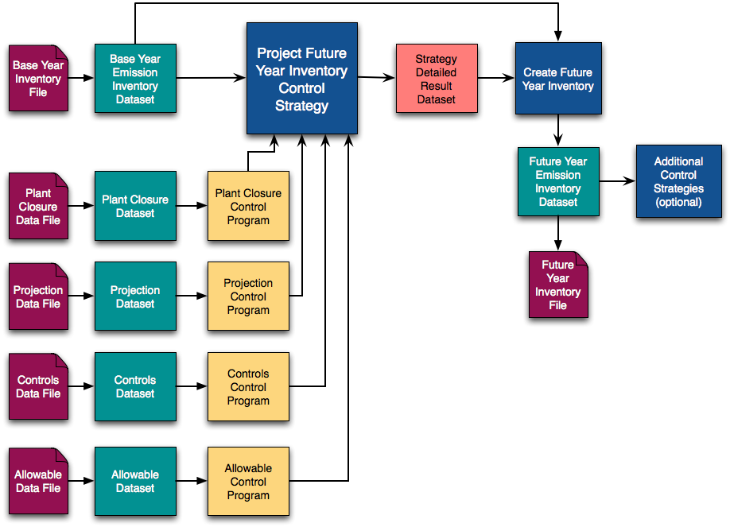{#fig:projection_workflow}

One or more base year inventories are imported into the EMF as inventory datasets. Files containing the control program data such as plant closures, growth or reduction factors (projection data), controls, and caps and replacements (allowable data) are also imported as datasets.

For each growth or control dataset, the user creates a Control Program. A Control Program specifies the type of program (i.e. plant closures, control measures to apply, growth or reduction factors) and the start and end date of the program. The dataset associated with the program identifies the inventory sources affected by the program and the factors to apply (e.g. the control efficiency of the associated control measure or the expected emissions reduction in the future year).

To create a Project Future Year Inventory control strategy, the user selects the input base year inventories and control programs to consider. The primary output of the control strategy is a Strategy Detailed Result dataset for each input inventory. The Strategy Detailed Result dataset consists of pairings of emission sources and control programs, each of which contains information about the emission adjustment that would be achieved if the control program were to be applied to the source.

The Strategy Detailed Result dataset can optionally be combined with the input inventory to create a future year inventory dataset. This future year inventory dataset can be exported to an inventory data file. The future year inventory dataset can also be used as input for additional control strategies to generate controlled future year emissions.

<!--- ### Cost Estimates ###

Along with estimating the emissions reductions for the future year, CoST will also estimate the costs associated with the controls applied. When applying control factors, CoST will search the Control Measure Database for the control measure that most closely matches the raw control packet data. If a probable measure is found for a source, the cost equations or cost-per-ton factor associated with the control measure will be used to estimate the cost of applying the control. -->

## Control Programs ##

### Introduction ###

The Project Future Year Inventory strategy uses various types of Control Programs to specify the expected changes to emissions between the base year and the future year. Each Control Program has a start date indicating when the control program takes effect, an optional end date, and an associated dataset which contains the program-specific factors to apply and source-matching information. There are four major types of control programs: Plant Closure, Projection, Control, and Allowable.

#### Plant Closure ####

A Plant Closure Control Program identifies specific plants to close. Each record in the plant closure dataset consists of:

* Some combination of source matching information
    * Region code (country/state/county)
    * Point source characteristics (facility ID, unit ID, release point ID, etc.)
* The effective date for the plant to close

Using the source matching options, you can specify particular stacks to close or close whole plants.

#### Projection ####

A Projection Control Program is used to apply growth or reduction factors to inventory emissions. Each record in the projection dataset consists of:

* Some combination of source matching information
    * Region code (country/state/county)
    * SCC
    * Point source characteristics (facility ID, unit ID, release point ID, etc.)
    * SIC, MACT, and/or NAICS
* An optional pollutant name for pollutant-specific projection factors
* The projection factor specified as a fraction. For example, a value of 1.2 means that emissions will increase 20%. Annual or monthly projection factors can be used.

#### Control ####

A Control-type Control Program is used to apply replacement or add-on control measures to inventory emissions. Each record in the control dataset consists of:

* Some combination of source matching information
    * Region code (country/state/county)
    * SCC
    * Point source characteristics (facility ID, unit ID, release point ID, etc.)
    * SIC, MACT, and/or NAICS
* An optional pollutant name for pollutant-specific controls
* The control measure abbreviation for matching to the CMDB
* A flag to indicate if the control is a replacement vs. an add-on control
* The control efficiency, rule effectiveness, and rule penetration values OR a combined percent reduction value. Annual or monthly reduction factors can be used.
* The compliance date indicating when the control can be applied to sources

#### Allowable ####

An Allowable Control Program is used to apply caps on inventory emissions or replacements to inventory emissions. Allowable Control Programs are applied after the other types of programs so that the impacts of the other programs can be accounted for when checking for emissions over the specified cap. Each record in the allowable dataset consists of:

* Some combination of source matching information
    * Region code (country/state/county)
    * SCC
    * Point source characteristics (facility ID, unit ID, release point ID, etc.)
    * SIC, MACT, and/or NAICS
* The pollutant name; this is optional but in most cases, the cap or replacement will be pollutant-specific
* The allowable emissions cap value OR replacement value; either value is specified in tons/day
* The compliance date indicating when the cap or replacement can be applied to sources

### Control Program Datasets ###

Each Control Program is associated with a dataset. [@Tbl:control_program_type_table] lists the EMF dataset types corresponding to each Control Program type. The Control Program datasets were designed to be compatible with the [SMOKE GCNTL (growth and controls) input file][smoke_gcntl] which uses the term "packet" to refer to the different types of control program data; the same term is used in the EMF.

[smoke_gcntl]: https://www.cmascenter.org/smoke/documentation/4.5/html/ch08s06.html#sect_input_gcntl {target="_blank"}

Control Program Type|Dataset Types
-|-
Allowable|Allowable Packet, Allowable Packet Extended
Control|Control Packet, Control Packet Extended
Plant Closure|Plant Closure Packet (CSV), Facility Closure Extended
Projection|Projection Packet, Projection Packet Extended
: Control Program Types and Datasets {#tbl:control_program_type_table}

The dataset formats named with "Extended" add additional options beyond the SMOKE-based formats. These extended formats use the same source information fields as Flat File 2010 inventories and also support monthly factors in addition to annual values. [@Tbl:ext_format_mapping_table] shows how the column names map between the extended and non-extended dataset formats.

Extended Format Column Name|Non-Extended Format Column Name|Description
-|-|-
REGION\_CD|FIPS|State/county code, or state code
FACILITY\_ID|PLANTID|Plant ID for point sources
UNIT\_ID|POINTID|Point ID for point sources
REL\_POINT\_ID|STACKID|Stack ID for point sources
PROCESS\_ID|SEGMENT|Segment for point sources
MACT|REG\_CD|Maximum Achievable Control Technology (MACT) code
: Extended Format Mapping {#tbl:ext_format_mapping_table}

The file formats for each control program dataset are listed in [@Sec:appendix_a].

#### Source Matching Hierarchy ####

When building Control Program dataset records, you can use various combinations of source matching information depending on the level of specificity needed. For example, you could create a projection factor that applies to all sources with a particular SCC in the inventory regardless of geographic location. In this case, the SCC code would be specified but the region code would be left blank. If you need a different factor for particular regions, you can add additional records that specify both the SCC and region code with the more specific factor.

When matching the Control Program dataset records to inventory sources, more specific matches will be used over less specific ones. In the case of ties, a defined hierarchy is used to rank the matches. This hierarchy is listed in [@Sec:appendix_b].

### Control Program Manager ###

The main interface for creating and editing Control Programs is the Control Program Manager. To open the Control Program Manager, select **Control Programs** from the main **Manage** menu at the top of the EMF window. A list of existing control programs is displayed as shown in [@Fig:cp_manager].

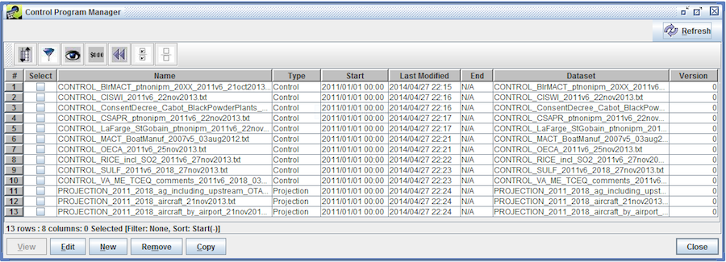{#fig:cp_manager}

[@Tbl:control_program_manager_columns_table] describes each column in the Control Program Manager window.

Column|Description
-|----
Name|A unique name or label for the control program.
Type|The type of this control program. Options are Allowable, Control, Plant Closure, or Projection.
Start|The start date of the control program. Used when selecting control programs to apply in a strategy's target year.
Last Modified|The most recent date and time when the control program was modified.
End|The end date of the control program. Used when selecting control programs to apply in a strategy's target year. If not specified, N/A will be displayed.
Dataset|The name of the dataset associated with the control program.
Version|The version of the associated dataset that the control program will use.
: Control Program Manager Columns {#tbl:control_program_manager_columns_table}

Using the Control Program Manager, you can select the control programs you want to work with by clicking the checkboxes in the Select column and then perform various actions related to those control programs. [@Tbl:control_program_manager_actions_table] lists the buttons along the bottom of the Control Program Manager window and describes the action for each button.

Command|Description
-|----
View|Not currently active.
Edit|Opens an Edit Control Program window for each of the selected control programs.
New|Opens a New Control Program window to create a new control program.
Remove|Deletes the selected control programs. Only the control program's creator or an EMF administrator can delete a control program.
Copy|Creates a copy of each selected control program with a unique name.
Close|Closes the Control Program Manager window.
: Control Program Manager Actions {#tbl:control_program_manager_actions_table}

### Creating a New Control Program ###

From the Control Program Manager, click the **New** button at the bottom of the window. The window to create a new control program is displayed as shown in [@Fig:cp_new].

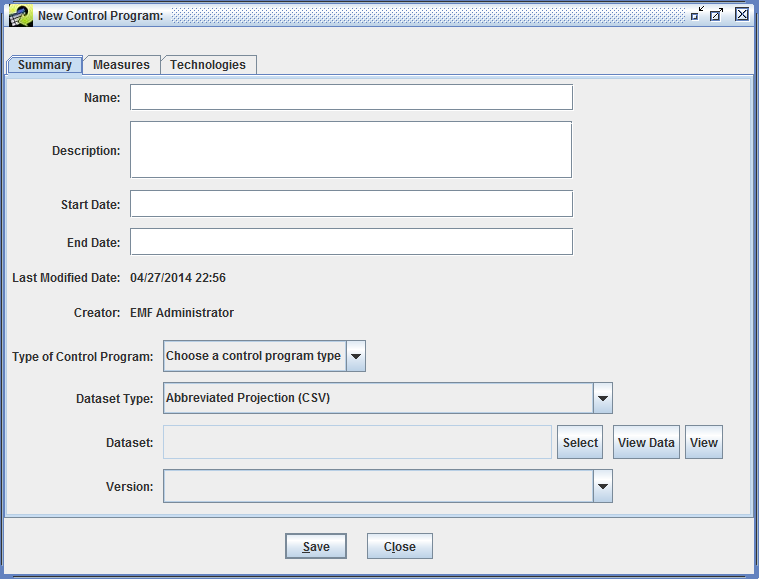{#fig:cp_new}

On the Summary tab, you can enter the details of the control program. [@Tbl:control_program_summary_table] describes each field.

Field|Description
-|----
Name|Enter a unique name or label for this control program; required.
Description|Enter a description of the control program; optional.
Start Date|The start date for the control program formatted as MM/DD/YYYY; required. When running a Project Future Year Inventory strategy, only control programs whose start date falls within the strategy's Target Year will be considered.
End Date|The end date for the control program formatted as MM/DD/YYYY; optional. If specified, the end date will be compared to the control strategy's Target Year when deciding which control programs to consider.
Last Modified Date|Last modification date and time of the control program; automatically set by the EMF.
Creator|The EMF user who created the control program; automatically set by the EMF.
Type of Control Program|Select from the list of four control program types: Allowable, Control, Plant Closure, or Projection; required.
Dataset Type|Select the dataset type corresponding to the dataset you want to use for this control program.
Dataset|Click the **Select** button to open the dataset selection window as shown in [@Fig:cp_dataset_selection]. Only datasets matching the selected dataset type are displayed. Select the dataset you want to use for this Control Program and click the **OK** button. You can use the **Dataset name contains** search box to narrow down the list of datasets if needed.
Version|After you've selected the dataset, the Version pull-down lists the available versions of the dataset with the default version selected. You can select a different version of the dataset if appropriate.
: Control Program Summary Tab {#tbl:control_program_summary_table}

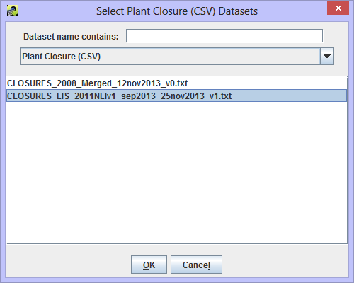{#fig:cp_dataset_selection}

[@Fig:cp_new_complete] shows the New Control Program window with the data fields filled out. Once you've finished entering the details of the new control program, click the **Save** button to save the control program.

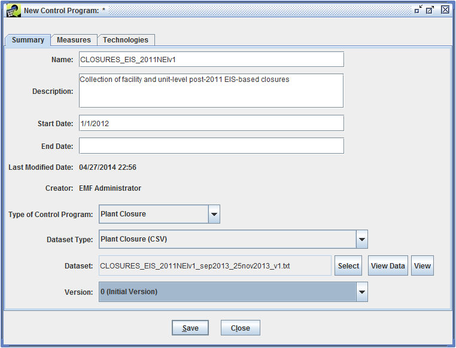{#fig:cp_new_complete}

Once a dataset has been selected for a control program, the **View Data** and **View** buttons to the right of the dataset name will open the Data Viewer ([@Fig:data_viewer]) or Dataset Properties View ([@Sec:dataset_properties_section]) for the selected dataset.

#### Control Measures and Technologies ####

The Measures and Technologies tabs in the Edit Control Program window are only used when working with Control-type Control Programs.

When a Control-type control program is used in a Project Future Year Inventory control strategy, CoST will try to match each applied control packet record to a control measure in the Control Measure Database in order to estimate associated costs. You can specify a list of probable control measures or control technologies when you define the control program to limit the potential matches.

In the Edit Control Program window, the Measures tab ([@Fig:cp_measures_tab]) lets you specify the control measures to include.

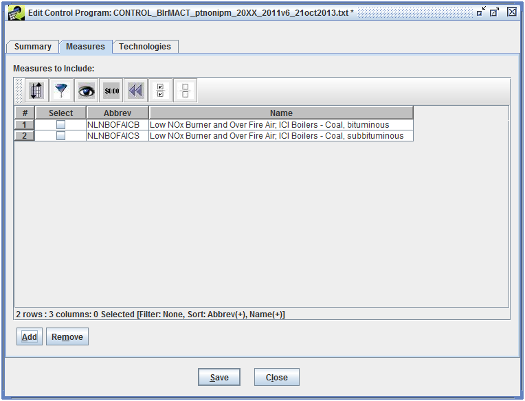{#fig:cp_measures_tab}

Click the **Add** button to open the Select Control Measures window. As shown in [@Fig:cp_select_measures], the Select Control Measures window lists all the defined control measures including the control measure's name, abbreviation, and major pollutant.

{#fig:cp_select_measures}

You can use the filtering and sorting options to find the control measures of interest. Select the control measures you want to add then click the **OK** button to add the control measures to the Control Program and return to the Edit Control Program window.

To remove control measures, select the appropriate control measures, then click the **Remove** button.

The Technologies tab in the Edit Control Program window ([@Fig:cp_technologies_tab]) allows you to specify particular control technologies associated with the control program.

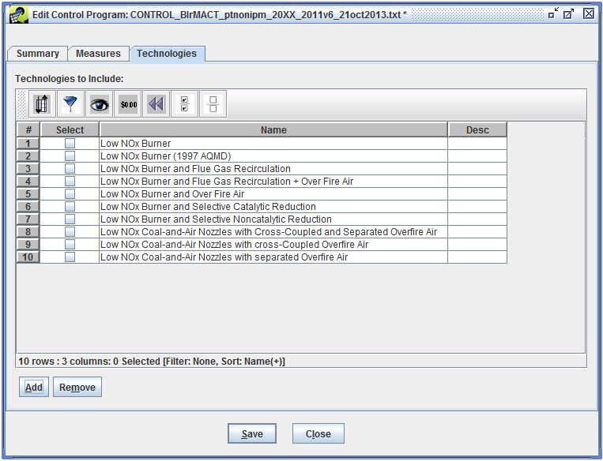{#fig:cp_technologies_tab}

Click the **Add** button to open the Select Control Technologies window. As shown in [@Fig:cp_select_technologies], the Select Control Technologies window lists all the defined control technologies by name and description.

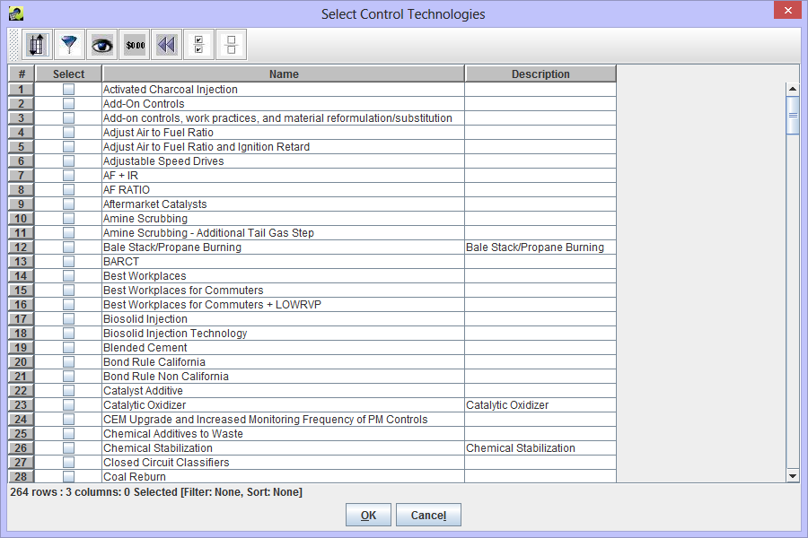{#fig:cp_select_technologies}

You can use the filtering and sorting options to find the control technologies of interest. Select the control technologies you want to add then click the **OK** button to add the control technologies to the Control Program and return to the Edit Control Program window.

To remove control technologies, select the appropriate control technologies, then click the **Remove** button.

## Creating a Project Future Year Inventory Control Strategy ##

To create a Project Future Year Inventory Control Strategy, first open the Control Strategy Manager by selecting **Control Strategies** from the main **Manage** menu. [@Fig:cs_manager] shows the Control Strategy Manager window.

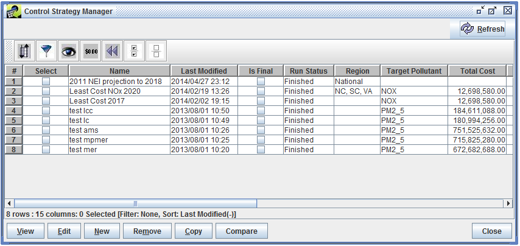{#fig:cs_manager}

Click the **New** button to start creating the control strategy. You will first be prompted to enter a unique name for the control strategy as shown in [@Fig:cs_new_name].

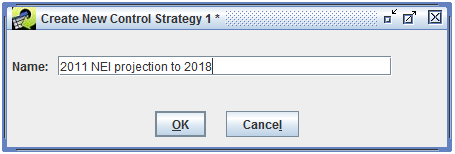{#fig:cs_new_name}

Almost all of the strategy parameters for the Project Future Year Inventory strategy have the same meaning and act in the same way as they do for the Maximum Emissions Reduction strategy, such as cost year, inventory filter, and county dataset. This section focuses on parameters or inputs that differ for the Project Future Year Inventory strategy type.

### Summary Information ###

The Summary tab displays high-level parameters about the control strategy 
([@Fig:pfyi_summary_tab]).

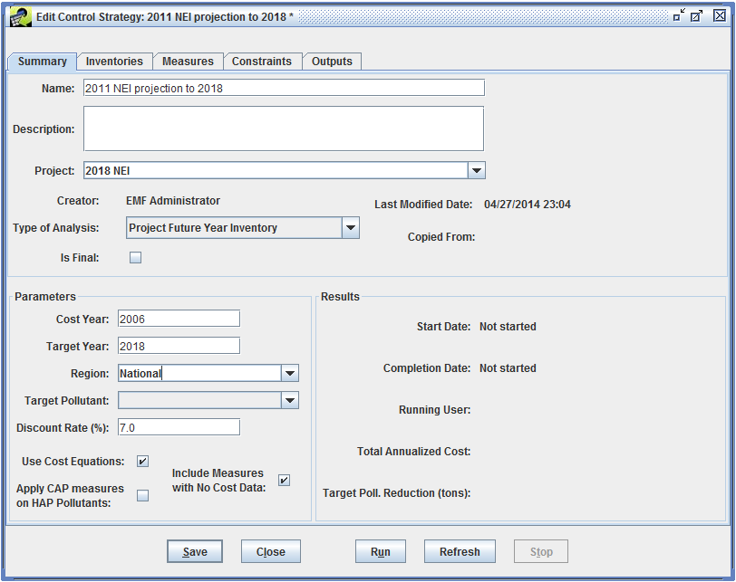{#fig:pfyi_summary_tab}

Parameters of interest for the Project Future Year Inventory strategy:

* **Type of Analysis**: Project Future Year Inventory

* **Target Year**: The target year represents the future year to which you are projecting the inventory. The target year is used when building the various cutoff dates (control compliance and plant closure effective dates) to evaluate whether or not certain control programs are applied to an inventory.

* **Target Pollutant**: The target pollutant is not used for the Project Future Year Inventory control strategy.

### Inventories ###

The Project Future Year Inventory strategy can use inventories in the following dataset types: Flat File 2010 Point, Flat File 2010 Nonpoint, ORL point, ORL nonpoint, ORL nonroad, or ORL nonroad. Multiple inventories can be processed in a single strategy. Note that multiple versions of the inventories may be available, and the appropriate version of each inventory must be selected prior to running a control strategy.

### Control Programs ###

The Programs tab in the Edit Control Strategy window is used to select which control programs should be considered in the strategy. [@Fig:pfyi_programs_tab] shows the Programs tab for an existing control strategy.

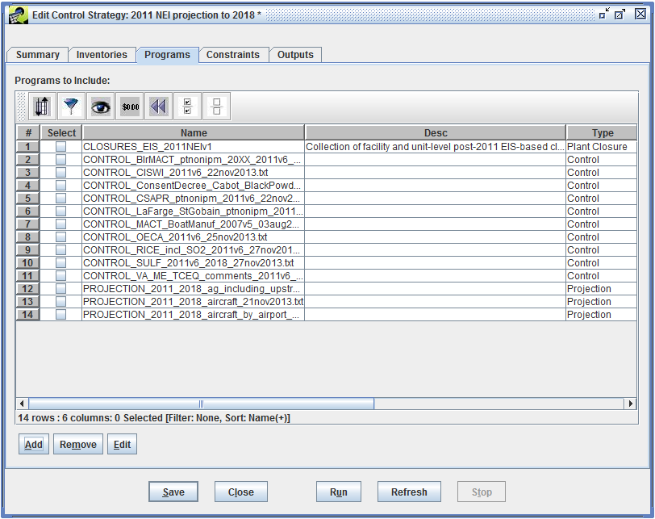{#fig:pfyi_programs_tab}

Click the **Add** button to bring up the Select Control Programs window as shown in [@Fig:pfyi_select_programs].

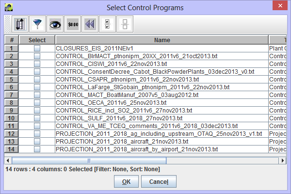{#fig:pfyi_select_programs}

In the Select Control Programs window, you can select which control programs to use in your PFYI control strategy. The table displays the name, control program type, and description for all defined control programs. You can use the filter and sorting options to help find the control programs you are interested in. Select the checkbox next to each control program to add and then click the **OK** button to return to the Programs tab.

To remove control programs from the strategy, select the programs to remove and then click the **Remove** button. The **Edit** button will open an Edit Control Program window for each of the selected control programs.

More than one of the same type of control program can be added to a strategy. For example, you could add three Plant Closure Control Programs: Cement Plant Closures, Power Plant Closures, and Boiler Closures. All three of these control programs would be evaluated and a record of the evaluation would be stored in the Strategy Detailed Result. If there happen to be multiple Projection, Control, or Allowable Type Control Programs added to a strategy, packets of the same type are merged into one packet during the matching analysis so that no duplicate source-control-packet pairings are created. Duplicate records will be identified during the run process and the user will be prompted to remove duplicates before the core algorithm performs the projection process.

### Constraints ###

[@Fig:pfyi_constraints_tab] shows the Constraints tab for a Project Future Year Inventory strategy. The only constraint used by PFYI strategies is a strategy-specific constraint named Minimum Percent Reduction Difference for Predicting Controls (%). This constraint determines whether a predicted control measure has a similar percent reduction to the percent reduction specified in the Control Program Control Packet.

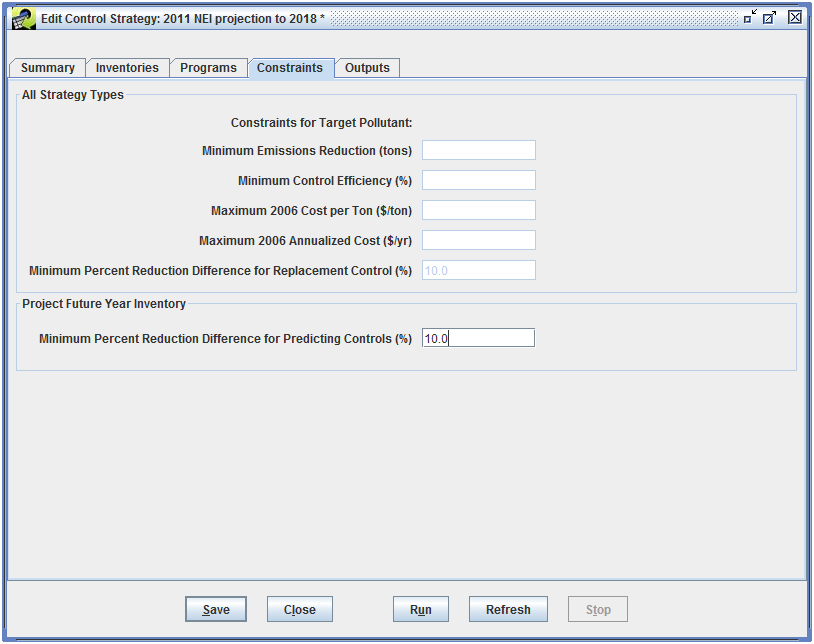{#fig:pfyi_constraints_tab}

## Running the Control Strategy ##

To run the Project Future Year Inventory control strategy, click the **Run** button at the bottom of the Edit Control Strategy window. The EMF will begin running the strategy. Check the Status window ([@Sec:status_window_section]) to monitor the status of the run.

### Control Program Application Order ###

The Project Future Year Inventory strategy processes Control Programs in the following order:

1. Plant Closure control programs
2. Projection control programs
3. Control type control programs
4. Allowable control programs

The Control analysis is dependent on the Projection analysis; likewise, the Allowable analysis is dependent on the Projection and Control analyses. The adjusted source emission values need to be carried along from each analysis step to make sure each portion of the analysis applies the correct adjustment factor. For example, a source could be projected, and also controlled, in addition to having a cap placed on the source. Or, a source could have a projection or control requirement, or perhaps just a cap or replacement requirement.

## Outputs from the Control Strategy ##

### Strategy Detailed Result ###

The main output for each control strategy is a table called the Strategy Detailed Result. This dataset consists of pairings of emission sources and control programs, each of which contains information about the emission adjustment that would be achieved if the control program were to be applied to the source, along with the cost of application. The Strategy Detailed Result table can be used with the original input inventory to produce, in an automated manner, a controlled emissions inventory that reflects implementation of the strategy; this inventory includes information about the control programs that have been applied to the controlled sources. The controlled inventory can then be directly input to the SMOKE modeling system to prepare air quality model-ready emissions data. In addition, comments are placed at the top of the inventory file to indicate the strategy that produced it and the settings of the high-level parameters that were used to run the strategy.

The columns in the Strategy Detailed Result dataset are described in [@Sec:appendix_c], [@Tbl:strategy_detailed_result_columns_table].

### Strategy Messages ###

In additional to the Strategy Detailed Result dataset, CoST automatically generates a Strategy Messages dataset. The Strategy Messages output provides useful information that is gathered while the strategy is running. This output can store ERROR and WARNING types of messages. If an ERROR is encountered during the prerun validation process, the strategy run will be canceled and the user can peruse this dataset to see what problems the strategy has (e.g., duplicate packet records).

The columns in the Strategy Messages dataset are described in [@Sec:appendix_c], [@Tbl:strategy_messages_columns_table].

## Creating Future Year Inventories ##

After the Project Future Year Inventory control strategy has been run, you can create a future year emissions inventory. From the Outputs tab, select the Strategy Detailed Result for the base year inventory and select the **Controlled Inventory** radio button as shown in [@Fig:cs_create_inv].

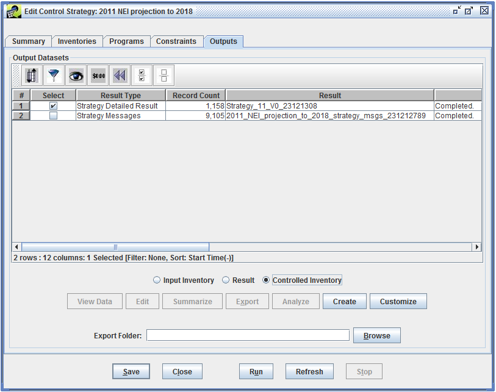{#fig:cs_create_inv}

Click the **Create** button to begin creating the future year inventory. Monitor the Status window for messages and to see when the process is complete.

The future year inventory will automatically be added as a dataset matching the dataset type of the base year inventory. The new dataset's description will contain comments indicating the strategy used to produce it and the high-level settings for that strategy.

*For ORL Inventories:*

For the sources that were controlled, CoST fills in the CEFF (control efficiency), REFF (rule effectiveness), and RPEN (rule penetration) columns based on the Control Packets applied to the sources. The CEFF column is populated differently for a replacement Control Packet record than for an add-on Control Packet record. For a replacement control, the CEFF column is populated with the percent reduction of the replacement control. For an add-on control, the CEFF column is populated with the overall combined percent reduction of the add-on control plus the preexisting control, using the following formula:

(1 – {[1 – (existing percent reduction / 100)] x [1 – (add-on percent reduction / 100)]}) x 100

For both types of Control Packet records (add-on or replacement), the REFF and RPEN are defaulted to 100 since the CEFF accounts for any variation in the REFF and RPEN by using the percent reduction instead of solely the CEFF.

Note that only Control Packets (not Plant Closure, Projection, or Allowable packets) will be used to help populate the columns discussed above.

*For Flat File 2010 Inventories:*

For the sources that were controlled, CoST fills in the annual (ANN\_PCT\_RED) and monthly percent reduction (JAN\_PCT\_RED) columns based on the values for the Control Packet that was applied to the sources. The CEFF column is populated differently for a replacement control than for an add-on control. For a replacement control, the CEFF column is populated with the percent reduction of the replacement control. For an add-on control, the CEFF column is populated with the overall combined percent reduction of the add-on control plus the preexisting control, using the following formula:

(1 – {[1 – (existing percent reduction / 100)] x [1 – (add-on percent reduction / 100)]}) x 100

For both types of measures, the REFF and RPEN values are defaulted to 100, because the CEFF accounts for any variation in the REFF or RPEN by using the percent reduction instead of the CEFF.

CoST also populates several additional columns toward the end of the ORL and Flat File 2010 inventory rows that specify information about measures that it has applied. These columns are:

* CONTROL MEASURES: An ampersand (&amp;) separated list of control measure abbreviations that correspond to the control measures that have been applied to the given source.

* PCT REDUCTION: An ampersand-separated list of percent reductions that have been applied to the source, where percent reduction = CEFF x REFF x RPEN.

* CURRENT COST: The annualized cost for that source for the most recent control strategy that was applied to the source.

* TOTAL COST: The total cost for the source across all measures that have been applied to the source.

## Control Program Dataset Formats ## {#sec:appendix_a}

### Plant Closure Packet ###

The format of the Plant Closure Packet described in [@Tbl:plant_closure_format_table] is based on the CSV format. The first row of this dataset file must contain the column header definition as defined in Line 1 of [@Tbl:plant_closure_format_table]. All the columns specified here must be included in the dataset import file.

Line|Position|Description
-|-|--------
1|A..H|Column header definition - must contain the following columns: fips,plantid,pointid,stackid,segment,plant,effective\_date,reference
2+|A|Country/State/County code, required
||B|Plant Id for point sources, optional; blank, zero, or -9 if not specified; leave blank for nonpoint inventories
||C|Point Id for point sources, optional; blank, zero, or -9 if not specified; leave blank for nonpoint inventories
||D|Stack Id for point sources, optional; blank, zero, or -9 if not specified; leave blank for nonpoint inventories
||E|Segment for point sources, optional; blank, zero, or -9 if not specified; leave blank for nonpoint inventories
||F|Plant name or description, for point sources, optional; leave blank for nonpoint inventories
||G|Effective Date, the effective date for the plant closure to take place. When the closure effective cutoff is after this effective date, the plant will not be closed. A blank value is assumed to mean that the sources matched from this record will be closed regardless. The strategy target year is the year used in the closure effective cutoff date check. See [@Sec:effective_date_section] for more information.
||H|Reference, contains reference information for closing the plant
: Plant Closure Packet Data Format {#tbl:plant_closure_format_table}

### Facility Closure Extended ####

The Facility Closure Extended format ([@Tbl:facility_closure_format_table]) is similar to the Plant Closure Packet but uses column names consistent with the Flat File 2010 inventories. The format also contains additional columns that may be used in the future to further enhance the inventory source matching capabilities: COUNTRY\_CD, TRIBAL\_CODE, SCC, and POLL.

Column|Description
-|----
Country\_cd|Country code, optional; currently not used in matching process
Region\_cd|State/county code, or state code with blank for county, or zero (or blank or -9) for all state/county or state codes
Facility\_id|Facility ID for point sources, optional; blank, zero, or -9 if not specified; leave blank for nonpoint inventories
Unit\_id|Unit ID for point sources, optional; blank, zero,or -9 if not specified; leave blank for nonpoint inventories
Rel\_point\_id|Release Point ID for point sources, optional; blank, zero, or -9 if not specified; leave blank for nonpoint inventories
Process\_id|Process ID for point sources, optional; blank, zero, or -9 if not specified; leave blank for nonpoint inventories
Facility\_name|Facility name or description, for point sources, optional; leave blank for nonpoint inventories
Tribal\_code|Tribal code, optional; currently not used in matching process
SCC|8- or 10-digit SCC, optional; blank, zero, or -9 if not an SCC-specific closure; currently not used in matching process
Poll|Pollutant name, optional; blank, zero, or -9 if not a pollutant-specific closure; currently not used in matching process
Effective\_date|Effective Date, the effective date for the plant closure to take place. When the closure effective cutoff is after this effective date, the plant will not be closed. A blank value is assumed to mean that the sources matched from this record will be closed regardless. The strategy target year is the year used in the closure effective cutoff date check. See [@Sec:effective_date_section] for more information.
Comment|Information about this record and how it was produced and entered by the user.
: Facility Closure Extended Data Format {#tbl:facility_closure_format_table}

### Projection Packet ###

The format of the Projection Packet ([@Tbl:projection_format_table]) is based on the SMOKE file format as defined in the [SMOKE User's Manual][PROJ]. One modification was made to enhance this packet's use in CoST: the unused SMOKE column at position K is now used to store the NAICS code.

Line|Position|Description
-|-|--------
1|A|/PROJECTION \<4-digit from year\> \<4-digit to year\>/
2+|A|# Header entry. Header is defined by the # as the first character on the line
3+|A|Country/State/County code, or Country/state code with blank for county, or zero (or blank or -9) for all Country/State/County or Country/state codes
||B|8 or 10-digit SCC, optional, blank, zero, or -9 if not a SCC-specific projection
||C|Projection factor [enter number on fractional basis; e.g., enter 1.2 to increase emissions by 20%]
||D|Pollutant , blank, zero, or -9 if not a pollutant-specific projection
||E|Standard Industrial Category (SIC), optional, blank, zero, or -9 if not a SIC- specific projection
||F|Maximum Achievable Control Technology (MACT) code, optional, blank, zero, or -9 if not a MACT-specific projection
||G|Plant Id for point sources, optional; blank, zero, or -9 if not specified; leave blank for nonpoint inventories
||H|Point Id for point sources, optional; blank, zero, or -9 if not specified; leave blank for nonpoint inventories
||I|Stack Id for point sources, optional; blank, zero, or -9 if not specified; leave blank for nonpoint inventories
||J|Segment for point sources, optional; blank, zero, or -9 if not specified; leave blank for nonpoint inventories
||K|North American Industry Classification (NAICS) Code, optional; blank, zero, or -9 if not a NAICS-specific projection
||L|Characteristic 5 (blank for ORL inventory input format), optional
3|A|/END/
: Projection Packet Data Format {#tbl:projection_format_table}

### Projection Packet Extended ###

The format of the Projection Packet Extended ([@Tbl:projection_ext_format_table]) dataset is not based on the SMOKE format. It is based on the EMF Flexible File Format, which is based on the CSV-based format. This new format uses column names that are aligned with the Flat File 2010 dataset types in the EMF system. The format also supports monthly projection factors in addition to annual projection factors. For example, instead of using the FIPS code, the new format uses the REGION\_CD column, and instead of PLANTID the new format uses FACILITY\_ID. The appropriate mapping between the old and new formats is described in [@Tbl:ext_format_mapping_table]. The new format also contains additional columns that will be used in the future to help further enhance the inventory source matching capabilities, these include COUNTRY\_CD, TRIBAL\_CODE, CENSUS\_TRACT\_CD, SHAPE\_ID, and EMIS\_TYPE.

Column|Description
-|----
Country\_cd|Country code, optional; currently not used in matching process
Region\_cd|State/county code, or state code with blank for county, or zero (or blank or -9) for all state/county or state codes
Facility\_id|Facility ID (aka Plant ID in ORL format) for point sources, optional; blank, zero, or -9 if not specified; leave blank for nonpoint inventories
Unit\_id|Unit ID (aka Point ID for ORL format) for point sources, optional; blank, zero,or -9 if not specified; leave blank for nonpoint inventories
Rel\_point\_id|Release Point ID (aka Stack ID in ORL format) for point sources, optional; blank, zero, or -9 if not specified; leave blank for nonpoint inventories
Process\_id|Process ID (aka Segment on ORL format) for point sources, optional; blank, zero, or -9 if not specified; leave blank for nonpoint inventories
Tribal\_code|Tribal code, optional; currently not used in matching process
Census\_tract\_cd|Census tract ID, optional; currently not used in matching process
Shape\_id|Shape ID, optional; currently not used in matching process
Emis\_type|Emission type, optional; currently not used in matching process
SCC|8- or 10-digit SCC, optional; blank, zero, or -9 if not an SCC-specific control
Poll|Pollutant;, blank, zero, or -9 if not a pollutant-specific projection
Reg\_code|Regulatory code (aka Maximum Achievable Control Technology code), optional; blank, zero, or -9 if not a regulatory code-specific control
SIC|Standard Industrial Category (SIC), optional; blank, zero, or -9 if not an SIC- specific control
NAICS|North American Industry Classification (NAICS) code, optional; blank, zero, or -9 if not a NAICS-specific control
Ann\_proj\_factor|The annual projection factor used to adjust the annual emission of the inventory. The number is stored as a fraction rather than a percentage; e.g., enter 1.2 to increase emissions by 20% (double precision). The annual projection factor is also used as a default for monthly-specific projection factors when they are not specified. If you do not want to specify a monthly-specific projection factor value, then also make sure not to specify an annual projection factor, which could be used as a default.
Jan\_proj\_factor|The projection factor used to adjust the monthly January emission of the inventory (the jan\_value column of the FF10 inventory). The number is stored as a fraction rather than a percentage; e.g., enter 1.2 to increase emissions by 20% (double precision). If no January projection factor is specified, the annual projection factor value will be used as a default. The monthly-specific projection factor fields are not used on the older ORL inventory formats; only the annual projection factor field will be used on these older formats.
Feb\_proj\_factor|Analogous to the January projections factor, above.
...|...
Dec\_proj\_factor|The projection factor used to adjust the monthly December emission of the inventory (the dec\_value column of the FF10 inventory). The number is stored as a fraction rather than a percentage; e.g., enter 1.2 to increase emissions by 20% (double precision). If no December projection factor is specified, the annual projection factor value will be used as a default. The monthly-specific projection factor fields are not used on the older ORL inventory formats; only the annual projection factor field will be used on these older formats.
Comment|Information about this record and how it was produced and entered by the user.
: Projection Packet Extended Data Format {#tbl:projection_ext_format_table}

### Control Packet ###

The format of the Control Packet ([@Tbl:control_format_table]) is based on the SMOKE file format as defined in the [SMOKE User's Manual][CONTROL]. Several modifications were made to enhance the packet's use in CoST:

1. The unused SMOKE column at position D is now used to store the primary control measure abbreviation; if one is specified, this measure is used on any source that was matched with those control packet entries.
2. The unused SMOKE column at position P is used to store the compliance date the control can be applied to sources.
3. The unused SMOKE column at position Q is used to store the NAICS code.

Line|Position|Description
-|-|--------
1|A|/CONTROL/
2+|A|# Header entry. Header is indicated by use of "#" as the first character on the line.
3+|A|Country/state/county code, or country/state code with blank for county, or zero (or blank or -9) for all country/state/county or country/state codes
||B|8- or 10-digit SCC, optional; blank, zero, or -9 if not an SCC-specific control
||C|Pollutant; blank, zero, or -9 if not a pollutant-specific control
||D|Primary control measure abbreviation; blank, zero, or -9 applies to all measure in the Control Measure Database
||E|Control efficiency; value should be a percent (e.g., enter 90 for a 90% control efficiency)
||F|Rule effectiveness; value should be a percent (e.g., enter 50 for a 50% rule effectiveness)
||G|Rule penetration rate; value should be a percent (e.g., enter 80 for a 80% rule penetration)
||H|Standard Industrial Category (SIC); optional, blank, zero, or -9 if not an SIC- specific control
||I|Maximum Achievable Control Technology (MACT) code; optional, blank, zero, or -9 if not a MACT-specific control
||J|Application control flag: Y = control is applied to inventory N = control will not be used
||K|Replacement flag: A = control is applied in addition to any controls already on source R = control replaces any controls already on the source
||L|Plant ID for point sources, optional; blank, zero, or -9 if not specified; leave blank for nonpoint inventories
||M|Point ID for point sources, optional; blank, zero, or -9 if not specified; leave blank for nonpoint inventories
||N|Stack ID for point sources, optional; blank, zero, or -9 if not specified; leave blank for nonpoint inventories
||O|Segment for point sources, optional; blank, zero, or -9 if not specified; leave blank for nonpoint inventories
||P|Compliance Date. The compliance date on which a control can be applied to sources; prior to this date, the control will not be applied. A blank value is assumed to mean that the control is within the compliance date and the sources matched from this record will be controlled regardless. The strategy target year is the year that is used in the control compliance cutoff date check. See [@Sec:effective_date_section] for more information.
||Q|North American Industry Classification (NAICS) Code, optional; blank, zero, or -9 if not a NAICS-specific control
4|A|/END/
: Control Packet Data Format {#tbl:control_format_table}

### Control Packet Extended ###

The format of the Control Packet Extended ([@Tbl:control_ext_format_table]) dataset is not based on the SMOKE format. It is based on the EMF Flexible File Format, which is based on the CSV-based format. This new format uses column names that are aligned with the Flat File 2010 dataset types in the EMF system. The format also contains additional columns that will be used in the future to help further enhance the inventory source matching capabilities: COUNTRY\_CD, TRIBAL\_CODE, CENSUS\_TRACT\_CD, SHAPE\_ID, and EMIS\_TYPE.

Column|Description
-|----
Country\_cd|Country code, optional; currently not used in matching process
Region\_cd|State/county code, or state code with blank for county, or zero (or blank or -9) for all state/county or state codes
Facility\_id|Facility ID (aka Plant ID in ORL format) for point sources, optional; blank, zero, or -9 if not specified; leave blank for nonpoint inventories
Unit\_id|Unit ID (aka Point ID for ORL format) for point sources, optional; blank, zero, or -9 if not specified; leave blank for nonpoint inventories
Rel\_point\_id|Release Point ID (aka Stack ID in ORL format) for point sources, optional; blank, zero, or -9 if not specified; leave blank for nonpoint inventories
Process\_id|Process ID (aka Segment on ORL format) for point sources, optional; blank, zero, or -9 if not specified; leave blank for nonpoint inventories
Tribal\_code|Tribal code, optional; currently not used in matching process
Census\_tract\_id|Census tract ID, optional; currently not used in matching process
Shape\_id|Shape ID, optional; currently not used in matching process
Emis\_type|Emission type, optional; currently not used in matching process
SCC|8- or 10-digit SCC, optional; blank, zero, or -9 if not an SCC-specific control
Poll|Pollutant;, blank, zero, or -9 if not a pollutant-specific control
Reg\_code|Regulatory code (aka Maximum Achievable Control Technology code), optional; blank, zero, or -9 if not a regulatory code-specific control
SIC|Standard Industrial Category (SIC), optional; blank, zero, or -9 if not an SIC-specific control
NAICS|North American Industry Classification (NAICS) code, optional; blank, zero, or -9 if not a NAICS-specific control
Compliance\_Date|Compliance Date. The compliance date on which a control can be applied to sources; prior to this date, the control will not be applied. A blank value is assumed to mean that the control is within the compliance date and the sources matched from this record will be controlled regardless. The strategy target year is the year used in the control compliance cutoff date check. See [@Sec:effective_date_section] for more information.
Application\_control|Application control flag: Y = control is applied to inventory N = control will not be used
Replacement|Replacement flag: A = control is applied in addition to any controls already on source R = control replaces any controls already on the source
Pri\_cm\_abbrev|Primary control measure abbreviation (from the Control Measure Database) that defines the control packet record
Ann\_pctred|The percent reduction of the control (value should be a percent; e.g., enter 90 for a 90% percent reduction) to apply to the annual emission factor; the percent reduction can be considered a combination of the control efficiency, rule effectiveness, and rule penetration (CE * RE/100 * RP/100). The annual percent reduction field is used to reduce annual emission of the inventory (the ann\_value column of the FF10 inventory formats contains the annual emission value). The annual percent reduction is also used as a default for monthly-specific percent reductions when they are not specified. If you do not want to specify a monthly-specific projection factor value, then also make sure not to specify an annual projection factor, which could be used as a default.
Jan\_pctred|The percent reduction of the control to apply to the monthly January emission factor (the jan\_value column of the FF10 inventory). If no January percent reduction is specified, the annual percent reduction value will be used as a default. The monthly-specific percent reduction fields are not used on the older ORL inventory formats; only the annual percent reduction field will be used on these older formats.
Feb\_pctred|Analogous to the January percent reduction, above.
...|...
Dec\_pctred|The percent reduction of the control to apply to the monthly December emission factor (the dec\_value column of the FF10 inventory). If no December percent reduction is specified, the annual percent reduction value will be used as a default. The monthly-specific percent reduction fields are not used on the older ORL inventory formats; only the annual percent reduction field will be used on these older formats.
Comment|Information about this record and how it was produced and entered by the user.
: Control Extended Packet Data Format {#tbl:control_ext_format_table}

### Allowable Packet ###

The format of the Allowable Packet ([@Tbl:allowable_format_table]) is based on the SMOKE file format as defined in the [SMOKE User's Manual][ALLOW]. Two modifications were made to enhance this packet's use in CoST:

1. The unused SMOKE column at position L is now used to store the compliance date that the cap or replacement emission value can be applied to a source.
2. The unused SMOKE column at position M is used to store the NAICS code.

Line|Position|Description
-|-|--------
1|A|/ALLOWABLE/
2+|A|# Header entry. Header is indicated by use of "#" as the first character on the line.
3+|A|Country/state/county code, or country/state code with blank for county, or zero (or blank or -9) for all country/state/county or country/state codes
||B|8- or 10-digit SCC, optional; blank, zero, or -9 if not an SCC-specific cap or replacement
||C|Pollutant; blank, zero, or -9 if not a pollutant-specific control; in most cases, the cap or replacement value will be a pollutant-specific value, and that pollutant's name needs to be placed in this column
||D|Control factor (no longer used by SMOKE or CoST; enter -9 as placeholder)
||E|Allowable emissions cap value (tons/day) (required if no "replace" emissions are given)
||F|Allowable emissions replacement value (tons/day) (required if no "cap" emissions are given)
||G|Standard Industrial Category (SIC), optional; blank, zero, or -9 if not an SIC- specific cap or replacement
||H|Plant ID for point sources, optional; blank, zero, or -9 if not specified; leave blank for nonpoint inventories
||I|Point ID for point sources, optional; blank, zero, or -9 if not specified, leave blank for nonpoint inventories
||J|Stack ID for point sources, optional; blank, zero, or -9 if not specified, leave blank for nonpoint inventories
||K|Segment for point sources, optional; blank, zero, or -9 if not specified, leave blank for nonpoint inventories
||L|Compliance Date. The compliance date on which a cap or replacement entry can be applied to sources; prior to this date, the cap or replacement will not be applied. A blank value is assumed to mean that the cap or replacement is within the compliance date and is available for analysis. See [@Sec:effective_date_section] for more information.
||M|North American Industry Classification (NAICS) Code, optional; blank, zero, or -9 if not a NAICS-specific projection
4|A|/END/
: Allowable Data Format {#tbl:allowable_format_table}

### Effective and Compliance Date Handling ### {#sec:effective_date_section}

For control programs that use an effective date (plant closures) or compliance date (controls), CoST uses the control strategy target year to build a cutoff date to use when determining which programs are in effect. To specify the month and day of the cutoff date (used in combination with the target year), there are two EMF system-level properties. These properties are stored in the emf.properties table and are named `COST_PROJECT_FUTURE_YEAR_EFFECTIVE_DATE_CUTOFF_MONTHDAY` (for effective dates) and `COST_PROJECT_FUTURE_YEAR_COMPLIANCE_DATE_CUTOFF_MONTHDAY` (for compliance dates). To set a cutoff month/day of October 1, the property value would be "10/01".

For a strategy with a target year of 2020 and an effective cutoff month/day of 10/01, the closure effective cutoff date is 10/01/2020.

Closure Record Effective Date|Outcome
-|---
07/01/2013|Effective date is before the cutoff date so all sources matching this record will be closed
blank|All sources matching this record will be closed
11/15/2020|Effective date is after the cutoff date so matching sources will not be closed

## Control Program Source Matching Hierarchy ## {#sec:appendix_b}

[@Tbl:control_packet_hierarchy_table] lists the source matching  combinations, the inventory types the matching criteria can be used for, and the Control Program Packet Types that can use these criteria.

Ranking|Matching Combination|Inventory Types|Control Program Types
-|---|-|---
1|Country/State/County code, plant ID, point ID, stack ID, segment, 8-digit SCC code, pollutant|point|allowable, control, projection, plant closure
2|Country/State/County code, plant ID, point ID, stack ID, segment, pollutant|point|allowable, control, projection, plant closure
3|Country/State/County code, plant ID, point ID, stack ID, pollutant|point|allowable, control, projection, plant closure
4|Country/State/County code, plant ID, point ID, pollutant|point|allowable, control, projection, plant closure
5|Country/State/County code, plant ID, 8-digit SCC code, pollutant|point|allowable, control, projection, plant closure
6|Country/State/County code, plant ID, MACT code, pollutant|point|control, projection
7|Country/State/County code, plant ID, pollutant|point|allowable, control, projection, plant closure
8|Country/State/County code, plant ID, point ID, stack ID, segment, 8-digit SCC code|point|allowable, control, projection, plant closure
9|Country/State/County code, plant ID, point ID, stack ID, segment|point|allowable, control, projection, plant closure
10|Country/State/County code, plant ID, point ID, stack ID|point|allowable, control, projection, plant closure
11|Country/State/County code, plant ID, point id|point|allowable, control, projection, plant closure
12|Country/State/County code, plant ID, 8-digit SCC code|point|allowable, control, projection, plant closure
13|Country/State/County code, plant ID, MACT code|point|control, projection
14|Country/State/County code, plant ID|point|allowable, control, projection, plant closure
15|Country/State/County code, MACT code, 8-digit SCC code, pollutant|point, nonpoint|control, projection
16|Country/State/County code, MACT code, pollutant|point, nonpoint|control, projection
17|Country/State code, MACT code, 8-digit SCC code, pollutant|point, nonpoint|control, projection
18|Country/State code, MACT code, pollutant|point, nonpoint|control, projection
19|MACT code, 8-digit SCC code, pollutant|point, nonpoint|control, projection
20|MACT code, pollutant|point, nonpoint|control, projection
21|Country/State/County code, 8-digit SCC code, MACT code|point, nonpoint|control, projection
22|Country/State/County code, MACT code|point, nonpoint|control, projection
23|Country/State code, 8-digit SCC code, MACT code|point, nonpoint|control, projection
24|Country/State code, MACT code|point, nonpoint|control, projection
25|MACT code, 8-digit SCC code|point, nonpoint|control, projection
26|MACT code|point, nonpoint|control, projection
27|Country/State/County code, NAICS code, 8-digit SCC code, pollutant|point, nonpoint|control, projection
28|Country/State/County code, NAICS code, pollutant|point, nonpoint|control, projection
29|Country/State code, NAICS code, 8-digit SCC code, pollutant|point, nonpoint|control, projection
30|Country/State code, NAICS code, pollutant|point, nonpoint|control, projection
31|NAICS code, 8-digit SCC code, pollutant|point, nonpoint|control, projection
32|NAICS code, pollutant|point, nonpoint|control, projection
33|Country/State/County code, NAICS code, 8-digit SCC code|point, nonpoint|control, projection
34|Country/State/County code, NAICS code|point, nonpoint|control, projection
35|Country/State code, NAICS code, 8-digit SCC code|point, nonpoint|control, projection
36|Country/State code, NAICS code|point, nonpoint|control, projection
37|NAICS code, 8-digit SCC code|point, nonpoint|control, projection
38|NAICS code|point, nonpoint|control, projection
39|Country/State/County code, 8-digit SCC code, 4-digit SIC code, pollutant|point, nonpoint|allowable, control, projection
40|Country/State/County code, 4-digit SIC code, pollutant|point, nonpoint|allowable, control, projection
41|Country/State code, 8-digit SCC code, 4-digit SIC code, pollutant|point, nonpoint|allowable, control, projection
42|Country/State code, 4-digit SIC code, pollutant|point, nonpoint|allowable, control, projection
43|4-digit SIC code, SCC code, pollutant|point, nonpoint|allowable, control, projection
44|4-digit SIC code, pollutant|point, nonpoint|allowable, control, projection
45|Country/State/County code, 4-digit SIC code, SCC code|point, nonpoint|allowable, control, projection
46|Country/State/County code, 4-digit SIC code|point, nonpoint|allowable, control, projection
47|Country/State code, 4-digit SIC code, SCC code|point, nonpoint|allowable, control, projection
48|Country/State code, 4-digit SIC code|point, nonpoint|allowable, control, projection
49|4-digit SIC code, SCC code|point, nonpoint|allowable, control, projection
50|4-digit SIC code|point, nonpoint|allowable, control, projection
51|Country/State/County code, 8-digit SCC code, pollutant|point, nonpoint, onroad, nonroad|allowable, control, projection
52|Country/State code, 8-digit SCC code, pollutant|point, nonpoint, onroad, nonroad|allowable, control, projection
53|8-digit SCC code, pollutant|point, nonpoint, onroad, nonroad|allowable, control, projection
54|Country/State/County code, 8-digit SCC code|point, nonpoint, onroad, nonroad|allowable, control, projection
55|Country/State code, 8-digit SCC code|point, nonpoint, onroad, nonroad|allowable, control, projection
56|8-digit SCC code|point, nonpoint, onroad, nonroad|allowable, control, projection
57|Country/State/County code, pollutant|point, nonpoint, onroad, nonroad|allowable, control, projection
58|Country/State/County code|point, nonpoint, onroad, nonroad|allowable, control, projection, plant closure
59|Country/State code, pollutant|point, nonpoint, onroad, nonroad|allowable, control, projection
60|Country/State code|point, nonpoint, onroad, nonroad|allowable, control, projection, plant closure
61|Pollutant|point, nonpoint, onroad, nonroad|allowable, control, projection
: Control Packet Source Matching Hierarchy {#tbl:control_packet_hierarchy_table}

## Control Strategy Output Dataset Formats ## {#sec:appendix_c}

### Strategy Detailed Result ###

Column|Description
-|----
SECTOR|The source sector specified for the input inventory dataset.
CM\_ABBREV|For Plant Closure Packets, this column will be set to “PLTCLOSURE”.  For Projection Packets, this column will be set to “PROJECTION”.  For Control Packets, this column will be set to the abbreviation of the control measure that was applied to the source, if it was explicitly specified in the packet, or it could be the predicted measure abbreviation as found in the CMDB. If no measure can be found, then it will be set to “UNKNOWNMSR”.  For Allowable Packets, this column will be set to the predicted abbreviation of the control measure that was applied to the source. If no measure can be found, then it will be set “UNKNOWNMSR”.
POLL|The pollutant for the source, found in the inventory
SCC|The SCC code for the source, found in the inventory
REGION\_CD|The state and county FIPS code for the source, found in the inventory
FACILITY\_ID|For point sources, the facility ID for the source from the inventory.
UNIT\_ID|For point sources, the unit ID for the source from the inventory.
REL\_POINT\_ID|For point sources, the release point ID for the source from the inventory.
PROCESS\_ID|For point sources, the process ID for the source from the inventory.
ANNUAL\_COST (\$)|The total annual cost (including both capital and operating and maintenance) required to keep the measure on the source for a year. Note that costs are adjusted to the strategy-defined “Cost Year” dollars.
CTL\_ANN\_COST\_PER\_TON (\$/ton)|This field is not used for the strategy type and is left blank/null.
EFF\_ANN\_COST\_PER\_TON (\$/ton)|The annual cost (both capital and operating and maintenance) to reduce one ton of the pollutant. Note that costs are adjusted to the strategy-defined “Cost Year” dollars.
ANNUAL\_OPER\_MAINT\_COST (\$)|The annual cost to operate and maintain the measure once it has been installed on the source. Note that costs are adjusted to the strategy-defined “Cost Year” dollars.
ANNUAL\_VARIABLE\_OPER\_MAINT\_COST (\$)|The annual variable cost to operate and maintain the measure once it has been installed on the source. Note that costs are adjusted to the strategy-defined “Cost Year” dollars.
ANNUAL\_FIXED\_OPER\_MAINT\_COST (\$)|The annual fixed cost to operate and maintain the measure once it has been installed on the source. Note that costs are adjusted to the strategy-defined “Cost Year” dollars.
ANNUALIZED\_CAPITAL\_COST (\$)|The annualized cost of installing the measure on the source assuming a particular discount rate and equipment life. Note that costs are adjusted to the strategy-defined “Cost Year” dollars.
TOTAL\_CAPITAL\_COST (\$)|The total cost to install a measure on a source. Note that costs are adjusted to the strategy-defined “Cost Year” dollars.
CONTROL\_EFF (%)|The control efficiency as specified by the Control Packet or Allowable Packet. This field is null for Plant Closure and Projection Packets.
RULE\_PEN (%)|The rule penetration that is specified in the old Control Packet format.  For the new Control Extended Packet format, this is set to 100.  This field is null for Plant Closure and Projection Packets.
RULE\_EFF (%)|The rule effectiveness that is specified in the old Control Packet format.  For the new Control Extended Packet format, this is set to 100.  This field is null for Plant Closure and Projection Packets.
PERCENT\_REDUCTION (%)|The percent by which the emissions from the source are reduced after the Control Packet has been applied. This field is null for Plant Closure and Projection Packets.
ADJ\_FACTOR|The adjustment factor stores the Projection Packet factor that is applied to the source. This number is stored in a fractional state rather than as a percentage.  This field is null for Plant Closure and Control Packets.
INV\_CTRL\_EFF (%)|The control efficiency for the existing measure on the source, found in the inventory
INV\_RULE\_PEN (%)|The rule penetration for the existing measure on the source, found in the inventory
INV\_RULE\_EFF (%)|The rule effectiveness for the existing measure on the source, found in the inventory
FINAL\_EMISSIONS (tons)|The final emissions amount that results from the source’s being adjusted by the various Control Program Packets. This is set by subtracting the emis\_reduction field by the inv\_emissions field.
CTL\_EMIS\_REDUCTION (tons)|This field is not used for the strategy type and is left blank/null.
EFF\_EMIS\_REDUCTION (tons)|This field is used to store the amount by which the emission was reduced for the particular Control Program Packet (Plant Closure, Projection, Control, or Allowable) that is being processed.
INV\_EMISSIONS (tons)|This field is used to store the beginning/input emission for the particular Control Program Packet (Plant Closure, Projection, Control, or Allowable) that is being processed.
APPLY\_ORDER|This field stores the Control Program Action Code that is being used on the source. These codes indicate whether the Control Program is applying a Plant Closure, Projection, Control, or Allowable Packet.
INPUT\_EMIS (tons)|This field is not used for the strategy type and is left blank/null.
OUTPUT\_EMIS (tons)|This field is not used for the strategy type and is left blank/null.
FIPSST|The two-digit FIPS state code.
FIPSCTY|The three-digit FIPS county code.
SIC|The SIC code for the source from the inventory.
NAICS|The NAICS code for the source from the inventory.
SOURCE\_ID|The record number from the input inventory for this source.
INPUT\_DS\_ID|The numeric ID of the input inventory dataset (for bookkeeping purposes).
CS\_ID|The numeric ID of the control strategy
CM\_ID|This field is not used for the strategy type and is left blank/null.
EQUATION TYPE|The control measure equation that was used during the cost calculations. If a minus sign is in front of the equation type, this indicates that the equation type was missing inputs and the strategy instead used the default approach to estimate costs.  Note that this field will be used only when Control Packets are applied, not when any of the other packet types are applied.
ORIGINAL\_DATASET\_ID|This field is not used for the strategy type and is left blank/null.
SECTOR|This field is not used for the strategy type and is left blank/null.
CONTROL\_PROGRAM|The control program that was applied to produce this record
XLOC|The longitude for the source, found in the inventory for point sources, for nonpoint inventories the county centroid is used. This is useful for mapping purposes
YLOC|The latitude for the source, found in the inventory for point sources, for nonpoint inventories the county centroid is used. This is useful for mapping purposes.
FACILITY|The facility name from the inventory (or county name for nonpoint sources)
REPLACEMENT\_ADDON|Indicates whether the Control Packet was applying a replacement or an add-on control. A = Add-On Control R = Replacement Control  Note that this field will be used only when Control Packets are applied, not when any of the other packet types are applied.
EXISTING\_MEASURE\_ABBREVIATION|This field is not used for the strategy type and is left blank/null.
EXISTING\_PRIMARY\_DEVICE\_TYPE\_CODE|This field is not used for the strategy type and is left blank/null.
STRATEGY\_NAME|This field is not used for the strategy type and is left blank/null.
CONTROL\_TECHNOLOGY|This field is not used for the strategy type and is left blank/null.
SOURCE\_GROUP|This field is not used for the strategy type and is left blank/null.
COUNTY\_NAME|This field is not used for the strategy type and is left blank/null.
STATE\_NAME|This field is not used for the strategy type and is left blank/null.
SCC\_L1|This field is not used for the strategy type and is left blank/null.
SCC\_L2|This field is not used for the strategy type and is left blank/null.
SCC\_L3|This field is not used for the strategy type and is left blank/null.
SCC\_L4|This field is not used for the strategy type and is left blank/null.
JAN\_FINAL\_EMISSIONS|The monthly January final emission that results from the source’s being adjusted by the various Control Program Packets. This is set by subtracting the monthly January emission reduction by the monthly January input emission.  This monthly- related field is populated only when projecting Flat File 2010 inventories.
FEB\_FINAL\_EMISSIONS|Same as defined for the jan\_final\_emissions field but for February.
...|...
DEC\_FINAL\_EMISSIONS|Same as defined for the jan\_final\_emissions field but for December.
JAN\_PCT\_RED|The percent by which the source’s January monthly emission is reduced after the Control Packet has been applied.  This field is null for Plant Closure and Projection Packets.  This monthly-related field is only populated when projecting Flat File 2010 inventories.
FEB\_PCT\_RED|Same as defined for the jan\_pct\_red field but for February
...|...
DEC\_PCT\_RED|Same as defined for the jan\_pct\_red field but for December
COMMENT|Information about this record and how it was produced; this can be either created automatically by the system or entered by the user.
: Columns in the Strategy Detailed Result {#tbl:strategy_detailed_result_columns_table}

### Strategy Messages ###

Column|Description
-|----
region\_cd|The state and county FIPS code for the source, found in the inventory
scc|The SCC code for the source, found in the inventory
facility\_id|For point sources, the plant/facility ID for the source, found in the inventory
unit\_id|For point sources, the point/unit ID for the source, found in the inventory
rel\_point\_id|For point sources, the stack/release point ID for the source, found in the inventory
process\_id|For point sources, the segment/process ID for the source, found in the inventory
poll|The pollutant for the source, found in the inventory
status|The status type. The possible values are listed below: Warning - description Error - description Informational - description
control\_program|The control program for the strategy run; this is populated only when using the PFYI strategy type.
message|The text describing the strategy problem.
message\_type|Contains a high-level message-type category. Currently this is populated only when using the PFYI strategy type. The possible values are listed below: Inventory Level (or blank) - message has to do specifically with a problem with the inventory Packet Level - message has to do specifically with a problem with the packet record being applied to the inventory
inventory|Identifies the inventory with the problem.
packet\_region\_cd|The state and county FIPS/region code for the source, found in the control program packet
packet\_scc|The SCC code for the source, found in the control program packet
packet\_facility\_id|For point sources, the plant/facility ID for the source, found in the control program packet
packet\_unit\_id|For point sources, the point/unit ID for the source, found in the control program packet
packet\_rel\_point\_id|For point sources, the stack/release point ID for the source, found in the control program packet
packet\_process\_id|For point sources, the segment/process ID for the source, found in the control program packet
packet\_poll|The pollutant for the source, found in the control program packet
packet\_sic|The SIC code for the source, found in the control program packet
packet\_mact|The MACT/regulatory code for the source, found in the control program packet
packet\_naics|The NAICS code for the source, found in the control program packet
packet\_compliance\_effective\_date|The compliance or effective date, found in the control program packet. The compliance date is used in the Control Packet; the effective date is used in the Plant Closure Packet
packet\_replacement|Indicates whether the packet identifies a replacement versus an add-on control, found in the control program packet
packet\_annual\_monthly|Indicates whether the packet is monthly based or annual based
: Columns in the Strategy Messages Dataset {#tbl:strategy_messages_columns_table}
