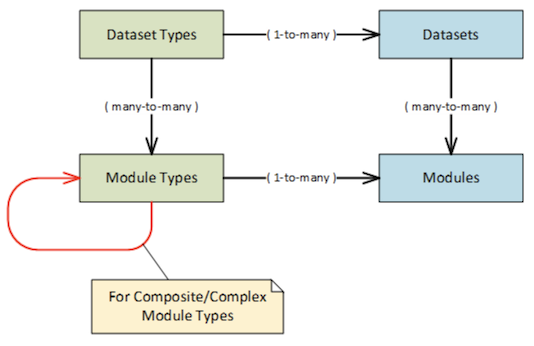
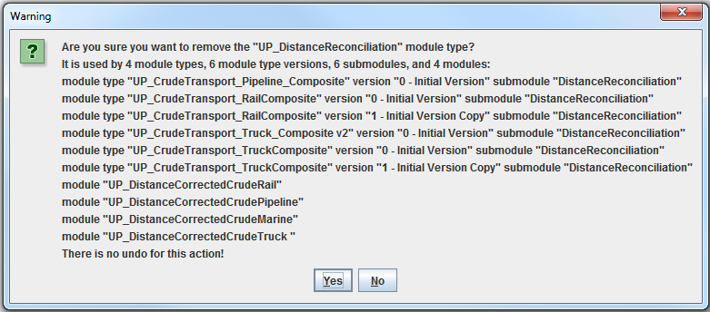
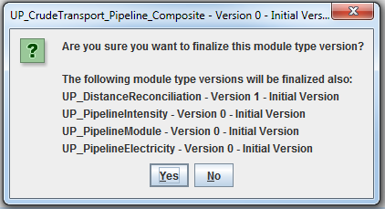
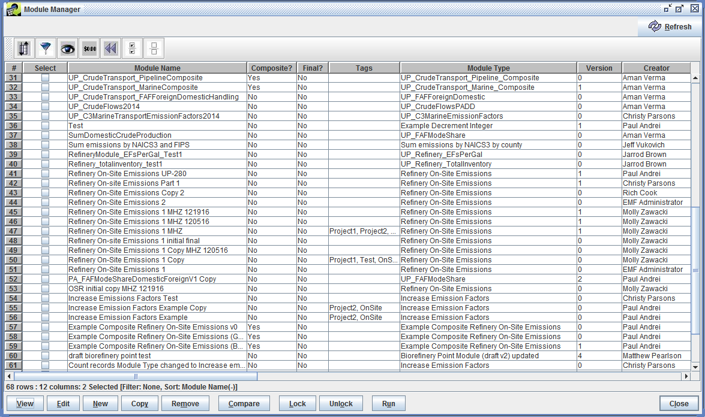
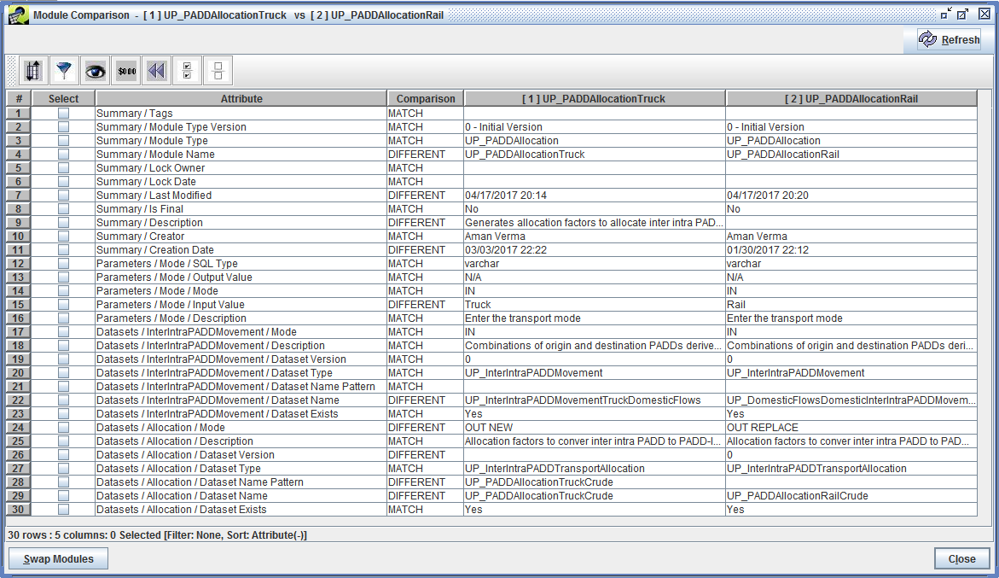
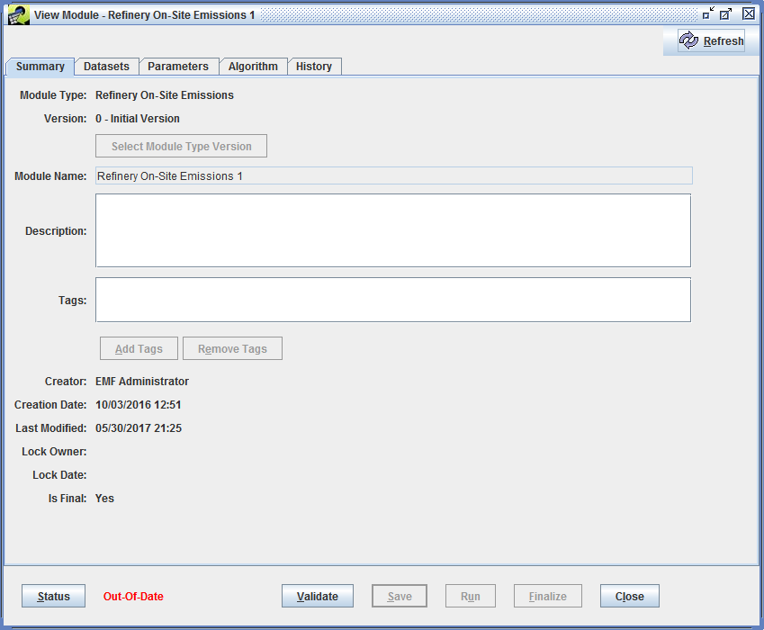
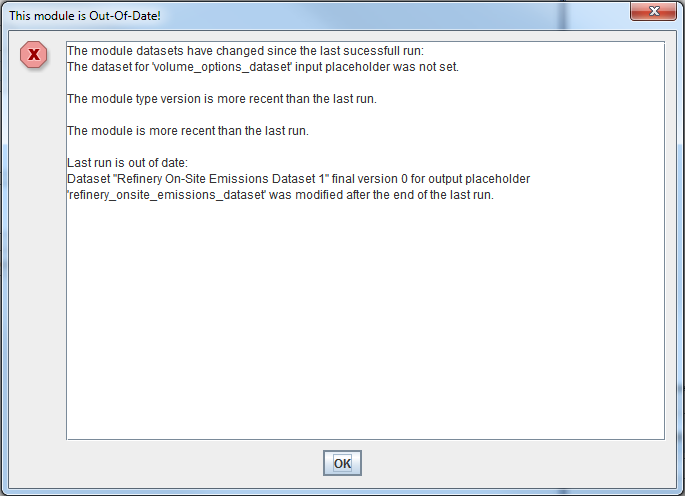
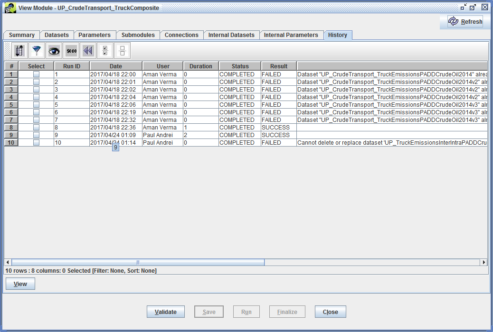

# Module Types and Modules #

## Introduction ##

The "module type" and "module" features have been developed as a component of the EMF and reuse many of its features (dataset types, datasets, client-server architecture, PostgreSQL database, etc.), while allowing users flexibility to utilize datasets in new ways through PostgreSQL commands.  

## Features ##

Both "module types" and "modules" are easy to use and are flexible enough to address a wide variety of scenarios, systematically tracks changes in either algorithms, inputs or assumptions; moreover, these changes are easy to document.

A **module type** defines an algorithm which can operate on input datasets and parameters and produces output datasets and parameters. Module types are equivalent to functions in most programming languages.

A **simple module type** implements the algorithm in PL/pgSQL, the SQL procedural language for the PostgreSQL database system. A **composite module type** implements the algorithm using a network of interconnected submodules based on other (simple or composite) module types.

A **module** is a construct that binds a module type's inputs and outputs to concrete datasets and parameter values. Running a module executes the algorithm on the concrete datasets and parameter values bound to inputs and produces the datasets and parameters bound to outputs. Modules are equivalent to complete executable programs.

The module types and the modules are generic components and can be used to implement any model.

The module type and module features consist of:

* specific dataset types and concrete datasets;
* a library of specific module types implementing the algorithms that model each step of each scenario of interest for modeling;
* a set of modules binding concrete datasets and parameters to module type inputs and outputs;

A module's outputs can be another module's inputs. Consequently, the modules can be organized in complex networks modeling complex dataflows.

The relationship between Module Types and Modules is very similar to the relationship between Dataset Types and Datasets:

{#fig:module_dataset_relationship}

## User Interface ##

### Module Type Manager ###

The Module Type Manager window lists the existing module types and allows the user to view edit, create, or remove module types. The user can create simple or composite module types.

Removing module types used by modules and other module types requires user confirmation:

{#fig:module_remove_type}

Only users with administrative privileges can remove entire module types via the Module Type Manager window.

### Module Type Version Manager ###

The Module Type Version Manager window lists all module type versions for the selected module type and allows the user to view, edit, copy, and remove module type versions. Only users with administrative privileges can remove module type versions that have been finalized.

### Module Type Version Editor ###

The Module Type Version Properties window lists module type metadata (name, description, creator, tags, etc.), module type version metadata (version, name, description, etc.), datasets, parameters, and revision notes for the selected module type version. It also lists the algorithm for simple module types and the submodules and the connections for the composite module types. The user can select a parameter's type from a limited (but configurable) list of SQL types (integer, varchar, etc.).

The user can indicate that a dataset or parameter is optional. For composite module types, if the target of a connection is optional then a source does not have to be selected. The UI prevents the user from connecting an optional source to a non-optional (required) target.

The algorithm for a simple module type must handle optional datasets and parameters. The following placeholders (macros) can be used to test if a dataset/parameter is optional and if a dataset/value was provided: `${placeholder-name.is_optional}`, `${placeholder-name.is_set}`, `#{parameter-name.is_optional}`, and `#{parameter-name.is_set}`. See Algorithm Syntax ([@Sec:algorithm_syntax_section]).

The user can change, save, validate, and finalize the module type version. The user is automatically prompted to add new revision notes every time new changes are saved. The validation step verifies (among other things) that all dataset placeholders in the algorithm are defined.

Updating a module type version used by modules and other composite module type versions requires user confirmation:

{#fig:module_update_type_version}

For a composite module type, finalizing a module type version requires finalizing all module type versions used by submodules, recursively. The user is shown the list of all required changes and the finalization proceeds only after the user agrees to all the changes.

{#fig:module_finalize_confirm}

When working with a composite module type, the Diagram tab displays a diagram illustrating the composite module type's submodules, inputs, outputs, and connections. Each submodule is color-coded so that the submodule and its specific inputs and outputs can be identified. Overall inputs to the composite module type are shown with a white background. In the diagram, datasets are identified by boxes with blue borders, and dataset connection are shown with a blue line. Parameters use boxes with red borders, and parameter connections use red lines.

### Module Manager ###

The Module Manager UI that lists the existing modules and allows the user to view, edit, create, copy, remove, compare, and run modules.

{#fig:module_manager width=100%}

Users who do not have administrative privileges can only remove modules that they created, and only modules that have not been finalized. When removing a module, the user can choose to remove all datasets that were output by that module. Datasets that are used as inputs to other modules, or are in use by other parts of the EMF (e.g. control strategies, control programs) won't be deleted. Eligible output datasets will be fully deleted, the equivalent of Remove and Purge in the Dataset Manager.

The module comparison feature produces a side-by-side report listing all module attributes and the comparison results: MATCH, DIFFERENT, FIRST ONLY, SECOND ONLY.

{#fig:module_comparison width=100%}

### Module Editor ###

The View/Edit Module window lists metadata (description, creator, tags, project, etc.), dataset bindings, parameter bindings, and execution history for the selected module. The user can bind concrete datasets to dataset placeholders and concrete values to input parameters. If a dataset/parameter is optional then a dataset/value binding is not required.

The View/Edit Module window also lists the algorithm for simple module types and the submodules, connections, internal datasets, and internal parameters for composite module types. The internal datasets and parameters are usually lost after a run, but the user can choose to keep some or all internal datasets and parameters (mostly for debugging). The user can change, save, validate, run, and finalize the selected module.

In the datasets tab the user can select and open a concrete dataset used or produced by the run (if any) and inspect the data. The user can also obtain the list of modules related to a concrete dataset. A module is related to a dataset if it produced the dataset as output or it's using the dataset as input.

In the parameters tab the user can inspect the value of the output parameters as produced by the last run (only if the last run was successful).

A module can be finalized if the following conditions are met:

1. The Module Type is final.
2. The last module run was successful.
3. The last module run (that is, the last history record) is up-to-date with respect to the module type (that is, the module type is older than the start of the last module run).
4. The last module run is up-to-date with respect to the input and output datasets (that is, the input datasets are older than the start of the last run and the output datasets are older than the end of the last run).

Finalizing a module finalizes the input and output datasets also.

The View/Edit Module window has a status indicator that informs the user that the module is UpToDate or OutOfDate.

{#fig:module_view_properties}

The Status button brings up a dialog box explaining why the module is Out-Of-Date.

{#fig:module_out_of_date}

A module is UpToDate when:

* the module is valid
* the module has no unsaved changes
* the module has been run at least once
* the last run was successful
* the module type version last modified date is older than the last run start date
* the module last modified date is older than the last run start date
* all input and output datasets captured by the last run history record are still present
* last modified dates for all input datasets captured by the last run history record are older than the last run start date
* last modified dates for all output datasets captured by the last run history record are older than the last run end date
* last modified dates for all internal datasets captured by the last run history record are older than the last run end date

### Module History ###

The Module History window lists all execution records for the selected module. The user can select and view each record in the Module History Details window.

{#fig:module_history width=100%}

### Module History Details ###

The Module History Details window lists metadata, concrete datasets used or produced by the run (including the internal datasets the user chose to keep), the parameter values used or produced by the run (including the internal parameters the user chose to keep), the actual setup/user/teardown scripts executed by the database server for the module and each submodule, and detailed logs including error messages, if any. The user can select and open a concrete dataset used or produced by the run and inspect the data. The user can also obtain the list of modules related to a concrete dataset.

The setup script used by the Module Runner creates a temporary database user with very limited permissions. It also creates a temporary default schema for this user.

The actual user scripts executed by the database server for each simple module or submodule contains the algorithm (with all placeholders replaced) surrounded by some wrapper/interfacing code generated by the Module Runner. The user script is executed under the restricted temporary database user account in order to protect the database from malicious or buggy code in the algorithm.

The teardown script drops the temporary schema and the temporary database user.

### Dataset Manager ###

The Dataset Manager lists all datasets in the EMF, including those used by modules, with options to view, edit, import, export, and remove datasets. When removing a dataset via the Dataset Manager, the system checks if that dataset is in use by a module as 1) an input to a module, 2) an output of a module where the module replaces the dataset, or 3) the most recent output created as a new dataset from a module. If any of the usage conditions are met, the dataset will not be deleted; the Status window will include a message detailing which modules use which datasets.

## Module Runner ##

The Simple Module Runner is a server component that validates the simple module, creates the output datasets, creates views for all datasets, replaces all placeholders in the module's algorithm with the corresponding dataset views, executes the resulting scripts on the database server (using a temporary restricted database user account), retrieves the values of all output parameters, and logs the execution details including all errors, if any. The Module Runner automatically adds new custom keywords to the output datasets listing the module name, the module database id, and the placeholder.

The Composite Module Runner is a server component that validates the composite module and executes its submodules in order of dependencies by:

* creating temporary SimpleSubmoduleRunner  or CompositeSubmoduleRunner objects for each submodule
* populating the inputs and outputs according to the composite module connections
* running the temporary submodule runner objects (recursive call)

The order in which the submodules are executed is repeatable: when multiple submodules independent of each other are ready for execution, they are processed in the order of their internal id.

The Composite Module Runner keeps track of temporary internal datasets and parameters and deletes them as soon as they are not needed anymore, unless the user explicitly chose to keep them.

While running a module, the Module Runner enforces strict dataset replacement rules to prevent unauthorized dataset replacement.

## Algorithm Syntax ## {#sec:algorithm_syntax_section}

The algorithm for a simple module type must be written in PL/pgSQL, the SQL procedural language for the PostgreSQL database system (<https://www.postgresql.org/docs/9.5/static/plpgsql-overview.html>).

The EMF Module Tool extends this language to accept placeholders for the module's datasets. The placeholder syntax is: `${placeholder-name}`. For example, if a module type has defined a dataset called `input_options_dataset` then the algorithm can refer to it using the `${input_options_dataset}` syntax.

The module tool also uses placeholders for the module's parameters. The parameter placeholder syntax is: `#{parameter-name}`. For example, if a module type has defined a parameter called `increase_factor` then the algorithm can refer to it using the `#{increase_factor}` syntax.

For example, the following algorithm reads records from `input_emission_factors_dataset`, applies a multiplicative factor to the `Emission_Factor` column, and inserts the resulting records into a new dataset called `output_emission_factors_dataset`:

    INSERT INTO ${output_emission_factors_dataset}
        (Fuel_Type, Pollutant, Year, Emission_Factor, Comments)
    SELECT
        ief.Fuel_Type,
        ief.Pollutant,
        ief.Year,
        ief.Emission_Factor * #{increase_factor},
        ief.Comments
    FROM ${input_emission_factors_dataset} ief;

More detailed information is available for each dataset placeholder:

Placeholder|Description|Example
-|--|-
${placeholder-name.table_name}|The name of the PostgreSQL table that holds the data for the dataset.|emissions.ds_inputoptions_dataset_1_1165351574
${placeholder-name.dataset_name}|The dataset name.|Input Options Dataset
${placeholder-name.dataset_id}|The dataset id.|156
${placeholder-name.version}|The version of the dataset as selected by the user.|2
${placeholder-name.view}|The name of the temporary view created for this dataset table by the Module Runner.|input_options_dataset_iv
${placeholder-name}|Same as ${placeholder-name.view}.|input_options_dataset_iv
${placeholder-name.mode}|The dataset mode: IN, INOUT, or OUT, where IN is an input dataset, INOUT is both an input and updated as output, and OUT is an output dataset.|IN
${placeholder-name.output_method}|The dataset output method (defined only when mode is OUT): NEW or REPLACE.|NEW
${placeholder-name.is_optional}|TRUE if the dataset is optional, FALSE if the dataset is required|TRUE
${placeholder-name.is_set}|TRUE if a dataset was provided for the placeholder, FALSE otherwise|TRUE
: Dataset Placeholders {#tbl:dataset_placeholders_table}

The following "general information" placeholders related to the current user, module, or run are defined also:

Placeholder|Description|Example
-|--|-
${user.full_name}|The current user's full name.|John Doe
${user.id}|The current user's id.|6
${user.account_name}|The current user's account name.|jdoe
${module.name}|The current module's name.|Refinery On-Site Emissions
${module.id}|The current module's id.|187
${module.final}|If the module is final, then the placeholder is replaced with the word Final. Otherwise the placeholder is replaced with the empty string.|Final
${module.project_name}|If the module has a project, then the placeholder is replaced with the name of the project. Otherwise the placeholder is replaced with the empty string.|
${run.id}|The unique run id.|14
${run.date}|The run start date.|11/28/2016
${run.time}|The run start time.|14:25:56.825
: General Information Placeholders {#tbl:general_information_placeholders_table}

The following parameter placeholders are defined:

Placeholder|Description|Example
-|--|-
#{parameter-name}|The name of the parameter with a timestamp appended to it.|increase_factor_094517291
#{parameter-name.sql_type}|The parameter's SQL type.|double precision
#{parameter-name.mode}|The parameter mode: IN, INOUT, or OUT, where IN is an input parameter, INOUT is both an input and updated as output parameter (e.g. an index value), and OUT is an output parameter.|IN
#{parameter-name.input_value}|The parameter's input value (defined only when mode is IN or INOUT).|1.15
#{parameter-name.is_optional}|TRUE if the parameter is optional, FALSE if the parameter is required|TRUE
#{parameter-name.is_set}|TRUE if a value was provided for the parameter, FALSE otherwise|TRUE
: Parameter Placeholders {#tbl:parameter_placeholders_table}

## New Output Datasets Name Pattern Syntax ##

The "general information" placeholders listed above (see [@Tbl:general_information_placeholders_table]) can also be used to build output dataset name patterns in the Module Editor. For example, a module could specify the following name pattern for a new output dataset:

`Refinery On-Site Emissions #${run.id} ${user.full_name} ${run.date} ${run.time}`

When running the module, all placeholders in the name pattern will be replaced with the corresponding current value. For example:

`Refinery On-Site Emissions #43 John Doe 12/05/2016 09:45:17.291`
