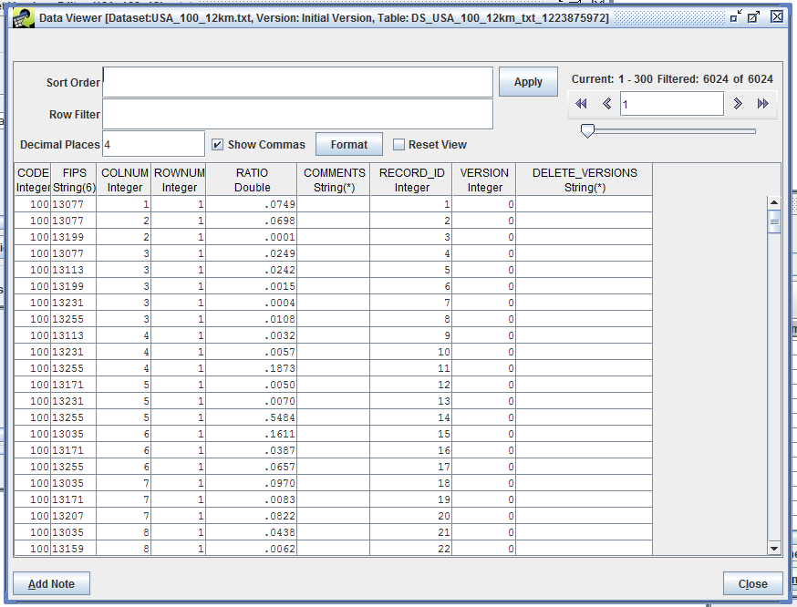

# Why Learn SQL to Use the EMF? #

The Emissions Modeling Framework (EMF) stores emissions and other data in a relational database. Data files are imported into the database as datasets and the raw data from the files is stored in database tables. Using the EMF client, you can work with this data using built-in tools for viewing and editing the data. [@Fig:data_viewer] shows the Data Viewer window for an inventory dataset. This interface displays the rows and columns of the underlying database table where the dataset is stored.

{#fig:data_viewer}

Because the data is stored in database tables, we can use Structured Query Language (SQL) to filter, sort, or analyze the data. In the Data Viewer window shown in [@Fig:data_viewer], snippets of SQL are used to specify the order the records are sorted in (Sort Order) and the filtering applied to limit the particular records displayed (Row Filter).

The EMF also allows you to add QA steps to a dataset. One type of QA step lets you write your own SQL query to retrieve and summarize the dataset. Using SQL, you can select particular records of interest, grab data from other tables like region descriptions or pollutant information, or sum up emissions by SCC, region, pollutant, etc. [@Fig:sql_qa_step] shows the SQL query used for a QA step associated with an ORL point inventory dataset. This QA step produces a county-level summary of the inventory along with county and state names, pollutant descriptions, and county coordinates.

{#fig:sql_qa_step}

In this guide, we'll discuss the fundamentals of database tables, explain how to build SQL queries, and cover the special syntax that the EMF adds for working with EMF datasets and QA steps.

# Database Tables #

The EMF database is made up of many tables each of which stores columns and rows of data. A simplified example table is shown below:

country (text)|state (text)|pollutant (text)|annual_emissions (numeric)
-|-|-|-
US|Georgia|NO|10.428
US|Kentucky|NO|6.3878
US|North Carolina|NO|41.835
US|South Carolina|NO|28.000
US|Georgia|CO|246.21
US|Kentucky|CO|140.25
US|North Carolina|CO|730.01
US|South Carolina|CO|434.39

Within each table, the columns are named. In the sample table, we have four columns named **country**, **state**, **pollutant**, and **annual_emissions**. Each column stores values of a particular type; in the example table, the **annual_emissions** column is numeric while the remaining columns are text (also called character strings). The sample table currently has 8 rows.

Each table in the database has a unique name which is assigned by the EMF. For our example, we'll call this table *state_emissions*.

The full EMF database contains many tables. Each dataset is imported into its own table based on the dataset type. When building queries for a given dataset, you will need to know the columns the dataset contains and the type of data in each column.

# Querying Data #

In this section, we'll work through the basics of a SQL `SELECT` query. You would use this type of query when creating SQL-based QA steps for a dataset.

The following example is a query that returns all the rows in the *state_emissions* table where the value in the **pollutant** column is 'CO'; the resulting records will be ordered by the **annual_emissions** column.

    SELECT *
    FROM state_emissions
    WHERE pollutant = 'CO'
    ORDER BY annual_emissions

country|state|pollutant|annual_emissions
-|-|-|-
US|Kentucky|CO|140.25
US|Georgia|CO|246.21
US|South Carolina|CO|434.39
US|North Carolina|CO|730.01

`SELECT` is the SQL command to retrieve information from a table. There are other SQL commands to insert or update data, delete records, alter database tables, etc. but within the EMF, you'll only use the `SELECT` command.

After the `SELECT` command, we list which columns from the table we want to output. In our example, we've used the asterisk (`*`) to grab all the columns of the table. This is equivalent to writing `SELECT country, state, pollutant, annual_emissions FROM state_emissions ...`.

Besides listing the column names, you can also include different expressions in the `SELECT` list to create calculated columns. For example, we can divide the annual emissions value by 365 to compute the average day value as shown in the query below. [@Sec:calculated_columns] has more information on calculated columns.

    SELECT country, state, pollutant, annual_emissions, 
           annual_emissions / 365 AS avg_day
    FROM state_emissions
    WHERE pollutant = 'CO'
    ORDER BY avg_day

country|state|pollutant|annual_emissions|avg_day
-|-|-|-|-
US|Kentucky|CO|140.25|0.3842
US|Georgia|CO|246.21|0.6745
US|South Carolina|CO|434.39|1.190
US|North Carolina|CO|730.01|2.000

In this example, we used the `AS` option to label the average day emissions column **avg_day**.

The next portion of the query (`FROM state_emissions`) indicates which table we want to get the data from, in this case the *state_emissions* table. When building queries for EMF tables, special keywords are available to refer to a dataset's table name. This syntax is discussed in [@Sec:emf_syntax].

The `WHERE` clause is used to match rows in the database table to return. If we did not include a `WHERE` clause, our query would return all the rows in the database table. [@Sec:where_clause] has more information about the `WHERE` clause.

We've included the `ORDER BY` option in our query. This specifies how the results should be sorted. When using `ORDER BY`, the default behavior is to sort the values in ascending order (smallest to biggest). To use descending order, add the keyword `DESC` like so: `ORDER BY annual_emissions DESC`.

Note that the SQL keywords (i.e. `SELECT`, `FROM`, `WHERE`, etc.) are not case sensitive. We'll use capital case in our examples for clarity. Also, line breaks and indentations within the queries are not meaningful.

## SELECT DISTINCT ##

By default, the output from the `SELECT` statement includes all the records that were matched. To only return the unique records, add the keyword `DISTINCT` before the list of column names. Suppose we want a list of all the pollutants in our *state_emissions* table. Initially we might try a query like the following:

    SELECT pollutant
    FROM state_emissions

|pollutant|
|-|
|NO|
|NO|
|NO|
|NO|
|CO|
|CO|
|CO|
|CO|

This query returned just the **pollutant** column from each row in the table. A more useful output would give us just the unique pollutants. Adding the `DISTINCT` keyword gives us what we're looking for.

    SELECT DISTINCT pollutant
    FROM state_emissions

|pollutant|
|-|
|NO|
|CO|

## LIMIT Option ##

By default, all records are returned from the `SELECT` statement. The `LIMIT` option can be used to limit how many records are returned. The following query uses the `ORDER BY` option along with `LIMIT` to return the top 3 records.

    SELECT *
    FROM state_emissions
    WHERE pollutant = 'CO'
    ORDER BY annual_emissions DESC
    LIMIT 3

country|state|pollutant|annual_emissions
-|-|-|-
US|North Carolina|CO|730.01
US|South Carolina|CO|434.39
US|Georgia|CO|246.21

# WHERE Clause Options ## {#sec:where_clause}

The `WHERE` clause determines which rows in the database should be returned in the results. Usually you will be comparing text or numeric values in the database table to your filtering requirements. For example, you may want records for a specific state or SCC. Or you may want emissions values that exceed a particular value. There are several operators that you can use when building the `WHERE` clause.

Operator|Description|Examples
-|--|---
`=`|Equal to|`state = 'Georgia'`, `annual_emissions = 100`
`!=` or `<>`|Not equal to|`pollutant != 'NO'`
`>`|Greater than|`annual_emissions > 10`
`<`|Less than|`annual_emissions < 500`
`>=`|Greater than or equal to|`annual_emissions >= 28`
`<=`|Less than or equal to|`annual_emissions <= 28`
`BETWEEN`|Value is within the given range|`annual_emissions BETWEEN 100 AND 200`; equivalent to `annual_emissions >= 100 AND annual_emissions <= 200`
`LIKE`|Match a character string (case-sensitive)|`state LIKE 'Geo%'`
`ILIKE`|Match a character string (case-insensitive)|`state ILIKE 'geo%'`
`NOT LIKE`|Inverse of LIKE|`state NOT LIKE 'Geo%'`
`IN`|Match one or more of a set of values|`state IN ('Georgia', 'Kentucky')`; equivalent to `state = 'Georgia' OR state = 'Kentucky'`
: WHERE Clause Operators {#tbl:where_clause_operators_table}

As shown in the examples in [@Tbl:where_clause_operators_table], text values are enclosed in single quotes. Numeric values are not quoted.

## Pattern Matching ##

The `LIKE` and `ILIKE` operators match records based on the supplied argument (i.e. `state LIKE 'Geo%'`). The argument is a pattern that can contain wildcard characters; an underscore (`_`) matches any single character while a percent sign (`%`) matches any sequence of zero or more characters.

## Multiple Criteria ##

You can combine multiple criteria together using `AND` and `OR`. The following query matches rows where the pollutant is CO and the annual emissions value is greater than 300.

    SELECT country, state, annual_emissions, pollutant
    FROM state_emissions
    WHERE pollutant = 'CO'
    AND annual_emissions > 300

country|state|annual_emissions|pollutant
-|-|-|-
US|North Carolina|730.01|CO
US|South Carolina|434.39|CO

Changing the `AND` to `OR` will return all the rows where either the pollutant is CO or the annual emissions are greater than 40.

    SELECT country, state, annual_emissions, pollutant
    FROM state_emissions
    WHERE pollutant = 'CO'
    OR annual_emissions > 40

country|state|annual_emissions|pollutant
-|-|-|-
US|North Carolina|41.835|NO
US|Georgia|246.21|CO
US|Kentucky|140.25|CO
US|North Carolina|730.01|CO
US|South Carolina|434.39|CO

## Complex Expressions ##

If you are combining multiple criteria and mixing `AND` and `OR` options, it's good practice to use parentheses to group criteria in the `WHERE` clause. For example, if we want to retrieve CO emissions for North and South Carolina, we would construct our query like so:

    SELECT country, state, annual_emissions, pollutant
    FROM state_emissions
    WHERE pollutant = 'CO'
    AND (state = 'North Carolina' OR state = 'South Carolina')

country|state|annual_emissions|pollutant
-|-|-|-
US|North Carolina|730.01|CO
US|South Carolina|434.39|CO

Compare the results if we hadn't included the parentheses;

    SELECT country, state, annual_emissions, pollutant                                                          
    FROM state_emissions                                                                                          
    WHERE pollutant = 'CO'                                                                                        
    AND state = 'North Carolina' OR state = 'South Carolina'

country|state|annual_emissions|pollutant
-|-|-|-
US|South Carolina|28.000|NO
US|North Carolina|730.01|CO
US|South Carolina|434.39|CO

In SQL, the `AND` operator has precedence over the `OR` operator meaning the `AND` conditions get evaluated first. Our second query is interpreted as follows:

    SELECT country, state, annual_emissions, pollutant                                                          
    FROM state_emissions                                                                                          
    WHERE (pollutant = 'CO' AND state = 'North Carolina') 
    OR state = 'South Carolina'

# Calculated Columns ## {#sec:calculated_columns}

In addition to column names, you can also include expressions in the `SELECT` list to create calculated columns. A previous example showed calculating average day emissions using `annual_emissions / 365 AS avg_day`.

You can use standard arithmetic operations on numeric columns in your queries.

Operator/Function|Description
-|-
`+`|addition
`-`|subtraction
`*`|multiplication
`/`|division
`^`|exponentiation
`ABS(value)`|absolute value
`LN(value)`|natural logarithm
`LOG(value)`|base 10 logarithm
`SQRT(value)`|square root
: Operators and Functions for Numeric Values {#tbl:numeric_operators_table}

For string fields, there are a variety of useful functions for concatenating/appending fields, converting to and from upper and lowercase, and extracting substrings.

Function|Description|Example|Example Result
--|--|--|-
`string || string`|String concatenation|`country || ' ' || state`|US Georgia
`LENGTH(string)`|Number of characters in string|`LENGTH(state)`|7
`LOWER(string)`|Convert string to lower case|`LOWER(state)`|georgia
`SUBSTR(string, starting position, length)`|Extract substring from string|`SUBSTR(state, 1, 2)`|Ge
|||`SUBSTR(state, 3, 3)`|org
`UPPER(string)`|Convert string to upper case|`UPPER(state)`|GEORGIA
: Functions for String Values {#tbl:string_functions_table}

These functions can also be used in the `WHERE` clause. For example, we could match state names that start with "North" or "South" using the `SUBSTR` function.

    SELECT country, state, annual_emissions, pollutant
    FROM state_emissions
    WHERE SUBSTR(state, 1, 5) IN ('North', 'South')

country|state|annual_emissions|pollutant
-|-|-|-
US|North Carolina|41.835|NO
US|South Carolina|28.000|NO
US|North Carolina|730.01|CO
US|South Carolina|434.39|CO

This query could also be written using `WHERE state LIKE 'North%' OR state LIKE 'South%'`.

# Aggregate Functions #

Besides returning individual rows from database tables, you can use SQL to aggregate data from multiple rows. Some common aggregate functions are `SUM`, `AVG` (average), `MAX` (maximum), and `MIN` (minimum).

When using aggregate functions, you use the `GROUP BY` clause to indicate how records should be grouped when applying the function. For example, to sum the annual emissions by pollutant, we can use `GROUP BY` pollutant with the `SUM` aggregate function.

    SELECT pollutant, SUM(annual_emissions) AS total
    FROM state_emissions
    GROUP BY pollutant
    ORDER BY pollutant

pollutant|total
-|-
CO|1550.86
NO|86.6508

To get summed emissions by pollutant and country, we can use additional `GROUP BY` options.

    SELECT country, pollutant, SUM(annual_emissions) AS country_total
    FROM state_emissions
    GROUP BY country, pollutant
    ORDER BY country, pollutant

country|pollutant|country_total
-|-|-
US|CO|1550.86
US|NO|86.6508

# Fully Qualified Column Names and Table Aliases #

In our examples so far, we haven't used the fully qualified column names. A fully qualified column name includes the table name as shown in the query below:

    SELECT state_emissions.country, state_emissions.state, 
    	state_emissions.pollutant, state_emissions.annual_emissions
    FROM state_emissions
    WHERE state_emissions.pollutant = 'CO'
    ORDER BY state_emissions.annual_emissions

We haven't needed the qualified column names because we've only been working with a single database table so there's no ambiguity about which columns we're referring to. In the next section, we'll look at combining multiple tables so we'll need to be more specific in our naming.

Using the full table name throughout a query can become burdensome. Table aliases allow you to create shorter table names which you can then use when referring to the table.

    SELECT e.country, e.state, e.pollutant, e.annual_emissions
    FROM state_emissions e
    WHERE e.pollutant = 'CO'
    ORDER BY e.annual_emissions

# Relationships to Other Tables #

So far, our example queries have retrieved data from one table. Using SQL, we can combine records from other tables in the database. In the EMF, you will often use information from additional tables to annotate the data in a dataset. For example, there are reference tables which contain state and county names corresponding to FIPS codes, SCC descriptions, and pollutant information. Several reference tables are described in [@Sec:reference_tables].

Suppose we have a table of state information named *state_reference*. Note that our *state_reference* table doesn't have the same four states as the *state_emissions* table.

country|state|capital
-|-|-
US|Alabama|Montgomery
US|Georgia|Atlanta
US|Kentucky|Frankfort
US|North Carolina|Raleigh

We use a `JOIN` clause to indicate which table we want to join to our main query table. Along with the table name, we also specify how the two tables relate to each other. In our example, the country and state columns should match between the *state_emissions* and *state_reference* tables.

    SELECT e.country, e.state, 
           r.capital, e.pollutant, 
           e.annual_emissions
    FROM state_emissions e
    JOIN state_reference r
    ON r.country = e.country
    AND r.state = e.state

country|state|capital|pollutant|annual_emissions
-|-|-|-|-
US|Georgia|Atlanta|NO|10.428
US|Georgia|Atlanta|CO|246.21
US|Kentucky|Frankfort|NO|6.3878
US|Kentucky|Frankfort|CO|140.25
US|North Carolina|Raleigh|NO|41.835
US|North Carolina|Raleigh|CO|730.01

Our output contains the records from *state_emissions* that were joined to matching records in *state_reference*. Because *state_reference* doesn't have an entry for South Carolina, our output doesn't have either of the South Carolina records from *state_emissions*. Similarly, because *state_emissions* doesn't have any records for Alabama, our output doesn't have the Alabama record from *state_reference*. This type of `JOIN` is also referred to as `INNER JOIN`.

What if we want all the records from *state_emissions* in our results with whatever data we can get from *state_reference*? Instead of using `JOIN`, we can change the query to use `LEFT JOIN`.

    SELECT e.country, e.state, r.capital, e.pollutant, e.annual_emissions
    FROM state_emissions e
    LEFT JOIN state_reference r
    ON r.country = e.country
    AND r.state = e.state

country|state|capital|pollutant|annual_emissions
-|-|-|-|-
US|Georgia|Atlanta|NO|10.428
US|Georgia|Atlanta|CO|246.21
US|Kentucky|Frankfort|NO|6.3878
US|Kentucky|Frankfort|CO|140.25
US|North Carolina|Raleigh|NO|41.835
US|North Carolina|Raleigh|CO|730.01
US|South Carolina|NULL|NO|28.000
US|South Carolina|NULL|CO|434.39

In our `LEFT JOIN` of tables *state_emissions* and *state_reference*, all of the records from the "left" table (i.e. *state_emissions*) will be returned. Notice that the values in the capital column for South Carolina are NULL in the output. `LEFT JOIN` is also referred to as `LEFT OUTER JOIN`. NULL values are automatically created by SQL when a value is unknown; in our example, we don't have information for the capital of South Carolina so NULL is returned.

When using `LEFT JOIN`, it's important to pay attention to the order that the tables are specified. For example, if *state_reference* is the "left" table, the output of the query will include all the records from *state_reference* instead of *state_emissions*:

    SELECT e.country, e.state, r.capital, e.pollutant, e.annual_emissions
    FROM state_reference r
    LEFT JOIN state_emissions e
    ON r.country = e.country
    AND r.state = e.state

country|state|capital|pollutant|annual_emissions
-|-|-|-|-
NULL|NULL|Montgomery|NULL|NULL
US|Georgia|Atlanta|NO|10.428
US|Georgia|Atlanta|CO|246.21
US|Kentucky|Frankfort|NO|6.3878
US|Kentucky|Frankfort|CO|140.25
US|North Carolina|Raleigh|NO|41.835
US|North Carolina|Raleigh|CO|730.01

In addition to `JOIN` and `LEFT JOIN`, SQL supports `RIGHT JOIN` and `OUTER JOIN`. In [@Fig:join_types], the blue shaded area represents the output of each type of join in terms of tables A and B. In the EMF, you can use all four types of joins but in practice, most of the queries used in the EMF use `LEFT JOIN`.

{#fig:join_types}

## Dealing with NULL Values Using COALESCE ##

NULL values can cause unexpected output when combined with other values. For example, concatenating anything with NULL produces NULL. Suppose we want to create a calculated column with the capital city and state.

	SELECT r.capital || ', ' || e.state AS city, e.pollutant, e.annual_emissions
	FROM state_emissions e
	LEFT JOIN state_reference r
	ON r.country = e.country
	AND r.state = e.state
	WHERE e.pollutant = 'CO'

city|pollutant|annual_emissions
-|-|-
Atlanta, Georgia|CO|246.21
Frankfort, Kentucky|CO|140.25
Raleigh, North Carolina|CO|730.01
NULL|CO|434.39

The `city` value for South Carolina is NULL since `capital` was NULL. To avoid this problem, we can use the `COALESCE` function.

The `COALESCE(value1, value2, ...)` function returns the first value in the list that is not null. Instead of using `r.capital` in our query, we can use `COALESCE(r.capital, 'Unknown')`. When `r.capital` is NULL, our output will use the value "Unknown" instead.

    SELECT COALESCE(r.capital, 'Unknown') || ', ' || e.state AS city,
           e.pollutant, e.annual_emissions
    FROM state_emissions e
    LEFT JOIN state_reference r
    ON r.country = e.country
    AND r.state = e.state
	WHERE e.pollutant = 'CO'

city|pollutant|annual_emissions
-|-|-
Atlanta, Georgia|CO|246.21
Frankfort, Kentucky|CO|140.25
Raleigh, North Carolina|CO|730.01
Unknown, South Carolina|CO|434.39

# EMF-Specific Syntax ## {#sec:emf_syntax}

The EMF provides custom extensions to SQL to make it easier to refer to specific database tables.

## `$TABLE[1] e` ##

When writing a QA step query, the `$TABLE[1] e` syntax is used to refer to the data table for the specific dataset. `e` is the table alias that can be used throughout the query. This alias must be a single character and must always be set (even if the rest of the query doesn't use it).

Suppose we have a dataset whose table name is *emissions.ds_2011neiv1_point_20130723_revised_ptnonipm_1850901482*. When writing a QA step query on this table, we could specify the complete table name.

    SELECT e.region_cd, e.scc, e.poll, SUM(e.ann_value) AS annual_emissions
    FROM emissions.ds_2011neiv1_point_20130723_revised_ptnonipm_1850901482 e
    GROUP BY e.region_cd, e.scc, e.poll
    ORDER BY e.region_cd, e.scc, e.poll

Instead, we can use the `$TABLE[1]` syntax in the QA step query. The EMF will automatically fill in the dataset's table name when the QA step is run.

    SELECT e.region_cd, e.scc, e.poll, SUM(e.ann_value) AS annual_emissions
    FROM $TABLE[1] e 
    GROUP BY e.region_cd, e.scc, e.poll
    ORDER BY e.region_cd, e.scc, e.poll

This syntax makes it easy to copy QA step queries between datasets. As long as the dataset has the same column names and types as used in the query (i.e. **region_cd**, **scc**, **poll**, and **ann_value**), this query can directly be reused. Datasets with the same dataset type (e.g., "Flat File 2010 Point" or "ORL Nonroad Inventory (ARINV)") will use the same column names and types. When switching between FF10 and ORL inventories, the names of columns will differ. For example, FF10 datasets have a **region_cd** column while ORL datasets have a **fips** column.

## `$DATASET_TABLE["dataset name", 1] a` ##

The `$DATASET_TABLE["dataset name", 1] a` tag can be used to refer to a different dataset from a QA step query. `"dataset name"` is the name of the other dataset enclosed in double quotes. The default version of the dataset will be used in the query. For more information on dataset versions, see [Sec. 3 - Datasets][] in the EMF User's Guide. `a` is a single character table alias that can be used throughout the query.

[Sec. 3 - Datasets]: https://www.cmascenter.org/cost/documentation/3.2/EMF%20User's%20Guide/#sec:datasets_chapter {target="_blank"}

This syntax allows you to join datasets together for comparison or annotation purposes. For example, the following fictionalized query shows how an annual inventory (`$TABLE[1]`) could be joined with a corresponding monthly inventory named "jan_monthly_inventory" to produce a report with annual and monthly totals by pollutant.

	SELECT e.pollutant, SUM(e.ann_value) AS annual_emissions, SUM(j.mon_value) AS january_emissions
	FROM $TABLE[1] e
	JOIN $DATASET_TABLE["jan_monthly_inventory", 1] j
	ON j.country_cd = e.country_cd
	AND j.region_cd = e.region_cd
	AND j.scc = e.scc
	GROUP BY e.pollutant

## `$DATASET_TABLE_VERSION["dataset name", 1, version_num] a` ##

`$DATASET_TABLE_VERSION["dataset name", 1, version_num] a` is similar to `$DATASET_TABLE` except that you can indicate the specific version of the dataset to use. If you are working with a new version of a dataset (i.e. not the default version), then you'll use the `$DATASET_TABLE_VERSION` tag in order to specify the particular version you are using.

## `$DATASET_QASTEP["dataset name", "QA step name"] a` ##

The `$DATASET_QASTEP["dataset name", "QA step name"] a` tag is used to refer to the output from another QA step. For a QA step that's associated with the same dataset, you can use "CURRENT_DATASET" instead of specifying the dataset name. This syntax may be helpful if you are performing a complicated QA procedure where the results of one step will be used or combined with another step.

# EMF Reference Tables ## {#sec:reference_tables}

This section describes some of the reference tables provided with the EMF. Some columns have been omitted.

## reference.fips ##

Column Name|Type|Sample Value
-|-|-
country_code|character (2)|US
country_num|character (2)|0
state_county_fips|character (6)|01001
state_abbr|character (2)|AL
county|character (255)|Autauga CO
tz|character (3)|CST
ignoredst|character (1)| |
centerlon|double precision|-86.658
centerlat|double precision|32.52
area|double precision|602
westlon|double precision|-86.9126
eastlon|double precision|-86.406
southlat|double precision|32.322
northlat|double precision|32.7117
state_county_fips_code_desc|character (255)|The county of Autauga, Alabama
epa_region|character (2)|4
fipscounty|character (3)|001
fipsst|character (2)|01
state_name|character (100)|Alabama
pop_flag|character (10)|U1
population_2002_|integer|45566
msa_code|character (5)|5240
msa_title|character (255)|Montgomery, AL MSA
state_minlon|double precision|-84.89
state_maxlon|double precision|-88.47
state_minlat|double precision|30.19
state_maxlat|double precision|35.01
cbsa_code|character (5)|33860
metro_division_code|character (5)| |
csa_code|character (3)|388
cbsa_name|character (255)|Montgomery, AL
level_of_cbsa|character (30)|Metropolitan Statistical Area
metropolitan_division_title|character (255)| |
csa_name|character (255)|Montgomery-Alexander City, AL

## reference.invtable ##

Column Name|Type|Sample Value
-|-|-
name|character (11)|BENZENE
mode|character (2)|EV
cas|character (16)|EVP__71432
spec4id|integer|302
react|integer| |
keep|character (1)|Y
factor|double precision|1
voctog|character (1)|V
species|character (1)|Y
explicit|character (1)| |
activity|character (1)|N
nti|integer| |
units|character (16)|tons/yr
descrptn|character (40)|Benzene
casdesc|character (40)| |

## reference.scc ##

Column Name|Type|Sample Value
-|-|---
scc|character (11)|10100101
scc_description|character (248)|External Combustion Boilers;Electric Generation;Anthracite Coal;Pulverized Coal

## reference.scc_codes ##

Column Name|Type|Sample Value
-|-|-
sector|character (128)|POINT
scc|character (11)|10100101
scc_l1|character (54)|External Combustion Boilers
scc_l2|character (54)|Electric Generation
scc_l3|character (70)|Anthracite Coal
scc_l4|character (70)|Pulverized Coal
