# Temporal Allocation #

## Introduction ##

The temporal allocation module in the Emissions Modeling Framework allows you to estimate inventory emissions for different time periods and resolutions. The module supports input inventories with annual totals, monthly totals, monthly average-day emissions, or daily totals. Using temporal allocation factors, the module can estimate monthly totals, monthly average-day values, daily totals, episodic totals, or episodic average-day values.

## Creating a Temporal Allocation Run ##

Under the main Manage menu, select Temporal Allocation to open the Temporal Allocation Manager. The Temporal Allocation Manager window will list existing temporal allocations as shown in [@Fig:manager].

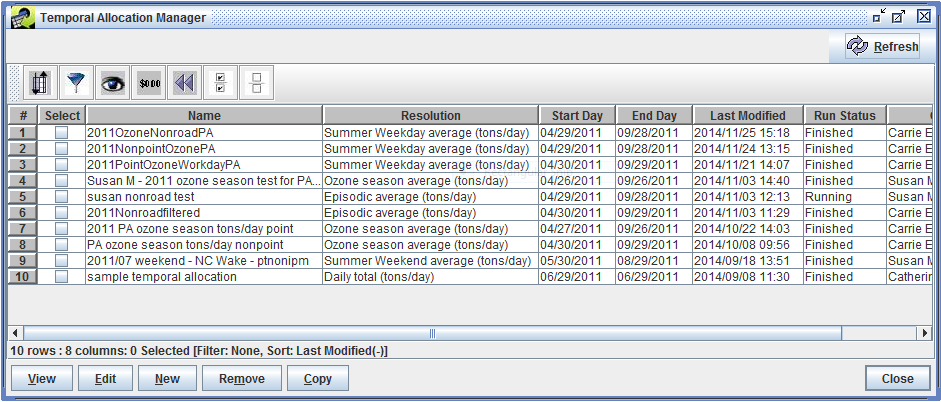{#fig:manager}

From the Temporal Allocation Manager, click the New button. The Edit Temporal Allocation window will open with the Summary tab selected ([@Fig:new_summary]).

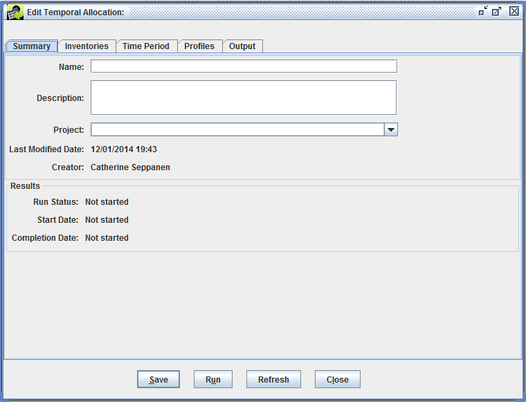{#fig:new_summary}

In the Edit Temporal Allocation window, the four tabs labeled Summary, Inventories, Time Period, and Profiles are used to enter the temporal allocation inputs. This information can be entered in any order; this guide goes through the tabs in order.

### Summary Tab ###

On the Summary tab, enter a unique name for the temporal allocation. You can optionally enter a description and select a project. The EMF will automatically set the last modified date and creator. [@Fig:new_summary_edited] shows the Summary tab with details of the new temporal allocation entered.

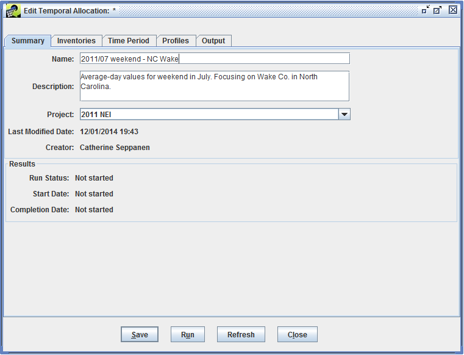{#fig:new_summary_edited}

You can click the Save button from any tab in the Edit Temporal Allocation window to save the information you have entered. If you don't enter a unique name, an error message will be displayed at the top of the window as shown in [@Fig:new_summary_dup_name].

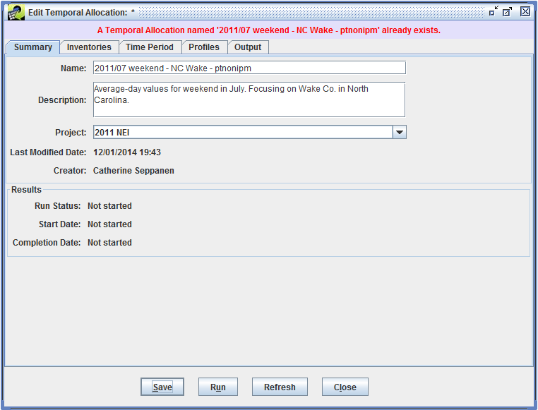{#fig:new_summary_dup_name}

If you enter or update information and then try to close the edit window without saving, you will be asked if you would like to discard your changes. The prompt is shown in [@Fig:tempalloc_discard_changes].

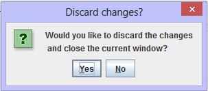{#fig:tempalloc_discard_changes}

When your temporal allocation is successfully saved, a confirmation message is displayed at the top of the window.

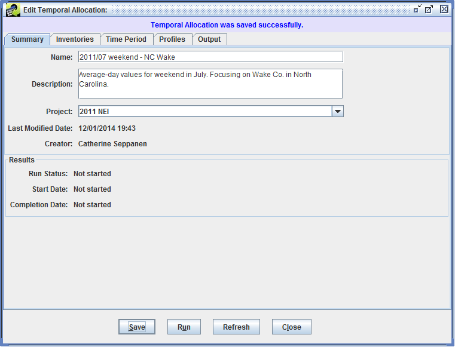{#fig:new_summary_saved}

### Inventories Tab ###

The Inventory tab of the Edit Temporal Allocation lists the inventories that will be processed by the temporal allocation. For a new temporal allocation, the list is initially empty as shown in [@Fig:new_inventories].

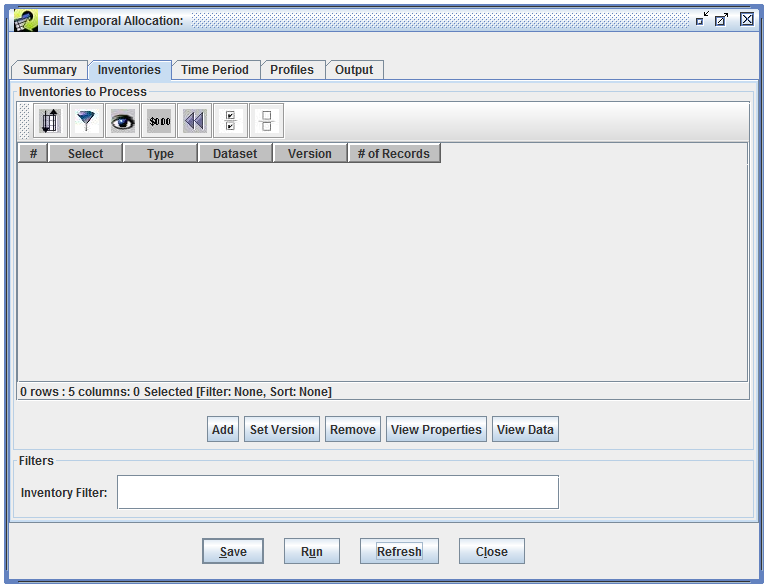{#fig:new_inventories}

Click the Add button to select inventory datasets. A Select Datasets window will appear with the list of supported dataset types ([@Fig:select_datasets]).

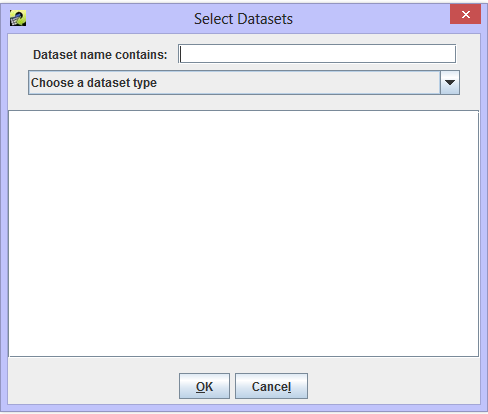{#fig:select_datasets}

The temporal allocation module supports the following inventory dataset types:

* ORL Point Inventory (PTINV)
* ORL Nonpoint Inventory (ARINV)
* ORL Nonroad Inventory (ARINV)
* ORL Onroad Inventory (MBINV)
* Flat File 2010 Point
* Flat File 2010 Nonpoint
* Flat File 2010 Point Daily
* Flat File 2010 Nonpoint Daily

Use the *Choose a dataset type* pull-down menu to select the dataset type you are interested in. A list of matching datasets will be displayed in the window as shown in [@Fig:select_datasets_list].

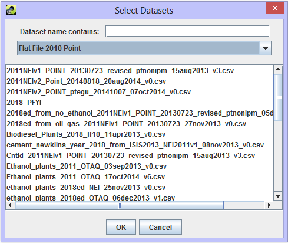{#fig:select_datasets_list}

You can use the *Dataset name contains* field to filter the list of datasets as shown in [@Fig:select_datasets_filtered].

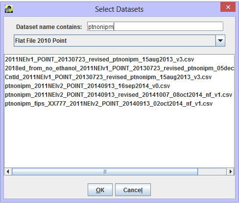{#fig:select_datasets_filtered}

Click on the dataset names to select the datasets you want to add and then click the OK button. [@Fig:select_datasets_selected] shows the Select Datasets window with one dataset selected.

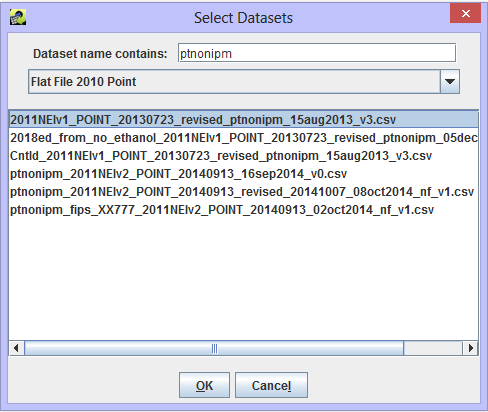{#fig:select_datasets_selected}

Your selected datasets will be displayed in the Inventories tab of the Edit Temporal Allocation window ([@Fig:new_inventories_list]).

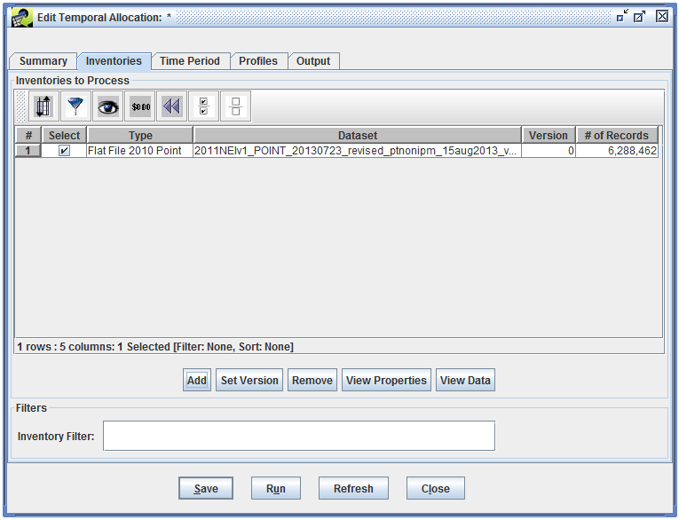{#fig:new_inventories_list}

The module will automatically use the default version of each dataset. To change the dataset version, check the box next to the inventory and then click the Set Version button. A Set Version dialog will be displayed for each selected inventory as shown in [@Fig:set_version].

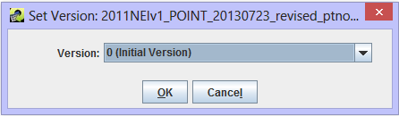{#fig:set_version}

To remove an inventory dataset, check the box next to the dataset and then click the Remove button. The View Properties button will open the Dataset Properties View [@Sec:dataset_properties_section] for each selected dataset and the View Data button opens the Data Viewer ([@Fig:data_viewer]).

The Inventories tab also allows you to specify an inventory filter to apply to the input inventories. This is a general filter mechanism to reduce the total number of sources to be processed in the temporal allocation run. [@Fig:new_inventories_filter] shows an inventory filter that will match sources in Wake County, North Carolina and only consider CO emissions from the inventory.

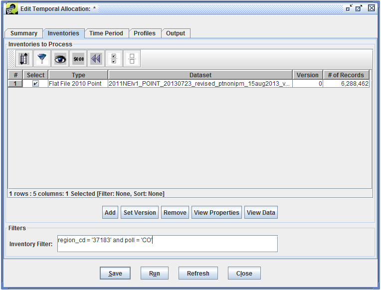{#fig:new_inventories_filter}

#### Annual vs. Monthly Input ####

The temporal allocation module can process annual and monthly data from ORL and FF10 datasets. To determine if a given ORL inventory contains annual totals or monthly average-day values, the temporal allocation module first looks at the time period stored for the inventory dataset. (These dates are set using the Dataset Properties Editor [see [@Sec:dataset_properties_section]] and are shown in the Time Period Start and Time Period End fields on the Summary tab.) If the dataset's start and end dates are within the same month, then the inventory is treated as monthly data.

As a fallback from using the dataset time period settings, the module also looks at the dataset's name. If the dataset name contains the month name or abbreviation like "\_january" or "\_jan", then the dataset is treated as monthly data.

For FF10 inventories, the temporal allocation module will check if the inventory dataset contains any values in the monthly data columns (i.e. jan_value, feb_value, etc.). If any data is found, then the dataset is treated as monthly data.

### Time Period Tab ###

The Time Period tab of the Edit Temporal Allocation window is used to set the desired output resolution and time period. [@Fig:new_time_period] shows the Time Period tab for the new temporal allocation.

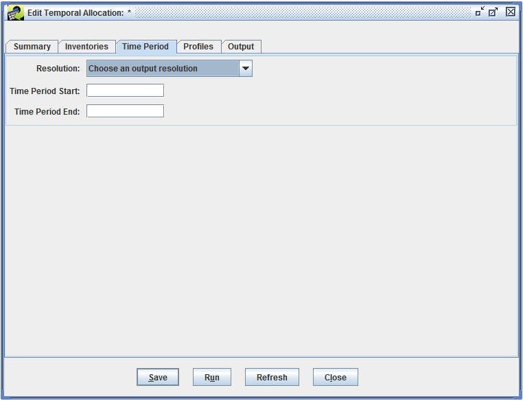{#fig:new_time_period}

The temporal allocation module supports the following resolutions:

* Daily total (tons/day)
* Episodic average (tons/day)
* Episodic total (tons/episode)
* Episodic weekday average (tons/day)
* Episodic weekend average (tons/day)
* Monthly average (tons/day)
* Monthly total (tons/month)

To set the time period for the temporal allocation, enter the start and end dates in the fields labeled Time Period Start and Time Period End. The dates should be formatted as MM/DD/YYYY. For example, to set the time period as May 1, 2008 thorugh October 31, 2008, enter "05/01/2008" in the Time Period Start text field and enter "10/31/2008" in the Time Period End text field. For monthly output, only the year and month of the time period dates will be used.

In [@Fig:new_time_period_edited], the output resolution has been set to Episodic weekend average and the time period is June 1, 2011 through August 31, 2011.

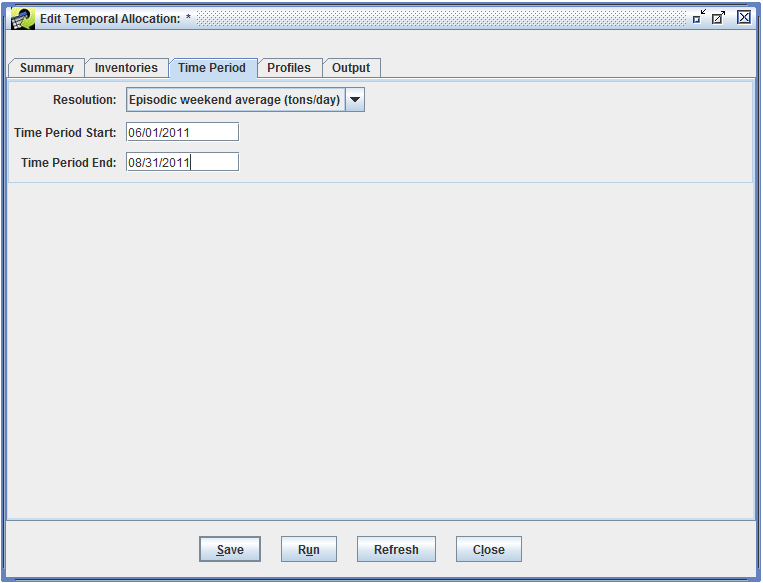{#fig:new_time_period_edited}

### Profiles Tab ###

The Profiles tab of the Edit Temporal Allocation window is used to select the temporal cross-reference dataset and various profile datasets. The cross-reference dataset is used to assign temporal allocation profiles to each source in the inventory. A profile dataset contains factors to estimate emissions for different temporal resolutions. For example, a year-to-month profile will have 12 factors, one for each month of the year.

When editing a new temporal allocation, no datasets are selected initially as shown in [@Fig:new_profiles].

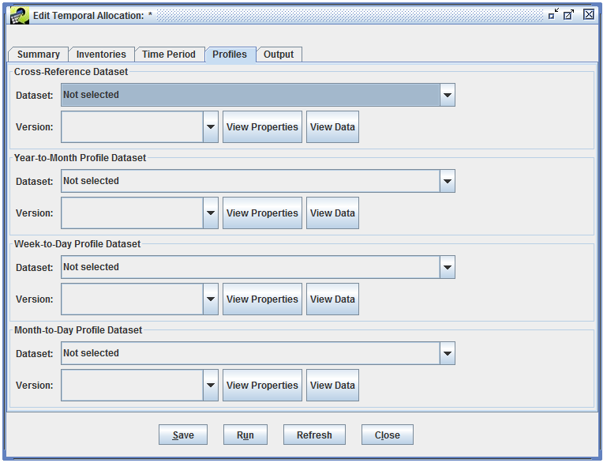{#fig:new_profiles}

The Cross-Reference Dataset pull-down menu is automatically populated with datasets of type "Temporal Cross Reference (CSV)". The format of this dataset is described in [@Sec:input_formats].

For annual input, year-to-month profiles are needed. The Year-To-Month Profile Dataset pull-down menu lists datasets of type "Temporal Profile Monthly (CSV)".

For daily or episodic output, the inventory data will need estimates of daily data. The temporal allocation module supports using week-to-day profiles or month-to-day profiles. The Week-To-Day Profile Dataset pull-down menu lists available datasets of type "Temporal Profile Weekly (CSV)". The Month-to-Day Profile Dataset pull-down shows datasets of type "Temporal Profile Daily (CSV)".

The formats of the various profile datasets are described in [@Sec:input_formats].

[@Fig:new_profiles_edited] shows the Profiles tab with cross-reference, year-to-month profile, and week-to-day profile datasets selected.

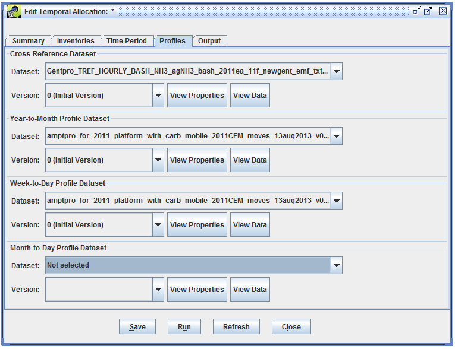{#fig:new_profiles_edited}

For each dataset, the default version will be selected automatically. The Version pull-down menu lists available versions for each dataset if you want to use a non-default version.

The View Properties button will open the Dataset Properties View ([@Sec:dataset_properties_section]) for the associated dataset. The View Data button opens the Data Viewer ([@Fig:data_viewer]).

### Output Tab ###

The Output tab will display the result datasets created when you run a temporal allocation. For a new temporal allocation, this window is empty as shown in [@Fig:new_output].

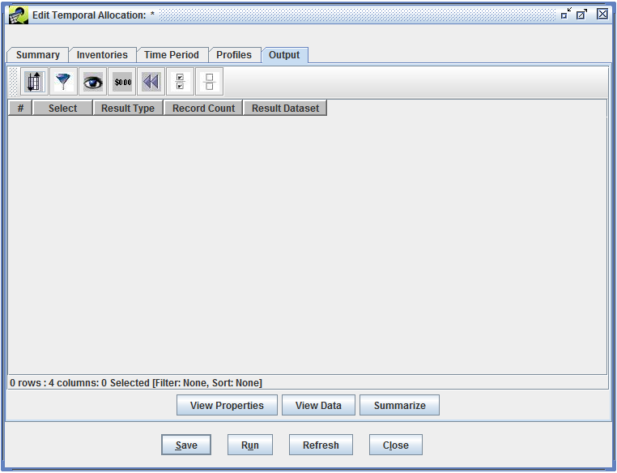{#fig:new_output}

## Running a Temporal Allocation ##

All temporal allocation runs are started from the Edit Temporal Allocation window. To run a temporal allocation, first open the Temporal Allocation Manager window from the main Manage menu. Check the box next to the temporal allocation you want to run and then click the Edit button.

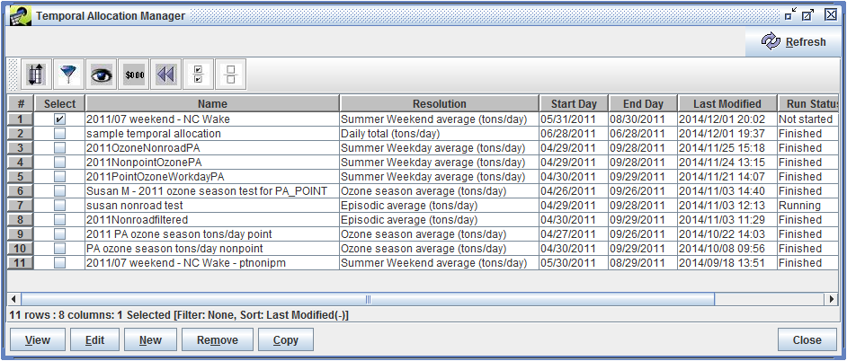{#fig:manager_selected}

The Edit Temporal Allocation window will open for the temporal allocation you selected. Click the Run button at the bottom of the window to start running the temporal allocation.

{#fig:run_summary}

### Error Messages ###

If any problems are detected, an error message is displayed at the top of the Edit Temporal Allocation window (see [@Fig:run_error] for an example). The following requirements must be met before a temporal allocation can be run:

* At least one inventory must be selected.
* The output resolution must be selected.
* The time period start date must be entered.
* The time period end date must be entered.
* The time period start date must be before the end date.
* The time period must start and end in the same year.
* If not all inventories are daily:
    * A cross-reference dataset must be selected.
    * A year-to-month profile dataset must be selected.
    * Either a week-to-day or month-to-day profile dataset must be selected.

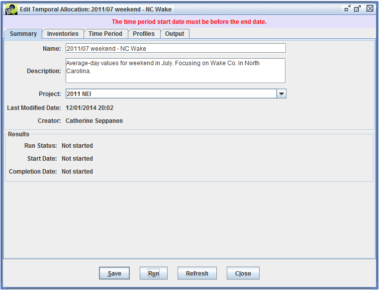{#fig:run_error}

### Run Steps and Status Messages ###

After starting the run, you'll see a message at the top of the Edit Temporal Allocation window as shown in [@Fig:run_started].

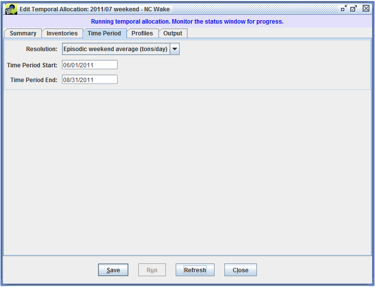{#fig:run_started}

The EMF Status window ([@Sec:status_window_section]) will display updates as the temporal allocation is run. There are several steps in running a temporal allocation. First, any existing outputs for the temporal allocation are removed, indexes are created for the inventory datasets to speed up processing in the database, and the cross-reference dataset is cleaned to make sure the data is entered in a standard format.

Next, monthly totals and monthly average-day values are calculated from the input inventory data. The monthly values are stored in the monthly result output dataset which uses the "Temporal Allocation Monthly Result" dataset type. For annual input data, the year-to-month profiles are used to estimate monthly values. For monthly data from FF10 inventories, a monthly average-day value is calculated by dividing the monthly total value by the number of days in the month. For monthly data from ORL inventories, the monthly total is calculated by multiplying the monthly average-day value by the number of days in the month.

For daily and episodic output (i.e. the temporal allocation's output resolution is not "Monthly average" or "Monthly total"), the next step is to calculate daily emissions. If a month-to-day profile is used, the monthly total value is multiplied by the appropriate factor from the month-to-day profile to calculate the emissions for each day.

Instead of month-to-day profiles, week-to-day profiles can be used. Week-to-day profiles contain 7 factors, one for each day of the week. To apply a weekly profile, the monthly average-day value is multiplied by 7 to get a weekly total value. Then, the weekly total is multiplied by the appropriate factor from the week-to-day profile to calculate the emissions for each day of the week. The calculated daily emission are stored in the daily result dataset which uses the dataset type "Temporal Allocation Daily Result".

If the temporal allocation resolution is episodic totals or average-day, an episodic result dataset is created using the dataset type "Temporal Allocation Episodic Result". This dataset will contain episodic totals and average-day values for the sources in the inventory. This values are calculated by summing the appropriate daily values and then dividing by the number of days to calculate the average-day values.

Once the temporal allocation has finished running, a status message "Finished Temporal Allocation run." will be displayed. [@Fig:run_status] shows the Status window after the temporal allocation has finished running.

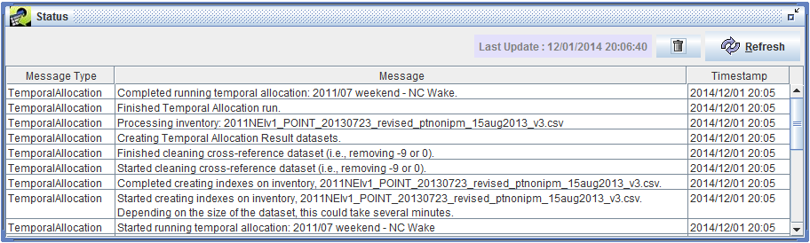{#fig:run_status}

The Summary tab of the Edit Temporal Allocation window includes an overview of the run listing the status (Running, Finished, or Failed) and the start and completion date for the most recent run.

{#fig:run_finished}

### Run Outputs ###

The Output tab of the Edit Temporal Allocation window will show the three result datasets from the run - monthly, daily, and episodic results. 

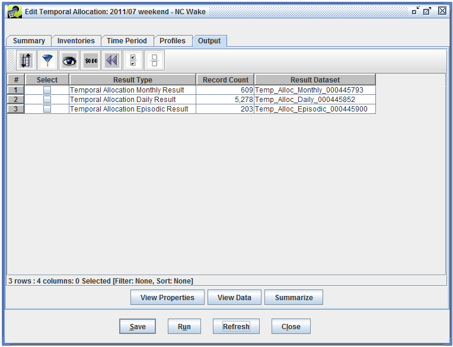{#fig:run_output}

From the Output tab, you can select any of the result datasets and click the View Properties button to open the Dataset Properties View window ([@Sec:dataset_properties_section]) for the selected dataset.

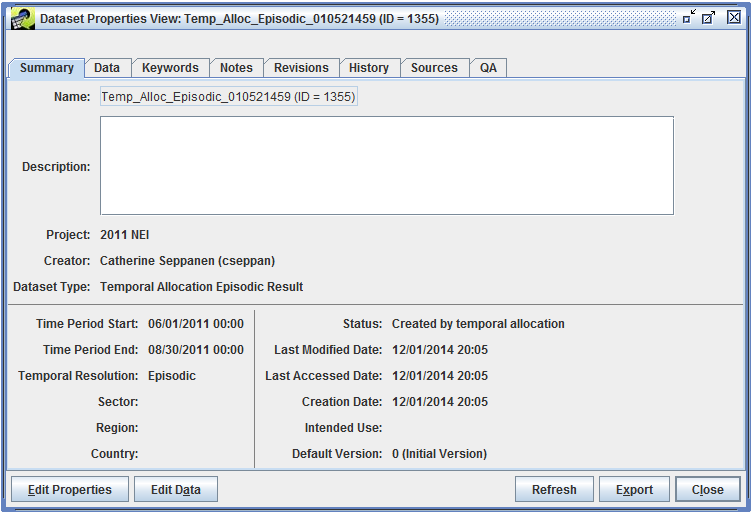{#fig:view_output_dataset}

You can also access the result datasets from the Dataset Manager.

The View Data button will open the Data Viewer window ([@Fig:data_viewer]) for the selected dataset. Clicking the Summarize button will open the QA tab of the Dataset Properties Editor window ([@Sec:dataset_properties_qa_section]).

You can use QA steps to analyze the result datasets; see [@Sec:qa_chapter] for information on creating and running QA steps. The formats of the three types of result datasets are described in [@Sec:output_formats].

## Input Dataset Formats ## {#sec:input_formats}

### Temporal Cross Reference (CSV) ###

Column|Name|Type|Description
-|--|--|------
1|SCC|VARCHAR(20)|Source Category Code (optional; enter zero for entry that is not SCC-specific)
2|FIPS|VARCHAR(12)|Country/state/county code (optional)
3|PLANTID|VARCHAR(20)|Plant ID/facility ID (optional - applies to point sources only; leave blank for entry that is not facility-specific)
4|POINTID|VARCHAR(20)|Point ID/unit ID (optional - applies to point sources only)
5|STACKID|VARCHAR(20)|Stack ID/release point ID (optional - applies to point sources only)
6|PROCESSID|VARCHAR(20)|Segment/process ID (optional - applies to point sources only)
7|POLL|VARCHAR(20)|Pollutant name (optional; enter zero for entry that is not pollutant-specific)
8|PROFILE\_TYPE|VARCHAR(10)|Code indicating which type of profile this entry is for. Values used by the EMF are 'MONTHLY', 'WEEKLY', or 'DAILY'. The format also supports hourly indicators 'MONDAY', 'TUESDAY', ... 'SUNDAY', 'WEEKEND', 'WEEKDAY', 'ALLDAY', and 'HOURLY'.
9|PROFILE_ID|VARCHAR(15)|Temporal profile ID
10|COMMENT|TEXT|Comments (optional; must be double quoted)

### Temporal Profile Monthly (CSV) ###

Column|Name|Type|Description
-|-|-|-
1|PROFILE_ID|VARCHAR(15)|Monthly temporal profile ID
2|JANUARY|REAL|Temporal factor for January
3|FEBRUARY|REAL|Temporal factor for February
4|MARCH|REAL|Temporal factor for March
...|...|...|...
11|OCTOBER|REAL|Temporal factor for October
12|NOVEMBER|REAL|Temporal factor for November
13|DECEMBER|REAL|Temporal factor for December
14|COMMENT|TEXT|Comments (optional; must be double quoted)

### Temporal Profile Weekly (CSV) ###

Column|Name|Type|Description
-|-|-|-
1|PROFILE_ID|VARCHAR(15)|Weekly temporal profile ID
2|MONDAY|REAL|Temporal factor for Monday
3|TUESDAY|REAL|Temporal factor for Tuesday
4|WEDNESDAY|REAL|Temporal factor for Wednesday
5|THURSDAY|REAL|Temporal factor for Thursday
6|FRIDAY|REAL|Temporal factor for Friday
7|SATURDAY|REAL|Temporal factor for Saturday
8|SUNDAY|REAL|Temporal factor for Sunday
9|COMMENT|TEXT|Comments (optional; must be double quoted)

### Temporal Profile Daily (CSV) ###

Column|Name|Type|Description
-|-|-|-
1|PROFILE_ID|VARCHAR(15)|Daily temporal profile ID
2|MONTH|INTEGER|Calendar month
3|DAY1|REAL|Temporal factor for day 1 of month
4|DAY2|REAL|Temporal factor for day 2 of month
5|DAY3|REAL|Temporal factor for day 3 of month
...|...|...|...
31|DAY29|REAL|Temporal factor for day 29 of month
32|DAY30|REAL|Temporal factor for day 30 of month
33|DAY31|REAL|Temporal factor for day 31 of month
34|COMMENT|TEXT|Comments (optional; must be double quoted)

## Output Dataset Formats ## {#sec:output_formats}

### Column Naming ###

The temporal allocation output datasets may contain sources from ORL or FF10 inventories. These two sets of inventory formats don't use consistent names for the source characteristic columns. The temporal allocation formats use the ORL column names. [@Tbl:column_mapping_table] shows how the column names map between FF10 and ORL inventories.

FF10 Column Name|ORL Column Name|Description
-|-|-
REGION\_CD|FIPS|State/county code, or state code
FACILITY\_ID|PLANTID|Plant ID for point sources
UNIT\_ID|POINTID|Point ID for point sources
REL\_POINT\_ID|STACKID|Stack ID for point sources
PROCESS\_ID|SEGMENT|Segment for point sources
: Column Name Mapping {#tbl:column_mapping_table}

### Temporal Allocation Monthly Result ###

Column|Description
-|----
SCC|The source SCC from the inventory
FIPS|The source FIPS code from the inventory
PLANTID|For point sources, the plant ID/facility ID from the inventory
POINTID|For point sources, the point ID/unit ID from the inventory
STACKID|For point sources, the stack ID/release point ID from the inventory
PROCESSID|For point sources, the segment/process ID from the inventory
POLL|The source pollutant from the inventory
PROFILE\_ID|The matched monthly temporal profile ID for the source; for monthly input data, this column will be blank
FRACTION|The temporal fraction applied to the source's annual emissions for the current month; for monthly input data, the fraction will be 1
MONTH|The calendar month for the current record
TOTAL\_EMIS (tons/month)|The total emissions for the source and pollutant in the current month
DAYS\_IN\_MONTH|The number of days in the current month
AVG\_DAY\_EMIS (tons/day)|The average-day emissions for the source and pollutant in the current month
INV\_RECORD\_ID|The record number from the input inventory for this source
INV\_DATASET\_ID|The numeric ID of the input inventory dataset

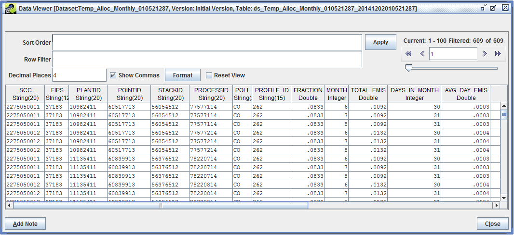{#fig:monthly_result}

### Temporal Allocation Daily Result ###

Column|Description
-|----
SCC|The source SCC from the inventory
FIPS|The source FIPS code from the inventory
PLANTID|For point sources, the plant ID/facility ID from the inventory
POINTID|For point sources, the point ID/unit ID from the inventory
STACKID|For point sources, the stack ID/release point ID from the inventory
PROCESSID|For point sources, the segment/process ID from the inventory
POLL|The source pollutant from the inventory
PROFILE\_TYPE|The type of temporal profile used for the source; currently only the WEEKLY type is supported
PROFILE\_ID|The matched temporal profile ID for the source
FRACTION|The temporal fraction applied to the source's monthly emissions for the current day
DAY|The date for the current record
TOTAL\_EMIS (tons/day)|The total emissions for the source and pollutant for the current day
INV\_RECORD\_ID|The record number from the input inventory for this source
INV\_DATASET\_ID|The numeric ID of the input inventory dataset

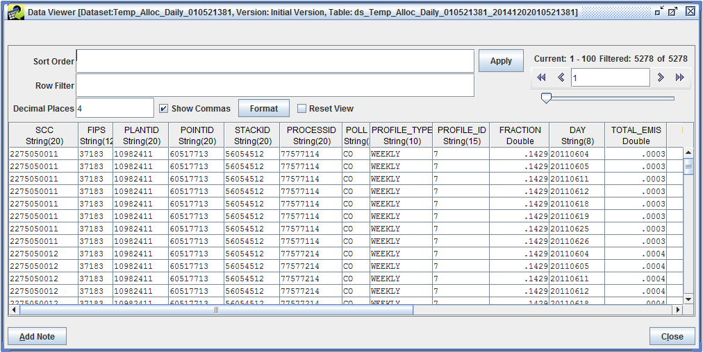{#fig:daily_result}

### Temporal Allocation Episodic Result ###

Column|Description
-|----
SCC|The source SCC from the inventory
FIPS|The source FIPS code from the inventory
PLANTID|For point sources, the plant ID/facility ID from the inventory
POINTID|For point sources, the point ID/unit ID from the inventory
STACKID|For point sources, the stack ID/release point ID from the inventory
PROCESSID|For point sources, the segment/process ID from the inventory
POLL|The source pollutant from the inventory
TOTAL\_EMIS (tons)|The total emissions for the source and pollutant in the episode
DAYS\_IN\_EPISODE|The number of days in the episode
AVG\_DAY\_EMIS (tons/day)|The average-day emissions for the source and pollutant in the episode
INV\_RECORD\_ID|The record number from the input inventory for this source
INV\_DATASET\_ID|The numeric ID of the input inventory dataset

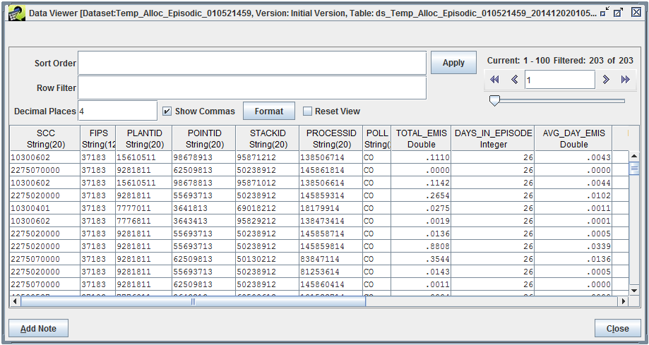{#fig:episodic_result}

### Temporal Allocation Messages ###

Column|Description
-|----
SCC|The source SCC from the inventory
FIPS|The source FIPS code from the inventory
PLANTID|For point sources, the plant ID/facility ID from the inventory
POINTID|For point sources, the point ID/unit ID from the inventory
STACKID|For point sources, the stack ID/release point ID from the inventory
PROCESSID|For point sources, the segment/process ID from the inventory
POLL|The source pollutant from the inventory
PROFILE_ID|The matched temporal profile ID for the source
MESSAGE|Message describing the issue with the source

